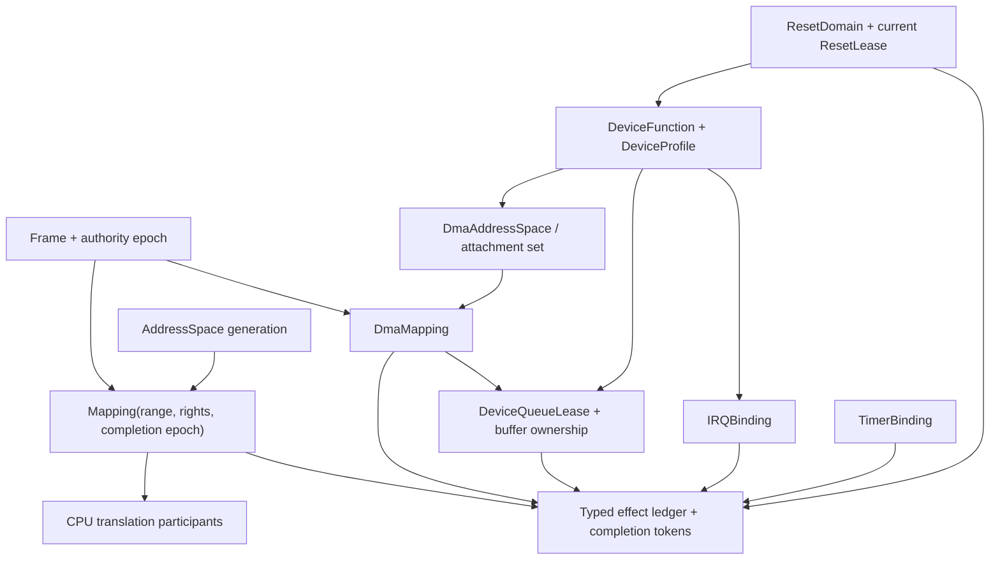
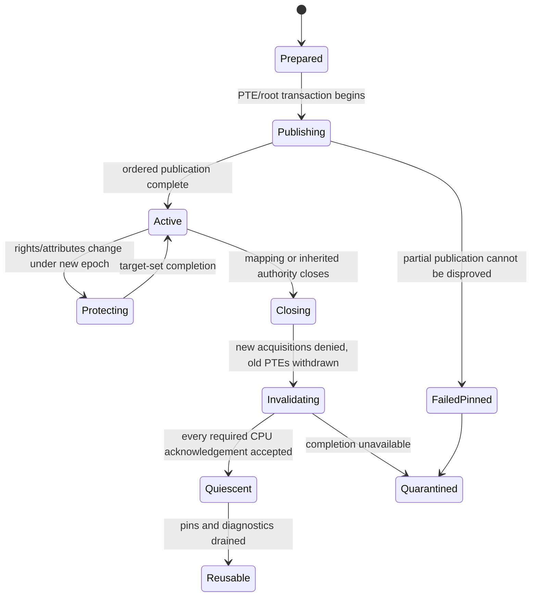
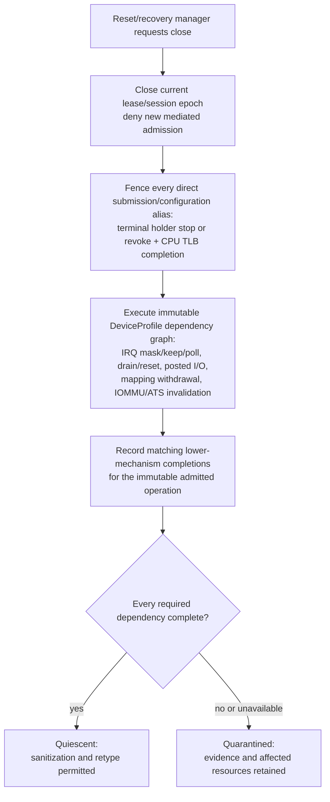

# Memory mappings and architecture-resource bindings

The kernel should represent every persistent use of architecture machinery as a
generation-safe typed relation rather than as an incidental register or table
write. `Mapping`, `IRQBinding`, `TimerBinding`, `DmaAddressSpace`, `DmaMapping`,
`DeviceQueueLease`, and `ResetDomain` objects compose capability authority,
resource charges, lower-layer mechanisms, and explicit completion evidence.
Logical closure denies new use immediately; backing frames and identifiers stay
pinned until CPU translations, interrupt/timer delivery, device queues, IOMMU
caches, posted writes, and reset-profile obligations have completed or are
quarantined.

This is the recommended implementation for component 6 of the [minimal
privileged kernel layer](../minimal-privileged-kernel-layer.md). seL4, modern
virtual-memory work, least-privilege translation models, IOMMU specifications,
CleanQ, and Thunderclap support the separate mechanisms. No source proves this
combined cross-ISA object and teardown lifecycle.

## Question, scope, and operational standard

The question is:

> How should portable kernel authority create, modify, close, and reclaim CPU
> mappings, interrupts, timers, and device/DMA relationships without hiding
> architecture completion or device ambiguity?

The lower architecture layer owns page-table operations, TLB/cache completion,
interrupt-controller flows, timer channels, IOMMU commands, and architecture
fault normalization. This component owns protected portable objects, authority,
accounting, generation, composition, and lifecycle. User-space pagers, drivers,
allocators, and reset managers own placement and device policy.

The first implementation is adequate only if:

1. Each relationship names exact endpoint objects and generations, admitted
   rights, resource account, lifetime anchors, and required completion class.
2. A mapping is not considered absent until the applicable CPUs or devices can
   no longer use the old translation; a PTE/context write alone is insufficient.
3. Closing any effect-bearing authority immediately prevents new map, submit,
   route, arm, or reactivate operations while recovery authority may still
   advance idempotent drainage.
4. Reuse at the same virtual/device address or hardware identifier creates a
   distinct object generation and cannot accept stale completions.
5. Device access is the composition of MMIO/configuration, requester attachment,
   DMA mappings, buffers, queues, interrupts, and reset authority—not “IOMMU on.”
6. Frames stay pinned after DMA unmap until profile-specific device quiescence,
   IOMMU/device-TLB invalidation, and relevant read/write completion succeed.
7. Shared reset or requester identities become explicit atomic trust sets; the
   kernel never claims isolation the hardware cannot distinguish.
8. Failed completion produces visible quarantine, never optimistic reuse.

## Evidence and limits

| Evidence | Supported conclusion | Limit for this design |
| --- | --- | --- |
| [Least-privilege memory protection](../../30-sources/achermann-et-al-2019-least-privilege-memory-protection.md) | Translation configuration authority and authority to access translated memory should be distinct across CPU/device address spaces | It is a research model, not a production implementation proof |
| [Relaxed virtual memory in Armv8-A](../../30-sources/simner-et-al-2022-relaxed-virtual-memory.md) | Page-table mutation is an ordered publication/invalidation protocol with delayed reuse, not a plain memory store | The model is Arm-specific and explicitly incomplete |
| [seL4 reference manual](../../30-sources/sel4-foundation-2026-reference-manual.md) | Typed frames, page tables, I/O spaces, SMMU, IRQ handlers, and notifications are concrete capability-mediated objects | It does not supply the proposed universal generational mapping and quarantine contract |
| [CleanQ](../../30-sources/haecki-et-al-2019-cleanq.md) | Device queues benefit from explicit finite buffer-ownership transfer and backend-specific ordering | Authentication, reset, revocation, and malicious devices are outside its proof |
| [Thunderclap](../../30-sources/markettos-et-al-2019-thunderclap.md) | Broad mappings, temporal exposure, and intentionally shared buffers defeat simplistic IOMMU protection claims | Tested systems/hardware are historical; it does not define a complete replacement design |
| [Tolerating malicious drivers](../../30-sources/boyd-wickizer-zeldovich-2010-malicious-device-drivers.md) | IOMMU, user-mode drivers, and controlled device access can constrain hostile drivers | Platform/requester coverage and shared protocols still limit containment |
| [Recovering device drivers](../../30-sources/swift-et-al-2004-recovering-device-drivers.md) | External reconstruction state and request tracking help restart, but accepted device operations may remain indeterminate | It does not handle malicious devices or universal reset semantics |

Architecture specifications in the lower-layer source corpus define the
mechanisms and completion primitives for x86-64, AArch64, and RISC-V. They do
not define this portable kernel ABI or prove complete platform routing.

## Object graph



Arrows describe lifetime dependencies. None lets one object mint authority to
another endpoint that the caller did not already hold. `TimerBinding` drains
directly into teardown accounting; it has no intrinsic lifetime dependency on
an `IRQBinding`, although an immutable platform/device profile may add a
specific relationship between them.

## CPU `Mapping`

A mapping is a protected object:

```text
Mapping {
  mapping_identity_and_generation,
  address_space_identity_and_generation,
  virtual_range,
  frame_identity_and_generation,
  frame_offset,
  admitted_frame_authority_epoch,
  effective_rights_and_memory_attributes,
  immutable_maximum_rights_ceiling,
  architecture_profile,
  participant_cpu_generation_set,
  publication_epoch,
  invalidation_ticket,
  lifecycle_and_anchor_vector
}
```

Creation requires compatible `AddressSpace.Map` and frame rights. The effective
rights and immutable maximum-rights ceiling are intersections of the original
address-space authority, frame authority, and architecture support. `Protect`
requires the current `Mapping` capability, revalidates the recorded frame-
authority epoch, and restricts requested rights to both that immutable ceiling
and the attenuated ceiling of the presented capability. It cannot recreate a
right after the originating authority disappears. Read, write, execute, and
device access are independent; no baseline facet combines writable and
executable mappings, and adding execute must complete the lower code-publication
protocol. Memory type/cacheability aliases are validated across all known
mappings of a frame according to the architecture profile.

The mapping object remains authoritative even if the same virtual address is
later reused. Replacement first closes the old relation, applies required
break-before-make or architecture-specific ordering, receives invalidation
completion from the recorded participant set, then publishes a new mapping
generation. A stale shootdown acknowledgement cannot complete the new one.

## Mapping lifecycle



`map`, `protect`, and `unmap` return semantic completion or a progress token.
They never claim a portable effect merely because the local CPU issued an
instruction. The architecture layer maps the semantic target-set ticket to
TLBI/barrier, `INVLPG`/shootdown, `SFENCE.VMA`, or other profile mechanisms.

## Frame authority and quarantine

A frame has a protected mutation authority epoch. Creating a CPU or DMA mapping
records the current epoch and inherits its close anchors. Quarantine atomically
closes every known mutating facet and advances the frame to a state in which old
`Map*`, `Dma`, `Reclaim`, and similar frame facets are inspection-only—never a
new map, teardown mutation, DMA submission, publication, or release. Teardown
authority survives on the already admitted `Mapping` and `DmaMapping` records
and protected recovery ledgers, not on a stale frame facet.

Releasing quarantine does not reopen old authority. After all hardware effects
are proven quiescent and bytes are sanitized, the old frame object is destroyed
and its backing is retyped as a new frame generation. This avoids an “unquarantine”
operation that could resurrect a stale alias.

## Interrupt and timer bindings

`IRQBinding` is one accounted aggregate whose typed views name source, route,
current destination, flow class, completion facet, controller generation,
device/reset dependency, hard-path account, and teardown epoch. The lower
[interrupt fabric](../kernel-hardware-and-architecture-components/interrupt-event-fabric.md)
performs claim/mask/EOI/deactivation. The kernel object decides who may bind,
route, acknowledge, recover, or destroy it.

An ordinary driver usually receives current-generation completion/inspect
rights. Mask/recover/route/reset authority stays with an independent manager.
Close masks and stabilizes the source, closes late completion facets, drains
hard/deferred references, and releases route/controller dependencies. A storm
exhausts a prevalidated source reserve and moves to mask/quarantine rather than
consuming unlimited privileged CPU.

`TimerBinding` similarly relates one authorized lower-layer deadline channel to
a notification/fault destination and scheduling account. Arming creates an
epoch-tagged deadline; cancellation waits for the lower layer's late-event
contract. A stale expiry cannot wake a replacement binding.

## Device model

### `DeviceProfile`

An immutable trusted profile, installed through boot/hardware manifest
authority, describes one exact device class/version and platform attachment:

- requester IDs/StreamIDs and whether they form an inseparable set;
- MMIO/configuration windows and permitted operations;
- queue, buffer, interrupt, and timer dependencies;
- stop, mask, drain, invalidation, reset, and posted-write ordering sequence;
- admissible completion evidence and timeout/error outcomes;
- shared reset-domain membership and collateral effects; and
- safe quarantine state when completion cannot be proven.

Drivers cannot mint or edit profiles. A profile is an assurance assumption
supported by specifications and device-specific experiments, not proof that
firmware or hardware follows it.

### `DmaAddressSpace`

One DMA space attaches an immutable atomic requester/trust set. If hardware or
firmware makes two functions indistinguishable, they share a security boundary.
Reassignment closes the old root, stops queues, invalidates IOMMU and device
translation caches, and creates a new generation; editing the requester set in
place is prohibited initially.

### `DmaMapping`

A DMA mapping names exact DMA range, frame, rights, direction, requester set,
frame epoch, IOMMU root, and completion epoch. `Unmap` first publishes logical
closure so later admission that would acquire or use that mapping fails while
the old range and frame remain pinned. Physical translation withdrawal occurs
only at the point selected by the immutable `DeviceProfile`: some devices
require mappings to remain present through drain or reset, while others require
early IOMMU removal and tolerate the resulting faults.

Before releasing the frame, the profile-specific dependency graph must close
mediated submission and every direct submission/configuration alias, reach its
declared queue drain or reset and posted-read/write release points, complete all
required IOMMU and ATS/device-TLB invalidation, and preserve a stable ledger
record for late generation-bound faults and completions. These are obligations,
not a universal instruction order. Failure of any required node retains the
relevant frames, queue, root, and reset-domain records in quarantine.

### Queue ownership

`DeviceQueueLease` gives finite submit/doorbell authority to one queue generation.
For mediated `Submit` and `Doorbell`, the kernel validates that descriptors name
currently software-owned buffers with exact mapping generations; after ownership
transfers, a later mediated submission fails. CleanQ-style ownership is protected
bookkeeping, not enforcement over arbitrary user stores.

A direct ring, doorbell, MMIO, or configuration path therefore requires the
`DeviceProfile` to enumerate every writable alias capable of submitting work or
redirecting DMA. Queue closure must either terminally stop every holder without a
resume path, or revoke every such mapping from every holder and complete the
required CPU TLB invalidation. Descriptors and posted writes visible before that
barrier remain admitted effects. A raw direct path outside a profile-complete,
revocable alias set is excluded from the recoverable isolation profile. In every
case teardown cannot free a hardware-owned buffer merely because the driver died.

## Reset topology

A `ResetDomain` spans the real hardware reset boundary, which may include
several functions. `ResetLease.Use` is current epoch-fenced authority required
for manager-driven profile steps. `ResetControl`, successor slots, fault route,
and cleanup reserve live outside every affected driver and ordinary supervisor
subtree.

Reset is not synonymous with quiescence. The profile must state what the reset
guarantees for DMA, posted writes, interrupts, internal queues, and configuration.
If a function-level reset cannot stop a shared engine, the whole shared domain
remains quarantined or takes the broader reset with explicitly reported
collateral failure.

## Lifecycle composition



Closing the manager/session epoch rejects later mediated submissions and stale
or mismatched manager attestations. It does not discard a matching hardware or
lower-mechanism completion for an operation already admitted: that completion
remains an immutable ledger fact that the current manager may adopt and validate.

The kernel validates protected one-shot `DeviceCompletionToken` objects rather
than trusting a driver's Boolean “drained.” Tokens bind profile, reset-control
epoch, operation, object generations, bounded resource set, and completion
epoch. The producing mechanism still has hardware assumptions that must be
documented.

## Implementation path

1. Specify a generational CPU `Mapping` and semantic invalidation ticket; refine
   it to two ISA backends before adding optimization.
2. Add global frame authority epochs and quarantine with exhaustive alias
   enumeration.
3. Wrap the lower interrupt and timer components in capability-mediated binding
   aggregates and test late-event drainage.
4. Introduce one simple emulated/IOMMU-backed device profile with no ATS and a
   fully controllable queue/reset path.
5. Add finite queue ownership and `DmaMapping` lifecycle, then malicious driver
   and delayed-device tests.
6. Add shared reset domains and independently leased manager takeover.
7. Add ATS/PRI, multifunction devices, or direct user data paths only after
   profile-specific completion evidence is demonstrated.

## Verification and experiments

- Refine portable map/protect/unmap states to x86-64 plus AArch64 or RISC-V
  ordering and invalidation sequences; include offline/stalled CPU outcomes.
- Race map replacement, frame quarantine, domain close, page fault repair, and
  TLB acknowledgement; stale tickets must not complete new generations.
- Enumerate all aliases of a frame across CPUs, devices, diagnostic mappings,
  and managers and verify quarantine closes every mutation path.
- Inject interrupt after mask, timer after cancel, DMA write after driver death,
  IOMMU timeout, ATS timeout, stuck posted write, and reset failure.
- Use an adversarial device model to mutate descriptors and issue DMA at every
  lifecycle boundary; no clean release is allowed without complete evidence.
- Benchmark mapping batch sizes and invalidation policies behind identical
  semantic completion, reporting retained/quarantined resources separately.
- Validate each `DeviceProfile` against exact hardware/firmware versions and
  preserve raw fault/completion records for reproduction.

## Rejected alternatives

- **PTE write equals mapping:** omits remote translation and ordering state.
- **Raw IRQ integer or timer channel:** loses namespace, route, generation,
  authority, and late-event lifecycle.
- **IOMMU enabled equals safe DMA:** ignores broad/temporal mappings, device TLBs,
  shared buffers, reset, and requester coverage.
- **Driver says drained:** a failed or malicious driver is not trusted evidence.
- **Reset means no effects:** device and interconnect guarantees are profile
  specific.
- **Reuse after timeout:** turns missing completion into cross-domain corruption.

## Open questions

- What is the smallest cross-ISA semantic completion vocabulary for CPU and DMA
  mappings without hiding important target differences?
- Can a first useful device set be restricted to profiles with reliable queue
  stop/reset and no ATS, substantially shrinking the initial model?
- How should shared-frame and diagnostic aliases be indexed so global quarantine
  remains bounded and complete?
- Which completion tokens can be produced entirely by trusted controller state,
  and which inevitably depend on device-specific assertions?

## Connections

- [Typed object storage and explicit memory](typed-object-storage-and-explicit-memory.md)
- [Teardown, revocation, and safe reclamation](teardown-revocation-and-safe-reclamation.md)
- [Protected I/O and DMA ownership](../kernel-hardware-and-architecture-components/protected-io-and-dma-ownership.md)
- [Address translation and protection transitions](../kernel-hardware-and-architecture-components/address-translation-and-protection-transitions.md)
- [Interrupt event fabric](../kernel-hardware-and-architecture-components/interrupt-event-fabric.md)
- [Minimal privileged-kernel contract inquiry](../../40-inquiries/what-contract-should-the-minimal-privileged-kernel-provide.md)

## Sources

- [Least-privilege memory protection](../../30-sources/achermann-et-al-2019-least-privilege-memory-protection.md)
- [Relaxed virtual memory in Armv8-A](../../30-sources/simner-et-al-2022-relaxed-virtual-memory.md)
- [seL4 reference manual](../../30-sources/sel4-foundation-2026-reference-manual.md)
- [CleanQ](../../30-sources/haecki-et-al-2019-cleanq.md)
- [Thunderclap](../../30-sources/markettos-et-al-2019-thunderclap.md)
- [Tolerating malicious drivers](../../30-sources/boyd-wickizer-zeldovich-2010-malicious-device-drivers.md)
- [Recovering device drivers](../../30-sources/swift-et-al-2004-recovering-device-drivers.md)
- [Arm SMMUv3](../../30-sources/arm-2025-smmuv3-architecture.md)
- [Intel VT-d](../../30-sources/intel-2024-vt-d-architecture.md)
- [RISC-V IOMMU](../../30-sources/risc-v-international-2026-iommu-architecture.md)
