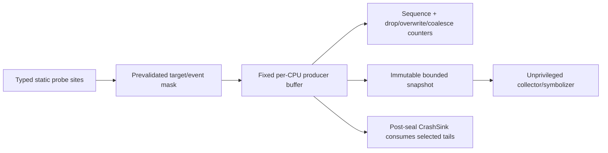
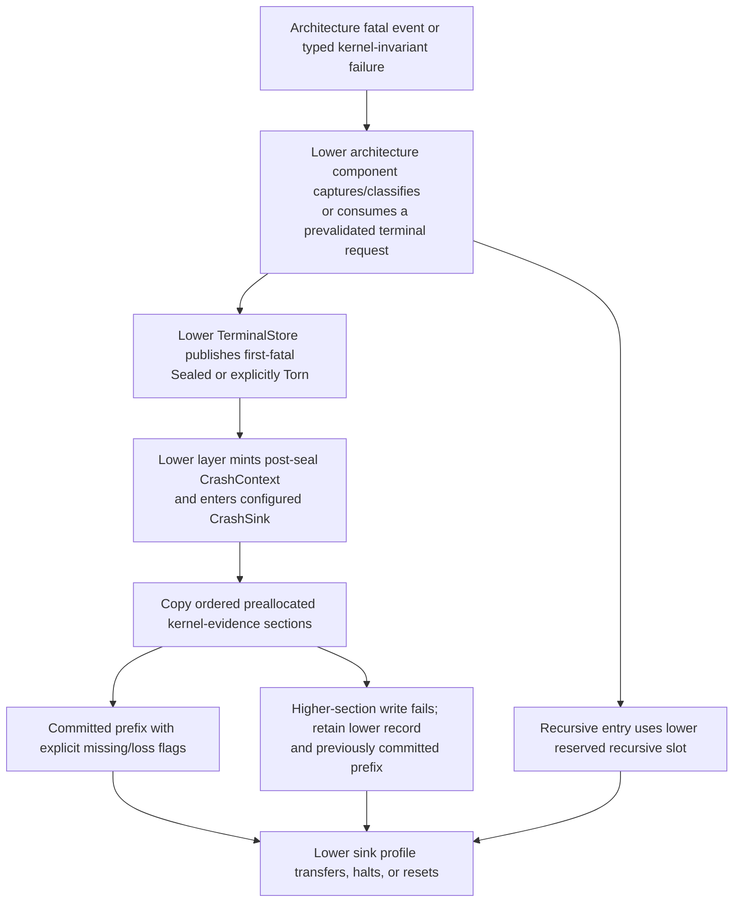

# Observability and crash evidence

Privileged observability should be a narrow capability-scoped evidence service,
not a universal debug backdoor. The kernel should expose bounded typed snapshots
and fixed-size per-CPU event buffers with explicit overwrite, drop, coalescing,
and corruption counters. Producers never allocate, block, or wait for observers.
Sensitive target, field, rate, duration, and destructive actions require
separate `DebugAuthority`. A preallocated versioned higher-level evidence
layout, reserved and identified at boot, supplies boot/kernel/profile identity,
lifecycle epochs, last events, and loss markers to the lower architecture
layer's already sealed terminal record and `CrashSink`. It does not define a
second capture or handoff path. Normal execution does not continue after
reference-monitor corruption.

This is the recommended implementation for component 10 of the [minimal
privileged kernel layer](../minimal-privileged-kernel-layer.md). DTrace supports
safe dynamic instrumentation, aggregation, and disabled-probe discipline;
kdump supports pre-reserved independent capture; RAS guidance supports raw plus
normalized evidence. None proves this minimal schema, its confidentiality,
survival under hostile DMA, or hard execution bounds.

## Question, scope, and operational standard

The question is:

> What privileged evidence is irrecoverable from user space and therefore worth
> its trust, timing, storage, and disclosure cost inside a minimal kernel?

The kernel records only state needed to audit authority/lifecycle invariants,
diagnose protected transitions, and survive faults that prevent user-space
observation. Managed runtimes and services own actor traces, application logs,
metrics, stack symbolication, request histories, and rich profiling.

The first implementation is adequate only if:

1. Disabled observation sites have measured zero or profile-declared minimal
   effect, and enabled sites have bounded time, stack, record, and lock cost.
2. Producers in syscall, fault, IRQ, timeout, stop, and fatal contexts never
   allocate, block on consumers, or retain an observer-controlled reference.
3. Every finite buffer declares whether full means overwrite-oldest, drop-new,
   sticky coalesce, or terminal freeze; loss is counted and visible.
4. Observers receive immutable snapshots/copies and cannot hold a kernel lock,
   prevent object teardown, or force unbounded serialization.
5. Health inspection, lifecycle evidence, capability-graph inspection, register
   access, memory access, trace control, and crash export are separately
   attenuable authorities.
6. Records include object and operation generations, clock provenance, schema
   version, truncation, certainty, and decoder/profile identity where relevant.
7. The cross-layer fatal path depends only on state reserved while healthy;
   lower-layer first-fatal and recursive slots remain authoritative, and
   higher-level enrichment can fail only by explicit truncation.
8. Crash export has an explicit confidentiality, integrity, retention, and
   redaction model; physical addresses and capability topology are not public
   by default.

## Evidence and limits

| Evidence | Supported conclusion | Limit for this design |
| --- | --- | --- |
| [DTrace](../../30-sources/cantrill-et-al-2004-dtrace.md) | Dynamic typed probes, a constrained execution language, per-consumer state, aggregation, and zero disabled-probe effect can make production instrumentation useful and safer | DTrace is much larger than a minimal kernel facility; enabled probes perturb timing and depend on verifier/runtime correctness |
| [Kdump](../../30-sources/goyal-et-al-2005-kdump.md) | Capture code, memory, and metadata reserved before failure can let an independent environment inspect the failed kernel | Severe CPU, firmware, reserved-memory corruption, or ongoing DMA can still defeat capture |
| [Linux RAS documentation](../../30-sources/linux-kernel-community-2026-ras-documentation.md) | Raw and normalized records, source, severity, precision, and containment state should remain distinct | Hardware reports may be incomplete/inaccurate and the Linux surface is far broader |
| [Timing analysis of a protected kernel](../../30-sources/blackham-et-al-2011-timing-analysis-protected-kernel.md) | Claims about bounded privileged paths require a concrete binary, target configuration, and explicit path analysis | Historical single-core analysis does not bound this tracing or fatal path |
| [Comprehensive seL4 verification](../../30-sources/klein-et-al-2014-comprehensive-sel4-verification.md) | Assurance claims need an explicit boundary and must state excluded boot, assembly, hardware, cache, DMA, and timing assumptions | Similar minimality or object design does not transfer proof |
| [Linux lockless tracing ring buffer](../../30-sources/rostedt-2009-lockless-ring-buffer-design.md) | A per-CPU page ring can make overwrite versus producer/consumer mode, nested-writer ordering, and record commitment explicit | The document is an implementation design, not a worst-case timing, security, persistence, or portability proof |

## Observability tiers

The ABI should distinguish four tiers:

| Tier | Typical data | Authority and lifetime |
| --- | --- | --- |
| Public health | Object type/state, aggregate charge, queue saturation, dropped-record counts | Narrow copyable inspect facet; rate-limited snapshots |
| Lifecycle evidence | Generations, close/stop/reap epochs, completion sets, terminal call outcome | Object/recovery-specific inspect facet; retained through teardown |
| Sensitive debug | Registers, addresses, capability edges, mapping/device topology, selected memory | Explicit `DebugAuthority` scoped to targets/fields/duration |
| Terminal crash | Kernel/profile identity, fatal reason, minimal CPU/object state, last-event buffers | Independently reserved capture/export authority; sealed after failure |

An authority at one tier does not imply the next. A supervisor may inspect
whether a child is stopped without reading its memory or the capabilities held
by unrelated domains.

## Typed event schema

All kernel events use one compact versioned envelope:

```text
KernelEvent {
  schema_version,
  event_type,
  record_size_and_truncation,
  per_cpu_sequence,
  cpu_id_and_generation,
  monotonic_counter_value,
  clock_profile_identity,
  clock_era,
  conversion_snapshot_generation,
  object_id_type_and_generation[bounded],
  operation_or_lifecycle_epoch,
  outcome_or_state,
  certainty_and_containment,
  payload_variant[fixed maximum],
  redaction_class,
  loss_or_corruption_flags
}
```

Events record semantic transitions rather than arbitrary formatted strings:
capability admission rejected, anchor closed, domain stop requested/acknowledged,
call outcome selected, budget depleted, mapping invalidation completed, IRQ
quarantined, DMA completion failed, reaper advanced, or fatal invariant broken.
Formatting and symbolication happen in user space against schema and build IDs.

The envelope's timestamp is a raw monotonic counter plus the canonical lower-
layer `ClockProfile`, `ClockEra`, and `ConversionSnapshotGeneration`
provenance. Recalibration changes the conversion snapshot without inventing a
discontinuity; only an unproved continuity transition advances `ClockEra`. The
value is not wall time and may be incomparable across CPUs unless the selected
profile establishes synchronization and error bounds.

## Per-CPU event buffers



The baseline uses single-CPU ownership for ordinary writes and fixed nesting
slots for interrupt/fault writers. Cross-CPU readers never modify producer
indexes. A snapshot operation copies a bounded prefix/tail or publishes an
immutable generation view after the producer rotates to a preallocated sibling
buffer. The observer cannot retain the only writable buffer or block its CPU.

Different buffers may choose different full behavior:

- high-rate diagnostic trace: overwrite oldest and increment overwrite count;
- security/audit transition: drop newest and set a sticky loss/fallback flag;
- coalescible state event: retain latest state plus count/saturation;
- terminal enrichment section: commit once after the lower first-fatal record
  is sealed; recursion remains in the lower layer's separate reserved slot.

The rule is part of the buffer type and crash schema, not an undocumented
implementation choice.

## Probe control

The safest initial probes are static typed sites compiled into invariant
transitions. A `TraceControl` capability specifies:

- target object/domain/type set;
- permitted event classes and payload fields;
- maximum rate or sampling rule;
- fixed destination buffer and charge account;
- start/end epoch or one-shot trigger; and
- whether sensitive values are redacted, hashed, or omitted.

Enabling validates the complete plan and publishes one immutable filter
generation. Producers perform a bounded check and fixed copy. There is no
arbitrary kernel bytecode initially.

DTrace shows that a constrained verified language and aggregation can be safe
and powerful, but importing such a language substantially enlarges the trusted
parser, verifier, interpreter/JIT, state model, and timing surface. Add it only
if static probes plus unprivileged aggregation prove inadequate. Any future
program must have statically bounded instructions, memory, loops, keys,
aggregation state, and helper calls.

## Snapshot API

An object snapshot returns a versioned, self-consistent bounded record, not a
live pointer. Each type chooses fields that can be copied under its lock or read
from an immutable generation. If the object changes concurrently, the result
includes before/after generation or `RetrySnapshot` rather than combining
states that never existed.

Representative views include:

- object identity/type/state, payer, lifetime group, anchor count, and teardown
  phase;
- domain member count, running CPU mask, stop epoch and acknowledgements;
- scheduling budget/refills/donation depth and timeout state;
- endpoint pending/accepted counts, selected call outcomes, and close epoch;
- mapping/IRQ/timer/DMA completion epochs and quarantine status; and
- fault certainty, route, loss flags, and containment progress.

Large tables are enumerated with charged bounded cursors and access checks at
each page. A debug snapshot never pins an object past its declared diagnostic
lifetime; teardown can redact, copy, or revoke the view.

## Cross-layer crash-evidence contract

There is one fatal protocol. The lower [architecture-faults and diagnostics
component](../kernel-hardware-and-architecture-components/architecture-faults-and-diagnostics.md)
owns raw staging, classification, the first-fatal and separately reserved
recursive-fault slots, terminal sealing, `CrashContext`, the `CrashSink`, and
the terminal handoff/halt/reset leaves. This component neither recaptures
architecture state nor claims a second terminal store. It owns the higher-level
kernel event schema, continuously maintained bounded snapshots, redaction
rules, and the ordered sections that the lower sink may consume after its
terminal record is sealed.

The sink layout is fixed and initialized while healthy. Capsule integrity is
not represented by one vulnerable trailing checksum:

```text
CrashEvidenceLayout {
  magic,
  format_version,
  fixed_section_count,
  immutable_layout_checksum,
  section[fixed_section_count] {
    section_type,
    sequence,
    state: Empty | Writing | Committed | Torn,
    payload_length,
    payload_checksum,
    payload[fixed_capacity]
  }
}
```

The first committed section copies or embeds the lower layer's already sealed
terminal record. Later fixed-capacity sections may contain boot/manifest/kernel
digests, architecture-profile identity, per-CPU event tails and loss counters,
and bounded domain/call/scheduling/mapping/device teardown summaries. Each
section publishes `Writing` before modification and release-publishes
`Committed` only after its length and checksum are final. A reader accepts the
longest consecutive committed, checksum-valid sequence and marks the first
`Writing`, `Torn`, or invalid section and all later sections unavailable. A
capsule-level footer may summarize the result but is never required to recover
the valid prefix.

The lower `TerminalStore` retains its independent recursive-fault slot; a
recursive entry never reuses an ordinary capsule section or overwrites the
first-fatal record. Thus a failure after any higher-level section write can at
worst truncate enrichment, not erase the lower sealed reason. The result is a
bounded evidence capsule, not a promised complete memory dump. It records
missing CPUs, active or unknown DMA, cache/persistence uncertainty, truncation,
and unavailable authenticity rather than manufacturing completion.

## Single fatal protocol



For a kernel invariant failure, this layer supplies only a typed reason and
bounded preallocated kernel evidence to the lower terminal interface. For an
architecture fatal event, the lower component enters the same protocol
directly. Post-seal enrichment performs no allocation, ordinary lock recovery,
filesystem/network work, symbolization, or remote wait. It does not claim to
freeze CPUs, fence DMA, flush caches, or preserve memory; it copies the lower
profile's completion or uncertainty fields. Continuing ordinary execution
after a reference-monitor invariant failed remains outside the baseline.

## Crash-sink consumer and export environment

An independently reserved capture environment is one possible lower-layer
`CrashSink` profile, motivated by kdump. Its code, stacks, page tables, device
plan, old-memory access, timeout, and transition are provisioned by the boot and
architecture layers. This component does not load that environment or perform
its CPU/DMA fencing and handoff. It contributes:

- the versioned higher-level section schema and fixed read bounds;
- sensitivity and redaction classes for every field;
- a `CrashExport` authority distinct from ordinary health/debug inspection;
- decoder/build/profile identity and raw-unknown-field preservation; and
- next-boot validation that distinguishes lower sealed, torn, missing, and
  untrusted sections.

The capture environment remains vulnerable to shared hardware, firmware,
memory, and DMA corruption. On a profile without a trustworthy transition, the
lower sink may instead preserve its bounded record across reset for a
separately authorized next-boot exporter.

## Confidentiality and integrity

Observability can violate isolation even when it never mutates a target.
Addresses reveal layout; capability graphs reveal authority; timestamps and
event rates reveal behavior; registers/memory reveal secrets; device topology
reveals physical configuration.

Controls include:

- target- and field-specific capabilities rather than one global debug bit;
- redacted stable object designators in ordinary health views;
- per-deployment decisions about address hashing or omission;
- encrypted/authenticated export when keys can be used without trusting the
  failed kernel, otherwise an explicit unauthenticated marker;
- anti-rollback/retention metadata outside the capsule where required; and
- clearing or rekeying capsule storage before reassignment.

A compromised kernel can forge its own evidence unless an external hardware or
capture trust root protects selected measurements. The schema must state that
limitation rather than presenting a checksum as authenticity.

## Performance and timing effects

Each probe/profile has a cost contract:

- disabled instructions/branch and cache footprint;
- enabled worst-case instruction, stack, and record bytes;
- maximum nesting and producer lock/preemption state;
- buffer saturation rate and full behavior; and
- whether observation changes scheduling or time-protection assumptions.

Measure target binaries, not source-level estimates. Enabled tracing may alter
races and latency; diagnostic conclusions must record active probe generation.
Security/time-protection profiles may prohibit certain cross-domain probes or
flush/partition trace state.

## Implementation path

1. Define a compact typed event registry and fixed per-CPU buffer with explicit
   loss modes; model nested producer ordering.
2. Instrument only lifecycle, authority, call outcome, budget, fault, mapping,
   and teardown transitions needed to validate early prototypes.
3. Add bounded immutable snapshots and separate health/debug facets.
4. Define the fixed higher-level section layout and register its reserved
   storage with the lower `CrashSink` contract during bootstrap.
5. Integrate a typed kernel-fatal request and read-only bounded enrichment into
   the lower architecture layer's first-fatal/recursive protocol; do not add a
   second terminal state machine.
6. Add a redacting decoder/exporter for the lower profile's next-boot or
   independently reserved capture-environment sink.
7. Consider constrained dynamic filters/aggregation only after static evidence
   and user-space tools demonstrate a concrete gap.

## Verification and experiments

- Model/check the buffer algorithm under syscall, IRQ, nested fault, NMI/SError-
  like writers, wrap, snapshot, and lower-driven terminal snapshot; loss
  counters remain accurate.
- Measure disabled and enabled probe overhead, maximum writer latency, stack,
  and cache effects on target binaries.
- Fill every buffer mode and verify overwrite/drop/coalesce/snapshot semantics
  are visible in user snapshots and the crash-evidence sections.
- Kill observers mid-snapshot and close targets mid-enumeration; producers and
  teardown must continue without leaked pins.
- Inject failure after every higher-level section write; the parser recovers a
  valid bounded prefix while the lower first-fatal and recursive records retain
  their own authoritative sealed/torn states.
- Exercise every lower reserved-memory, cache-flush, reset-preservation, and
  capture-handoff result while hostile DMA is active; this layer must preserve
  reported completion or uncertainty rather than infer success.
- Audit authority/redaction by attempting cross-domain register, address,
  capability-edge, trace-control, and crash-export access.
- Version-skew test old/new capsule decoders and retain raw unknown records.

## Rejected alternatives

- **General logging/printf in privileged paths:** formatting, locks, allocation,
  and sinks are not bounded or crash-safe.
- **Observer reads live kernel pointers:** creates lifetime hazards and leaks
  representation/authority.
- **Silent ring overwrite:** absence of evidence becomes indistinguishable from
  absence of events.
- **One universal debug privilege:** collapses health, lifecycle, memory,
  capability, and crash access into an excessive authority.
- **Complete dump is always possible:** fatal hardware, DMA, firmware, or memory
  corruption can prevent it.
- **Continue after kernel invariant failure:** risks further reference-monitor
  corruption and misleading evidence.

## Open questions

- Which minimal event set is sufficient to validate the kernel invariants
  without becoming a permanent high-volume tracing ABI?
- Can crash-capsule authenticity and confidentiality be anchored outside the
  failed kernel on the first target platforms?
- Which persistent-memory/cache/reset sequences are trustworthy enough to claim
  capsule survival, and how are failures signalled?
- Is a static typed filter sufficient, or will bounded aggregation justify a
  verified tracing language later?

## Connections

- [Fault capture and containment](fault-capture-and-containment.md)
- [Teardown, revocation, and safe reclamation](teardown-revocation-and-safe-reclamation.md)
- [Bootstrap and root-authority handoff](bootstrap-and-root-authority-handoff.md)
- [Architecture faults and diagnostics](../kernel-hardware-and-architecture-components/architecture-faults-and-diagnostics.md)
- [Raw time and deadline programming](../kernel-hardware-and-architecture-components/raw-time-and-deadline-programming.md)
- [Managed-runtime observability and crash evidence](../managed-actor-runtime-components/observability-deterministic-testing-and-crash-evidence.md)
- [Minimal privileged-kernel contract inquiry](../../40-inquiries/what-contract-should-the-minimal-privileged-kernel-provide.md)

## Sources

- [DTrace](../../30-sources/cantrill-et-al-2004-dtrace.md)
- [Kdump](../../30-sources/goyal-et-al-2005-kdump.md)
- [Linux RAS documentation](../../30-sources/linux-kernel-community-2026-ras-documentation.md)
- [Linux lockless tracing ring buffer](../../30-sources/rostedt-2009-lockless-ring-buffer-design.md)
- [Timing analysis of a protected kernel](../../30-sources/blackham-et-al-2011-timing-analysis-protected-kernel.md)
- [Comprehensive seL4 verification](../../30-sources/klein-et-al-2014-comprehensive-sel4-verification.md)
