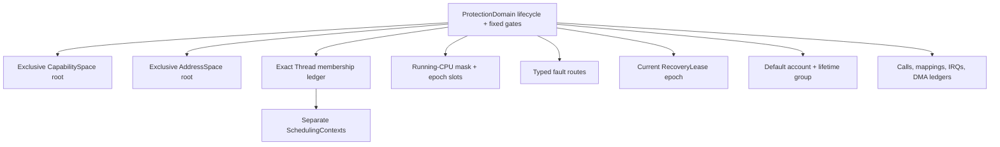
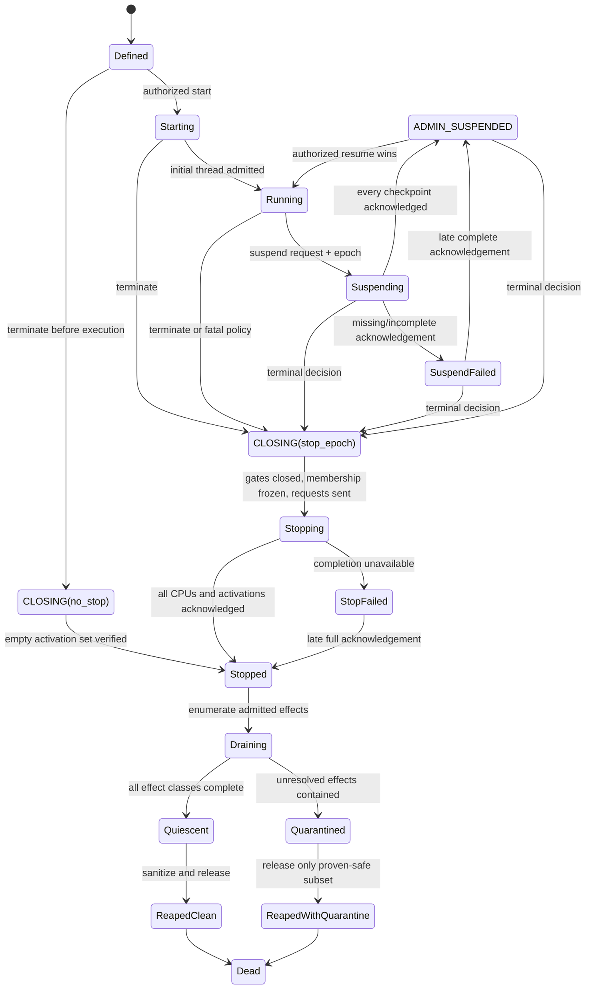
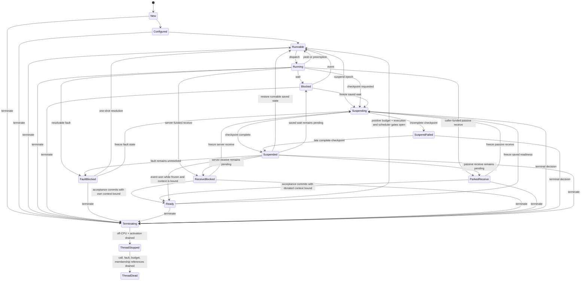

# Protection domains, threads, and address spaces

The kernel should make `ProtectionDomain` a first-class, small lifecycle and
admission object distinct from its threads, scheduling contexts, address space,
capability space, and user-space service identity. A domain owns immutable
exclusive CSpace and VSpace roots after start, an exact precharged membership
ledger, fixed root-gate vector, fault routes, and recovery epoch. Termination
first closes those fixed gates and freezes membership in constant work, then
uses epoch-tagged preallocated per-CPU requests to prove every member is off-CPU
and out of kernel activation before publishing `STOPPED`. Calls, mappings,
IRQs, DMA, and external effects drain afterward.

This is the recommended implementation for component 3 of the [minimal
privileged kernel layer](../minimal-privileged-kernel-layer.md). L4/seL4,
multikernels, Hive, and verified concurrent kernels support the constituent
mechanisms and the need for explicit cross-core coordination. No cited system
provides or proves this exact group-stop and recovery-lease protocol.

## Question, scope, and operational standard

The question is:

> What kernel object can stop one mutually distrustful runtime or native
> service coherently on an SMP machine without treating each BEAM actor as a
> kernel object or claiming that execution stop has undone external effects?

This component owns protected execution membership, user-entry admission,
thread state, root attachment, suspend/stop epochs, and completion of in-kernel
checkpoints. The scheduling component owns CPU budgets; capability spaces own
authority lookup; mapping objects own translations; teardown owns physical
drainage; user-space supervisors own recovery policy and logical service epochs.

The implementation is acceptable only if:

1. Thread creation, membership, migration, start, resume, endpoint acceptance,
   and user entry all order atomically against domain closure.
2. Closing fixed root gates and taking the running-CPU snapshot have bounded
   work independent of capability or owned-object count.
3. `STOPPED` is published only after no member executes user code and no member
   retains an in-kernel activation on any participating CPU.
4. A syscall or fault activation is never cancelled at an arbitrary instruction;
   it commits or aborts at a declared linearization point and exits through a
   bounded stop checkpoint.
5. A missing CPU acknowledgement reports `STOP_FAILED`; it never licenses
   memory reuse or a false clean restart.
6. Suspension is reversible and distinct from termination, fault blocking,
   liveness suspicion, and teardown.
7. Thread-local termination is available only to a manifest-declared isolated
   worker class; generic ERTS/JIT/NIF corruption defaults to domain-fatal.
8. A replacement is a new domain identity; user-space service publication uses
   its own epoch and protocol.

## Evidence and limits

| Evidence | Supported conclusion | Limit for this design |
| --- | --- | --- |
| [On micro-kernel construction](../../30-sources/liedtke-1995-microkernel-construction.md) | Address spaces, threads, and protected communication are functionally minimal kernel mechanisms | It predates this capability, SMP stop, and recovery model |
| [L4 lessons](../../30-sources/elphinstone-heiser-2013-l4-lessons.md) | Small explicit mechanisms, user-level policy, and architecture-sensitive fast paths can form a practical microkernel | L4 experience does not supply this multi-thread domain object or proof |
| [seL4 reference manual](../../30-sources/sel4-foundation-2026-reference-manual.md) | TCBs attach execution state, CSpace/VSpace roots, fault endpoints, and scheduling state through capabilities | The primary abstraction is per TCB; no atomic whole-domain stop is inherited |
| [Hive](../../30-sources/chapin-et-al-1995-hive.md) | Shared memory, devices, and shared kernel state create correlated failures beyond a process boundary | Historical hardware and implementation do not validate this protocol |
| [The Multikernel](../../30-sources/baumann-et-al-2009-multikernel.md) | Cross-core state changes should be explicit messages with visible replicated-state obligations | Messaging moves rather than eliminates consistency and timeout complexity |
| [CertiKOS](../../30-sources/gu-et-al-2016-certikos.md) | Concurrent kernels can be decomposed into per-CPU/per-thread logical machines and contextual refinements | Its proof boundary excludes important boot, TLB, device, and DMA effects |
| [For a microkernel, a big lock is fine](../../30-sources/peters-et-al-2015-big-lock-microkernel.md) | A coarse lock can outperform more complex synchronization when kernel contention is low | One evaluation cannot decide this workload or worst-case stop latency |

## Domain object

A baseline `ProtectionDomain` contains only:

- immutable domain object identity and generation;
- one exclusive CSpace root and one exclusive VSpace root fixed before start;
- an exact bounded/precharged member-thread ledger;
- a fixed-size vector of execution, relationship, outbound-call, and session
  admission gates;
- a kernel-maintained running-CPU mask and preallocated per-CPU epoch slots;
- typed fault routes and bounded fallback evidence;
- current sealed recovery-lease epoch and terminal fallback route;
- default resource account and lifetime group references; and
- lifecycle, suspend/stop epoch, and teardown summary.

It contains no BEAM PID, actor list, mailbox, service name, supervisor strategy,
restart counter, filesystem namespace, or device policy. Thousands or millions
of BEAM processes live within one or more unprivileged managed-runtime domains;
only memory-safety, authority, resource, or recovery boundaries justify a
kernel domain.

Shared frames are separate mapping relationships between exclusive roots. A
future shared-address-space profile must treat all attached domains as one
correlated isolation and stop group rather than continuing to promise mutual
memory isolation.

## Dependency structure

Arrows are references and lifecycle dependencies, not authority amplification.
A domain cannot manufacture a scheduling context, mapping, or recovery lease.

## Root gates

Before start, configuration installs a fixed vector:

1. **execution gate** — thread creation/start/resume/migration and user entry;
2. **relationship gate** — inherited by domain-bound products such as mappings
   and bindings;
3. **outbound-call gate** — inherited by calls originating in the domain; and
4. **session gate** — inherited by domain-scoped sessions and borrowed authority.

Each gate is a preallocated close anchor. Entering `CLOSING` closes all four in
one bounded transition. Bulk descendant invalidation follows incrementally.
This prevents a termination path from first walking a large CSpace, thread list,
or lifetime group while new relationships continue to race in.

## Domain lifecycle

The `CLOSING(no_stop)` fast path is available only to a domain that never left
`DEFINED`, after the kernel verifies empty active-CPU and in-kernel activation
sets. Once a domain could have executed, termination must use a stop epoch.
`SUSPEND_FAILED` can become resumably suspended only after a late complete
checkpoint proof; otherwise a terminal decision enters `CLOSING(stop_epoch)`.

Liveness suspicion is not a lifecycle state. A timeout can cause an
unprivileged supervisor to request suspend or terminate, but it does not prove
the domain crashed. A resolvable thread fault is likewise a thread state while
other members may continue.

`STOPPED` proves an execution fact only. It is not `QUIESCENT` or
`REAPED_CLEAN`; remote translations, calls, IRQs, DMA, shared aliases, and
external operations may remain.

## Thread model

A `Thread` owns architecture context, kernel activation state, domain membership,
fault state, optional scheduling binding, and call/reply tags. It does not own
its address space or capability space independently in the baseline.

Principal states include:

Endpoint acceptance publishes `READY(outcome, context_bound)`; it does not
make a thread runnable. Dispatch is a separate decision that checks positive
budget and all scheduler, thread, and domain admission gates.

Suspension freezes dispatch but preserves the underlying logical wait. A reply,
timeout, endpoint close, or fault resolution that wins while the thread is
frozen updates protected saved state; resume observes that result. Suspension
does not cancel calls or external effects.

Thread termination first closes fixed thread admission gates, obtains an
off-CPU/kernel-checkpoint proof, then drains call records, reply tokens, fault
resolvers, scheduling bindings, and membership. A stale resolver or reply then
fails by generation before dereferencing the replacement.

## Coordinated SMP stop

Termination proceeds as a protocol:

1. Validate `ProtectionDomain.Terminate` plus the current sealed recovery lease,
   or consume a preauthorized domain-fatal fault policy.
2. Atomically enter `CLOSING(stop_epoch)`: freeze the exact membership ledger,
   close the fixed root gates, snapshot the bounded running-CPU mask, initialize
   preallocated acknowledgement slots, and publish the epoch.
3. Send an architecture request containing domain identity and epoch to every
   CPU in that mask. No allocation or copied member list is needed.
4. Prevent new user entry. Members in user mode save sanitized contexts;
   in-kernel activations advance to their declared bounded stop checkpoint.
5. At a checkpoint, each activation either commits an operation whose
   linearization point passed or aborts before it, releases temporary locks and
   references, and records any admitted effect in the teardown ledger.
6. CPU acknowledgement is allowed only after no member user context or kernel
   activation remains on that CPU and migration/run-mask state is reconciled.
7. Publish `STOPPED` only after all epoch slots acknowledge.

Membership creation and migration take the same domain gate and epoch lock. A
thread either becomes a pre-close member and is included in stop, or creation
fails. A migration either updates both CPU slots before closure snapshots the
mask, or closure prevents it and the old CPU remains responsible.

An acknowledgement timeout produces `STOP_FAILED(progress)`. Resetting or
offlining a CPU proves that execution ceased but not that an interrupted kernel
activation released locks or left a consistent partial operation. Without a
separately verified CPU-recovery protocol, this is node-fatal and no dependent
storage is reused.

## Syscall and fault checkpoints

Every privileged path must declare:

- inputs pinned before the linearization point;
- the exact commit state transition;
- an abort path before commit;
- effect-ledger records published after commit;
- locks and temporary references released before checkpoint acknowledgement;
- maximum non-preemptible work and stack; and
- the safe architecture context returned or captured.

Arbitrary asynchronous cancellation inside privileged code is forbidden. It
can leave a lock held, a reference uncounted, or a PTE/capability half-published.
Long operations instead return progress tokens or reach explicit preemption
points that preserve an invariant.

## Authority model

Authority is separated as follows:

| Facet | Use |
| --- | --- |
| `Inspect` | Read lifecycle, membership summaries, epochs, and bounded evidence |
| `SelfManage` | Domain-internal thread operations while root gates remain open |
| `Suspend` / `Resume` | Reversible administrative freeze through current lease |
| `Terminate` | Publish irreversible domain close through current lease |
| `Reap` | Advance charged post-stop cleanup without reopening access |
| `Debug` | Read sensitive contexts or memory, separate from recovery |
| `FaultResolve` | One-shot action for one exact thread/fault generation |

External state-changing recovery operations require both the attenuated domain
facet and current `RecoveryLease.Use`. Possessing an old generic selector is
insufficient after takeover. A fatal route can contain a preauthorized narrow
transition to `CLOSING`, but not general debug or reset authority.

## Thread-local versus domain-fatal failure

Thread-only termination is safe only when an immutable trusted profile states
that the worker owns no untracked domain-wide lock or invariant and can be
reconstructed. Examples may include a deliberately isolated stateless native
worker. An ERTS scheduler, JIT worker, NIF executing within runtime state, or
generic driver thread defaults to domain-fatal because it can have mutated
shared user memory before the fault.

Ordinary BEAM actor crashes do not enter this kernel path. The managed runtime
provides actor isolation, links, monitors, and OTP supervision above the domain.

## Synchronization strategy

Start with a coarse kernel mutation lock and per-CPU preallocated stop slots.
This makes membership, run-mask, gate closure, and state transitions easier to
model. Optimize only measured contention:

- per-domain locks may protect independent lifecycle state;
- read-mostly inspection can use immutable snapshots or RCU;
- CPU-local run queues belong to scheduling and can remain separate; and
- cross-core stop remains explicit even if a global lock serializes mutation.

The lock must not be held while waiting for remote acknowledgements. Closure
publishes state and requests, releases locks, then consumes completion records.

## Implementation path

1. Model a single-domain, fixed-thread-count lifecycle and gate semantics.
2. Implement exclusive CSpace/VSpace attachment and single-CPU start/stop.
3. Add per-syscall linearization/checkpoint metadata and fault injection.
4. Add SMP running-mask tracking and epoch-tagged acknowledgements with a coarse
   lock.
5. Race membership, migration, suspend, fault, call, and termination in a
   deterministic scheduler/model checker.
6. Connect stop completion to split-phase call, mapping, IRQ, timer, and DMA
   drainage without allowing those paths to delay `STOPPED` incorrectly.
7. Add thread-local recovery profiles only after representative runtime and
   driver invariants have been audited.

## Verification and experiments

- State-machine checking for start/suspend/resume/terminate/fault races and
  monotonic terminal states.
- An invariant that each runnable/running thread belongs to exactly one live
  domain and each CPU epoch slot has one responsible state.
- Adversarial migration and thread creation at the close linearization point.
- Instrumented maximum stop-checkpoint latency for every syscall/fault path,
  including cache-cold and contended conditions.
- CPU nonresponse, delayed IPI, nested interrupt, and partial acknowledgement
  injection; no false `STOPPED` or reuse may appear.
- Cross-ISA tests for complete context save/sanitization and user-entry denial.
- Runtime experiments killing a domain during GC, JIT publication, native work,
  IPC donation, mapping change, and DMA to demonstrate the distinction between
  execution stop and effect drainage.

## Rejected alternatives

- **One kernel thread per BEAM actor:** destroys the runtime's lightweight
  actor model and moves language policy into privilege.
- **Address space equals domain:** cannot coordinate capability, thread,
  recovery, and lifecycle state, especially under SMP.
- **Walk threads before closing admission:** allows creation/migration races and
  adversarially unbounded terminal latency.
- **Timeout means stopped:** confuses missing evidence with completion.
- **Kill a kernel activation immediately:** can corrupt global privileged state.
- **Restart in place with the same identity:** lets stale replies, tokens, and
  mappings target a replacement.

## Open questions

- What configured maximum threads per domain and CPUs per node keep exact
  membership and stop masks bounded without constraining practical runtimes?
- Can a verified per-CPU recovery protocol reduce node resets after a CPU stops
  inside privileged code, or is the complexity incompatible with the TCB goal?
- Which ERTS and native worker classes, if any, can satisfy a thread-local
  cancellation profile?
- Should optional shared-root domains be prohibited initially or represented
  explicitly as one correlated stop group?

## Connections

- [Scheduling contexts and temporal authority](scheduling-contexts-and-temporal-authority.md)
- [Bounded invocation and transport](bounded-invocation-and-transport.md)
- [Fault capture and containment](fault-capture-and-containment.md)
- [Teardown, revocation, and safe reclamation](teardown-revocation-and-safe-reclamation.md)
- [Logical-CPU coordination and lifecycle](../kernel-hardware-and-architecture-components/logical-cpu-coordination-and-lifecycle.md)
- [Minimal privileged-kernel contract inquiry](../../40-inquiries/what-contract-should-the-minimal-privileged-kernel-provide.md)

## Sources

- [On micro-kernel construction](../../30-sources/liedtke-1995-microkernel-construction.md)
- [L4 lessons](../../30-sources/elphinstone-heiser-2013-l4-lessons.md)
- [seL4 reference manual](../../30-sources/sel4-foundation-2026-reference-manual.md)
- [Hive](../../30-sources/chapin-et-al-1995-hive.md)
- [The Multikernel](../../30-sources/baumann-et-al-2009-multikernel.md)
- [CertiKOS](../../30-sources/gu-et-al-2016-certikos.md)
- [For a microkernel, a big lock is fine](../../30-sources/peters-et-al-2015-big-lock-microkernel.md)
