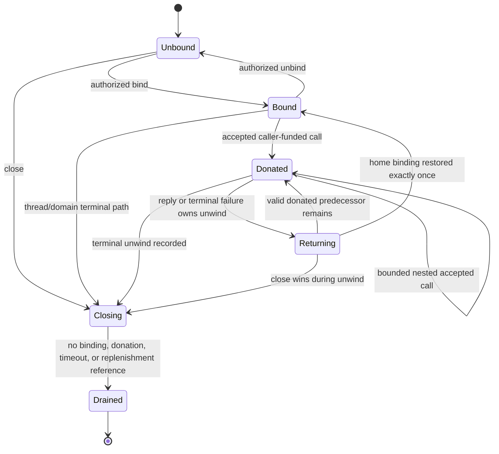
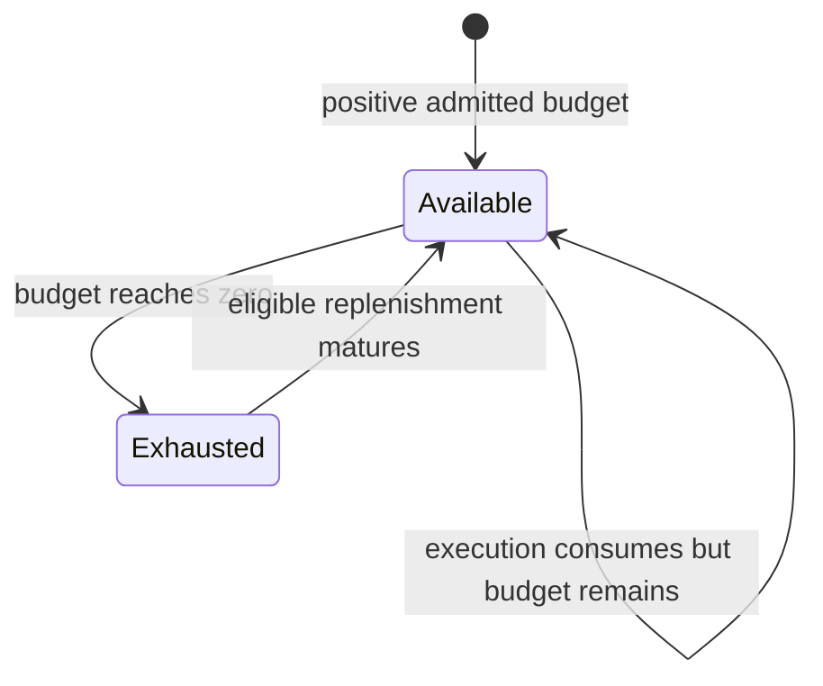
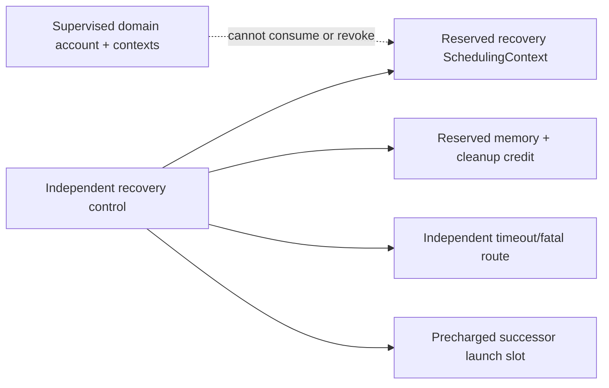

# Scheduling contexts and temporal authority

CPU time should be an explicit, conserved, capability-mediated resource
represented by a `SchedulingContext` with a bounded replenishment structure,
budget, period, priority ceiling, affinity, and one exclusive binding or
donation chain. Policy and BEAM process selection stay in user space. A thread
cannot run on a context whose budget is exhausted; its domain may still run on
another independently available context. Every supervised failure scope has an
independent recovery context, timer path, memory reserve, and fault route that
the supervised domain cannot spend or revoke.

This is the recommended implementation for component 5 of the [minimal
privileged kernel layer](../minimal-privileged-kernel-layer.md). seL4 MCS and
scheduling-context research demonstrate explicit budgets, passive-server
donation, and timeout exceptions. Resource containers support causal charging,
while time-protection work shows that budget isolation is not timing-channel
isolation. The stronger cancellation, immutable-while-bound, kernel/IRQ charge,
and recovery-reserve rules below remain proposals.

## Question, scope, and operational standard

The question is:

> How can the kernel enforce temporal isolation and preserve enough independent
> execution capacity for recovery while allowing an unprivileged managed
> runtime to schedule lightweight actors and account service work causally?

The kernel schedules threads and scheduling contexts, not BEAM processes.
ERTS-style reduction accounting, run-queue policy, actor priority, dirty work,
and mailbox pressure remain managed-runtime mechanisms layered over the CPU
capacity assigned to runtime threads.

The first implementation is adequate when:

1. Every dispatch has a current context with positive budget and an allowed
   priority/affinity; zero budget prevents user execution.
2. Context creation and configuration require conserved/admission-checked
   `SchedulingControl` authority rather than manufacturing utilization.
3. Replenishment storage is fixed and charged; adversarial blocking/wakeup
   patterns cannot grow kernel state without bound.
4. Donation forms one bounded exclusive chain, cannot fork, and returns exactly
   once on reply, cancel, timeout, or lifecycle failure.
5. An accepted passive handler still needs a positive handler quantum before
   dispatch; kernel admission cannot smuggle in unbudgeted execution.
6. Privileged syscall, fault, timeout, interrupt, and deferred work is charged
   to a declared principal or bounded system reserve and cannot run indefinitely.
7. Recovery execution and its wakeup/deadline path remain outside the failed
   domain's account, capability lineage, and failure subtree.
8. Documentation and tests distinguish budget isolation from optional cache,
   TLB, predictor, interrupt, and kernel-state time protection.

## Evidence and limits

| Evidence | Supported conclusion | Limit for this design |
| --- | --- | --- |
| [Scheduling-context capabilities](../../30-sources/lyons-et-al-2018-scheduling-context-capabilities.md) | Budget/period objects, priority-control authority, passive donation, and timeout exceptions can support user-level policy and temporal isolation | Donation cancellation is a trust problem; measured overhead is platform/workload specific |
| [seL4 reference manual](../../30-sources/sel4-foundation-2026-reference-manual.md) | Current MCS objects, refill limits, bindings, donation, timeouts, and scheduling-control operations provide a concrete implementation reference | The manual permits cases where a donated context never returns and does not provide this recovery topology |
| [Resource containers](../../30-sources/banga-et-al-1999-resource-containers.md) | The resource principal can be separate from the thread executing server work, enabling causal accounting | Accounting alone is not admission control, enforcement, or a capability model |
| [Scheduler activations](../../30-sources/anderson-et-al-1992-scheduler-activations.md) | Kernel processor allocation can be separated from user-level fine-grained thread scheduling | Upcalls and critical-section recovery were complex; the design is historical |
| [Time protection](../../30-sources/ge-et-al-2019-time-protection.md) | Spatial and CPU-budget isolation leave microarchitectural timing channels unless state is partitioned, flushed, or padded | Full mitigation is hardware/configuration dependent and retains residual channels |
| [Timing analysis of a protected kernel](../../30-sources/blackham-et-al-2011-timing-analysis-protected-kernel.md) | Kernel bounds require a concrete binary, hardware/configuration model, and explicit preemption points | Results are historical and largely single-core; they do not bound this kernel |

## Object and authority model

### `SchedulingControl`

A control capability represents authority over a finite share of one CPU or
admission domain. It carries:

- CPU or affinity-set scope;
- maximum controlled priority;
- maximum admitted utilization or server capacity;
- permitted budget/period ranges and refill count; and
- child-control delegation limits.

Creating or reconfiguring a context consumes or reserves capacity under an
admission policy. Child controls can only narrow scope and ceilings. The kernel
enforces conservation; user-space policy chooses which services receive it.

### `SchedulingContext`

```text
SchedulingContext {
  object_identity_and_generation,
  budget,
  period,
  bounded_replenishments[N],
  current_available_budget,
  maximum_controlled_priority,
  affinity_set,
  binding_state,
  donation_chain[bounded_depth],
  timeout_route,
  payer_account,
  lifecycle_and_teardown_epoch
}
```

It is neither a thread nor a protection domain. A context may bind to one
active thread, wait unbound, or move along one accepted caller-funded donation
chain. It cannot be simultaneously dispatched by two threads.

### Authority facets

| Facet | Authority |
| --- | --- |
| `Bind` | Bind an unbound context to a compatible thread |
| `Donate` | Permit transfer only through accepted compatible calls |
| `SetBudget` | Configure while unbound and within control limits |
| `SetPriority` | Set within the control capability's ceiling |
| `SetAffinity` | Narrow placement within admitted CPUs |
| `Inspect` | Read budget, replenishment, overrun, and donation state |
| `Close` | Stop new bindings/donations and begin drainage |

The first profile permits structural reconfiguration only while `UNBOUND` and
not present in a donation chain. Live arbitrary parameter changes make budget
conservation, current replenishments, and call funding ambiguous.

## Binding and donation lifecycle



Each unwind revalidates the exact predecessor generation, parent call state,
suspension overlay, and domain gates. A valid predecessor receives the binding;
a terminal one is skipped until the home binding is restored or the context
becomes unbound. Closing retains enough metadata to perform this unwind without
duplicating CPU authority.

## Budget-availability lifecycle



Budget availability is orthogonal to binding/donation and to the thread's run
state. `EXHAUSTED` neither destroys nor unbinds the context. A replenishment
only makes the context `AVAILABLE`; dispatch still requires a ready thread,
compatible affinity, scheduler admission, and open thread and domain execution
gates. Runnable and executing states therefore belong to the thread lifecycle,
not to this context. A timeout event can inform user policy but cannot create
CPU authority for its handler.

## Budget and replenishment semantics

The baseline should use a sporadic-server-style budget/period contract with a
fixed maximum number of replenishment entries. Execution consumes budget using
the lower layer's monotonic counter. Preemption, interrupt entry, and migration
capture the counter delta with architecture-defined precision and wrap handling.

When consumption would require more than `N` replenishment records, the
implementation uses one specified conservative merge rule that cannot increase
available service above the admitted envelope. It reports merge/precision
counters so policy can detect workloads that need a different profile.

The public contract must state:

- whether budget is continuous or quantized;
- timer and accounting error bounds per target;
- maximum delayed preemption/overrun in privileged code;
- treatment of interrupt and steal/firmware time;
- replenishment merge rule and worst-case service envelope; and
- migration requirements when counters are not globally synchronized.

## Donation protocol

Donation is part of call acceptance, never a separate best-effort scheduler
operation:

1. Caller context is exclusively bound and has a positive reserved acceptance
   prefix plus handler budget.
2. Endpoint generation is caller-funded and the parked receiver has compatible
   affinity and no bound context.
3. A finite server-consented admission and current abort policy are validated.
4. Acceptance atomically records the previous binding, call and receiver
   generations, remaining budget, donation depth, and return owner.
5. The receiver becomes `READY` with the donated context. Dispatch independently
   checks positive budget and open domain/thread gates.
6. Reply or a terminal event atomically becomes the one unwind owner. Nested
   descendants drain from the end of the chain.
7. Only after the receiver reaches the required checkpoint do binding and
   residual budget return exactly once to the predecessor.

The chain has a profile maximum. Calls beyond it fail before acceptance or must
use a server-funded endpoint. Donation may cross threads but should initially
remain within one CPU/affinity domain; cross-core donation requires validated
counter, run-queue, and return semantics.

## Causal charging

CPU use should carry a charge identity distinct from the executing domain:

- ordinary server-funded work charges the server context;
- caller-funded passive work charges the donated caller context;
- asynchronous work created by a request carries a bounded delegated account
  or reverts to a server/system account according to explicit policy;
- syscall work charges the invoking context up to a declared non-preemptible
  prefix, then may continue through charged resumable work;
- interrupt hard paths charge a prevalidated source/system reserve and enforce
  mask/quarantine thresholds; and
- teardown and recovery use pre-reserved accounts outside the failed domain.

This does not require every CPU cycle to be attributed perfectly. It requires
uncertainty and unattributable overhead to be bounded and visible rather than
an unlimited free kernel reserve.

## Recovery reserve



A supervisor sharing the failed domain's budget can be starved precisely when
needed. The baseline requires a reserve whose capability lineage, payer,
deadline channel, and fault route do not descend from the supervised scope.
Admission must include simultaneous worst-case recovery demand for the scopes
the reserve covers; merely labelling a context “recovery” creates no capacity.

## Runtime scheduling boundary

The managed runtime receives one or more kernel threads with contexts. It
schedules BEAM processes by reductions and mailbox/work state on those threads.
The two accounting levels answer different questions:

| Layer | Unit | Purpose |
| --- | --- | --- |
| Kernel | Scheduling context budget and period | Enforce domain/service CPU ceiling and recovery availability |
| Managed runtime | Reductions, scheduler queues, dirty-work classes | Preserve actor responsiveness and fairness within assigned capacity |

Kernel priority is not an actor priority. A high-priority BEAM process cannot
exceed the runtime domain's context budget. Conversely, a domain with budget
can still schedule its actors unfairly; that is a runtime bug or policy issue.

## Budget isolation versus time protection

Budgets prevent direct CPU monopolization but do not prevent observation through
shared caches, TLBs, predictors, DRAM controllers, kernel metadata, interrupts,
or DVFS. An optional time-protection profile may add:

- core/cache coloring or partitioning;
- kernel data partitioning;
- predictor/TLB/cache flushes at security-domain switches where supported;
- interrupt partitioning and deterministic padding; and
- restrictions on simultaneous multithreading and shared frequency domains.

Each target needs a feasibility ledger and residual-channel statement. The
baseline must say “temporal resource isolation,” not claim confidential
noninterference from budgeting alone.

## Multiprocessor placement

Initial scheduling contexts are CPU-affine or restricted to a set with a
compatible counter and admission domain. Migration is an explicit transaction:
remove from the old run queue, capture/charge elapsed time, validate target
capacity and affinity, transfer the exclusive binding, and publish the new CPU
generation. Domain closure competes with migration at the binding transition.

Per-CPU run queues and explicit cross-core wakeups avoid a global hot lock.
However, the semantic model should be implemented first under simpler locking;
replication must not weaken budget conservation or produce simultaneous
dispatch.

## Implementation path

1. Define budget/period/refill arithmetic with integer-overflow and precision
   rules in an executable model.
2. Implement CPU-affine server-funded contexts with a coarse scheduler lock and
   bounded refill array.
3. Add timeout delivery, account inspection, depletion tests, and kernel-overrun
   measurements.
4. Reserve independent recovery contexts and demonstrate recovery under hostile
   CPU saturation.
5. Add caller-funded single-level donation with exact return on all call
   outcomes; then model bounded nesting.
6. Add per-CPU queues and explicit migration after conservation tests pass.
7. Evaluate optional time-protection mechanisms per hardware target rather than
   baking them into the baseline ABI.

## Verification and experiments

- Prove budget never increases except through an admitted replenishment or
  authorized reconfiguration and one context is never bound twice.
- Model reply/cancel/timeout/domain-stop races along nested donation chains;
  residual budget and binding return once.
- Measure maximum kernel overrun for every syscall, fault, interrupt, and
  preemption-disabled section on target binaries.
- Generate adversarial block/wake patterns to fill refill arrays and verify the
  merge rule remains conservative.
- Saturate supervised domains and interrupt sources while measuring bounded
  dispatch latency of the independent recovery reserve.
- Run representative BEAM latency/throughput workloads comparing server-funded
  and caller-funded services and multiple kernel-context allocations.
- Measure residual timing channels separately from CPU-budget enforcement and
  state the hardware/configuration assumptions.

## Rejected alternatives

- **Thread priority alone:** does not cap consumption or reserve time for
  recovery.
- **Domain owns all charged work:** loses causal attribution through servers and
  encourages cross-domain denial of service.
- **Unlimited refill list:** adversarial wakeups allocate unbounded kernel state.
- **Donation without cancellation semantics:** a failed server can retain the
  caller's only execution authority indefinitely.
- **Runtime reductions as kernel budget:** moves BEAM policy into privilege and
  cannot account native/kernel/device work.
- **Budgeting equals time protection:** ignores microarchitectural channels.

## Open questions

- What initial refill count and merge rule give useful sporadic-server behavior
  without excessive object size or analysis complexity?
- Which privileged work is charged directly to callers versus source-specific
  reserves, and how is unavoidable system overhead apportioned?
- Can caller-funded donation across CPUs be made worthwhile after migration and
  counter costs, or should it remain CPU-local?
- How should admission reserve simultaneous supervisor failures without making
  resource utilization impractically low?

## Connections

- [Bounded invocation and transport](bounded-invocation-and-transport.md)
- [Protection domains, threads, and address spaces](protection-domains-threads-and-address-spaces.md)
- [Fault capture and containment](fault-capture-and-containment.md)
- [Raw time and deadline programming](../kernel-hardware-and-architecture-components/raw-time-and-deadline-programming.md)
- [Managed-runtime reduction scheduler](../managed-actor-runtime-components/reduction-scheduler-and-kernel-scheduling-contexts.md)
- [Managed-runtime resource accounting](../managed-actor-runtime-components/resource-accounting-and-overload-control.md)
- [Minimal privileged-kernel contract inquiry](../../40-inquiries/what-contract-should-the-minimal-privileged-kernel-provide.md)

## Sources

- [Scheduling-context capabilities](../../30-sources/lyons-et-al-2018-scheduling-context-capabilities.md)
- [seL4 reference manual](../../30-sources/sel4-foundation-2026-reference-manual.md)
- [Resource containers](../../30-sources/banga-et-al-1999-resource-containers.md)
- [Scheduler activations](../../30-sources/anderson-et-al-1992-scheduler-activations.md)
- [Time protection](../../30-sources/ge-et-al-2019-time-protection.md)
- [Timing analysis of a protected kernel](../../30-sources/blackham-et-al-2011-timing-analysis-protected-kernel.md)
