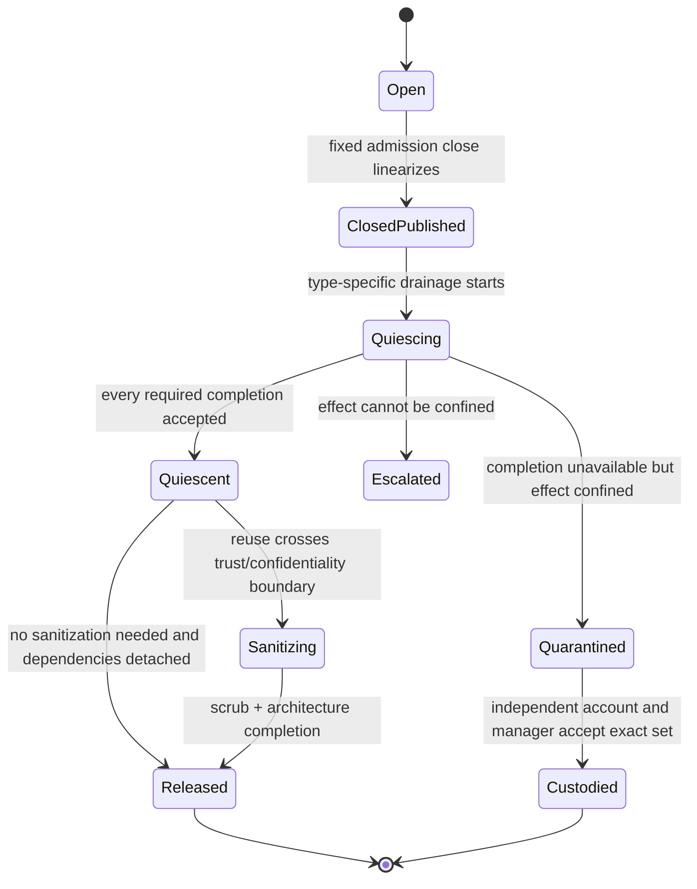
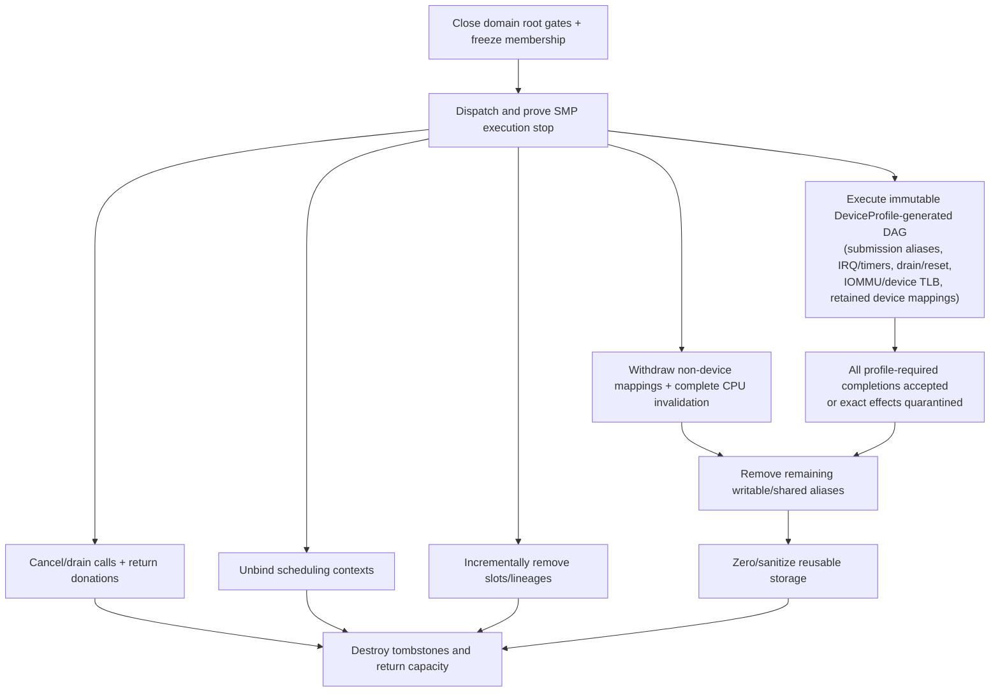

# Teardown, revocation, and safe reclamation

Teardown should be a typed dependency-driven protocol, not one recursive
destructor. Domain closure first publishes fixed admission-gate closure and
dispatches the SMP stop epoch in bounded work. A charged `ReapToken` then
advances stable product records for calls, capabilities, mappings, interrupts,
timers, queues, DMA, frames, and objects through logical close, software
drainage, architecture/device quiescence, sanitization, and release. Anything
whose completion cannot be proved remains in a precise independently custodied
quarantine set; it is never optimistically reused.

This is the recommended implementation for component 9 of the [minimal
privileged kernel layer](../minimal-privileged-kernel-layer.md). Capability
revocation, seL4 retyping, RCU, hazard pointers, architecture invalidation, and
driver-recovery research support individual steps. No cited source proves the
unified lifecycle or ordering across every product class proposed here.

## Question, scope, and operational standard

The question is:

> After authority or a domain closes, what exact evidence lets the kernel
> reclaim each byte and identifier without stale software, CPU, interrupt, or
> device effects reaching a replacement?

This component owns protected teardown ledgers, dependency order, resumable
progress, completion-token validation, quarantine custody, sanitization, and
the final reusable verdict. Object-specific components perform their own close
and quiescence operations through the lower architecture mechanisms.

The implementation is acceptable only if:

1. Logical closure is constant-work and orders against later admission before
   any potentially large graph traversal.
2. Domain execution stop is dispatched before capability/object walks and
   `STOPPED` is required before releasing resources a member could still use.
3. Every admitted effect has one stable generation-tagged product record whose
   backing survives every late completion that can name it.
4. Teardown work is bounded, resumable, idempotent, charged, and pre-resourced at
   admission; recovery-service failure cannot force destructive replay.
5. Software references, calls, scheduling, CPU translations, IRQ/timer events,
   DMA/IOMMU state, device queues, and reset each reach their own declared
   quiescence point before dependent release.
6. Generation changes only at safe backing reuse; logical close never redirects
   stale references toward a replacement.
7. Quarantine has exact scope, deny-new-effect enforcement, an independent
   custodian/account, and a documented escalation when confinement is impossible.
8. `REAPED_CLEAN` and `REAPED_WITH_QUARANTINE` make different claims and are
   never inferred from elapsed time alone.

## Evidence and limits

| Evidence | Supported conclusion | Limit for this design |
| --- | --- | --- |
| [seL4 reference manual](../../30-sources/sel4-foundation-2026-reference-manual.md) | Capability derivation/revoke and untyped retype require descendant cleanup before reuse | Traversal is not the proposed constant-work logical close and does not cover this device lifecycle |
| [Comprehensive seL4 verification](../../30-sources/klein-et-al-2014-comprehensive-sel4-verification.md) | Explicit object/reuse invariants can be verified while assumptions and excluded hardware effects remain visible | Similar objects do not transfer the proof; multicore/device assumptions differ |
| [Read-copy update](../../30-sources/mckenney-slingwine-1998-read-copy-update.md) | Remove future lookup first, then reclaim after pre-existing software readers cross quiescence | RCU does not stop CPUs, translations, IRQs, or devices and can retain memory behind slow readers |
| [Hazard pointers](../../30-sources/michael-2004-hazard-pointers.md) | Bounded published software references can protect removed objects until no participant names them | Scan cost and retained nodes need bounds; hardware effects are outside the method |
| [Exokernel](../../30-sources/engler-et-al-1995-exokernel.md) | Secure binding and visible resource revocation are core protection mechanisms | Raw-resource precedents do not supply portable cross-device completion |
| [Relaxed virtual memory](../../30-sources/simner-et-al-2022-relaxed-virtual-memory.md) | Translation removal, invalidation, ordering, and delayed reuse form a protocol | Arm-specific model and incomplete coverage |
| [CleanQ](../../30-sources/haecki-et-al-2019-cleanq.md) | Queue-buffer ownership must be explicit across transfer and return | Reset, malicious devices, and full lifecycle are excluded |
| [Thunderclap](../../30-sources/markettos-et-al-2019-thunderclap.md) | Temporal DMA exposure and shared buffers remain dangerous despite nominal IOMMU protection | Historical systems; it diagnoses rather than proves this remedy |
| [Recovering device drivers](../../30-sources/swift-et-al-2004-recovering-device-drivers.md) | Reconstruction needs external state and some accepted operations stay indeterminate after failure | No universal malicious-device/reset solution |

## Product ledger

Every effect-bearing relationship has a stable record:

```text
TeardownProduct {
  product_type,
  object_identity_and_generation,
  source_domain_and_lifetime_group,
  payer_and_cleanup_credit,
  inherited_anchor_vector,
  admitted_operation_identity,
  lifecycle_state,
  dependency_ids_and_generations[bounded],
  software_pin_summary,
  expected_completion_set,
  accepted_completion_set,
  quarantine_scope_and_custodian,
  sanitization_requirement,
  next_action_and_cursor
}
```

Records exist for capability lineages and anchors, call/reply state, scheduling
bindings, mappings, IRQ/timer bindings, device queues, DMA mappings, frame
epochs, diagnostics, and typed objects. A record is allocated/charged when the
effect is admitted, not later after the payer has failed.

## Product lifecycle



The domain lifecycle remains authoritative. These records refine its
`CLOSING`, `DRAINING`, `QUIESCENT`, sanitizing, and reaped states rather than
creating a competing domain state machine.

## Teardown dependency graph



Independent branches may run concurrently, but their dependency edges cannot
be reordered merely for speed. The device node is a placeholder for a concrete
DAG generated from the immutable `DeviceProfile`, not a universal sequence.
Its nodes include submission-alias closure, IRQ/timer quiescence, drain/reset,
IOMMU/device-TLB completion, and any device mappings that must remain until a
later step. Every required node feeds `tr_profile_done`, so IRQ or timer state
cannot disappear from the release proof.

## Required teardown order

### 1. Publish closure and dispatch stop

One bounded transition closes the domain's execution, relationship, outbound-
call, and session gates; freezes membership; creates `stop_epoch`; initializes
preallocated CPU acknowledgement slots; and sends stop requests. Delegated
capabilities inherit relevant gates, so a holder in another CSpace cannot start
a new child operation afterward.

Do not first scan capabilities, mappings, or objects. That lets a large or
adversarial graph delay execution stop while members create more effects.

### 2. Prove execution stop

Every member is removed from user execution and every in-kernel activation
reaches a declared checkpoint that commits or aborts its operation and publishes
any admitted effect. A timeout becomes `STOP_FAILED`. Without a verified stuck-
CPU recovery protocol, teardown escalates to node reset and retains all
dependent resources.

### 3. Stabilize protected software state

After `STOPPED`, close and traverse CSpace slots, lineage nodes, reply tokens,
waiters, owned objects, and lifetime groups in charged slices. Do not release
their records while software activation pins or revocation cursors refer to
them. Shared/client-owned objects remain under their own groups.

### 4. Drain calls and scheduling

Select terminal outcomes for blocked/accepted calls; drive handlers to required
checkpoints; close borrowed capability/product anchors; drain nested calls; and
return donated scheduling contexts exactly once. Then unbind permanent contexts
and account residual budget. A caller may have observed an outcome before this
physical drainage completes.

### 5. Close mapping admission and withdraw eligible CPU mappings

Publish no-new-map/protect state. Remove non-device PTEs/root relationships and
complete the recorded cross-CPU invalidation set when they are no longer a
prerequisite for a later hardware step. Device MMIO, shared-ring, doorbell, and
other submission mappings instead enter the `DeviceProfile` DAG: some profiles
revoke them before reset, while others must retain selected mappings until
drain or reset completes. Frames and address-space roots remain pinned.
Offline or nonacknowledging CPUs must be handled by a proven platform protocol
or force quarantine/reset; elapsed time is not TLB completion.

### 6. Instantiate the profile-specific device teardown DAG

Instantiate the immutable `DeviceProfile` graph for the exact endpoint,
requester set, queue generation, interrupt set, reset domain, and platform
revision. Its ordering may require early submission-alias revocation, continued
mapping access until reset, drain before interrupt masking, interrupt masking
before reset, or another documented dependency. A direct queue requires every
holder to be terminally stopped or every consumed ring, doorbell, MMIO, and
reconfiguration alias to be revoked with completed CPU invalidation at the
profile-declared point. Capability closure alone is not submission closure.

### 7. Quiesce or reset devices

Execute that DAG, including its queue drain, interrupt/timer ordering, posted-
write completion, reset, IOMMU/device-TLB invalidation, and retained-mapping
nodes. There is no universal drain/reset/invalidate order. Buffers remain
pinned while hardware can read or write. Driver death is not evidence; a late
completion must bind the exact profile, object generations, reset epoch, and
operation. Release waits for every profile-required IRQ, timer, queue, device,
translation, and mapping completion or for an independently custodied exact
quarantine set.

### 8. Remove remaining aliases

Revoke writable shared-ring, diagnostic, pager, and manager aliases not already
required by device steps. Service protocols separately reconcile ring epochs
and requests represented only in user memory; the kernel cannot enumerate
semantic messages it never owned.

### 9. Sanitize and release

Only after every relevant completion is consumed can confidential bytes be
zeroed and storage returned. Sanitization itself follows target cache/persistent-
memory rules and is charged. Destroy stable tombstones last, then advance or
retire object generations.

## Bounded progress

`reap(domain, work_budget)` processes at most a profile-defined number of nodes,
completion records, or bounded architecture steps and returns:

```text
ReapToken {
  domain_and_teardown_epoch,
  current_phase,
  stable_cursor,
  work_completed,
  remaining_estimate_or_unknown,
  pending_completion_classes,
  quarantine_set,
  payer_and_reserved_cleanup_credit,
  recovery_epoch_for_control
}
```

Repeated calls are idempotent. A successor recovery holder revalidates/adopts
the token under its current lease without changing the underlying teardown
epoch. Completed destructive steps are not replayed; outstanding steps do not
disappear when the reaper service crashes.

Admission reserves enough metadata and cleanup credit for the maximum graph the
domain can create. Otherwise the kernel could admit authority it lacks resources
to revoke during failure.

## Software reclamation mechanisms

The implementation may combine:

- fixed admission anchors for instant logical denial;
- stable derivation/tombstone nodes for physical capability enumeration;
- RCU/epoch grace periods for read-mostly lookup structures;
- bounded per-activation hazard pins for exact object references;
- reference counts for long-lived relationships whose cycles are separately
  represented in the dependency graph; and
- type-specific completion tickets for CPU/device effects.

No single mechanism is universal. A zero refcount does not prove TLB or DMA
quiescence; an RCU grace period does not close a capability; an epoch number
does not undo an external operation.

## Quarantine semantics

Quarantine is valid only when the kernel can prove the unresolved effect is
confined to an exact set. For a frame/device set this requires:

- global deny-new-map/transfer/DMA authority for each frame epoch;
- completed removal of all incompatible CPU aliases;
- closed submission, queue, IRQ, and reset-manager sessions;
- IOMMU or physical/platform containment preventing access outside the listed
  requester/frame set; and
- an independently authorized custodian and account retaining every object and
  record needed for later evidence or wider reset.

`REAPED_WITH_QUARANTINE` means all reusable resources were released and custody
of the listed inaccessible set transferred. It does not mean the underlying
device or effect stopped. If confinement itself cannot be proved, reaping does
not complete and the failure escalates to partition/node reset.

## Publication versus completion

The API should use precise terms:

| Product | Published close/revoke | Quiescent/reusable |
| --- | --- | --- |
| Capability anchor | Later lookup/derivation fails | Descendant nodes, pins, and cursors drained |
| Call | Terminal outcome selected; no new call descendants | Handler checkpoint, borrows, nested calls, and donation drained |
| CPU mapping | Later mapping acquisition fails and withdrawal published | Every required translation invalidation acknowledged |
| IRQ/timer | Later delivery admission fails | Source/channel and late event generations drained |
| DMA lease | Later submission fails | Device/IOMMU/profile completion proves no old access |
| Frame | New mutating facets/maps denied | Every CPU/device alias gone, then sanitization complete |

This vocabulary should appear in results, tracing, tests, and recovery policy.

## Implementation path

1. Build an executable product-state/dependency model with capability, call,
   mapping, and frame records only.
2. Implement fixed domain closure and SMP stop before any bulk traversal.
3. Add charged idempotent reap cursors and software reference reclamation.
4. Add mapping/TLB completion and global frame quarantine on two ISAs.
5. Add IRQ/timer late-event drainage.
6. Add one tightly specified device queue/DMA/reset profile and adversarial
   delayed-completion model.
7. Add recovery-lease adoption and precise quarantine custody.
8. Measure/verify cleanup reserves before admitting broader object counts or
   additional device classes.

## Verification and experiments

- Model-check close/admit, stop/migrate, reply/cancel, unmap/shootdown, and
  unmap/DMA-completion races across interdependent product records.
- Generate random bounded dependency graphs; incremental reaping must match a
  reference topological cleanup without skipping or double-destroying nodes.
- Crash the reaper after every cursor commit and resume under a new recovery
  epoch; destructive actions remain idempotent.
- Hold RCU readers/hazard pins indefinitely and verify only dependent objects
  remain charged while unrelated cleanup progresses.
- Inject missing CPU, IRQ, timer, IOMMU, ATS, device, reset, and posted-write
  completions; no affected resource reaches clean reuse.
- Reassign released frames to an adversarial domain and test for stale CPU/DMA
  access and residual data.
- Validate maximum per-slice work, lock hold, stack, completion storage, and
  total reserved cleanup credit at profile limits.

## Rejected alternatives

- **Delete last capability then free:** misses admitted operations, shared
  ownership, translations, and hardware effects.
- **One unbounded recursive revoke/destructor:** turns adversarial graph size
  into privileged latency and stack consumption.
- **Wait before closing admission:** lets new effects race into the graph.
- **Generation bump as cancellation:** rejects stale software but does not stop
  old physical effects.
- **Timeout implies quiescence:** converts missing evidence into unsafe reuse.
- **Quarantine without global alias denial/custody:** is only a label, not
  containment.

## Open questions

- What static type/dependency schema can generate both teardown code and proof
  obligations without hiding target-specific quiescence?
- How much cleanup credit is sufficient under worst-case fan-out, and how is
  quarantined capacity reflected in future admission?
- Which software lookup structures benefit from RCU versus explicit hazard pins
  under bounded kernel activations?
- What platform evidence is sufficient to quarantine a stuck device without a
  full node power cycle?

## Connections

- [Typed object storage and explicit memory](typed-object-storage-and-explicit-memory.md)
- [Capability spaces and authority](capability-spaces-and-authority.md)
- [Protection domains, threads, and address spaces](protection-domains-threads-and-address-spaces.md)
- [Memory mappings and architecture-resource bindings](memory-mappings-and-architecture-resource-bindings.md)
- [Failure boundaries and recovery topology](failure-boundaries-and-recovery-topology.md)
- [Minimal privileged-kernel contract inquiry](../../40-inquiries/what-contract-should-the-minimal-privileged-kernel-provide.md)

## Sources

- [seL4 reference manual](../../30-sources/sel4-foundation-2026-reference-manual.md)
- [Comprehensive seL4 verification](../../30-sources/klein-et-al-2014-comprehensive-sel4-verification.md)
- [Read-copy update](../../30-sources/mckenney-slingwine-1998-read-copy-update.md)
- [Hazard pointers](../../30-sources/michael-2004-hazard-pointers.md)
- [Exokernel](../../30-sources/engler-et-al-1995-exokernel.md)
- [Relaxed virtual memory](../../30-sources/simner-et-al-2022-relaxed-virtual-memory.md)
- [CleanQ](../../30-sources/haecki-et-al-2019-cleanq.md)
- [Thunderclap](../../30-sources/markettos-et-al-2019-thunderclap.md)
- [Recovering device drivers](../../30-sources/swift-et-al-2004-recovering-device-drivers.md)
