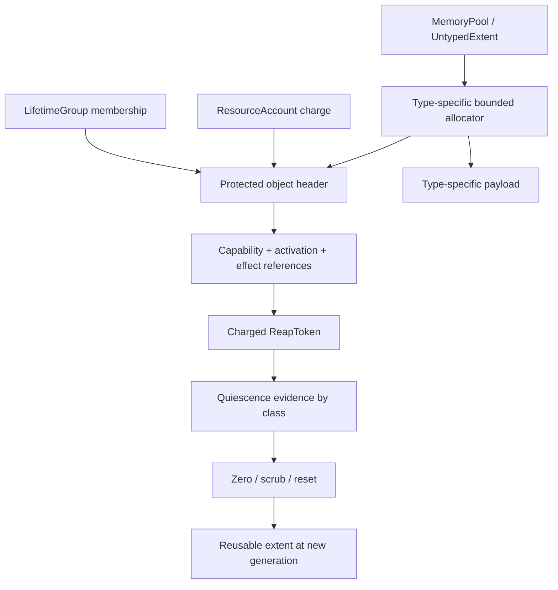
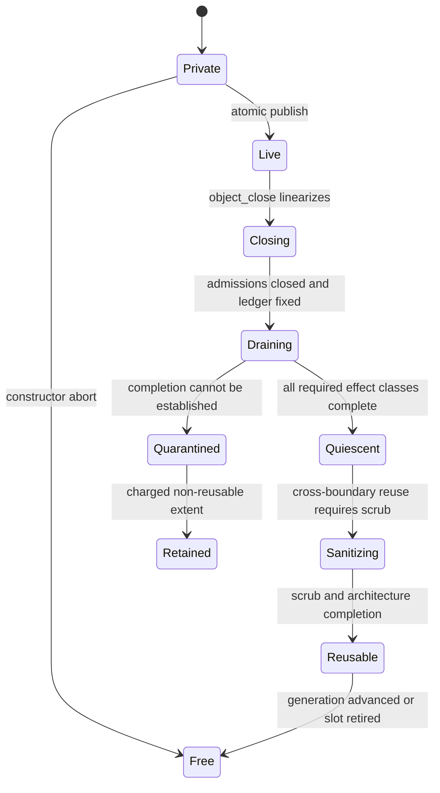

# Typed object storage and explicit memory

Every dynamic kernel object should be created from caller-designated physical
storage and charged atomically to one resource account and one lifetime group.
The kernel should use fixed-size type-specific slabs or extents derived from
typed memory pools, never a general ambient heap. Deletion performs logical
closure only; storage returns to a pool after capability, CPU, MMU, IRQ, timer,
DMA, diagnostic, and concurrency references have reached their declared
quiescence points and confidentiality sanitization is complete.

This is the recommended implementation for component 1 of the [minimal
privileged kernel layer](../minimal-privileged-kernel-layer.md). seL4 supplies
strong precedent for explicit untyped memory and retyping. RCU and hazard
pointers illuminate software-reference reclamation. The unified accounting,
lifetime-group, multi-class effect ledger, and split-phase reaper proposed here
remain unverified.

## Question, scope, and operational standard

The question is:

> How can a small kernel create and reclaim dynamic objects without hidden
> memory consumption, stale aliases, or an unbounded exceptional-path
> allocator?

This component owns backing storage, type transitions, object identities,
charges, lifetime membership, and the final reusable/not-reusable decision. It
does not choose service quotas, virtual placement, capability policy, restart
policy, or device-specific quiescence sequences.

The first implementation is acceptable only if:

1. Every live object maps to one non-overlapping backing extent and exactly one
   payer and lifetime group.
2. Creation either publishes a fully initialized object with all three records
   or has no externally visible effect.
3. Every object type has a fixed maximum size or an explicit bounded extent
   vector; no syscall allocates recursively from an ambient heap.
4. Object identity cannot alias after generation wrap, storage reuse, or pool
   split/merge.
5. Logical closure immediately rejects later acquisitions, while admitted
   references remain pinned and enumerable.
6. Reuse waits for every relevant quiescence class, not merely a zero
   capability count.
7. Cross-confidentiality reuse zeroes bytes through an architecture-correct
   protocol before a new object is published.
8. Reclamation work and retained quarantined storage remain charged and
   observable under adversarial failure.

## Evidence and limits

| Evidence | Supported conclusion | Limit for this design |
| --- | --- | --- |
| [seL4 reference manual](../../30-sources/sel4-foundation-2026-reference-manual.md) | Caller-held untyped memory can be retyped into explicit kernel objects, and descendants constrain reuse | Its object set, revocation implementation, and boot authority are not this design |
| [Kernel design for physical-memory isolation](../../30-sources/elkaduwe-et-al-2008-kernel-memory-isolation.md) | Explicit object memory and capabilities make physical-memory authority and isolation more tractable | The model does not establish this full lifecycle across DMA and recovery |
| [Comprehensive seL4 verification](../../30-sources/klein-et-al-2014-comprehensive-sel4-verification.md) | A disciplined object model supports refinement and access-control proofs, with important stated exclusions | Similar objects do not transfer seL4's proof or close hardware assumptions |
| [Exokernel](../../30-sources/engler-et-al-1995-exokernel.md) | Secure binding and visible revocation can separate protection from resource policy | Exposing raw resource management is not a portable or complete reclamation contract |
| [Read-copy update](../../30-sources/mckenney-slingwine-1998-read-copy-update.md) | Logical removal and physical reclamation can be separated until pre-existing readers pass quiescence | RCU covers software readers, not translations, interrupts, or devices |
| [Hazard pointers](../../30-sources/michael-2004-hazard-pointers.md) | Explicit bounded reference publication can protect lock-free nodes and permit later arbitrary reuse | Scanning and retention must be bounded; hardware effects are outside the method |

## Object-store structure



The protected header should contain only common enforcement state:

```text
ObjectHeader {
  object_slot,
  object_generation,
  immutable_type,
  lifecycle_state,
  backing_extent_id_and_generation,
  payer_account_id_and_generation,
  lifetime_group_id_and_generation,
  revocation_anchor_vector,
  active_activation_count,
  type_specific_effect_summary,
  teardown_epoch,
  integrity_cookie_or_debug_checksum
}
```

The checksum is diagnostic, not authority. The header is protected kernel
memory; a user-provided value never becomes an object identity or reference.

## Pool and type model

One root pool describes a disjoint physical extent and its allocation lineage.
`Split` creates child extents without duplicating capacity. `Retype` consumes an
aligned free subextent and produces objects of one declared type. A pool node
cannot merge or return to its parent until every descendant object and child
pool is terminal and physically reusable.

The recommended first profile uses:

- power-of-two pool splits for page-granular frames and page-table objects;
- fixed-size per-type slabs for small kernel records;
- caller-supplied contiguous extents for large or architecture-constrained
  objects; and
- no compaction that moves a live privileged object.

Internal fragmentation is preferable to moving objects behind active
architecture or capability references. Later profiles may add typed slab
packing, but they must retain exact payer, lineage, and final-free accounting.

## Atomic creation

Creation is one linearizable transition:

1. Resolve and pin the pool, account, lifetime group, destination slot, and all
   type-specific authority inputs.
2. Validate type, alignment, size, quota, generation, lifecycle, anchor path,
   and destination capacity without changing state.
3. Reserve the exact extent and protected metadata from caller-backed capacity.
4. Initialize the complete object privately, including failure and teardown
   records needed later.
5. Atomically debit the account, attach the lifetime record, consume or split
   the pool extent, and publish the capability.
6. Return the new selector and immutable creation summary.

If any check fails before step 5, all inputs are unchanged. There is no state
where a capability names an uninitialized object or an account was charged
without a corresponding object. Type-specific constructors may validate a
mapping root, endpoint, scheduling control, or device profile, but they cannot
allocate hidden records after publication.

## Resource accounting

Physical bytes alone are insufficient. Charges must cover:

- object storage and alignment loss;
- capability slots, lineage nodes, anchors, and revocation cursors;
- call records, reply tokens, reservations, waiter slots, and notification
  state;
- scheduling replenishments, timeout records, and per-CPU bindings;
- mappings, page tables, translation completion records, IRQ/timer bindings,
  and DMA ledgers;
- fault records, trace buffers, diagnostic pins, and crash references; and
- retained teardown and quarantine metadata.

One object has exactly one payer. Shared funding occurs by delegating quota to
a shared account first, not by installing an unbounded contributor list in the
header. Moving a charge requires the source account's `MoveCharge`, the
destination's `AcceptCharge`, sufficient destination quota, and object/lifetime
authority. The debit and payer reference change atomically or not at all.

Accounts themselves cannot disappear while charges, reserved cleanup credit,
or in-progress transfers refer to them. A failed payer does not excuse a leak:
recovery may accept the charge into a preauthorized reserve or leave the object
quarantined against the failed account.

## Lifetime groups are not accounts

The account answers who pays; the lifetime group answers which coordinated
cleanup root enumerates the object. They are deliberately independent:

- a client can pay for per-client state owned by a service-neutral group;
- a supervisor can pay cleanup work while the failed domain's group remains
  the ownership root;
- a shared endpoint or frame can outlive one domain; and
- a device binding can be owned by a reset-domain group rather than by its
  current driver.

Attaching to a group installs a protected generational membership record and
inherits the group's close anchor where the operation creates a future effect.
Closing a group prevents new attachments immediately and creates a charged
reap cursor over stable records. It does not destroy unrelated shared objects
merely because one domain held a capability to them.

## Object lifecycle



`object_close` is idempotent and constant-work. It closes fixed admission gates,
records a teardown epoch, and rejects later acquisitions. It never means
`destroy`. Type-specific drainage may continue for an arbitrary elapsed time in
bounded charged slices.

The generation changes only when storage is safe to publish as a different
object, not when closure begins. All references to the old generation fail
after reuse. The design must either use counters whose wrap is impossible under
the stated lifetime bound or permanently retire the slot before collision.

## Software-reference reclamation

Fast lookup needs a bounded activation pin that wins or loses atomically against
closure. Two viable implementation families should be prototyped:

- **Epoch/RCU-style:** lookup enters a per-CPU bounded read-side section,
  validates the object and anchors, and uses the reference only until the next
  declared kernel checkpoint. Reclamation waits for all CPUs participating at
  closure to pass the epoch.
- **Hazard/explicit-pin style:** each in-kernel activation publishes a bounded
  object-generation tuple in preallocated slots before dereference. Reclamation
  scans the fixed participant/slot set and retains protected objects.

RCU minimizes reader writes but can retain many objects behind one delayed
grace period. Hazard slots expose exact protected objects but require publication
and scanning. A hybrid can use RCU for read-mostly table nodes and explicit
object pins once an operation crosses its linearization point. The implementation
must never treat either scheme as evidence that TLB or device effects ended.

## Quiescence classes

Each type declares a compile-time dependency table. Representative classes are:

| Class | Completion evidence | Failure result |
| --- | --- | --- |
| Kernel activation | Every pre-close pin released or relevant CPU checkpoint acknowledged | Node-fatal if a CPU may retain corrupted kernel state |
| Capability lineage | Slots, lineage nodes, anchor references, and cursors drained | Retain charged metadata |
| Thread execution | Member off-CPU and no in-kernel activation | Domain stop failure; no reuse |
| Virtual translation | Required local/remote invalidation ticket acknowledged | Quarantine frames and roots |
| Interrupt/timer | Source masked, late events drained, route generation closed | Quarantine binding and dependencies |
| DMA/device | Profile-specific stop/reset/invalidate/completion token accepted | Quarantine frames, queues, and reset domain |
| Diagnostic evidence | Authorized readers release snapshot pins or bounded copy completes | Retain or redact according to evidence policy |

A reusable verdict is the conjunction of every class named by the object type
and its recorded relationships. Absence of a class from the ledger must mean it
was impossible by construction, not that the reaper failed to look.

## Sanitization and confidentiality

Memory crossing a protection boundary is zeroed after all readers and hardware
writers are quiescent and before the new object is published. The order matters:
zeroing while a stale DMA engine can still write creates false confidence.

For ordinary RAM the architecture backend supplies cache and ordering completion.
For executable frames, publication/retirement state must also be closed. For
device memory, persistent memory, encrypted memory, or memory with poison/error
state, the profile may require a different sanitization procedure or forbid
general reassignment entirely.

Zeroing must be measured and charged. Large extents can be sanitized in slices,
but no partially scrubbed extent enters a general free pool.

## Concurrency and synchronization

The first implementation should prefer a coarse kernel lock for mutations plus
bounded lock-free/RCU lookup where measurement justifies it. The [big-lock
microkernel study](../../30-sources/peters-et-al-2015-big-lock-microkernel.md)
warns against accepting fine-grained proof complexity before contention is
demonstrated. Per-object state transitions still require one linearization
point and a lock order generated from the dependency table.

No object destructor runs an arbitrary callback while holding the store lock.
It records the next type-specific action in a `ReapToken`, drops global locks,
performs a bounded architecture or device step through typed mechanisms, and
then conditionally commits the returned evidence.

## Implementation path

1. Specify pool conservation, object identity, account, and lifetime invariants
   in an executable state model.
2. Implement fixed type descriptors and a single-CPU allocator with checked
   arithmetic and no general `malloc` after bootstrap.
3. Add atomic creation, failure injection, and protected enumeration.
4. Add constant-work close and a bounded software-reference reaper.
5. Connect mapping/TLB, thread, IRQ/timer, and DMA completion classes one at a
   time, with quarantined fallback before clean reuse.
6. Add charge transfer and shared lifetime groups only after the single-payer,
   single-group baseline passes conservation tests.
7. Compare RCU, explicit pins, and coarse locking under realistic syscall,
   fault, and teardown workloads.

## Verification and experiments

- Model-check create/close/pin/unpin/reap/retype races and identify every
  linearization point.
- Property-test arbitrary pool splits, object creation failures, group closure,
  and account transfer while preserving byte and quota conservation.
- Force generation counters near limits and prove retirement prevents aliasing.
- Kill domains with outstanding calls, faults, mappings, timers, IRQs, and DMA;
  verify no extent is returned before all required evidence.
- Stall each CPU pin and each hardware completion class; retained memory must
  remain charged and visible without blocking unrelated cleanup.
- Scan the kernel binary for post-bootstrap calls to unapproved allocators and
  instrument maximum exceptional-path record consumption.
- Reassign sanitized frames between mutually distrustful domains and test for
  residual contents, stale translations, and late device writes.

## Rejected alternatives

- **Hidden privileged heap:** defeats attribution and lets one domain exhaust
  recovery-critical kernel memory.
- **Reference count equals safe reuse:** cycles, stale hardware translations,
  and external writers make the inference false.
- **Generation bump at logical close:** can redirect old references toward
  still-live backing and confuses closure with reuse.
- **One universal destructor:** hides type-specific quiescence and encourages
  unbounded work or unsafe generic shortcuts.
- **Immediate whole-graph revocation:** gives adversarial fan-out an unbounded
  syscall path.

## Open questions

- Which object types merit packed slabs versus one-page backing in the first
  assurance profile?
- Is a global grace-period system simpler than fixed activation hazards once
  CPU stop and hotplug are included?
- How much cleanup credit must be reserved at creation so teardown always makes
  forward progress after the payer fails?
- Should quarantined capacity count only against the original payer, a system
  failure reserve, or both for admission decisions?

## Connections

- [Capability spaces and authority](capability-spaces-and-authority.md)
- [Teardown, revocation, and safe reclamation](teardown-revocation-and-safe-reclamation.md)
- [Memory mappings and architecture-resource bindings](memory-mappings-and-architecture-resource-bindings.md)
- [Minimal privileged-kernel contract inquiry](../../40-inquiries/what-contract-should-the-minimal-privileged-kernel-provide.md)

## Sources

- [seL4 reference manual](../../30-sources/sel4-foundation-2026-reference-manual.md)
- [Kernel design for physical-memory isolation](../../30-sources/elkaduwe-et-al-2008-kernel-memory-isolation.md)
- [Comprehensive seL4 verification](../../30-sources/klein-et-al-2014-comprehensive-sel4-verification.md)
- [Exokernel](../../30-sources/engler-et-al-1995-exokernel.md)
- [Read-copy update](../../30-sources/mckenney-slingwine-1998-read-copy-update.md)
- [Hazard pointers](../../30-sources/michael-2004-hazard-pointers.md)
- [For a microkernel, a big lock is fine](../../30-sources/peters-et-al-2015-big-lock-microkernel.md)
