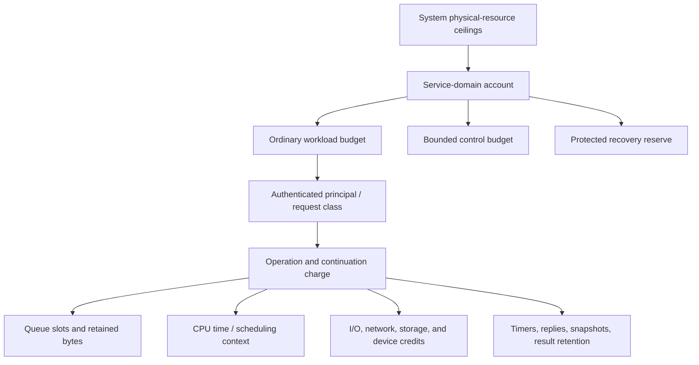
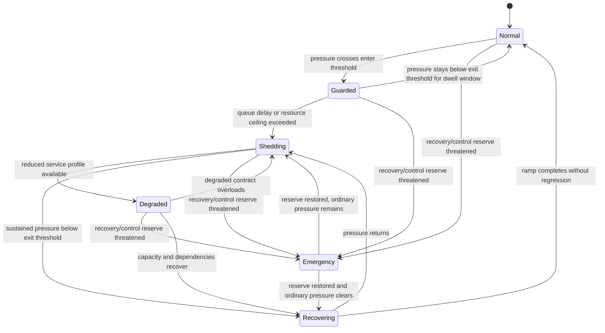

# Admission, overload, and service-resource governance

## Question, scope, and operational standard

How should Atom OS keep service latency, memory, and recovery work bounded when
offered load exceeds capacity, dependencies slow down, or retry traffic
amplifies a partial failure?

This component owns hierarchical service resource accounts, request admission,
finite queue policy, credits, deadlines, quotas, fairness, shedding,
degradation, retry budgets, and protected control/recovery reserve. It does not
replace kernel scheduling or memory enforcement, decide application business
priority, or make an overloaded dependency faster.

The system is adequate only if:

1. every accepted request has bounded charged CPU, memory, queue, I/O, timer,
   continuation, and downstream work;
2. every asynchronous boundary has a finite capacity and declared full result;
3. overload is detected from server-observed pressure rather than caller
   optimism alone;
4. deadlines, cancellation, retries, and priorities are authenticated and
   carried end to end;
5. healthy tenants and recovery/control work retain explicitly reserved
   capacity; and
6. recovery from shedding uses hysteresis and rate limits rather than an
   immediate synchronized surge.

No load test or capacity values are claimed.

## Evidence and synthesis

[SEDA](../../30-sources/welsh-et-al-2001-seda.md) makes queues and stages
explicit and uses dynamic load conditioning to prevent event-driven services
from hiding overload in threads. [DAGOR](../../30-sources/zhou-et-al-2018-dagor.md)
provides large-scale evidence for server-observed overload, business-aware
admission, and coordinated propagation in RPC services; its application
priority model is not automatically suitable for an OS.

[Resource containers](../../30-sources/banga-et-al-1999-resource-containers.md)
show why resource use should follow the activity/principal across execution
contexts rather than be charged only to the thread currently running.
[Borg](../../30-sources/verma-et-al-2015-borg.md) and
[Omega](../../30-sources/schwarzkopf-et-al-2013-omega.md) contribute admission,
reservation, and optimistic-plan precedents at cluster scale. [Backoff and
jitter](../../30-sources/brooker-2015-exponential-backoff-jitter.md) shows why
uncorrelated capped retries reduce contention compared with synchronized
retry. None supplies the complete embedded resource model.

The Atom OS synthesis charges causal work to a service/principal across actor
messages and reserves a separate, bounded recovery lane.

## Resource-account architecture

The service manifest declares ceilings and minimum reserves for CPU time,
memory/objects, mailbox bytes/messages, outstanding calls, timers,
continuations, storage/log bytes, device descriptors, network buffers,
connections, audit/telemetry, and recovery. The lifecycle controller reserves
these resources before publication. Lower layers enforce physical consumption;
the service layer decides which operation/principal may spend the delegation.

A `ResourceContext` accompanies accepted work across actors and services. It
contains authenticated origin, current service/request generations, operation
class, absolute deadline, remaining budgets, priority class, retry attempt,
and causal trace reference. It is a non-copyable, generation-tagged accounting
capability, not a numeric suggestion in a message. Fanout atomically subdivides
its credits into unique child reservations or charges all children against one
authoritative shared account; replayed or duplicated reservations are rejected.
Callees may attenuate or return unused credit but cannot increase or double-
spend it. Background work has an explicit owner instead of escaping into an
uncharged system pool.

## Admission protocol

Admission is a decision before expensive work or unbounded retention:

1. authenticate the capability/principal and operation class;
2. reject stale service, caller, or policy generations;
3. reject already expired deadlines and impossible completion estimates;
4. reserve queue slot, retained bytes, and minimum downstream credits;
5. evaluate current queue delay, utilization, dependency pressure, and
   principal quota against policy;
6. record `Rejected`, `Wait`, `Admitted(operation_id, reservation)`, or
   `Degraded(profile)`; and
7. release or transfer the reservation as work moves.

Server-observed queue delay is usually more reliable than CPU utilization
alone because a blocked dependency or lock can create intolerable latency at
low CPU. The controller uses multiple signals—queue age, service time,
deadline miss rate, outstanding work, resource saturation, and downstream
credits—with smoothing and hysteresis. Telemetry loss cannot be treated as
healthy state.

Thresholds for entering overload are stricter than thresholds for leaving it.
Recovery gradually increases admitted concurrency or credits. This prevents a
service from oscillating or releasing a synchronized backlog as soon as one
sample improves.

## Queue, deadline, and cancellation semantics

Every queue declares item and byte limits, ownership account, ordering,
priority bands, full behavior, maximum residence time, and drain policy.
Permitted full behaviors include reject, bounded wait, overwrite only for an
explicit latest-value signal, coalesce only for a declared sticky event, shed
by authenticated class, degrade response, or close. A reliable request queue
cannot silently drop or overwrite.

Within one kernel time domain, relative timeouts are converted once to an
absolute monotonic deadline and each local hop checks that value. Monotonic
timestamps are not comparable across machines. To preserve an end-to-end
deadline across a remote hop without synchronized clocks, the sender debits
local elapsed time plus a profile-bounded worst-case network residence and
clock-conversion uncertainty, then sends only the smaller remaining duration;
the receiver creates a new local deadline from that already conservative
budget. Measured transit may tighten but never enlarge it. A synchronized-time
profile may instead carry a timestamp only with explicit offset/error bounds.
If neither bound exists, the value is merely a new per-hop waiting budget and
must not be described as end-to-end. A deadline ending the caller's wait does
not cancel accepted work. Cancellation is an explicit, generation-bound
operation that returns whether it won before the effect boundary, lost to
completion, or is indeterminate.

Priorities are finite classes carried by capabilities or authenticated policy,
not caller-supplied integers. Within a class, use weighted fair or deficit
scheduling where it materially prevents starvation. Safety-critical recovery
may preempt ordinary work, but its own budget is finite and cannot become a
permanent universal priority.

## Backpressure, shedding, and degraded service

Credits make downstream capacity explicit. This exact cross-service credit and
multi-resource conservation protocol is an Atom OS proposal requiring model
and workload validation; the cited systems support its constituent accounting,
staging, and overload motivations rather than proving this composition. A
producer cannot enqueue more
descriptors, bytes, requests, or result-retention obligations than the receiver
granted. Credit return follows actual release, not mere dequeue when work still
retains the resource. Multi-stage services reserve enough continuation
capacity or release and reacquire under a new admission decision; they cannot
hold scarce upstream resources while waiting indefinitely downstream.

Shedding prefers cheap early rejection. It can select by authorized
criticality, deadline feasibility, tenant fair share, age, cost, and semantic
class. It must not leak secret priority labels in public errors or allow an
unauthenticated caller to claim emergency status.

A degraded profile is an explicit smaller contract: stale-but-bounded reads,
reduced resolution, lower fidelity, local-only operation, or disabled optional
features. It names allowed operations, data staleness, duration, capacity, and
exit condition. Returning arbitrary incomplete data under an ordinary success
type is not degradation.

## Retry and recovery budgets

Retries are load. A request carries an attempt number and consumes a budget
associated with the original principal and failing dependency. The retry
budget can be a fraction of successful baseline traffic or a finite token
bucket. It prevents each upstream layer independently multiplying work.

Only `RejectedBeforeAcceptance`, proved `Aborted`, or a defined idempotent
outcome is automatically retryable. `Indeterminate` enters reconciliation.
Retries use capped exponential backoff with jitter and honor the remaining
deadline budget. A circuit opens to reject or sharply limit new work after
repeated dependency failures, becomes half-open for bounded recovery probes,
and closes gradually when the dependency is again usable.

Service recovery has a different budget from request retry. Supervisor restarts,
state replay, device reset, and update rollback spend protected resources. If
that reserve is exhausted, policy escalates or quarantines instead of stealing
unbounded capacity from healthy services.

## Failure and security analysis

- **Unbounded causal work:** resource contexts follow messages,
  continuations, fanout, and result retention; detached work needs a new
  authorized owner.
- **Priority fraud:** priority derives from capability/policy and is audited;
  clients cannot promote arbitrary work in a payload.
- **Retry storm:** shared retry budgets, downstream pressure, deadlines,
  circuit state, and jitter suppress multiplicative replay.
- **Slow dependency:** reserved downstream credits and server queue delay cause
  early admission reduction before upstream memory explodes.
- **Noisy tenant:** per-principal quotas plus fair scheduling protect others;
  unused capacity may be borrowed only with revocable ceilings.
- **Control starvation:** separate finite lanes serve fault, close, lease,
  audit, and recovery traffic. A workload cannot allocate their slots.
- **Metric manipulation:** admission uses local counters and typed dependency
  evidence; unauthenticated telemetry does not directly grant capacity.
- **Load-shed oscillation:** hysteresis, minimum dwell, and rate-limited ramp
  prevent immediate re-overload.

## Implementation and verification program

Stage 0 models a three-stage service with finite queues, deadlines, fanout,
retry, one failed dependency, and recovery reserve. Check bounded state,
conservation of credits, no priority amplification, eventual rejection under
overload, and eventual return to normal under stable sub-capacity load.

Stage 1 implements resource contexts and queue policies in hosted actor
services with deterministic load generation. Stage 2 connects kernel
scheduling/memory accounts and device/network credits. Stage 3 exercises
multi-service backpressure, degraded profiles, recovery storms, and malicious
tenants on target hardware.

Experiments use step, burst, heavy-tail, synchronized retry, gray dependency,
and recovery-storm loads. Measure admitted/rejected work, useful throughput,
latency percentiles and deadlines, memory high water, fairness, retry
amplification, control response, time in degradation, and recovery overshoot.
All results report capacity, topology, queue limits, and failure injection.

The design fails if accepted work can escape accounting, a finite queue
silently implements lossless delivery, ordinary load can consume the last
recovery capacity, or improving pressure immediately unleashes an unbounded
backlog.

## Supported decisions and open questions

The evidence supports explicit finite stages, causal resource accounting,
server-observed pressure, early admission, credits, authenticated priority,
deadlines, fair quotas, retry budgets, explicit degradation, protected
recovery reserve, hysteresis, and gradual recovery. It does not supply one
universal overload controller or threshold set.

Open questions include how resource contexts map onto BEAM reductions, which
budgets can be safely borrowed on small systems, how to price fanout and shared
cache work, and which services need hard temporal guarantees rather than
best-effort admission.

## Connections

- [OTP-like system services layer](../otp-like-system-services-layer.md)
- [Supervision and recovery policy](supervision-and-recovery-policy.md)
- [Network endpoint and protocol services](network-endpoint-and-protocol-services.md)
- [Scheduling contexts and temporal authority](../minimal-privileged-kernel-components/scheduling-contexts-and-temporal-authority.md)
- [OTP-like system services map](../../10-maps/otp-like-system-services.md)

## Sources

- [SEDA](../../30-sources/welsh-et-al-2001-seda.md)
- [DAGOR](../../30-sources/zhou-et-al-2018-dagor.md)
- [Resource containers](../../30-sources/banga-et-al-1999-resource-containers.md)
- [Borg](../../30-sources/verma-et-al-2015-borg.md)
- [Omega](../../30-sources/schwarzkopf-et-al-2013-omega.md)
- [Exponential backoff and jitter](../../30-sources/brooker-2015-exponential-backoff-jitter.md)
