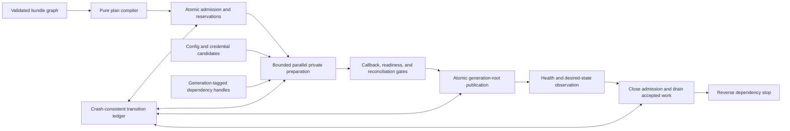
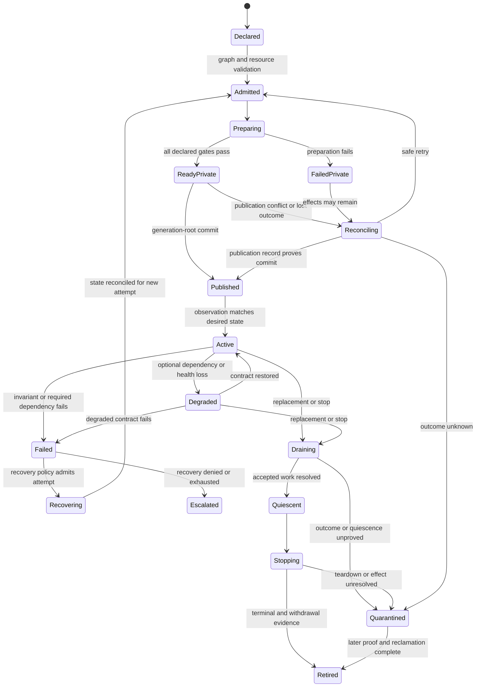

# Application lifecycle and dependency orchestration

## Question, scope, and operational standard

How should Atom OS turn a validated bundle graph into privately prepared,
ready, published, drained, and retired service generations without confusing
dependency order with readiness or promising rollback of irreversible effects?

This component owns the lifecycle of deployable unprivileged bundles. It
coordinates dependencies, resources, root actors, configuration, readiness,
publication, drain, ordered stop, and local rollback. It does not authenticate
release artifacts, implement child supervision, grant new root authority, or
decide distributed exclusive ownership.

An orchestration is correct only if it:

1. validates a typed dependency graph before causing effects;
2. never exposes a partially prepared generation;
3. identifies exactly which resources and effects belong to one attempt;
4. distinguishes callback start completion, process liveness, readiness,
   health, drain, and terminal evidence;
5. resumes deterministically after controller failure; and
6. records when rollback is impossible and reconciliation is required.

No implementation, boot trace, or timing result is claimed.

## Evidence and synthesis

The [OTP 29 system-services
documentation](../../30-sources/erlang-otp-team-2026-otp-29-0-6-system-services-documentation.md)
defines application masters, callbacks, dependencies, start/stop order,
`start_type`, `restart_type`, and library applications. [The Erlang start
phase](../../30-sources/burcsi-et-al-2010-erlang-start-phase.md) analyzes
startup ordering and the costs of sequential dependency handling, motivating
explicit safe parallelism rather than accidental serialization.

[TOSCA 2.0](../../30-sources/oasis-2025-tosca-2.md) supplies a typed graph and
orchestration vocabulary, but its broad cloud modeling surface is too large
for an initial embedded service nucleus. [NixOS
distributions](../../30-sources/dolstra-et-al-2008-nixos.md) support immutable
dependency closures and atomic selection of configurations while also showing
that switching the selected generation does not make every live side effect
atomic. [Anvil](../../30-sources/sun-et-al-2024-anvil.md) makes eventual stable
reconciliation an explicit liveness objective for controllers.

The proposed design combines a small typed graph with one-effect durable
steps. It deliberately avoids importing a general-purpose orchestration
language.

## Dependency model

A single edge called “depends on” is insufficient. The manifest compiler uses
distinct relations:

| Edge | Meaning |
| --- | --- |
| `requires-interface` | Provider and compatible protocol must exist for the consumer to operate; `existing` requires an already active provider, while `activate` permits orchestration to start it |
| `start-after` | Preparation/start ordering constraint only |
| `ready-after` | Consumer cannot pass readiness before the provider's named readiness revision |
| `health-coupled` | Provider degradation triggers a declared consumer transition |
| `stop-before` | Explicit shutdown ordering when it cannot be derived safely |

Every edge names interface version, provider selection rule, failure behavior,
acquisition mode (`existing` or `activate`), cardinality/optionality, and whether
the dependency is captured at prepare, publish, or use time. Optionality is a
modifier on a typed relation, not a standalone edge: absence must select a
declared degraded feature. Cycles are rejected unless every cyclic relation is
implemented by a named rendezvous protocol that can prepare the endpoints
without either being ready. The compiler collapses that validated strongly
connected group into one rendezvous-plan vertex; the resulting phase graph is
then a DAG.

The compiled plan is an immutable DAG of phases, not a mutable collection of
start commands. Independent vertices can prepare concurrently within a global
and per-domain concurrency budget. Publication barriers remain explicit even
when preparation is parallel.

## Recommended architecture and protocol

### Bundle identity and attempt records

A bundle has a stable `bundle_id`; each desired revision has a
`bundle_generation`; each activation has an `attempt_id`. Its plan binds
artifact digest, compatibility profile, state schema, configuration digest,
requested authority, resource budgets, membership rule, lifecycle root,
dependency revisions, readiness/drain contracts, and update compatibility.

Every provisioned capability, queue, namespace reservation, actor, domain,
storage transaction, device session, and network endpoint records the attempt
that owns it. This ownership ledger permits precise cleanup of private work.
It cannot undo an external effect merely because the attempt later fails.

### Lifecycle state

`ReadyPrivate` means the new instance can perform its declared operation class
using the exact dependency, configuration, identity, and resource generations
in the plan. It remains undiscoverable. Publication changes one authoritative
root from the old immutable table to the new table. Consumers therefore see a
complete old or new service generation, not a series of per-name edits.

Readiness is not mere process survival. The contract can require recovered
state through an LSN, a bound endpoint, current credentials, device reset
generation, warm cache minimum, or successful self-check. It cannot turn a
probe into authority: capabilities and fencing proofs still come from their
owners.

## Start, drain, stop, and failed transitions

Start records an intent before each effect and records its proved outcome.
After a lost reply, the controller reobserves by stable operation ID. It only
repeats an operation when the receiver deduplicates it, the effect is naturally
idempotent, or evidence proves it was not accepted.

Drain first atomically closes selected public admission. Existing requests
retain their caller and service generations and terminate at a named boundary:
complete, cancel-before-effect, hand off with durable ownership, or become
indeterminate. A deadline can trigger forceful fencing, but it cannot convert
unknown effects into successful cancellation.

Stop runs in reverse dependency order, subject to explicitly declared parallel
groups. Cooperative callbacks have deadlines. Terminal process evidence,
capability revocation, device/DMA quiescence, namespace withdrawal, and safe
memory reclamation are independent milestones. An unresolved milestone enters
`Quarantined`; the bundle reaches `Retired` only after later evidence proves
every required milestone and the quarantine custodian authorizes reclamation.

Private rollback removes only resources owned by the failed attempt. Durable
transactions use their storage protocol. Remote or physical effects need
deduplication, compensation, or an `Indeterminate` record. A compensation is
itself authorized, logged, fallible work.

## OTP compatibility boundary

The strict adapter preserves documented application semantics, including
library applications with no callback process and top processes that are not
supervisors. Native Atom OS bundles instead require an explicit lifecycle root
and manifest membership.

`application:start` checks that required applications are already running and
can return `not_started`; a native graph operation may separately provide an
`ensure_all_started`-like traversal. Callback start success is the OTP
completion boundary unless the bundle explicitly opts into native readiness.

Application `restart_type` describes what happens when an application
terminates. Callback `start_type` explains whether a new start is `normal`,
`takeover`, or `failover`. They are independent. Atom OS translates an OTP
node-wide consequence to a declared root-domain escalation; neither field is
proof of a distributed lease or fencing token.

OTP application membership can follow the application master's group-leader
tree. A compatibility domain must emulate that behavior or declare it
unsupported. Native services use explicit bundle membership and supervision,
because I/O leadership is not a robust ownership boundary.

## Failure, security, and overload analysis

- **Dependency race:** publication revalidates dependency generations and
  readiness revisions. A stale prepared consumer returns to preparation.
- **Partial activation:** all public references derive from one immutable
  generation root; private state is unreachable without preparation
  authority.
- **Controller crash:** the ledger and observed objects reconstruct the phase;
  volatile work queues are never treated as truth.
- **Authority amplification:** graph resolution only attenuates the boot
  envelope. A dependency name cannot confer a capability.
- **Prepare storm:** graph width, simultaneous activations, and per-service
  resource reserve are bounded. Recovery work has separate protected capacity.
- **Drain denial:** clients cannot extend a deadline indefinitely, and a
  service cannot prevent its outer holder from fencing it.
- **Rollback overclaim:** the attempt ledger distinguishes reversible private
  allocation from committed local and external effects.
- **Readiness forgery:** gates combine service reports with independent
  generation, capability, storage, and endpoint evidence as required.

## Implementation and verification program

Stage 0 implements the graph types, pure compiler, lifecycle states, and a
small model with optional edges, a rendezvous, a failed prepare, and controller
restart. Properties include acyclicity, deterministic plans, no partial
publication, attempt-owned cleanup, and eventual convergence once inputs
stabilize.

Stage 1 runs a hosted orchestrator with mock resources and fault injection
after every intent, external request, outcome, and publication. Stage 2 starts
real managed runtimes and protected domains. Stage 3 adds persistent state,
device/network effects, drain, and release handoff. OTP adapters receive
separate conformance traces.

Tests cover invalid graphs, missing and optional dependencies, randomized
parallel preparation, readiness flapping, stale config or identity,
publication conflict, lost replies, controller crash at every boundary,
uncooperative stop, and indeterminate external effects. Measure critical-path
boot, work inflation after faults, peak private-generation memory, publication
latency, drain tail, and time to safe reclamation.

The design is rejected if graph validation can cause effects, one failed
bundle exposes a partial public generation, rollback deletes another attempt's
resource, or any claimed readiness can be satisfied by a stale incarnation.

## Supported decisions and open questions

The evidence supports typed dependency relations, immutable compiled plans,
bounded parallel preparation, explicit readiness, one generation-root
publication, reverse drain/stop, attempt ownership, and reconciled outcomes.
It does not establish the ideal graph size, rendezvous vocabulary, publication
storage, or default readiness timeout.

Open questions include whether multi-bundle coordinated publication is needed
in the first profile, how much service state can be shadowed on constrained
devices, and which OTP application-master behaviors merit compatibility before
a bootable native system exists.

## Connections

- [OTP-like system services layer](../otp-like-system-services-layer.md)
- [Service-domain bootstrap and manifest controller](service-domain-bootstrap-and-manifest-controller.md)
- [Supervision and recovery policy](supervision-and-recovery-policy.md)
- [Release, update, rollback, and state migration](release-update-rollback-and-state-migration.md)
- [OTP-like system services map](../../10-maps/otp-like-system-services.md)

## Sources

- [OTP 29 system-services documentation](../../30-sources/erlang-otp-team-2026-otp-29-0-6-system-services-documentation.md)
- [The Erlang start phase](../../30-sources/burcsi-et-al-2010-erlang-start-phase.md)
- [TOSCA 2.0](../../30-sources/oasis-2025-tosca-2.md)
- [NixOS](../../30-sources/dolstra-et-al-2008-nixos.md)
- [Anvil](../../30-sources/sun-et-al-2024-anvil.md)
