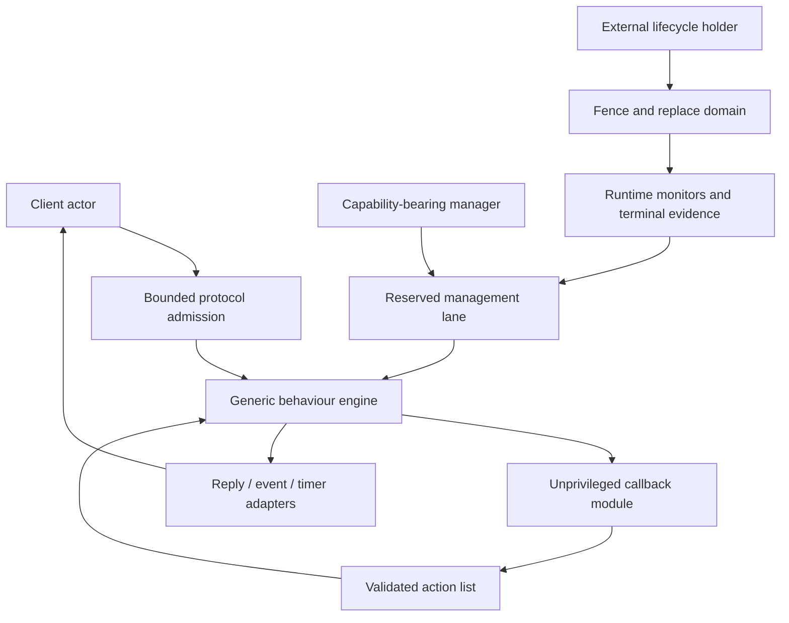
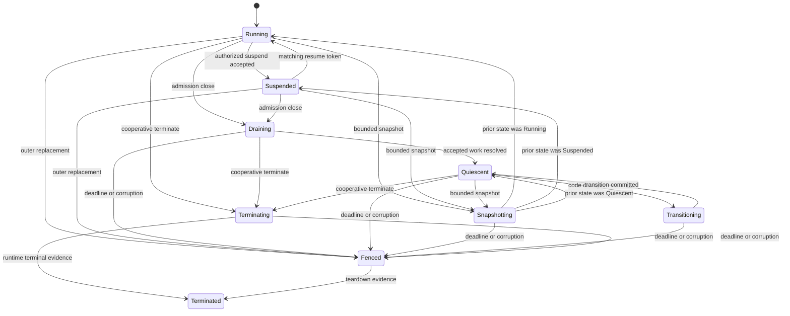

# Behaviour engines and capability-gated management

## Question, scope, and operational standard

How should Atom OS retain the compositional value of OTP behaviours while
keeping callbacks unprivileged, bounding every queue and management action,
and avoiding semantic claims that OTP itself does not make?

This component supplies reusable actor-level protocol engines. It owns call
correlation, state-machine event dispatch, timers, reply discipline, event
fanout, code-transition hooks, and cooperative management. It does not own
kernel scheduling, forced domain teardown, application restart policy,
durability, or network transparency. Those remain with the runtime and the
specialized service components.

The native engine is acceptable only if it:

1. keeps protocol bookkeeping separate from application callbacks;
2. bounds mailboxes, deferred events, callers, timers, and snapshots;
3. makes deadline, cancellation, acceptance, reply, and terminal evidence
   distinct;
4. authorizes every management operation with a target-scoped capability;
5. lets an external lifecycle holder replace a non-cooperating engine; and
6. runs an explicitly selected compatibility adapter when exact OTP behavior
   is required.

No implementation or conformance result exists yet. This report defines the
contract against which one can be built and tested.

## Evidence and semantic limits

The [OTP 29 system-services
documentation](../../30-sources/erlang-otp-team-2026-otp-29-0-6-system-services-documentation.md)
defines the observable behavior of `gen_server`, `gen_statem`, `gen_event`,
`sys`, supervisors, and applications. It is the compatibility authority, not
an assurance claim for the proposed native engine. [Armstrong's
thesis](../../30-sources/armstrong-2003-making-reliable-distributed-systems.md)
supports isolated processes, explicit messages, links, monitors, and “let it
crash,” but also makes state placement and failure assumptions central.

[SEDA](../../30-sources/welsh-et-al-2001-seda.md) demonstrates why explicit
stages, queues, and load conditioning make overload observable. Its Java
server setting does not prove that every actor needs a separate thread or
queue. [Capability myths
demolished](../../30-sources/miller-et-al-2003-capability-myths.md) supports
object-capability authority and attenuation, but the engine still needs an
Atom OS-specific mapping from capabilities to actor management operations.

The resulting synthesis is deliberately dual-profile: strict adapters preserve
documented OTP interactions for admitted traffic; native engines add finite
admission, explicit outcomes, and outer recovery. Finite exhaustion remains a
named compatibility divergence rather than being presented as invisible or
fully exact behavior.

## Recommended architecture

The engine is a library or small runtime service operating in the target
actor's protection domain. It interprets a closed set of actions returned by a
callback. A callback cannot directly mutate engine queues, forge a caller
reference, acquire ambient management authority, or claim that a reply was
delivered.

### Common engine envelope

Every engine instance has a stable service identity and a changing
incarnation. Its envelope contains:

- behavior kind and semantic profile;
- callback module/artifact digest and state-schema generation;
- mailbox and priority-lane limits;
- maximum outstanding calls, postponed events, timers, continuations, and
  snapshot bytes;
- resource and recovery accounts;
- accepted protocol versions and caller authority classes;
- management capabilities, each limited to operations and lifetime; and
- an escalation route outside the managed actor.

All request references bind caller identity and generation, target identity
and generation, operation class, request digest, and deadline. They are not
reused after restart.

## Native behaviour contracts

### Serialized service engine

The `gen_server`-like engine serializes accepted requests against one state
value. A call returns one of `Rejected`, `Accepted(request_ref)`,
`Replied(value)`, `ExpiredLocally`, `CancelledBeforeAcceptance`, `Fenced`, or
`Indeterminate`. An ordinary convenience API may collapse these states, but
the system-services API must retain them.

An absolute deadline controls admission and how long the caller waits. It does
not prove that accepted work stopped. Cancellation is a separate request and
is effective only when the engine confirms that the original operation has
not crossed its declared cancellation boundary. Late replies carry the old
request and caller generations and are discarded or reconciled, never applied
to a reused alias.

Casts remain one-way. Queue acceptance can be reported by a separate admitted
cast API, but a plain cast cannot be described as acknowledged execution.
Continuations are scheduled work owned by the engine and charged to its
account, not an unbounded way to bypass mailbox fairness.

### Explicit state-machine engine

The `gen_statem`-like engine represents current state, event type, event
content, transition, actions, timers, deferred replies, and postponement
explicitly. Timers use absolute monotonic deadlines plus timer generations.
Cancellation of a timer races with its already queued event; the generation
check prevents a stale event from affecting a later timer.

Postponement is finite. The envelope limits retained events and the number of
times one event can be reconsidered without a state change. Exceeding the
limit emits evidence and applies declared backpressure or failure policy. This
keeps a legal state-machine feature from becoming invisible permanent
starvation.

### Event dissemination

Atom OS needs two deliberately different forms:

- The OTP `gen_event` adapter preserves one manager invoking every installed
  handler serially in the manager's failure domain. A slow handler can delay
  synchronous notification. Handler iteration order is not a portable public
  guarantee; a profile may pin a particular implementation order only when it
  is separately tested and versioned.
- The native event router places each subscriber behind a separate finite
  queue and usually a separate actor. Event classes declare whether they are
  lossy, sticky/coalescing, credit-controlled, or acknowledged.

The native router never advertises an atomic broadcast. A successful publish
means only the declared admission condition. Subscriber removal closes its
generation and drains or drops queued events according to policy.

## Capability-gated management protocol

Management travels on a small reserved lane so a saturated ordinary mailbox
does not make inspection or shutdown structurally impossible. It still has a
finite queue and CPU budget. Capabilities are attenuated by target, operation,
field visibility, deadline ceiling, generation, and delegation policy:

| Capability | Permitted effect |
| --- | --- |
| `Inspect` | Read selected metadata, queue counters, state digest, and evidence references |
| `Snapshot` | Request a bounded, schema-tagged cooperative snapshot |
| `Suspend` | Stop ordinary dispatch while management traffic continues |
| `Drain` | Close selected admission and resolve accepted work to a declared boundary |
| `Resume` | Resume only the same current generation and suspension token |
| `ChangeCode` | Prepare and activate an authorized callback/schema transition |
| `TerminateRequest` | Ask the callback to terminate cooperatively |
| `Replace` | Ask the external lifecycle holder to fence and replace the generation |

Every operation records authenticated initiator, delegated authority, target
generation, request digest, decision, resulting evidence, and outcome. State
snapshots are subject to secrecy labels and byte limits; inspecting a service
must not become a universal secret-reading interface.

`Suspend` is not `Drain`: suspended ordinary messages may remain queued.
`TerminateRequest` acceptance is not death. Only a runtime monitor or protected
domain terminal record proves termination. If the engine does not cooperate by
the deadline, the holder fences its generation, closes admission and authority,
and invokes lower-layer teardown.

## OTP compatibility boundary

Compatibility is a named manifest profile with versioned conformance tests.
It preserves at least:

- documented `call`, `cast`, reply, timeout, and late-reply behavior;
- `gen_statem` event ordering, postponement, timeout, and action rules;
- `gen_event` single-manager shared-fate behavior, invocation of every
  installed handler, and `sync_notify` waiting for them, without inventing a
  portable handler iteration order;
- `sys` message handling during suspension, state inspection/change, and
  termination request semantics; and
- callback return tuples, failure propagation, formatting, and code-change
  hooks within the declared OTP release profile.

Native bounded mailboxes can force earlier rejection than stock OTP. A strict
adapter therefore claims behavioral compatibility only after admission and
defines a separate `ResourceExhausted` boundary for queue/atom/memory limits;
it must not claim whole-system exactness at exhaustion. Similarly, adding
jitter, readiness gates, isolated event subscribers, or forced termination
belongs to native policy outside the strict adapter.

## Failure, security, and overload analysis

- **Callback loop or crash:** the engine emits typed fault evidence; the
  supervisor decides recovery. Cleanup callbacks are advisory because forced
  replacement can bypass them.
- **Mailbox exhaustion:** per-class admission returns an explicit rejection or
  applies declared coalescing. Reserved control traffic cannot grow without
  bound.
- **Management denial of service:** callers are authenticated through their
  capability, operations are rate-limited and charged, snapshots are bounded,
  and repeated requests cannot indefinitely reset a drain deadline.
- **Confused deputy:** callback actions are validated against the engine's
  envelope and caller context. A message containing a name does not grant the
  right to inspect or terminate that name.
- **Stale action:** every timer, call, reply, suspension token, and code-change
  token carries the target generation.
- **Secret disclosure:** default inspection exposes hashes, schemas, and
  counters, not arbitrary state. More revealing facets must be separately
  delegated and audited.
- **Priority inversion:** management has reserved service capacity, but force
  remains outside the target so even a deadlocked callback cannot hold the
  final recovery mechanism.

## Implementation and verification program

Stage 0 specifies the common envelope and the serialized/state-machine engines
as executable transition systems. Property tests cover request/reference
uniqueness, deadline races, timer cancellation, finite postponement, and
generation fencing.

Stage 1 implements hosted engines over the managed actor runtime with bounded
queues and deterministic virtual time. A fault harness crashes the engine
between callback return and every action. Stage 2 adds the management
capability vocabulary, audit records, cooperative drain, and forced external
replacement. Stage 3 builds OTP adapters and runs differential tests against
the pinned OTP release for documented traces.

Required measurements include steady-state call/cast cost, timer latency,
memory per outstanding request, management responsiveness under saturation,
subscriber isolation, snapshot bounds, and replacement latency. Required
negative tests include forged capabilities, stale replies, callback
non-return, recursive management, postponed-event exhaustion, event-router
subscriber failure, and code-transition crash at every boundary.

The design fails if strict compatibility cannot be distinguished from native
semantics, a target can block outer replacement, a stale generation can reply
or resume, or any queue required for recovery is unbounded.

## Supported decisions and open questions

The evidence supports pure protocol engines around unprivileged callbacks, a
dual compatibility/native profile, capability-scoped management, explicit
deadlines and cancellation, bounded event isolation, and an outer forced
recovery path. It does not yet select the callback ABI, snapshot encoding,
priority policy, maximum state size, or exact OTP conformance corpus.

Open questions include whether common engines should be linked into every
runtime or hosted as shared services, how much management state may cross a
trust boundary, and whether hot code transition is worth supporting in the
first bootable profile.

## Connections

- [OTP-like system services layer](../otp-like-system-services-layer.md)
- [Supervision and recovery policy](supervision-and-recovery-policy.md)
- [Application lifecycle and dependency orchestration](application-lifecycle-and-dependency-orchestration.md)
- [Managed actor runtime layer](../managed-actor-runtime-layer.md)
- [OTP-like system services map](../../10-maps/otp-like-system-services.md)

## Sources

- [OTP 29 system-services documentation](../../30-sources/erlang-otp-team-2026-otp-29-0-6-system-services-documentation.md)
- [Making reliable distributed systems in the presence of software errors](../../30-sources/armstrong-2003-making-reliable-distributed-systems.md)
- [SEDA](../../30-sources/welsh-et-al-2001-seda.md)
- [Capability myths demolished](../../30-sources/miller-et-al-2003-capability-myths.md)
