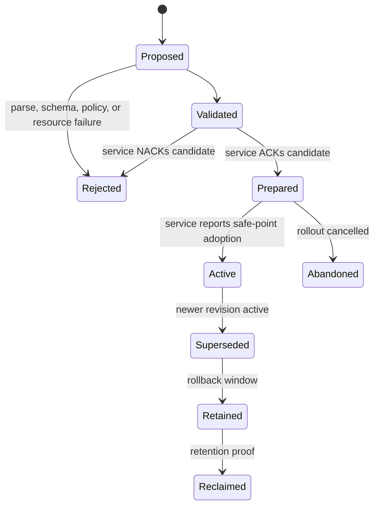

# Configuration, workload identity, and secrets

## Question, scope, and operational standard

How should Atom OS deliver ordinary configuration, attest a workload
incarnation, and rotate sensitive credentials without merging those concerns
into a global environment or long-lived shared secret?

This component owns typed configuration snapshots, candidate validation,
activation tracking, local workload identity delivery, credential leases,
rotation, redaction, and issuer-outage policy. It does not define application
authorization, root boot trust, secure-channel protocols, or durable storage
mechanisms.

The component is acceptable only if:

1. every service reads a complete immutable configuration generation;
2. validation, acknowledgement, and actual adoption are separately visible;
3. workload identity derives from attested instance context, not a display
   name supplied by the caller;
4. secrets never enter ordinary configuration, logs, crash dumps, or broad
   management snapshots by default;
5. credential scope, audience, expiry, renewability, and revocation limits are
   explicit; and
6. issuer failure and trust-policy change lead to declared fail-closed,
   drain, or degraded behavior.

No credential issuer, attestation path, or rotation experiment exists yet.

## Evidence and synthesis

The [Envoy xDS
protocol](../../30-sources/envoy-project-2026-xds-protocol.md) usefully
separates versioned configuration, stream correlation, ACK/NACK, and actual
application. It shows why a successful acknowledgement means a candidate is
valid and intended for use, not that all services atomically switched.
[NixOS](../../30-sources/dolstra-et-al-2008-nixos.md) supports immutable,
content-addressed configuration closures and rollback of a selected
generation, while live side effects remain a separate activation problem.

The [SPIFFE Workload
API](../../30-sources/spiffe-project-2026-workload-api.md) supplies a concrete
local credential-delivery and rotation model based on workload attestation.
[Vault leases](../../30-sources/hashicorp-2026-vault-secrets-and-leases.md)
show useful expiry, renewal, revocation lineage, and dynamic-secret practices,
as well as their trust and availability assumptions. Neither source turns an
authenticated identity into authorization or guarantees instant revocation of
a copied bearer credential.

The Atom OS synthesis separates a `ConfigStore` from a `CredentialBroker`,
even if both use the same lower durable-state service.

## Recommended architecture

```mermaid
flowchart TB
    Sources["Manifest-declared config sources"] --> Build["Canonical typed snapshot builder"]
    Build --> Validate["Schema, dependency, policy, and size validation"]
    Validate --> Candidate["Immutable candidate digest + revision"]
    Candidate --> Prepare["Per-service prepare and ACK/NACK"]
    Prepare --> Activate["Service safe-point activation"]
    Activate --> Active["Reported active digest"]

    Attestor["Kernel/runtime instance evidence"] --> Broker["Credential broker"]
    Policy["Identity and scope policy"] --> Broker
    Broker --> Handle["Short-lived key handle or protected secret lease"]
    Handle --> Workload["Current service generation"]
    Audit["Redacted audit and expiry evidence"] <-- Broker
```

Configuration and credential delivery use distinct endpoints, queue budgets,
authorization facets, and audit projections. A service can inspect its config
digest without gaining access to another service's secret material.

## Configuration object and activation protocol

A `ConfigSnapshot` contains schema identifier/version, content digest,
monotonic activation revision, source digests and precedence, target service
and compatibility profile, typed values, secrecy labels, dependency revisions,
and size/resource estimates. Canonical encoding makes the digest stable. The
snapshot is immutable after validation.

Activation uses explicit stages:



The store atomically publishes the complete candidate. Each service fetches
and verifies the digest, constructs derived state privately, and returns ACK
or NACK with bounded diagnostics. ACK means it can accept and intends to apply
the candidate. Only a later generation-tagged report of `active_digest`
establishes adoption at the service's safe point.

Mixed active revisions are normal during rollout. If an invariant requires
several services to switch together, the lifecycle or release controller
closes affected admission, prepares all participants, publishes a shared
generation root, and requires every cross-service request to carry that root
generation; a mismatch is fenced until all participants pass a barrier or the
transition rolls back. The root alone does not make independently scheduled
services switch simultaneously. Ordinary config publication must not claim
system-wide simultaneity. After lost watch continuity, a service fetches the
current complete snapshot; patches are never applied to an unknown base.

Sources and precedence are part of the manifest. Runtime flags, device facts,
operator policy, and application data occupy distinct namespaces. Unknown
required fields fail closed; deprecated fields retain a bounded compatibility
window. Dynamic state that changes as part of normal work belongs in durable
application state, not in configuration.

## Workload identity and credential delivery

The credential broker derives the caller from the protected local channel:
boot-measured service identity, artifact digest, protection-domain and runtime
generations, manifest role, and current lifecycle state. The request cannot
override these fields. Policy maps that evidence to a stable workload identity
inside a named trust domain.

A `CredentialLease` contains identity, credential generation, issuer and trust
bundle revisions, audience/resource scope, allowed operation class, not-before
and expiry, renewability, delegation prohibition or ceiling, key-handle
reference, and revocation lineage. Prefer non-exportable signing or channel-key
handles. When a protocol requires bytes, the broker transfers them through a
broker-owned pinned bounded buffer, excludes that buffer from ordinary crash
capture, and zeroizes that buffer on release. The protected profile forbids
conversion into ordinary managed-runtime terms because tracing collection and
immutable binary copies cannot guarantee erasure. A compatibility profile that
exports bytes must acknowledge that copied bytes cannot be recalled or
comprehensively zeroized.

Authentication proves which workload or peer participated. Authorization is a
separate decision over identity, capability, operation, resource, generation,
and context. X.509-like identity credentials may not express a narrow audience;
an operation capability or policy check remains necessary. Bearer tokens use
explicit audiences and short lifetimes.

### Rotation and issuer failure

Rotation overlaps old and new credentials for a bounded window. A service
receives a full credential/trust snapshot, establishes new sessions, reports
the active generation, drains old sessions according to policy, and releases
the old handle. A watch event only prompts a refetch; it does not mutate a key
in place.

Each service declares:

- renewal lead time and jitter;
- whether established sessions may survive local credential expiry;
- whether new work fails closed, degrades locally, or uses an offline
  emergency credential during issuer outage;
- which policy or trust-bundle changes force reauthentication or drain;
- maximum stale trust and revocation information; and
- the outer recovery authority for a failed broker.

The broker enters `jeopardy` before expiry if renewal is uncertain. It closes
new leases when it cannot prove safe issuance. Existing credentials remain
valid only as the validating sink's protocol specifies; deleting the local
record is not remote revocation.

## Secret handling and operator access

Secrets use separate schemas with `never-log`, `never-snapshot`, exportability,
retention, and redaction policy. Ordinary configuration APIs return opaque
references for secret fields. Crash evidence records credential identifiers,
generation, expiry, and error class—not key bytes or bearer values.

Operator reveal is not a default debugging privilege. It requires a dedicated
capability, purpose, target, expiry, and durable audit path; high-risk profiles
can require dual approval. Break-glass credentials are predeclared, offline or
hardware-bound where feasible, short-lived, and cannot silently become the
normal availability path.

## Failure, security, and overload analysis

- **Partial config:** immutable complete snapshots and digest verification
  prevent observing a half-written candidate.
- **False activation:** ACK and `active_digest` are different records; a
  controller cannot infer safe-point adoption from transport delivery.
- **Stale workload:** credential requests bind the current domain and service
  generations; the broker rejects a fenced caller.
- **Secret exfiltration:** least-scope handles, protected buffers, redacted
  telemetry, and no ordinary config embedding reduce exposure but cannot undo
  compromise after a bearer value is copied.
- **Issuer outage:** renewal jeopardy and per-service expiry policy avoid both
  unbounded stale credentials and accidental global failure.
- **Rotation storm:** bounded fanout, jittered renewal, staged rollout, and
  protected broker capacity prevent simultaneous renewals from monopolizing
  the control plane.
- **Policy rollback:** signatures prove provenance, not freshness. A protected
  monotonic high-water mark, independent witness, or equivalent rollback-
  resistant anchor must reject restoration of an obsolete signed trust or
  configuration generation; profiles without one declare rollback detection
  unavailable.
- **Broker compromise:** the broker receives only scoped issuer and storage
  facets, runs outside workloads, and has an independent recovery holder; it is
  still a high-value trusted service requiring hardening.

## Implementation and verification program

Stage 0 defines canonical configuration types, the activation state machine,
identity evidence, and credential lease algebra. Property tests cover stable
digests, deterministic precedence, unknown fields, rollback, and generation
fencing.

Stage 1 implements an in-memory `ConfigStore` and mock `CredentialBroker` with
virtual time, fake handles, redaction tests, and forced watch loss. Stage 2 adds
durable snapshots, lifecycle barriers, workload attestation, and real protected
key handles. Stage 3 integrates a selected secure-channel profile and performs
rotation and outage fault injection.

Tests include oversized and cyclic config imports, mixed service revisions,
ACK followed by crash before activation, stale watch cursor, broker restart,
old caller generation, expiry during an operation, issuer partition, trust
bundle rollback, log/crash-dump scanning, and simultaneous renewal at maximum
admitted population. Measure memory per snapshot, adoption latency, rotation
tail, broker recovery time, secret-copy surface, and control-plane load.

The design fails if a configuration acknowledgement is presented as active
state, a display name can obtain credentials, ordinary diagnostics reveal
secret bytes, or issuer loss has no bounded, documented system behavior.

## Supported decisions and open questions

The evidence supports immutable typed configuration, separate validation and
activation, last-known-valid retention, attested workload identity,
short-lived least-scope credentials, non-exportable handles where possible,
full-snapshot rotation, and explicit issuer-outage policy. It does not select
the root of trust, attestation format, certificate/token profile, secret
storage hardware, or system-wide activation protocol.

Open questions include whether the first target has reliable protected time,
which workloads genuinely need exportable credentials, and how an offline
device renews identity without creating an effectively permanent root secret.

## Connections

- [OTP-like system services layer](../otp-like-system-services-layer.md)
- [Application lifecycle and dependency orchestration](application-lifecycle-and-dependency-orchestration.md)
- [Release, update, rollback, and state migration](release-update-rollback-and-state-migration.md)
- [Observability, audit, alarms, and operator control](observability-audit-alarms-and-operator-control.md)
- [OTP-like system services map](../../10-maps/otp-like-system-services.md)

## Sources

- [xDS REST and gRPC protocol](../../30-sources/envoy-project-2026-xds-protocol.md)
- [SPIFFE Workload API](../../30-sources/spiffe-project-2026-workload-api.md)
- [Vault secrets, leases, and security model](../../30-sources/hashicorp-2026-vault-secrets-and-leases.md)
- [NixOS](../../30-sources/dolstra-et-al-2008-nixos.md)
