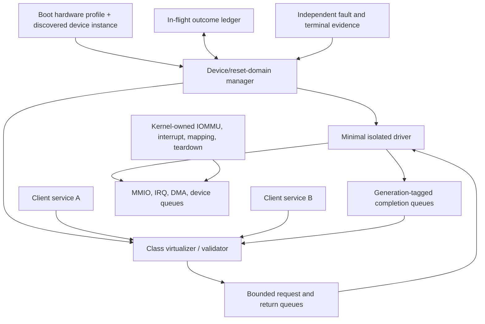
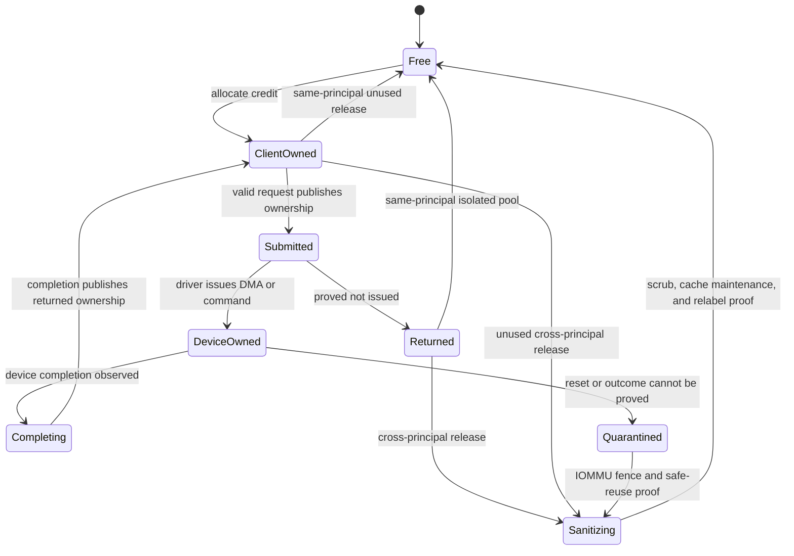

# Device-service policy and management

## Question, scope, and operational standard

How should Atom OS turn lower-layer MMIO, interrupt, DMA, queue, buffer, and
reset mechanisms into recoverable application-facing device services without
placing driver policy in the kernel or pretending a driver restart undoes
hardware effects?

This component owns device inventory policy, driver selection, class
virtualization, client admission, request validation, buffer ownership,
completion correlation, power/maintenance policy, recovery sequencing, and
generation publication. The kernel and hardware layer still enforce mappings,
interrupt control, DMA isolation, scheduling, capability revocation, and safe
reclamation.

The design is acceptable only if:

1. each physical device or reset-coupled group has one current management and
   fencing generation;
2. a client receives only the MMIO-free typed service operations and buffer
   authority its policy permits;
3. every queue and DMA buffer has finite ownership and a recoverable state;
4. completion distinguishes rejected, not-issued, completed, and
   indeterminate effects;
5. a successor is unpublished until old DMA, interrupts, queues, and accepted
   work are fenced, drained, reset, or quarantined; and
6. no compromised driver can invoke the reset/recovery authority that contains
   it.

No Atom OS driver, benchmark, or device reset experiment exists yet.

## Evidence and limitations

[Nooks](../../30-sources/swift-et-al-2003-nooks.md) showed that driver fault
isolation and recovery can improve operating-system reliability, while its
same-kernel-domain mechanisms did not fully isolate all faults. [Recovering
device drivers](../../30-sources/swift-et-al-2004-recovering-device-drivers.md)
adds shadowing and restart techniques, but recovery still depends on each
device's state and effect semantics. [CuriOS](../../30-sources/david-et-al-2008-curios.md)
supports isolated, restartable services with client-transparent state
management; transparency is limited when requests or hardware effects are
ambiguous.

The current [sDDF design](../../30-sources/heiser-et-al-2026-sddf-design.md)
provides the closest structural precedent: isolated driver and virtualizer
components, selectively shared data regions, bounded ownership queues, and
IOMMU-backed DMA separation. Its report is work in progress and does not solve
all discovery, initialization, or crash recovery. [Gray
failure](../../30-sources/huang-et-al-2017-gray-failure.md) explains why partial
and perspective-dependent faults evade simple binary health checks.

The Atom OS synthesis adds generation fencing, a persistent in-flight ledger,
and outcome classes to the isolated queue architecture.

## Recommended architecture

Use one protected domain for a physical device or set of functions that cannot
be reset independently. A small manager sits outside the driver failure
subtree. A class virtualizer is separate when clients need multiplexing,
validation, scheduling, or data transformation. For an exclusive simple
device the manager may expose one typed client endpoint directly, but it still
does not hand out raw management or reset authority.

## Authority and object model

The manager receives only profile-approved facets from the lower layers:

- bounded MMIO register windows and access widths;
- named interrupt binding/completion facets;
- DMA address-space and map/unmap authority constrained by IOMMU context;
- pre-accounted buffer pools and cache-maintenance operations;
- device-queue creation and notification endpoints;
- power-state transitions; and
- reset authority scoped to the actual reset group.

The driver normally receives the data-path subset. The manager retains reset,
replacement, and publication authority. The virtualizer receives client
policy and queues but no broader MMIO access than its class requires.

A `DeviceSession` binds client/service/device identities and generations,
device class/protocol version, queue pair and credits, buffer pool, DMA context,
deadline ceiling, operation classes, completion semantics, resource account,
and current reset fence. Reusing a numeric queue or DMA address cannot validate
an old session.

## Queue and buffer protocol

Prefer bounded single-producer/single-consumer rings for each direction and a
separate return ring for ownership reclamation. Queue metadata and payload
regions are mapped only into components that need them. A buffer follows an
explicit state machine:

Queue publication uses acquire/release ordering defined by the architecture
layer. Credits account both descriptors and buffers; a producer cannot write
past ownership. Queue full returns `WouldBlock`, `RejectedOverload`, or a
declared wait handle. It never overwrites an unconsumed request. Batching is
allowed within maximum descriptors, bytes, and service time.

A request contains stable operation ID, request digest, caller and session
generations, device/reset fence, deadline, buffer capabilities, operation
class, and requested completion proof. The validator checks all fields before
the driver can issue a command. The manager's in-flight ledger records
`Admitted`, `Issued`, `CompletionObserved`, `Returned`, or `Indeterminate`.

## Completion and effect semantics

Hardware issue and ledger persistence are not one atomic event. Before a
doorbell or command write, the driver and manager persist or share an
`IssueIntent` with the exact queue/device generation. After issuing, the driver
publishes `IssueObserved`; device queue indices, status, and completions provide
class-specific reconciliation evidence. A crash between either step is
`Indeterminate` unless the device profile can prove from authoritative queue or
hardware state that the command was not issued. Recording `Issued` in software
alone never supplies that proof.

The API exposes at least:

- `Rejected`: request was not admitted;
- `NotIssued`: admission occurred but evidence proves no hardware command or
  DMA became visible;
- `Completed(result, proof_point)`: the device reached the class-specific
  completion boundary;
- `CancelRequested`: cancellation is pending and has no terminal meaning;
- `CancelledBeforeIssue`: cancellation won before the issue boundary;
- `Fenced`: session or device generation is stale; and
- `Indeterminate`: issue or effect may have occurred but cannot be proved.

“Descriptor consumed,” “DMA complete,” “data in device cache,” “media durable,”
and “physical actuator moved” are different proof points. Each driver-class
profile chooses accurate names and documents the device evidence. A deadline
only limits waiting/admission. It does not revoke a command already accepted by
hardware.

Retry is allowed only when the class is naturally idempotent, the device or
service deduplicates the operation ID, or recovery proves `NotIssued`.
Otherwise the client reconciles status or accepts `Indeterminate`. This avoids
the false promise that process isolation creates exactly-once I/O.

## Failure detection and recovery

Device health combines independent signals: driver progress, interrupt and
queue sequences, device status, DMA/IOMMU faults, timeout distribution,
management heartbeats, and client-observed errors. A single successful probe
does not clear contradictory evidence; gray failure enters `Suspect` and
limits new work while diagnosis proceeds.

Recovery is ordered:

1. close new admission and publish a draining state;
2. increment/fence the device-session generation at every software sink;
3. mask or reroute interrupts and revoke writable mappings;
4. stop new DMA through the IOMMU and wait for the platform's safe invalidation
   boundary;
5. drain matching completions and classify every ledger entry;
6. quiesce or reset the full hardware reset group;
7. reinitialize from the immutable device profile and reconcile durable or
   physical state;
8. prepare a new driver and virtualizer privately; and
9. publish the successor generation after readiness.

If any step cannot prove safe reclamation, affected buffers, DMA mappings,
device state, and operations remain quarantined. A reboot may be the declared
outer recovery for hardware that offers no safe function reset.

Driver replacement can use a shadow path only when the hardware supports
multiple independent queues or the old generation is quiescent. State copied
from the old driver is treated as untrusted input and validated against device
observation. Management does not trust a compromised driver to attest its own
clean shutdown.

## Security and overload analysis

- **Compromised driver:** IOMMU, mappings, interrupt facets, finite queues, and
  a separate reset holder constrain reach; the driver can still corrupt data
  legitimately entrusted to it.
- **Compromised client:** typed validation, buffer capabilities, operation
  quotas, and per-session credits prevent arbitrary MMIO/DMA and descriptor
  forgery.
- **Reset collateral damage:** the inventory records real reset coupling;
  policy drains or fails every affected function instead of presenting reset
  as per-client.
- **Interrupt/queue storm:** workload is charged per session, coalesced or
  masked under the declared profile, and recovery retains a protected lane.
- **Completion spoofing:** sequence, operation digest, queue, session, driver,
  device, and reset generations must all match.
- **Firmware/power transition:** artifacts and commands require separate
  capabilities, anti-rollback policy, quiescence, and durable audit.
- **Manager failure:** an outer holder can fence the manager and device domain;
  the manager cannot be the sole owner of the authority needed to replace
  itself.

## Implementation and verification program

Stage 0 models one device queue, buffer ownership, a lost completion, driver
crash, reset, and replacement. Invariants include unique buffer owner, no
post-fence admission, no reuse before safe proof, and no completed result
without its class proof point.

Stage 1 implements a synthetic loopback device and hostile mock driver over
bounded rings. Stage 2 integrates one simple real device with IOMMU and
interrupt fencing, then measures isolation and queue cost. Stage 3 adds a
shared network or storage device with a separate virtualizer, power/reset fault
injection, and persistent in-flight evidence. Legacy drivers, if needed, run
behind a deliberately weaker containment profile.

Tests corrupt descriptors, reuse buffers, forge generations, crash every
component at every queue transition, lose/duplicate completions, saturate rings,
delay interrupts, fault DMA, reset mid-operation, fail the manager, and reboot
during reconciliation. Measure latency and throughput against an in-domain
baseline, memory per queue/session, CPU per request, recovery time, quarantined
resource high water, and work inflation during storms.

The design fails if the driver can reset its own containment domain, a buffer
has two writers, a stale completion can free new-generation memory, or restart
turns an unknown hardware outcome into an automatic retry.

## Supported decisions and open questions

The evidence supports isolated drivers, separate virtualizers, selective
shared memory, explicit ownership rings, IOMMU-confined DMA, generation-bound
sessions, an external recovery manager, and a persistent outcome ledger. It
does not prove one universal driver model or the cost on Atom OS hardware.

Open questions include which first device best exercises reset and DMA
semantics, how much class validation can be generated from specifications,
whether passive driver scheduling meets latency goals, and which devices must
remain trusted because their hardware cannot be safely virtualized.

## Connections

- [OTP-like system services layer](../otp-like-system-services-layer.md)
- [Network endpoint and protocol services](network-endpoint-and-protocol-services.md)
- [Interrupt event fabric](../kernel-hardware-and-architecture-components/interrupt-event-fabric.md)
- [Protected I/O and DMA ownership](../kernel-hardware-and-architecture-components/protected-io-and-dma-ownership.md)
- [OTP-like system services map](../../10-maps/otp-like-system-services.md)

## Sources

- [sDDF design](../../30-sources/heiser-et-al-2026-sddf-design.md)
- [Nooks](../../30-sources/swift-et-al-2003-nooks.md)
- [Recovering device drivers](../../30-sources/swift-et-al-2004-recovering-device-drivers.md)
- [CuriOS](../../30-sources/david-et-al-2008-curios.md)
- [Gray failure](../../30-sources/huang-et-al-2017-gray-failure.md)
