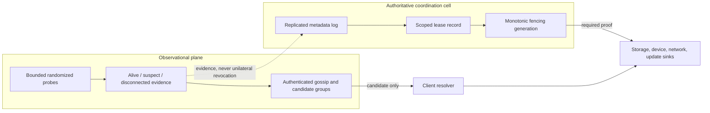
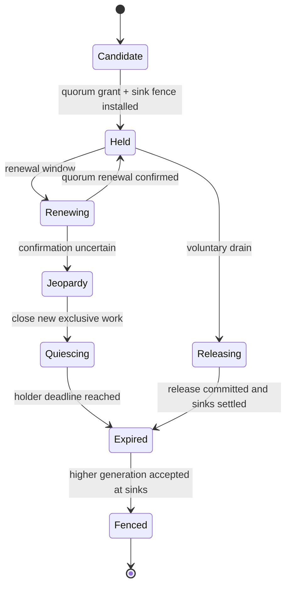

# Distributed membership, discovery, and authoritative coordination

## Question, scope, and operational standard

How should Atom OS discover remote services and observe node health while
ensuring that partitions, stale messages, and failed lease renewal cannot
create two authoritative owners of the same external effect?

This component owns authenticated membership observations, candidate discovery,
a small quorum-backed metadata service, lease issuance, configuration change,
and fencing proofs. It does not make a failure detector perfect, place all
application data in consensus, or convert a network name into invocation
authority.

The design is acceptable only if:

1. suspicion and transport disconnection never directly revoke or transfer
   exclusive authority;
2. every remote observation binds identity, boot epoch, incarnation, sequence,
   and expiry/tombstone rules;
3. authoritative mutation requires the declared quorum and fails closed when
   it is unavailable;
4. an old owner becomes unable to affect every protected sink before a new
   owner is allowed to proceed;
5. lease safety states clock-drift, scheduling-pause, and message-delay
   assumptions or avoids time-only authority; and
6. control-plane state, queues, retry work, and reconfiguration are finite and
   recoverable.

No protocol implementation, model check, or partition experiment exists yet.

## Evidence and synthesis

[Unreliable failure
detectors](../../30-sources/chandra-toueg-1996-failure-detectors.md) formalize
why asynchronous systems cannot make perfect crash judgments without timing
assumptions and show how consensus can use explicitly imperfect detectors.
[SWIM](../../30-sources/das-et-al-2002-swim.md) supplies scalable randomized
probing, suspicion, and gossip dissemination, but its membership view is weakly
consistent rather than authoritative.

[Raft](../../30-sources/ongaro-ousterhout-2014-raft.md) supplies an
understandable replicated-log and membership-change basis. [Chubby](../../30-sources/burrows-2006-chubby.md)
adds operational lessons about coarse-grained coordination, sessions, caches,
sequencers, and client uncertainty. [Leases](../../30-sources/gray-cheriton-1989-leases.md)
show when time-bounded authority/caching can be useful; they depend on bounded
time uncertainty. [SPIFFE](../../30-sources/spiffe-project-2026-workload-api.md)
informs authenticated workload identity but not authorization.

The synthesis separates an available observational plane from a small,
fail-closed authoritative plane and requires sink-enforced fences rather than
registry-only leadership.

## Two-plane architecture

The observational plane remains useful during partitions: it can show likely
endpoints, latency, and recent service advertisements. Its outputs are typed as
`CandidateHint`, never `AuthoritativeOwner`. The authoritative plane stores
only compact coordination metadata—ownership, configuration, fencing
generation, and selected service revisions—not bulk application state.

## Membership and discovery records

A `MemberObservation` binds trust domain, authenticated node/service identity,
boot epoch, membership incarnation, observation sequence, sender, evidence
type, monotonic observation time, expiry policy, supported protocols, and
endpoint candidates. A profile may use a rollback-resistant monotonic boot
generation or an unrepeatable opaque nonce. Monotonic generations can be
ordered. Opaque epochs are compared only for equality: a different epoch is
accepted only through a newer authoritative re-admission revision, after which
incarnation and sequence are ordered within that epoch. A random UUID is never
treated as temporally ordered.

States remain distinct:

- `observed_alive`: recent protocol evidence from that incarnation;
- `suspect`: missed/contradictory evidence within a suspicion window;
- `transport_disconnected`: one local path failed;
- `session_expired`: an authoritative coordination session is no longer valid;
- `administratively_removed(revision)`: quorum-backed membership removal; and
- `fenced(generation)`: effect sinks reject the older owner.

SWIM-like indirect probes and piggybacked updates reduce traffic. Suspicion
delays removal and reduces false positives, but cannot prove death. Messages
are authenticated and bounded in member entries, size, dissemination count,
and age. Removal keeps a tombstone through the maximum delayed-message and
rejoin interval. If no packet-lifetime bound exists, a boot epoch that is never
reused plus authoritative re-admission prevents delayed resurrection.

Group discovery returns candidate endpoints with observation revision,
staleness and identity constraints. Connecting still requires endpoint
authority, authentication, and authorization. A client selecting a candidate
does not acquire exclusive ownership.

## Authoritative coordination cell

Use a small odd-sized replicated state machine with a pinned Raft-style
profile. Entries include cluster configuration, member identity/boot epoch,
resource ownership, lease state, monotonic fencing generation, and audit
reference. A commit requires the current quorum. Reads used for exclusive
decisions are linearizable through a leader/quorum barrier or a proved read
lease; follower/cached reads are candidate hints.

Membership changes use joint consensus or another specifically proved
transition in which old and new quorums overlap safely. Gossip removal is only
an input to an authorized proposal. It cannot edit the quorum configuration.
Lost quorum rejects new grants and ownership changes while already granted
leases follow their safe-expiry protocol.

The cell itself has a recovery holder and resource reserve on each participant.
Snapshots, logs, outbound replication, proposals, and watches are bounded.
Snapshot installation verifies identity, configuration, index/term, and digest
before replacing local state. Rollback detection additionally requires a
protected monotonic fence/configuration high-water mark, an externally
witnessed checkpoint, or a quorum recovery rule that cannot be satisfied by
the stale snapshot alone. A profile without such an anchor cannot claim
disaster-recovery anti-rollback or preserve fencing across total stable-state
loss.

### Cell topology and federation

Coordination cells have explicit membership and a bounded scope, such as one
device group, security domain, or deployment region. They do not recursively
join every Atom OS node into one consensus group. Cross-cell discovery uses
authenticated gateways that export selected candidate records and translate
only explicitly supported operations; authoritative ownership crossing a cell
uses a dedicated transfer protocol with fences in both domains.

Standard distributed Erlang, if offered, terminates in a confined compatibility
gateway rather than creating transitive full-mesh authority or connectivity.
[PARTISAN](../../30-sources/meiklejohn-et-al-2019-partisan.md) and [Scaling
Reliably](../../30-sources/trinder-et-al-2017-scaling-reliably.md) motivate
explicit topology and distribution choices, but do not supply the proposed
cell-federation safety protocol.

## Lease and fencing protocol

A lease grant binds:

- coordination-cell and configuration identity;
- resource and owner identities;
- owner boot epoch and service generation;
- unique lease ID and issuer epoch;
- monotonically increasing fence generation;
- quorum/grant revision;
- grantor expiry and holder's conservative local deadline; and
- authenticator and permitted operation class.

The holder deadline is earlier than the grantors' expiry by a margin proven
against maximum clock-rate error, scheduling pause, and communication
uncertainty. Renewal uncertainty enters `Jeopardy`; the service stops admitting
new exclusive work and completes quiescence before its deadline. A successor
waits until every possible old grant expires under those bounds and installs a
higher fence.

If pause or clock bounds cannot be guaranteed, time alone is not safe
authority. The profile requires a quorum barrier per exclusive operation,
hardware-backed fencing, or fails closed. Wall-clock time is never used for
lease safety.

Every protected sink stores or otherwise validates the highest accepted fence
generation for the resource and rejects lower values. Registry publication is
not enough: an isolated old owner can bypass discovery and continue issuing
requests unless storage, device, network peer, or update target enforces the
fence. Multi-sink work either establishes a fence at every sink or explicitly
admits that exclusivity is not atomic.

## Failure, security, and overload analysis

- **False suspicion:** only observation changes; lease and ownership remain
  under quorum/time/fence rules.
- **Partitioned former leader:** it cannot commit new grants and effect sinks
  reject its stale fence after safe takeover.
- **Clock or scheduling pause:** conservative deadlines and jeopardy protect
  bounded profiles; unbounded profiles cannot rely on leases.
- **Identity replay:** authenticated boot epoch, incarnation, sequence,
  tombstone, and authoritative re-admission reject stale membership traffic.
- **Quorum loss:** authoritative mutation fails closed; candidate discovery and
  explicitly lease-covered local work may continue.
- **Gossip flood:** membership, message, fanout, retransmission, and parsing are
  bounded and charged by peer identity.
- **Slow watcher:** a revision gap yields `ResnapshotRequired`; it does not
  silently preserve stale ownership.
- **Compromised member:** authentication limits impersonation but not lies by
  the compromised identity. Quorum policy, least privilege, and sink-side
  validation constrain its authority.
- **Reconfiguration race:** only the formal joint transition may change voters;
  health automation cannot shrink quorum opportunistically.

## Implementation and verification program

Stage 0 separately models observations and authoritative ownership, then
combines them with partitions, delayed packets, pauses, renewal loss, and sink
fences. Check election/log safety, one accepted highest fence, no authority
transfer from suspicion, and liveness only under explicit synchrony/quorum
assumptions.

Stage 1 implements authenticated candidate discovery in a deterministic
network simulator. Stage 2 adds a three-node coordination cell for metadata
only, persistent log fault injection, and linearizable read barriers. Stage 3
adds leases on hardware with measured clock/pause bounds and integrates one
real fenced storage or device sink. Stage 4 tests membership change, rolling
upgrade, snapshot recovery, and multi-site delay.

Tests include asymmetric partitions, delayed/replayed gossip, duplicate node
identity, disk loss, leader pause, clock drift, stale follower reads, watch
overflow, split vote, membership change during failure, issuer reboot, and an
old owner directly addressing a sink. Measure detection distribution, false
suspicion, recovery time, quorum latency, renewal load, maximum safe pause,
state size, and behavior under admitted membership scale.

The design fails if a gossip state transfers ownership, a client can use a
cached binding as current authority without a valid lease/barrier, or any
exclusive sink accepts a stale fence.

## Supported decisions and open questions

The evidence supports distinct observational and authoritative planes,
incarnation-aware authenticated membership, small quorum-backed metadata,
formal reconfiguration, scoped leases with jeopardy, and monotonically fenced
effect sinks. It does not establish the first deployment size, clock bound,
consensus implementation, or WAN profile.

Open questions include whether the initial OS needs distributed authority at
all, which hardware can enforce fences durably, how boot epochs survive device
replacement, and whether application-specific ownership should use this cell
or a higher-level protocol.

## Connections

- [OTP-like system services layer](../otp-like-system-services-layer.md)
- [Naming, registry, and local discovery](naming-registry-and-local-discovery.md)
- [Network endpoint and protocol services](network-endpoint-and-protocol-services.md)
- [Release, update, rollback, and state migration](release-update-rollback-and-state-migration.md)
- [OTP-like system services map](../../10-maps/otp-like-system-services.md)

## Sources

- [Unreliable failure detectors](../../30-sources/chandra-toueg-1996-failure-detectors.md)
- [SWIM](../../30-sources/das-et-al-2002-swim.md)
- [Raft](../../30-sources/ongaro-ousterhout-2014-raft.md)
- [Chubby](../../30-sources/burrows-2006-chubby.md)
- [Leases](../../30-sources/gray-cheriton-1989-leases.md)
- [SPIFFE Workload API](../../30-sources/spiffe-project-2026-workload-api.md)
- [PARTISAN](../../30-sources/meiklejohn-et-al-2019-partisan.md)
- [Scaling Reliably](../../30-sources/trinder-et-al-2017-scaling-reliably.md)
