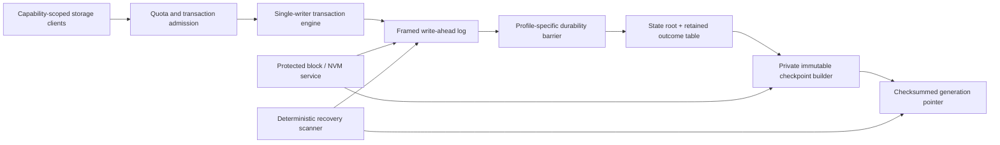
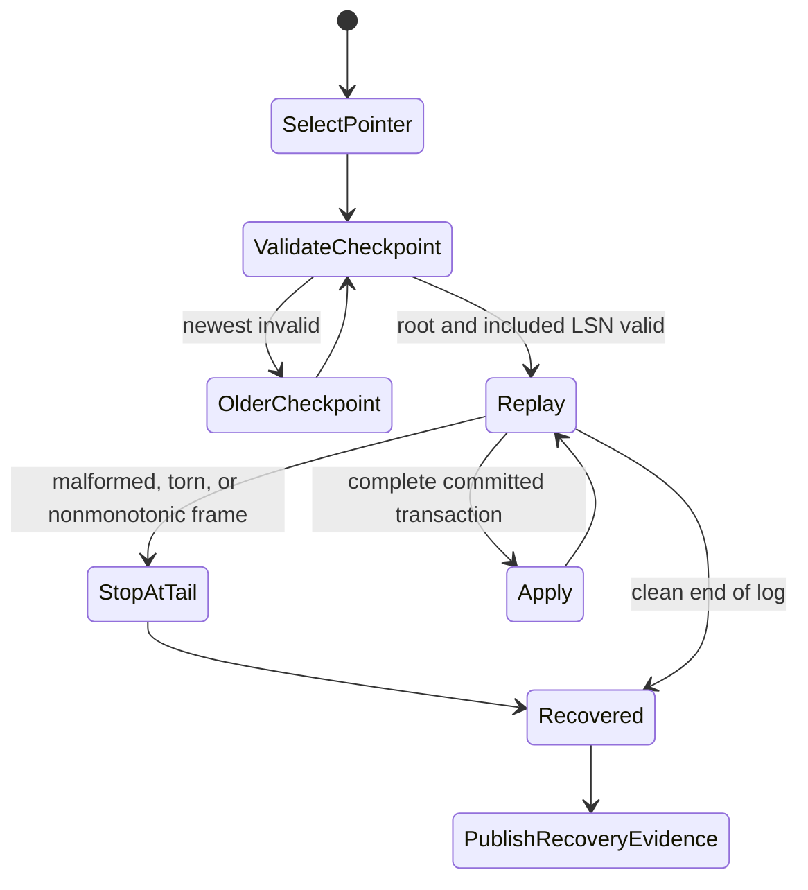

# Durable state, transactions, and outcome recovery

## Question, scope, and operational standard

What is the smallest unprivileged persistence service Atom OS needs to recover
service metadata and request outcomes honestly after process, domain, or power
failure?

This component owns framed write-ahead records, small transactions, immutable
checkpoints, content-addressed blobs, operation-result retention, recovery, and
durability profiles. It does not place a general database in the kernel, make
remote or physical effects part of a local transaction, or promise that every
retry is exactly once.

The first implementation is acceptable only if:

1. it names the exact record that makes a local transaction committed;
2. it states device atomicity, ordering, flush, corruption, and loss
   assumptions rather than relying on a generic `fsync` label;
3. recovery chooses a validated checkpoint and deterministically replays only
   complete committed transactions;
4. a crash during recovery can restart without duplicating state;
5. acknowledged idempotent results survive for their stated retry window; and
6. effects outside the durability domain remain explicitly indeterminate or
   compensated.

No Atom OS storage implementation, power-cut test, or filesystem proof exists.

## Evidence and its boundaries

[ARIES](../../30-sources/mohan-et-al-1992-aries.md) provides the classic
analysis/redo/undo structure, page LSNs, physiological logging, and
compensation records for concurrent in-place databases. It is powerful but
brings locking, buffer, and page assumptions the first Atom OS metadata store
may not need. [FSCQ](../../30-sources/chen-et-al-2015-fscq.md) demonstrates how
a crash specification and write-ahead logging can support machine-checked
filesystem guarantees; its proof and synchronous disk model do not transfer
automatically to new hardware or code.

[RIFL](../../30-sources/lee-et-al-2015-rifl.md) demonstrates retryable RPC
through unique request IDs, durable result records, acknowledgements, and
result movement with objects. Its “exactly-once” scope depends on all of those
conditions. [Sagas](../../30-sources/garcia-molina-salem-1987-sagas.md) support
semantic compensation for long-lived multi-step work, not magic distributed
rollback. The [end-to-end
argument](../../30-sources/saltzer-et-al-1984-end-to-end-arguments.md) warns
that lower-layer reliability cannot substitute for application-level outcome
checks.

The synthesis starts with a single-writer log and shadow checkpoints because a
small state space and explicit proof boundary are more valuable than general
database features at this stage.

## Storage profile and architecture

Before formatting any medium, bind the store to a `DurabilityProfile`:

- physical or virtual device identity and generation;
- minimum atomic write and alignment;
- ordering and cache-flush primitive and its failure result;
- torn-write, lost-write, misdirected-write, bit-rot, and total-device-loss
  assumptions;
- single-copy or replication model;
- encryption, key, erase, and retention policy;
- maximum record, transaction, log, checkpoint, and result-table sizes; and
- the point at which acknowledgement means stable after power loss.

The lower layers provide isolated device, DMA, buffer, and scheduling
mechanisms. The storage service owns names, quotas, transactions, recovery, and
policy as an ordinary protected service.

## Record and transaction format

Each log frame has a fixed bounded header with store generation, contiguous
monotonically increasing LSN, record type, transaction ID, logical namespace,
payload length, schema generation, checksum, and optional authenticated-
encryption metadata.
Lengths are validated before allocation. Padding and endianness are canonical.
An invalid frame terminates the usable tail; recovery never scans for a
plausible later header and thereby accepts attacker- or corruption-selected
bytes.

A transaction uses `Begin`, zero or more typed mutation records, optional
operation-result record, and `Commit`. `Begin` declares the first LSN and
transaction identity. `Commit` authenticates the ordered record count, first
and last LSN, and a digest or hash chain over every transaction record. A gap,
duplicate, reordering, or digest mismatch invalidates the transaction even if
the commit frame itself is intact. The valid complete durable `Commit` is the
local linearization point. All required predecessors are written before it and
the profile-specific barrier completes before success is returned. `Abort` may
document a decision but is not required to make a transaction without a valid
commit invisible.

Mutations target immutable logical objects or copy-on-write roots. The initial
profile provides serial transactions from one writer. If later concurrency
requires in-place pages, ARIES-like page LSNs, locking, compensation records,
and redo/undo rules must be added as a new profile rather than smuggled into
the simple recovery claim.

## Checkpoint, recovery, and truncation

Checkpoint construction never mutates the current checkpoint. The service
writes a new immutable image containing store/schema generations, included LSN
high-water, state-root checksum, retained operation-result range, object index,
and provenance. After all contents pass a durability barrier, it atomically
publishes a checksummed double-slot or log-selected pointer.

Recovery chooses the newest pointer and complete checkpoint whose checksums,
schema, device/store generation, and root validate. It scans strictly after
`included_lsn`, requires a contiguous store LSN prefix, groups transactions,
and applies only transactions whose commit count/range/digest proves every
record is present in order. A store-LSN gap terminates the usable prefix rather
than skipping a possibly lost or misdirected mutation. Uncommitted fragments
and the malformed tail are ignored but recorded as evidence. Reapplication is
keyed by LSN/transaction identity, so a crash during recovery restarts the same
deterministic scan.

A log prefix is reclaimable only after the checkpoint pointer is durable and a
retention proof shows that no recovery path, replica, snapshot reader,
migration, audit obligation, or retry-result lease still requires it. Space
pressure can reject new transactions; it cannot silently discard evidence
needed to uphold acknowledged outcomes.

## Request outcome and retry contract

Every effectful request returns or transitions through `Rejected`, `Accepted`,
`CancelRequested`, `CancelledBeforeCommit`, `Committed`, `Aborted`,
`Indeterminate`, or `Fenced`. `CancelRequested` is nonterminal until the
commit/cancel race is proved. For a retryable local operation, a globally unique
logical operation ID binds authenticated principal, service and protocol
generation, operation kind, request digest, and state object. Reuse with a
different digest is rejected.

The state mutation and result record commit in the same transaction. After a
duplicate request, the service returns the retained result without reapplying
the mutation. The client durably acknowledges receiving the result, or the
record remains until a safely expired client lease and retention rule permit
collection. Object migration moves outcome ownership with the object or leaves
a forwarding record. A client that loses its own operation ID receives
`Indeterminate`, not a newly fabricated attempt.

This profile is “retryable within the store's defined failure domain,” not
universal exactly once. A network send, actuator command, or other external
effect can be:

- deduplicated by the external sink using the same operation identity;
- observed and reconciled by an authoritative status query;
- paired with an authorized semantic compensation; or
- left `Indeterminate` for policy/operator resolution.

A local commit before an external effect is an intent, not proof of that
effect. A local commit after an external reply still cannot prove what happened
if the reply or final record is lost unless the sink exposes durable outcome
lookup.

## Failure, security, and overload analysis

- **Torn or reordered write:** framing, checksums, monotonic LSNs, barriers,
  and pointer protocol make the valid prefix explicit; the hardware profile is
  tested, not assumed.
- **Corrupt checkpoint:** recovery falls back only to a fully validated older
  generation and reports the loss window.
- **Replay attack or stale device:** store/device generation and anti-rollback
  state prevent an older image from masquerading as current where the platform
  provides a trusted monotonic anchor.
- **Result-table exhaustion:** admission accounts result-retention bytes before
  accepting retryable work; pressure rejects or shortens only future declared
  leases.
- **Tenant interference:** namespace capabilities, quotas, per-principal I/O
  charging, and bounded transactions stop one service consuming the entire log.
- **Secret data:** encryption and key separation may protect offline media,
  while access capabilities and redacted evidence protect live paths. Keys and
  plaintext remain part of the service threat model.
- **Writer crash:** an independent holder restarts the service, which recovers
  before publication. Multiple writers never race over one generation.
- **Device ambiguity:** failure to prove a flush or reset leaves the store
  unavailable or degraded; it does not acknowledge speculative durability.

## Implementation and verification program

Stage 0 specifies the log grammar, transaction state, checkpoint selection,
replay, and outcome retention as an executable model. Generate arbitrary byte
tails and crash points and prove/recheck prefix safety, committed visibility,
idempotent replay, and monotonically selected generations.

Stage 1 builds a hosted file-backed prototype with a simulated device that can
tear, lose, reorder, duplicate, and corrupt writes. Stage 2 uses the first real
storage-device profile and power-cut harness. Stage 3 adds encryption,
multi-namespace quotas, result migration, and a narrowly justified replicated
profile. A database-like concurrent profile is deferred until workloads show
the need.

Tests crash before and after every write and barrier, corrupt every header and
pointer field, exhaust space mid-transaction, repeat requests with same and
different digests, lose result acknowledgements, crash during recovery and
checkpoint publication, and simulate device replacement. Measure commit and
recovery tail latency, write amplification, memory bounds, checkpoint pause,
retained-result cost, and detected/unrecoverable corruption.

The design fails if a success can precede its declared durable point, recovery
can apply an uncommitted transaction, an old operation ID can mutate a new
request, or truncation can erase evidence still required for a promised retry.

## Supported decisions and open questions

The evidence supports a single-writer framed WAL, immutable private
checkpoints, an atomic generation pointer, deterministic committed-only replay,
explicit device profiles, transaction-coupled result records, and honest
indeterminate external outcomes. It does not establish a filesystem API,
concurrency-control model, replication factor, or storage medium.

Open questions include how much trusted monotonic state early targets provide,
which services need durable retry results, whether content-addressed blobs
share the same fault domain, and when replication complexity is justified over
simple recoverable local metadata.

## Connections

- [OTP-like system services layer](../otp-like-system-services-layer.md)
- [Release, update, rollback, and state migration](release-update-rollback-and-state-migration.md)
- [Device-service policy and management](device-service-policy-and-management.md)
- [Typed object storage and explicit memory](../minimal-privileged-kernel-components/typed-object-storage-and-explicit-memory.md)
- [OTP-like system services map](../../10-maps/otp-like-system-services.md)

## Sources

- [ARIES](../../30-sources/mohan-et-al-1992-aries.md)
- [FSCQ](../../30-sources/chen-et-al-2015-fscq.md)
- [RIFL](../../30-sources/lee-et-al-2015-rifl.md)
- [Sagas](../../30-sources/garcia-molina-salem-1987-sagas.md)
- [End-to-end arguments in system design](../../30-sources/saltzer-et-al-1984-end-to-end-arguments.md)
