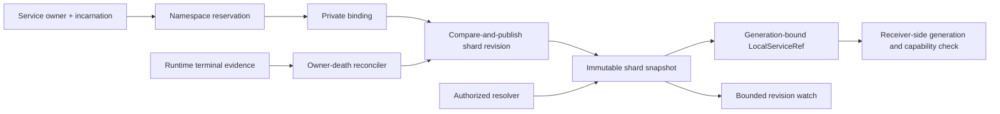
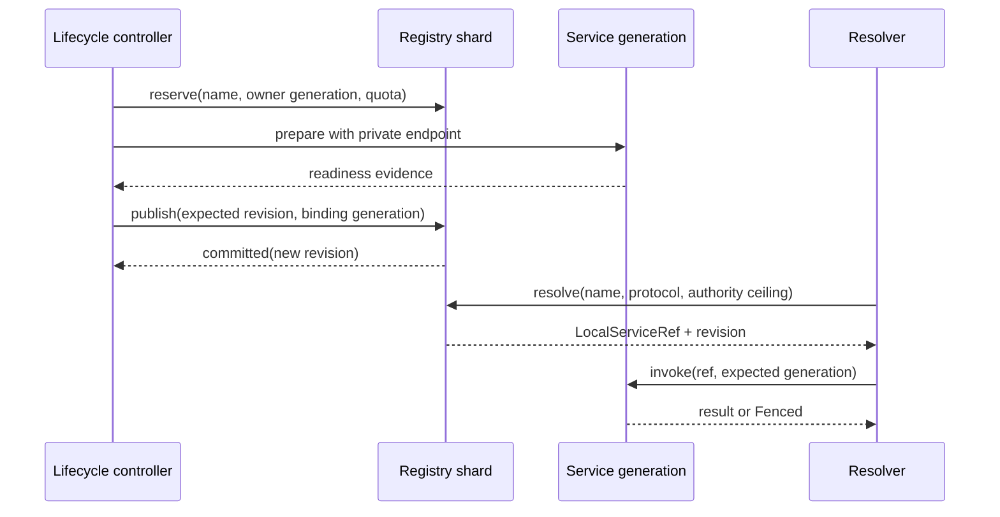

# Naming, registry, and local discovery

## Question, scope, and operational standard

How should an Atom OS process resolve a stable logical service name to the
current local incarnation without treating the name as authority, leaking
unbounded namespace state, or missing replacement events between a snapshot
and a watch?

This component owns local namespaces, reservations, bindings, lookup,
generation-aware references, snapshots, watches, owner-death cleanup, and
bounded group membership. It does not authorize the referenced operation,
prove a remote endpoint current, or decide distributed exclusive ownership.

The design is adequate only when it:

1. separates stable name, object identity, incarnation, and invocation
   capability;
2. makes unique binding publication conditional on an expected revision;
3. prevents an old owner from withdrawing or replacing a new binding;
4. closes the snapshot/watch gap and specifies overflow recovery;
5. bounds names, registrations, watchers, queued changes, and cached history;
6. preserves explicit weak semantics for groups and candidate hints; and
7. gives every resolved handle enough generation evidence for the receiver to
   reject stale use.

No registry implementation, race test, or performance result exists yet.

## Evidence and synthesis

[Lampson's global name-service
analysis](../../30-sources/lampson-1986-global-name-service.md) distinguishes
stable names from changing locations and emphasizes caching, administrative
structure, and failure. [Leases](../../30-sources/gray-cheriton-1989-leases.md)
explain time-bounded cache validity and the cost tradeoff among reads, writes,
and renewal. These ideas do not make a local name a capability or solve
unbounded pause.

The [etcd API guarantee
contract](../../30-sources/etcd-project-2026-api-guarantees.md) demonstrates a
useful revisioned snapshot/watch model and makes compaction recovery explicit.
Atom OS can use those semantics without embedding a replicated database in the
local fast path. The [OTP 29 system-services
documentation](../../30-sources/erlang-otp-team-2026-otp-29-0-6-system-services-documentation.md)
supplies compatibility behavior for process registration and groups; its atom
names and runtime assumptions should not become the native system namespace.

The central conclusion is that discovery returns evidence about a current
candidate plus a separately constrained invocation facet. It never turns a
human-readable string into ambient authority.

## Recommended structure

Partition the namespace into shards selected by a stable namespace identifier,
not an attacker-controlled hash alone. One actor is the authoritative writer
for each local shard generation. Readers use immutable snapshots or request a
linearized lookup. A shard can be moved only through an explicit generation
handoff that fences the old writer.

### Core objects

- `Namespace` binds an owner authority, naming grammar, quota, protocol-policy
  ceiling, and shard mapping.
- `NameReservation` grants one owner generation the right to propose a binding
  for a name; it is not the right to invoke the service.
- `Binding` contains name, service identity, service incarnation, protocol
  profile, endpoint object, invocation-facet derivation rule, owner monitor,
  lifecycle state, and publication revision.
- `LocalServiceRef` contains an attenuated endpoint capability plus expected
  service and endpoint generations. It is intentionally unusable outside its
  delegated operation set.
- `GroupView` is a revisioned, explicitly non-unique member set with ordering
  and staleness semantics.
- `WatchCursor` identifies shard generation and the next required revision.

Display aliases can map to stable names, but neither is a raw actor identifier.
Names use canonical bounded encodings and declared case/normalization rules.
The service manifest reserves namespace capacity before activation.

## Publication, lookup, and replacement

A unique binding follows `reserve → prepare → ready → publish`. Publication is
a compare-and-swap over `(shard_generation, prior_revision, prior_binding)`.
The transaction verifies the reservation holder and service incarnation, then
commits one new immutable table root and revision. If any expected value
changed, the caller replans instead of overwriting current state.

Lookup is not atomic with later use. A service can be replaced immediately
after resolution. Therefore the receiver or its endpoint adapter checks the
expected incarnation when accepting each new operation. A stale reference
returns `Fenced` or `Gone`; it must not reach a newly created service that
happens to reuse storage or an actor slot.

During replacement, the new binding prepares privately. One publication
replaces the current binding and marks the previous generation draining. The
old owner cannot withdraw the new binding because withdrawal is conditional on
its own binding generation and publication revision. Runtime terminal evidence
triggers the same reconciliation path; monitor arrival alone does not permit
unsafe reuse of a device or durable resource.

## Snapshot and watch contract

Clients obtain `snapshot_and_cursor(selector)`, which returns a complete
immutable view at revision `r` and a cursor for events strictly after `r`.
Installing a watch after an unrelated snapshot is not supported because a
change can occur in the gap.

Each watcher declares selector, event projection, queue capacity, delivery
class, and resynchronization budget. Events carry shard generation, revision,
operation, stable name, old/new binding generations, and a digest. Revisions
are ordered within a shard; there is no invented total order across independent
shards.

When a queue overflows, history is compacted past the cursor, the shard moves,
or continuity after reconnect cannot be proved, the registry atomically closes
the watch and increments an overflow epoch visible through the watch handle's
status/poll path. It never relies on enqueueing a final marker into the full
queue. The next read returns `ResnapshotRequired(epoch)` until the consumer
obtains a new snapshot and cursor. It does not silently skip changes. A watch
event is a hint to update local state, not proof that the cached binding
remains current at use time.

## Unique names, groups, and compatibility

Unique local bindings have one writer and one current generation. Groups are a
different abstraction: they can expose ordered, unordered, sticky, or
eventually merged membership, but selection is a client policy. A group result
does not grant exclusive ownership. Local candidate caches may be stale within
their declared revision/lease profile.

The OTP compatibility adapter can provide documented local registered-name,
alias, `via`, and process-group behavior inside a bounded compatibility
namespace. It must surface quota failure and any divergence caused by finite
atoms or mailboxes. Native clients use binary or structured identifiers and
capability-bearing references. Distributed registration routes through
component 9 rather than pretending that a local registry CAS survives a
partition.

## Failure, security, and overload analysis

- **Name squatting:** namespace capabilities, reservations, quotas, and
  manifest ownership prevent arbitrary global registration.
- **ABA/reuse:** shard, binding, owner, service, and endpoint generations are
  checked independently; numeric slot reuse cannot validate an old reference.
- **Stale cache:** result types report revision and consistency class. Exclusive
  effects require authoritative coordination and sink-side fencing.
- **Watcher overload:** finite queues produce a resnapshot marker. Projected
  events avoid leaking entire bindings to unauthorized subscribers.
- **Owner crash:** monitor evidence starts conditional withdrawal; the binding
  remains unavailable or draining until its resource profile is reconciled.
- **Registry crash:** the shard restores a complete checkpoint, replays
  committed publications, increments its shard generation, and revalidates
  every binding against the current runtime owner incarnation before lookup
  resumes. Clients treat lost continuity as resnapshot.
- **Hot shard:** per-namespace quotas, bounded selectors, sharding, and cached
  immutable reads constrain contention; a malicious name cannot choose an
  unlimited fanout.
- **Authority confusion:** resolve requires namespace access, but invocation
  still needs the returned attenuated facet and receiver-side generation check.

## Implementation and verification program

Stage 0 defines the registry state machine and model-checks two owners racing
to publish, replace, withdraw, crash, and reuse a slot. Properties include one
current unique binding, monotonic revision, no stale withdrawal, and complete
snapshot-plus-watch reconstruction.

Stage 1 implements an in-memory single-shard actor with immutable snapshots,
finite watches, monitor integration, and property-based command generation.
Stage 2 adds sharding, persistent checkpoints, lifecycle publication, and OTP
adapters. Stage 3 integrates distributed candidate hints and authoritative
references while keeping the local path independent.

Tests include malformed names, quota exhaustion, hash flooding, watcher
overflow, compaction, crash between binding and root publication, owner death
before/after publish, stale withdrawal, endpoint reuse, shard handoff, and
resolver delay. Measure resolve latency, publication tail, bytes per binding,
watch amplification, resnapshot cost, and recovery time at maximum admitted
state.

The design fails if a string alone authorizes invocation, an old owner can
remove a successor, a watcher can silently miss a revision, or bounded memory
requires silently dropping a supposedly lossless update.

## Supported decisions and open questions

The evidence supports single-writer local shards, immutable revisioned
snapshots, compare-and-publish, owner monitors, generation-aware references,
atomic snapshot/cursor acquisition, explicit resynchronization, and separate
group semantics. It does not determine the initial shard count, persistence
medium, native naming grammar, or cache lease duration.

Open questions include whether most local resolution should occur through
pre-derived capabilities rather than names, how registry recovery interacts
with early boot, and which compatibility namespaces can be safely garbage
collected without exhausting BEAM atoms.

## Connections

- [OTP-like system services layer](../otp-like-system-services-layer.md)
- [Service-domain bootstrap and manifest controller](service-domain-bootstrap-and-manifest-controller.md)
- [Distributed membership, discovery, and authoritative coordination](distributed-membership-discovery-and-authoritative-coordination.md)
- [Capability spaces and authority](../minimal-privileged-kernel-components/capability-spaces-and-authority.md)
- [OTP-like system services map](../../10-maps/otp-like-system-services.md)

## Sources

- [A global name service for a highly decentralized system](../../30-sources/lampson-1986-global-name-service.md)
- [Leases](../../30-sources/gray-cheriton-1989-leases.md)
- [etcd API guarantees](../../30-sources/etcd-project-2026-api-guarantees.md)
- [OTP 29 system-services documentation](../../30-sources/erlang-otp-team-2026-otp-29-0-6-system-services-documentation.md)
- [Capability myths demolished](../../30-sources/miller-et-al-2003-capability-myths.md)
