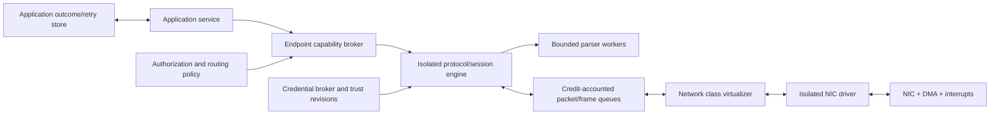
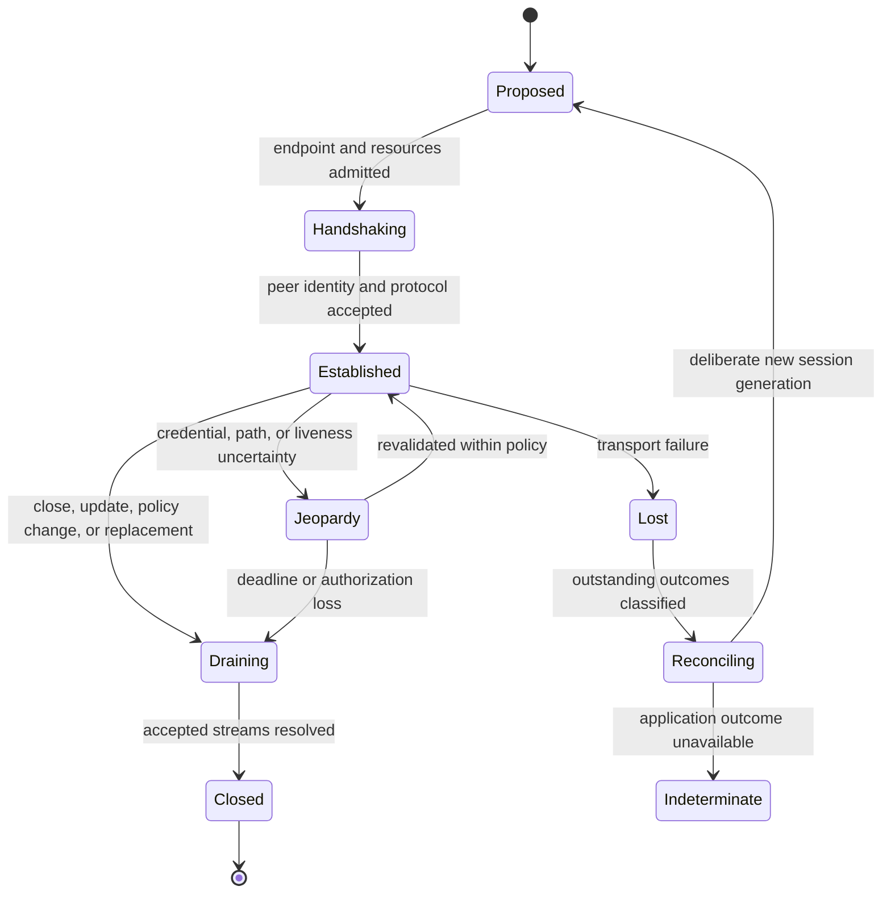

# Network endpoint and protocol services

## Question, scope, and operational standard

How should Atom OS expose local network endpoints and protocol sessions while
keeping drivers and parsers isolated, propagating finite flow control, binding
peer identity to the current session, and reporting remote outcomes without
RPC illusions?

This component owns capability-scoped endpoint creation, local routing policy,
transport/protocol engines, parser isolation, session identity, credits,
connection lifecycle, and outcome vocabulary. It does not make the network
reliable, decide application authorization, supply distributed membership, or
grant a connected peer ambient node authority.

The service is adequate only when:

1. bind, listen, accept, connect, resolve, route, and raw-packet access are
   separate attenuated authorities;
2. all packet, frame, request, response, and retransmission queues are finite
   and charged;
3. a session binds transport generation, authenticated peer, protocol version,
   trust/config revisions, and resource window;
4. reconnect creates a new generation and cannot validate old frames, credits,
   or acknowledgements;
5. every send result names its actual proof point; and
6. untrusted parsing and compatibility distribution remain outside the kernel
   and outside unrelated service domains.

No network stack, secure-channel profile, interoperability run, or benchmark
is implemented here.

## Evidence and interpretation

[Birrell and Nelson's
RPC](../../30-sources/birrell-nelson-1984-remote-procedure-calls.md) explains
call identifiers, retransmission, duplicate suppression, and the irreducible
uncertainty created by communication failure. [QUIC](../../30-sources/iyengar-thomson-2021-quic.md)
provides current transport precedent for authenticated handshakes, streams,
flow control, connection IDs, migration, and replay-sensitive 0-RTT. It does
not define application commit.

The [end-to-end
argument](../../30-sources/saltzer-et-al-1984-end-to-end-arguments.md) supports
placing ultimate correctness at the application boundary instead of inferring
it from a transport acknowledgement. The [SPIFFE Workload
API](../../30-sources/spiffe-project-2026-workload-api.md) supports local
workload credentials and rotation, but identity remains distinct from
authorization. [sDDF](../../30-sources/heiser-et-al-2026-sddf-design.md)
supports isolated high-throughput driver/virtualizer paths with bounded shared
queues.

The synthesis uses transport mechanisms but exposes a more honest layered
outcome model to applications.

## Recommended architecture

The endpoint broker is a policy service, not a universal socket factory. It
derives a specific handle from the caller's service identity, network
namespace, address/port or peer constraints, protocol profile, bandwidth and
memory budgets, and expiration. Raw packet access is a distinct high-risk
facet.

Drivers handle NIC mechanics. A network virtualizer validates descriptors,
multiplexes clients, and accounts buffers. Transport engines implement IP,
UDP, TCP, QUIC, DNS, or later protocols in isolated domains appropriate to
their parsing risk. Application codecs can use still smaller worker domains.

## Endpoint and session object model

An `EndpointCapability` identifies network namespace, local address and port
range, permitted peer selector, direction, protocol family/version, route
class, rate and connection limits, resolver policy, raw-feature exclusions,
and delegation ceiling.

A `SessionRef` contains:

- local endpoint, service, transport, and protocol generations;
- authenticated local and peer identities and their trust-domain context;
- credential and trust-bundle revisions used for the handshake;
- negotiated protocol and feature set;
- local route/interface and current path generation;
- receive/send/stream credit windows and resource account;
- authorization decision reference and recheck boundary;
- replay/early-data policy; and
- lifecycle state and drain deadline.

An address or discovered name is only a candidate route. A selected secure-
channel profile must define how its handshake proves possession of credentials
for an expected peer identity and which transcript/context is bound to the
session; this report does not yet select or substantiate that profile. A
separate policy authorizes the requested operation. A connection to a
recognized peer does not grant process spawn, registry, storage, device, or
operator capabilities.

## Bounded data and control flow

Every boundary has explicit ownership and credits. Receive buffers move from
driver to virtualizer to protocol engine to application and return along a
bounded path. Send buffers move in the opposite direction. A component cannot
retain more bytes/descriptors than its granted window. Metadata queues remain
separate from payload regions, and mappings expose only the regions each
component needs.

Flow-control behavior is declared by class:

| Pressure point | Permitted response |
| --- | --- |
| Listener backlog | reject, cookie/challenge, or shed by authenticated priority |
| Protocol/session memory | stop granting credits, reset lowest-priority session, or degrade features |
| Application receive queue | withhold window, coalesce allowed events, or close; never overwrite reliable data |
| Send admission | reject before acceptance, return wait handle, or admit against reserved bytes |
| Control path | use a small protected queue for close, key update, error, and recovery; still finite |

Backpressure propagates toward the producer. Retries consume a separate budget
so an outage does not turn one request into unbounded network work. Deadlines
are absolute and carried through queues; expired work is rejected before
costly parsing or transmission where safe.

## Session lifecycle, reconnect, and rotation

Reconnect never continues an old transport generation. A custom datagram or
RPC wire profile must carry an authenticated epoch/connection identifier, or
use a protocol-native equivalent, so delayed packets from an old session are
rejected remotely as well as by local handles. A logical application operation
ID can survive a deliberate retry, but packet numbers, stream IDs, credits,
frame sequence, and transport acknowledgements cannot. Old frames and late
local completions are rejected by session generation; wire-visible epochs
provide the corresponding remote check.

Credential rotation supplies a complete new credential/trust generation. The
manifest defines whether an established authenticated session may continue,
must reauthenticate, or must drain when local credentials expire, peer trust is
removed, or authorization changes. A credential update notification does not
cryptographically revoke an existing session by itself.

QUIC-like 0-RTT is disabled by default for mutations because replay can repeat
application work. A profile may allow explicitly idempotent reads or requests
with application-level replay protection.

## Layered outcome semantics

The network API avoids one undifferentiated “sent” result:

- `Rejected`: local admission failed and no protocol work was accepted;
- `LocallyAccepted`: bytes/request are owned by the local service;
- `TransportAcknowledged`: the peer transport acknowledged the relevant data;
- `PeerAccepted`: an authenticated peer service admitted the request;
- `ApplicationCommitted`: the peer application returned durable outcome proof
  under a named protocol;
- `CancelRequested`: cancellation was requested but the accept/commit race is
  unresolved;
- `CancelledBeforeCommit`: application protocol evidence proves cancellation
  won before its commit boundary;
- `Aborted`: the protocol proves the operation did not commit;
- `Fenced`: a service/session/peer generation is obsolete; or
- `Indeterminate`: the effect may have occurred but the proof is unavailable.

Peer- and application-level acknowledgements bind logical operation ID and
digest, local and peer service identities/generations, transport session
generation, protocol version, and proof point. Generic TCP/QUIC transport
acknowledgements identify byte or packet transport state and can only be
correlated locally with the request; they do not carry or authenticate the
application operation identity. A transport ACK proves neither application
parsing nor durable commit. If a disconnect follows request transmission, the
client queries an application outcome service or retries only under a defined
idempotency protocol.

## Erlang distribution compatibility

Standard Erlang distribution may run as a confined gateway for a deliberately
trusted cell. The gateway terminates the distribution protocol, maps approved
names and operations to native capabilities, enforces connection and atom/data
limits, and isolates parsing and decoding. It does not make every authenticated
distribution peer a trusted Atom OS node.

The gateway profile pins OTP/ERTS versions, handshake and encryption choices,
atom-cache limits, process/link/monitor semantics, failure translation, and
unsupported operations. Native inter-service protocols should prefer explicit
schemas, workload identity, bounded resources, and capability-based routing.

## Failure, security, and overload analysis

- **Parser exploit:** memory-safe or separately isolated parsers receive
  bounded frames and no ambient authority; failure closes only the affected
  session/profile.
- **Peer impersonation:** the eventual secure-channel profile must verify the
  expected identity, trust revision, and its defined session binding before
  policy; names and IP addresses are not sufficient.
- **Replay/stale response:** operation digest plus peer/service/session
  generations prevent an old acknowledgement completing new work.
- **NIC/driver failure:** device-service recovery fences DMA and queue
  generations; sessions become lost and reconcile rather than silently
  migrating accepted effects.
- **Connection flood:** endpoint admission, per-identity quotas, bounded
  handshake work, protected control capacity, and early rejection limit cost.
- **Slow receiver:** finite credits push pressure back or close the session;
  reliable queues never silently discard data.
- **Credential issuer outage:** established/new-session behavior follows the
  explicit credential policy and enters jeopardy before unsafe expiry.
- **Partition:** local sessions can degrade or fail; distributed membership
  hints cannot by themselves revoke or transfer exclusive authority.

## Implementation and verification program

Stage 0 models endpoint authority, buffer credits, session generations,
handshake identity, reconnect, and outcome transitions. Properties include no
buffer double ownership, no post-fence acceptance, bounded retained bytes, and
no `ApplicationCommitted` without application proof.

Stage 1 builds a loopback protocol over hostile fragmenting/reordering mocks
and virtual time. Stage 2 integrates the isolated NIC path with a minimal
UDP-like datagram and one authenticated reliable transport. Stage 3 adds
application outcome lookup, credential rotation, resolver/discovery, and a
confined Erlang-distribution gateway.

Tests fuzz every parser and state transition, exhaust each queue, lose and
duplicate frames/ACKs, reconnect with stale generations, rotate credentials
mid-session, change authorization, crash driver/protocol/application domains,
partition outcome lookup, replay early data, and inject gray failure. Measure
copy/mapping cost, throughput, tail latency, memory per session, overload
recovery, handshake cost, close/drain time, and blast radius.

The design fails if transport delivery is reported as application commit, a
connected peer gains ambient authority, reconnect reuses old credits, or
reliable operation depends on an unbounded queue.

## Supported decisions and open questions

The evidence supports capability-scoped endpoints, isolated parsers and
drivers, explicit buffer credits, authenticated generation-bound sessions,
new generations on reconnect, layered outcomes, and a confined compatibility
gateway. It does not select the first IP/transport/TLS stack, routing service,
or wire schema.

Open questions include whether the first bootable profile needs TCP, QUIC, or
only a smaller datagram/RPC subset; how certificate time validation works
without a reliable RTC; and which application protocols merit durable outcome
lookup rather than simple at-least-once or at-most-once semantics.

## Connections

- [OTP-like system services layer](../otp-like-system-services-layer.md)
- [Device-service policy and management](device-service-policy-and-management.md)
- [Configuration, workload identity, and secrets](configuration-workload-identity-and-secrets.md)
- [Distribution gateway and remote actor semantics](../managed-actor-runtime-components/distribution-gateway-and-remote-actor-semantics.md)
- [OTP-like system services map](../../10-maps/otp-like-system-services.md)

## Sources

- [Implementing remote procedure calls](../../30-sources/birrell-nelson-1984-remote-procedure-calls.md)
- [QUIC](../../30-sources/iyengar-thomson-2021-quic.md)
- [End-to-end arguments in system design](../../30-sources/saltzer-et-al-1984-end-to-end-arguments.md)
- [SPIFFE Workload API](../../30-sources/spiffe-project-2026-workload-api.md)
- [sDDF design](../../30-sources/heiser-et-al-2026-sddf-design.md)
