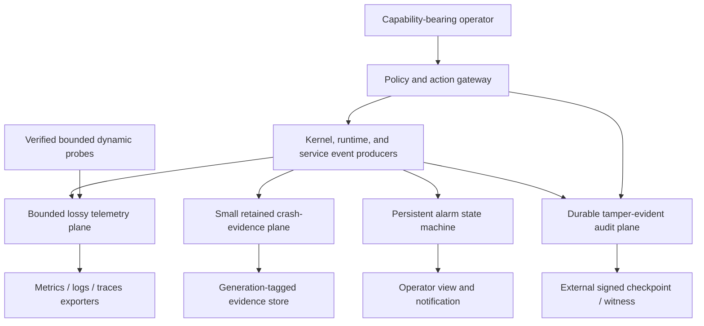
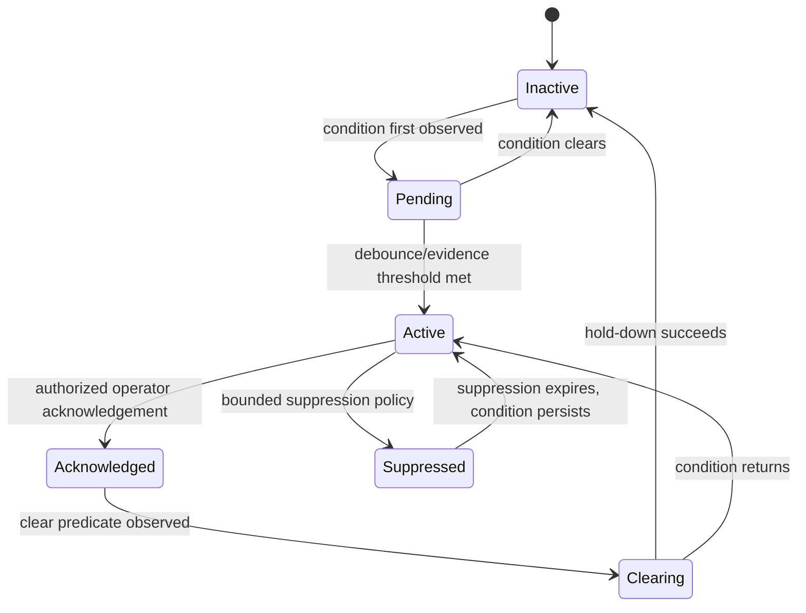

# Observability, audit, alarms, and operator control

## Question, scope, and operational standard

How should Atom OS make causal behavior, failures, security-relevant effects,
and operator actions inspectable without letting telemetry block the system,
letting a compromised service rewrite history, or turning debugging into
ambient authority?

This component owns telemetry routing, trace correlation, bounded crash
evidence, persistent alarm state, tamper-evident audit, dynamic probes, and
capability-scoped operator actions. It does not claim that logs are true merely
because they are signed, put all observability in the kernel, or guarantee
lossless high-volume telemetry.

The design is acceptable only if:

1. lossy telemetry, retained crash evidence, alarms, and durable audit have
   different contracts and resource paths;
2. ordinary event emission cannot block critical service or kernel progress;
3. causal identifiers bind service/request generations and are treated as
   untrusted input across trust boundaries;
4. audit records capture authorization, intent, effect/outcome, and sequence
   with detectable modification and externally anchored progress;
5. alarms survive controller restart and require explicit acknowledgement and
   clear conditions; and
6. inspection and operator actions require least-authority capabilities,
   expiry, rate limits, and audit.

No telemetry pipeline, cryptographic audit log, or operator console is
implemented or evaluated.

## Evidence and synthesis

[Dapper](../../30-sources/sigelman-et-al-2010-dapper.md) demonstrates
low-overhead distributed trace context, sampling, and causal reconstruction in
large services. It does not make sampled traces complete or secure. The
[OpenTelemetry specification](../../30-sources/opentelemetry-project-2026-specification-1-60.md)
provides a current interoperable vocabulary for traces, metrics, logs,
resources, context propagation, sampling, limits, and export; its SDK defaults
are not an Atom OS safety proof.

[Secure audit logs](../../30-sources/schneier-kelsey-1999-secure-audit-logs.md)
support hash/MAC-chained records and key evolution to detect later tampering,
while completeness and truth still require trustworthy collection and external
checkpoints. [DTrace](../../30-sources/cantrill-et-al-2004-dtrace.md) shows the
operational value of dynamic, production-safe probing with constrained actions
and predicates. [FSCQ](../../30-sources/chen-et-al-2015-fscq.md) informs
crash-consistent durable state, and [gray
failure](../../30-sources/huang-et-al-2017-gray-failure.md) motivates retaining
contradictory perspectives rather than collapsing health to one Boolean.

The synthesis is four distinct data planes sharing identifiers but not
durability or backpressure promises.

## Four-plane architecture

### Telemetry plane

Metrics, routine logs, and sampled traces use preallocated or bounded buffers.
Emission is nonblocking for critical paths. Full behavior is explicit by event
class: drop newest/oldest, aggregate, sample, coalesce, or disable. Drop counts,
queue high-water marks, and exporter lag are themselves observable through a
small protected summary. No ordinary telemetry class is called lossless.

### Crash-evidence plane

Each domain receives a finite crash-evidence pool charged at domain creation.
Actors normally retain only cheap inline exit metadata from that pool; detailed
envelopes are capped by count/bytes and allocated by criticality or sampling at
spawn/failure time. Domains and a small set of critical services can reserve a
dedicated record, but BEAM-scale actor populations cannot each consume an
unbounded fixed allocation. A record can retain terminal reason,
identity/incarnation, last accepted and completed operation sequences, resource
counters, bounded stack/trace digest, fault class, relevant register subset
where authorized, and links to recent trace/audit records. New evidence
overwrites or rotates only by declared rule. Secrets and arbitrary process
memory are excluded by default.

### Alarm plane

An alarm is durable control state, not a log line. It has stable alarm ID,
resource/service identity and generation, condition type, severity, first/last
observation, evidence references, deduplication key, lifecycle state,
acknowledgement, suppression window, and clear predicate.

### Audit plane

Audit records cover security- and authority-relevant decisions and effects:
boot trust changes, capability delegation/revocation, identity/secret access,
registry ownership, device reset, durable commit, release activation, policy
change, quarantine override, and operator action. High-volume ordinary request
telemetry remains separate.

## Causal context and data model

Every operation can carry `TraceContext` with trace ID, parent span ID, span
links, flags, sampling decision, and baggage allowlist. Parent expresses one
causal predecessor; links represent fan-in, fan-out, queue handoff, retry, and
work that continues after selective receive or a new local root. Atom OS adds
origin trust domain, service/caller generations, operation ID and digest
reference, and resource account. A trust-boundary gateway may retain an
approved link but creates a new authenticated local context. Remote context is
untrusted data until the session and policy accept it. Attackers cannot set
priority, authority, or unlimited label cardinality through baggage.

Spans distinguish queue wait, execution, dependency wait, durable commit,
device/transport proof points, and outcome reconciliation. Cross-machine
duration analysis records clock-domain identity and synchronization/error
bounds; wall-clock ordering is not inferred when uncertainty overlaps.
Sampling decisions and dropped spans are part of interpretation. Metrics have
bounded label sets; service-provided strings are normalized into controlled
dimensions or logs.

Logs use typed fields, severity, producer identity/generation, monotonic event
sequence, wall time only when trusted, and redaction classification. Formatting
occurs outside critical producers. A message string alone is not machine
actionable evidence.

## Alarm state and gray failure

Acknowledging an alarm does not clear its condition. Suppression has an expiry
and does not delete evidence. Clear requires a type-specific predicate and
hold-down window. After restart, the alarm controller recovers current states
from durable records and re-evaluates live conditions.

Gray failures retain perspectives: driver progress, client timeout, dependency
health, kernel fault, and network observation can disagree. Correlation groups
them by resource and time without overwriting the minority observation. Policy
can enter `Suspect` or degraded mode until decisive evidence exists.

## Tamper-evident audit protocol

Each audit record binds log identity and epoch, monotonically increasing
sequence, previous-record authenticator, producer and authenticated initiator,
delegated capability reference, target/resource generations, action and
request digest, authorization decision/policy revision, intent/outcome class,
effect proof reference, monotonic and trusted wall time where available, and
redaction schema.

Records are framed, checksummed, authenticated, and committed through the
durable-state service. Key evolution can limit how far a later key compromise
rewrites history. Periodic signed roots are exported to an independent witness
or append-only medium; recovery reports gaps, invalid chains, rollback, and the
last externally witnessed sequence.

Cryptography detects selected modification. It cannot prove that a compromised
producer reported a truthful event, that a disabled path emitted all records,
or that the external witness is available. High-assurance actions therefore
use mediation that writes intent before granting/effecting authority and
records the independently observed outcome afterward. If the normal mandatory
audit path cannot durably accept an operation, policy either fails the
operation closed or routes a narrowly defined emergency intent and outcome to
a separately reserved kernel-sealed evidence slot. The service audit writer
later correlates and checkpoints that sealed record before normal emergency
authority is renewed. Emergency operation therefore changes the audit path;
it never silently drops the audit obligation.

## Dynamic inspection and operator control

Dynamic probes use a verifier or small safe language with finite instruction,
stack, memory, event-rate, recursion, and lifetime bounds. Probe attachment
requires a capability scoped to provider, event, fields, predicates, target
generations, and expiry. Probe actions can record/aggregate approved fields;
they cannot mutate service state or call arbitrary kernel functions.

Operator APIs separate `inspect`, `subscribe`, `acknowledge-alarm`,
`suppress-alarm`, `drain`, `restart`, `quarantine`, `rotate-credential`,
`activate-release`, and `change-policy`. Each facet binds audience/service,
target and magnitude ceilings, holder or sender constraint, issue and revocation
epochs, expiry, delegation rule, rate budget, and a nonce/request-digest rule
that prevents substitution. The verifier checks the authoritative current
revocation epoch and atomically consumes each one-shot `(issuer, holder,
issue_epoch, nonce)` in an idempotent operation ledger; an exact replay returns
the recorded outcome rather than executing the action again. Cooperative
requests return acceptance separately from terminal evidence. Forced action
routes through the external lifecycle or kernel holder.

Break-glass authority is predeclared, short-lived, purpose-bound, and audited;
high-risk profiles can require two independent approvals. Loss of the normal
identity service cannot justify a permanent unauthenticated console.

## OTP Logger compatibility boundary

Native telemetry publication is bounded and may sample, aggregate, or drop
according to its event class. A strict OTP Logger adapter separately preserves
the selected OTP release's handler, filter, metadata, overload, and error
semantics. In particular, any documented or version-pinned path where handler
or filter work executes in the emitting process remains a trusted
compatibility cost; it cannot be silently moved to an isolated asynchronous
subscriber while claiming exact behavior.

Compatibility log events pass through redaction and capability policy before
leaving their trust domain, and queue/resource exhaustion is a named profile
divergence. OTP logging is not the durable security audit plane. Audit-worthy
actions are mediated and recorded through the separate intent/outcome
protocol even when a corresponding Logger event is also emitted.

## Failure, security, and overload analysis

- **Telemetry storm:** sampling, aggregation, bounded buffers, label limits,
  and independent exporter accounts protect service progress; drop evidence
  remains visible.
- **Secret leakage:** source-side classification and redaction, field
  allowlists, protected crash records, and separate reveal capabilities reduce
  exposure. Exporters remain confidentiality boundaries.
- **Trace spoofing:** remote trace IDs are correlation hints, not authority;
  authenticated local context records actual principal/generation.
- **Audit outage:** mandatory operations fail closed or use the reserved
  kernel-sealed emergency evidence path with later correlation; routine
  telemetry may drop.
- **Log tampering:** chaining, evolving keys, monotonic epochs, and external
  checkpoints detect covered changes but not false producer statements.
- **Alarm flapping:** debounce, deduplication, hold-down, and bounded
  suppression prevent notification storms without erasing active conditions.
- **Probe abuse:** verification, quotas, finite lifetime, field scoping, and
  audit prevent arbitrary debugging code in privileged paths.
- **Operator compromise:** attenuated action capabilities and dual control
  limit reach; every accepted intent and outcome is independently recorded.

## Implementation and verification program

Stage 0 specifies event schemas, context trust, queue behavior, alarm states,
and an authenticated audit chain. Property tests cover sequence continuity,
recovery after torn records, alarm acknowledgement/clear separation, label
bounds, and generation fencing.

Stage 1 implements bounded in-memory metrics/logs/traces and per-domain crash
records with forced exporter stalls. Stage 2 adds the durable audit/alarm store,
external checkpoints, and capability-gated operator API. Stage 3 adds verified
dynamic probes, distributed context, privacy policy, and incident exercises.

Tests saturate every telemetry path, crash producers/exporters/audit writer at
each transition, corrupt and roll back audit storage, forge trace context,
inject secrets and high-cardinality fields, flap alarms, expire suppressions,
abuse probes, lose identity service, and interrupt operator actions. Measure
producer overhead, drops, memory high water, crash-evidence latency, audit
commit cost, alarm detection/clear time, exporter lag, and operator blast
radius.

The design fails if routine telemetry can deadlock a critical producer, audit
claims completeness without an enforcement path, alarm acknowledgement erases
the condition, or debugging authority permits unbounded privileged execution.

## Supported decisions and open questions

The evidence supports separate telemetry/crash/alarm/audit planes, bounded
nonblocking emission, causal generation-aware context, durable alarm state,
tamper-evident audit with external checkpoints, safe dynamic probing, and
capability-scoped operator actions. It does not choose an exporter protocol,
audit cryptosystem, witness service, sampling policy, or retention schedule.

Open questions include which audit actions must fail closed on constrained
devices, how privacy and incident forensics should trade off, whether trusted
wall time is available, and which minimal probe language is both useful and
verifiable.

## Connections

- [OTP-like system services layer](../otp-like-system-services-layer.md)
- [Configuration, workload identity, and secrets](configuration-workload-identity-and-secrets.md)
- [Admission, overload, and service-resource governance](admission-overload-and-service-resource-governance.md)
- [Observability and crash evidence](../minimal-privileged-kernel-components/observability-and-crash-evidence.md)
- [OTP-like system services map](../../10-maps/otp-like-system-services.md)

## Sources

- [Dapper](../../30-sources/sigelman-et-al-2010-dapper.md)
- [OpenTelemetry specification 1.60](../../30-sources/opentelemetry-project-2026-specification-1-60.md)
- [Secure audit logs](../../30-sources/schneier-kelsey-1999-secure-audit-logs.md)
- [DTrace](../../30-sources/cantrill-et-al-2004-dtrace.md)
- [FSCQ](../../30-sources/chen-et-al-2015-fscq.md)
- [Gray failure](../../30-sources/huang-et-al-2017-gray-failure.md)
- [OTP 29 system-services documentation](../../30-sources/erlang-otp-team-2026-otp-29-0-6-system-services-documentation.md)
- [Capability myths demolished](../../30-sources/miller-et-al-2003-capability-myths.md)
