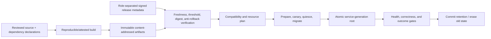
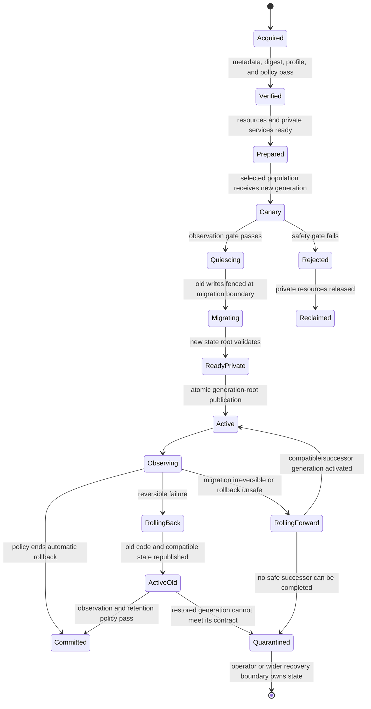

# Release, update, rollback, and state migration

## Question, scope, and operational standard

How should Atom OS authenticate a release graph, stage compatible service
generations, migrate state, activate one generation, and retain a truthful
rollback or roll-forward path across crashes?

This component owns release metadata, artifact verification, compatibility
planning, rollout, canary/shadow evaluation, quiescence, migration,
generation-root activation, rollback, and commit/retention policy. It does not
replace secure boot, compiler/build assurance, application-specific migration
logic, or the lifecycle and storage mechanisms it coordinates.

The design is acceptable only if:

1. artifact authenticity, build provenance, rollout authorization, runtime
   activation, state migration, and rollback are independently evidenced;
2. all artifacts and dependency closures are immutable and digest-identified;
3. obsolete or expired metadata cannot silently reactivate a vulnerable
   generation;
4. the old serving generation is fenced at every effect sink before the new
   one becomes exclusive;
5. code rollback is never presented as data rollback; and
6. a crash at every transition recovers to one known generation or an explicit
   indeterminate/quarantined state.

No updater, signed release, migration, or failure-injection result exists yet.

## Evidence and synthesis

[TUF](../../30-sources/samuel-et-al-2010-tuf.md) separates root, targets,
snapshot, and timestamp roles and addresses rollback, freeze, and key
compromise for update metadata. It does not establish that the built artifact
is benign or that runtime activation is safe. [NixOS](../../30-sources/dolstra-et-al-2008-nixos.md)
supports immutable dependency closures and atomic selection between system
generations, while live service transition remains effectful orchestration.

[Ginseng](../../30-sources/neamtiu-et-al-2006-practical-dynamic-software-updating.md)
shows that dynamic code and type/state transformation can be practical under
explicit update points and compatibility constraints. It does not make
arbitrary concurrent state transformation safe. [FSCQ](../../30-sources/chen-et-al-2015-fscq.md)
supports crash-specified shadow/durable state transitions. [TOSCA
2.0](../../30-sources/oasis-2025-tosca-2.md) contributes typed dependency and
orchestration concepts, but a first Atom OS profile should remain much smaller.

The synthesis treats update as a transaction over several independently
fallible domains, with one small public activation point and explicit
irreversibility. Build-provenance attestation and statistically sound canary
policy are architectural requirements whose strongest direct literature is not
yet preserved in this pass; TUF explicitly does not secure a compromised build
process. They remain evidence gaps rather than inherited TUF guarantees.

## Separated assurance chain

The records are separate because each answers a different question:

- signature metadata: did authorized release roles approve these digests?
- provenance: what builder, source, dependencies, and parameters produced them?
- compatibility: can this platform and current state legally transition?
- activation: which generation is publicly selected now?
- observation: did the new generation meet declared health/correctness gates?
- commit: has policy ended the automatic rollback window?

A valid signature does not prove correctness; a healthy canary does not prove
the artifact was authorized.

## Release graph and authority

A `ReleaseGraph` binds release ID, monotonically ordered security epoch,
platform/boot profile, immutable artifact and configuration digests, BEAM/OTP
compatibility profile, service dependency graph, requested capability/resource
ceilings, state schemas and migration edges, minimum compatible peer versions,
rollout and observation policy, rollback/roll-forward options, and expiry.

Role-separated metadata limits compromise. Root keys establish trust and
thresholds; target roles authorize artifact paths/digests; snapshot metadata
binds a consistent set; freshness metadata prevents indefinite freeze. Offline
and online roles have separate capabilities and rotation procedures. Trusted
monotonic anti-rollback state records at least the highest accepted security
epoch. When a device lacks reliable wall time, freshness uses signed monotonic
version and trusted update checkpoints rather than pretending its RTC is
authoritative.

Rollout authority is attenuated by target population, service, version range,
resource ceiling, schedule, and maximum failure rate. Artifact download never
grants activation authority.

## Rollout protocol

The detailed order is:

1. acquire immutable artifacts and metadata without exposing them;
2. verify thresholds, expiry/freshness, anti-rollback, digests, dependency
   closure, platform profile, and requested authority;
3. reserve full new-generation and recovery resources;
4. start the candidate privately against a snapshot or shadow input;
5. run an effect-free shadow, or a canary whose authority is restricted to a
   disjoint cohort/resource partition and whose effect sinks validate a
   canary-specific fence; label every observation by version and cohort;
6. close old write admission, drain accepted work, and fence old generations;
7. migrate state into a private new-schema root, with progress and outcome
   records;
8. validate the new state and prepare all required services;
9. atomically publish one current generation root;
10. observe correctness, resource, and health gates; and
11. commit only after the retention/rollback window and operator policy allow
    old state and artifacts to be reclaimed.

Canary traffic must be distinguishable from the control generation. A canary
does not share unfenced exclusive authority with the old generation: it serves
only its assigned cohort or partition, and every effect sink enforces that
scope. A comparison without version labels can hide regressions. Shadow
execution does not issue external effects unless the sink supports explicit
dry-run or deduplicated shadow identities.

## State migration and rollback truthfulness

Every state schema is immutable and versioned. A migration edge declares
source and destination schema, code digest, preconditions, resource bound,
checkpoint frequency, validation, reversibility, and external effects. The
migrator receives read authority to the old snapshot and write authority only
to a private destination generation.

Prefer expand/contract compatibility: deploy readers/writers that tolerate
old and new representations, backfill privately, switch authority, then remove
old format later. For offline migration, quiesce writers and record the exact
old state root. For online migration, dual-read/write or change capture needs a
proved cutover sequence and extra retention.

Code rollback is safe only if the old code can read the active schema and
protocol, old secrets/policy remain valid, peers accept the version, and no
irreversible external effect violates the old invariant. Otherwise the
supported response is roll-forward, restore from an explicitly accepted
preimage with acknowledged data loss, or quarantine. “Previous binary starts”
is not sufficient.

A crash during migration resumes from durable progress against immutable input.
An operation applied to external state needs the standard deduplication,
reconciliation, or compensation contract. The release controller cannot infer
absence from a timeout.

## OTP release compatibility boundary

The native generation-replacement protocol is not an invisible reimplementation
of OTP release handling. A strict compatibility profile pins current
`release_handler` behavior, `.appup` and `.relup` instruction interpretation,
application suspend/change/resume ordering, callback `code_change/3`, the
runtime's two-code-version rule, purge behavior that may terminate actors still
executing old code, and mixed-version/distribution restrictions. Arbitrary MFA
upgrade instructions execute only inside an explicitly trusted compatibility
domain with bounded authority and audit.

Native releases prefer prepared service generations and schema migrations over
in-place callback mutation. The manifest declares which OTP features are
supported, intentionally different, or unavailable. A successful native
replacement cannot be reported as an OTP hot-code update unless differential
tests establish the selected profile's observable semantics.

## Distributed rollout and fencing

Cluster rollout is not one global atomic transaction. The authoritative
coordination service assigns eligible members and rollout generations.
Compatibility windows allow old and new protocol versions to coexist for a
bounded period. Exclusive roles transfer only with quorum-backed leases and
sink-enforced fencing.

Each node reports `downloaded`, `verified`, `prepared`, `active`, and
`committed` separately with artifact, config, state, and boot generations.
Quorum loss stops new authoritative transitions. Nodes may continue the
currently authorized generation under lease and local policy; they cannot
invent rollout progress.

## Failure, security, and overload analysis

- **Freeze/rollback attack:** role thresholds, freshness, consistent snapshot,
  monotonic security epoch, and retained root metadata prevent unbounded stale
  selection under the stated time/anchor assumptions.
- **Compromised online key:** scoped roles, thresholds, expiry, offline roots,
  and digest/provenance policy reduce reach; authorized malicious code remains
  a build/review problem.
- **Resource exhaustion:** download, unpack, private generation, migration,
  rollback reserve, and retained artifacts are admitted before rollout.
- **Failed canary:** candidate admission closes, private resources are
  reclaimed, and evidence remains version-labeled.
- **Crash at activation:** a transactional storage primitive or redundant
  generation-tagged pointer slots are used. The new immutable root is forced
  first; the new pointer slot is then written and forced. Recovery validates
  both slots and their referenced roots and selects the highest complete
  generation, so a torn slot never leaves the system with no valid selector.
- **Mixed cluster:** protocol compatibility and ownership fencing are explicit;
  healthy version skew is not guessed from process liveness.
- **Irreversible migration:** the plan forbids automatic rollback and preserves
  roll-forward/recovery artifacts.
- **Updater compromise:** artifact verification and activation are separated;
  the updater holds no broader device or service authority than the rollout.

## Implementation and verification program

Stage 0 models signed metadata versions, immutable artifacts, activation
pointer, schema edges, and crash/recovery. Properties include no unauthorized
digest activation, monotonic security epoch, one public generation, and no
automatic rollback across an irreversible edge.

Stage 1 implements offline package acquisition and a simulated signer set.
Stage 2 performs single-node A/B service generations and copy-on-write state
migration with power-cut injection. Stage 3 adds canary/shadow traffic,
operator gates, and a cluster compatibility window. Secure boot integration
and root-key ceremonies receive separate hardware-specific evidence.

Tests include expired/frozen metadata, threshold loss, wrong digest,
dependency substitution, insufficient disk/memory, decompression bomb, crash
at every durable step, invalid migration output, canary false positives,
rollback after schema change, peer version mismatch, stale fence, and quorum
loss. Measure download/storage amplification, prepare time, migration pause and
tail, rollback/roll-forward time, extra memory, and retained-generation cost.

The design fails if signature verification alone can activate a release, a
partial graph becomes public, an old generation can continue exclusive
effects, or rollback is offered without verifying data and protocol
compatibility.

## Supported decisions and open questions

The evidence supports immutable release closures, role-separated metadata,
freshness and anti-rollback, private preparation, version-labeled canaries,
quiescence and fences, private migration roots, one activation pointer, and
explicit rollback limits. It does not select a final metadata format, builder
attestation system, trusted-time source, or migration language.

Open questions include whether the earliest targets can afford two complete
generations, how to recover root trust after device replacement, which updates
require reboot, and whether hot code change is worth its state-space cost
compared with service-generation replacement. Direct primary evidence for the
chosen build-attestation scheme and statistically valid canary controller must
be added when those mechanisms are selected.

## Connections

- [OTP-like system services layer](../otp-like-system-services-layer.md)
- [Application lifecycle and dependency orchestration](application-lifecycle-and-dependency-orchestration.md)
- [Durable state, transactions, and outcome recovery](durable-state-transactions-and-outcome-recovery.md)
- [Distributed membership, discovery, and authoritative coordination](distributed-membership-discovery-and-authoritative-coordination.md)
- [OTP-like system services map](../../10-maps/otp-like-system-services.md)

## Sources

- [The Update Framework](../../30-sources/samuel-et-al-2010-tuf.md)
- [NixOS](../../30-sources/dolstra-et-al-2008-nixos.md)
- [Practical dynamic software updating for C](../../30-sources/neamtiu-et-al-2006-practical-dynamic-software-updating.md)
- [FSCQ](../../30-sources/chen-et-al-2015-fscq.md)
- [TOSCA 2.0](../../30-sources/oasis-2025-tosca-2.md)
- [OTP 29 system-services documentation](../../30-sources/erlang-otp-team-2026-otp-29-0-6-system-services-documentation.md)
