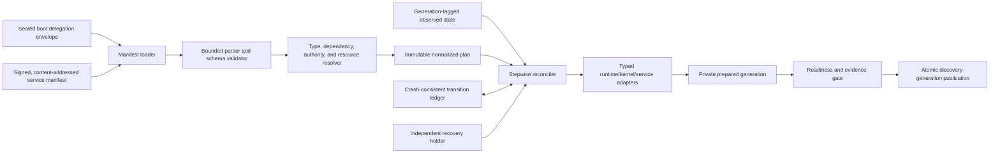
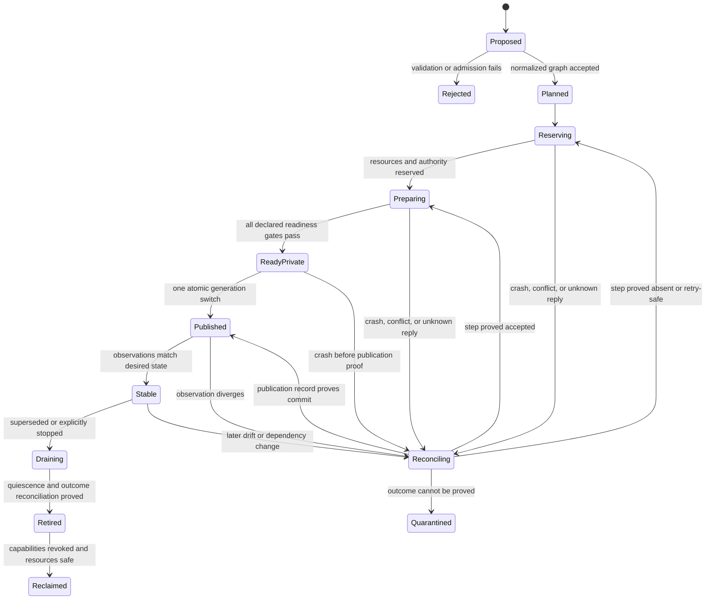

# Service-domain bootstrap and manifest controller

## Question, scope, and operational standard

How should Atom OS turn the lower layers' sealed boot handoff into a running
set of unprivileged system services without creating a second privileged
kernel or an immortal application controller?

This component owns validation and reconciliation of *service desired state*.
It does not authenticate the machine's boot image, create authority beyond the
boot envelope, implement the managed actor runtime, decide application-specific
recovery, or make remote effects exactly once. It succeeds only when it can:

1. reject an invalid, cyclic, unauthorizable, incompatible, or unresourced
   service graph before publishing any of it;
2. derive no authority outside the sealed boot delegation envelope;
3. prepare a complete new service generation privately and publish one current
   generation at one explicit linearization point;
4. resume safely after a crash at every step, including a lost reply;
5. converge once desired state and required dependencies remain stable; and
6. be replaced by an independently authorized recovery holder.

The report proposes an implementation and verification target. No Atom OS
controller, persistent ledger, model check, benchmark, or hardware result
exists yet.

## Evidence, synthesis, and boundary

[Borg](../../30-sources/verma-et-al-2015-borg.md) demonstrates the practical
value of declarative jobs, complete observed-state reports, idempotent mutation,
and controller/agent separation. Existing tasks continue through controller
loss, which is the right availability bias for already delegated authority.
[Omega](../../30-sources/schwarzkopf-et-al-2013-omega.md) shows how specialized
controllers can plan from shared snapshots and commit only if relevant
versions remain current. Neither system proves safe embedded bootstrap.

[Anvil](../../30-sources/sun-et-al-2024-anvil.md) adds the missing liveness
criterion: a reconciler should eventually reach and retain the goal after
desired state and its environment stabilize. Its one-external-request-per-step
discipline is especially useful for crash reasoning. [TOSCA
2.0](../../30-sources/oasis-2025-tosca-2.md) supports a typed parser, resolver,
representation graph, and orchestrator, while also showing why Atom OS needs a
much smaller fixed profile. [NixOS](../../30-sources/dolstra-et-al-2008-nixos.md)
supports immutable dependency closures and atomic selection of a static
generation, but explicitly does not make live activation side effects atomic.

The lower [minimal privileged kernel](../minimal-privileged-kernel-layer.md)
creates protected domains, capabilities, scheduling contexts, bounded IPC, and
teardown evidence. The [managed actor runtime](../managed-actor-runtime-layer.md)
creates actors and executes BEAM code. This controller consumes those
mechanisms as an ordinary service domain. A separate boot/recovery holder owns
the one authority needed to replace it.

## Recommended architecture

Use a small single-node reference controller first. Split it into pure
validation and effectful reconciliation stages:



### Immutable manifest and normalized plan

The external manifest is content-addressed and versioned. Parsing produces a
closed normalized plan whose digest covers at least:

```text
ServicePlan {
  schema_profile, plan_digest, minimum_platform_profile,
  service_id, artifact_digest, compatibility_profile,
  required_interfaces[], provided_interfaces[],
  dependency_edges[], capability_requests[],
  resource_budget, recovery_reserve, supervisor_policy,
  configuration_digest, identity_profile,
  readiness_contract, drain_contract, update_profile,
  evidence_sinks[], failure_domain, criticality
}
```

Every identifier has a canonical encoding. Imports have explicit digests and
depth, byte, node, and edge limits. Unknown required fields fail closed;
unknown optional fields remain preserved only when the profile defines safe
forwarding. The resolver checks:

- schema and artifact/profile compatibility;
- mandatory dependency satisfaction and prohibited cycles;
- distinct `requires`, `start-after`, `ready-after`, and `health-coupled`
  edge types rather than one overloaded dependency relation;
- that every requested capability is a permitted attenuation of the sealed
  boot envelope;
- CPU, memory, kernel-object, mailbox, I/O, storage, and recovery-reserve
  feasibility; and
- that every replaceable root references a sealed external recovery-holder
  binding and attenuated replacement facet created by the boot-authority
  workflow; the service graph cannot create, contain, or replace that holder.

Validation is pure. It cannot start a process, derive a capability, resolve a
mutable name, or contact a device. A validated plan therefore remains safe to
inspect and compare before effects begin.

### Desired, observed, and authoritative state

Keep three records separate:

- `DesiredPlan(plan_digest, generation)` is the operator-authorized target.
- `ObservedService` reports actual domain, actor, capability, resource,
  readiness, registry, and drain evidence with object incarnations.
- `Transition` records an intended step, its stable operation ID, input
  revisions, admission decision, request state, and proved outcome.

Observed state is evidence, not authority. A service that claims `Ready` is
published only when its declared readiness path, capability bindings, resource
reservation, and dependency revisions all match. A stale report from a prior
domain incarnation cannot satisfy that gate.

### Capability and resource transaction

The controller never receives a universal object-creation or device
capability. The boot holder delegates a bounded `ServiceEnvelope` with typed
subtrees and maxima. Preparation uses provisional children under a new service
generation. Each reservation has an owner, quantity, generation, expiry or
closure rule, and rollback action. The controller may subdivide or attenuate;
it cannot increase rights or budget.

Resource admission precedes domain construction. Recovery reserve remains
outside application borrowing. A failed preparation releases only resources
owned by that attempt after lower-layer quiescence proves safe reclamation.
Unknown teardown or device outcomes are quarantined, not optimistically reused.

## Lifecycle and reconciliation protocol

The public state machine is generation-based:



Each ledger step does at most one external request. Before sending, it records
`Intent(operation_id, input_revisions, request_digest)`. After receiving or
re-observing, it records `Rejected`, `Accepted`, `Committed`, `Aborted`,
`Fenced`, or `Indeterminate`. A timeout is never rewritten as failure. A retry
is legal only if the operation is naturally idempotent, deduplicated by the
receiver, or proved not to have crossed its effect boundary.

Publication is a small durable compare-and-swap from the previous registry
root to the prepared generation. All public service handles include service
identity and incarnation. Multi-registry publication is avoided in the first
profile: one authoritative root points to an immutable table from which local
views are derived. The old generation drains after the new root is visible and
remains recoverable until the update controller commits reclamation.

### Controller restart and replacement

On restart, the controller reads the sealed boot envelope, the desired-plan
pointer, the last valid ledger checkpoint, the current discovery root, and
lower-layer observed objects. It does not trust its former volatile queues. It
replays committed records, resolves every `Intent` without a terminal outcome,
and resumes reconciliation.

If the controller domain itself is unresponsive or corrupt, its external
recovery holder closes the controller generation, stops its scheduling and IPC
authority, waits for or quarantines outstanding operations, starts a successor
from a known plan, and transfers only the controller facets. Existing service
domains keep already published capability and resource grants unless their own
policy demands otherwise. This prevents control-plane loss from becoming an
automatic whole-system outage.

## Failure, security, and overload analysis

- **Manifest attack:** bounded decoding, canonical encodings, digest-locked
  imports, signature and anti-rollback policy, and validation before effects
  limit parser and confused-deputy risk.
- **Authority amplification:** every derived facet records its parent envelope
  and maximum-rights ceiling. Failure is `UnauthorizedPlan`, not a request to
  acquire ambient privilege.
- **Resource exhaustion:** graph size, concurrent preparation, reconciliation
  work, and observation fanout are admitted against finite budgets. Control
  traffic has a small protected reserve and cannot borrow indefinitely.
- **Controller loop:** repeated identical failures consume a per-service and
  controller-wide recovery budget, use capped jittered backoff, and eventually
  quarantine or escalate.
- **Stale readiness:** dependency and service generations are checked again at
  publication. Health probes are typed observations and cannot authorize a
  capability transfer.
- **Ledger failure:** inability to prove durable intent or outcome stops new
  irreversible effects. Read-only observation and already published services
  may continue under their declared degraded profile.
- **Rollback illusion:** private reservations can be rolled back; a committed
  external effect needs idempotency, a domain-defined compensation, or an
  explicit indeterminate record.

## Implementation program

### Stage 0: executable pure model

Define the manifest schema, canonical encoder, graph-edge types, authority
algebra, resource arithmetic, lifecycle states, and crash outcomes. Model one
controller, three services, a dependency change, a crash before and after
publication, and a lost external reply. Check no authority expansion, no stale
publication, single current generation, and eventual stable reconciliation
under stated fairness.

### Stage 1: hosted controller

Run the controller over mock typed adapters. Use an append-only ledger with
fault injection after every record and barrier. Property-test parser bounds,
cycle detection, deterministic plan generation, idempotent replay, stale
observations, and randomized controller restarts.

### Stage 2: native single-node bootstrap

Create real protected domains and managed runtimes, but start with services
that have no irreversible external effects. Publish one immutable registry
root. Measure boot critical path, parallel preparation, memory high water,
reconciliation work, and control latency under a failed service storm.

### Stage 3: recovery and update

Add the independent controller recovery holder, device/network operations with
indeterminate outcomes, old/new generation drain, and signed anti-rollback
plans. Reboot or power-cut after every durable transition and verify the
recovered state against the model.

## Verification and decision gates

Required tests include malformed and oversized manifests; every graph cycle;
authority and budget overclaim; controller crash at every step; duplicate and
late replies; dependency generation change at readiness; registry publication
race; resource teardown that never completes; ledger corruption; monotonic-time
discontinuity; and controller replacement while services remain active.

The baseline is acceptable only if it provides bounded parser memory, no
publication before complete validation, no stale handle after replacement, no
resource reuse without quiescence, replay-equivalent recovery, and a measured
upper bound for critical boot on each supported profile. Failure to prove
eventual convergence or to keep the recovery holder outside the controller
falsifies this design.

## Alternatives and rejected shortcuts

- **One privileged service manager:** simplifies startup calls but combines
  policy, parser, persistence, and broad authority inside the kernel.
- **Mutable manifest as live database:** removes the validation boundary and
  makes partial edits observable. Activate immutable generations instead.
- **Restart from scratch after controller failure:** discards accepted effects
  and can duplicate device, storage, or network work.
- **Publish each service as it becomes ready:** exposes partial graph
  generations and makes rollback depend on client timing.
- **Full TOSCA or Kubernetes API:** offers breadth at the cost of a large
  parser, policy language, and compatibility surface before Atom OS has proved
  its minimal lifecycle.

## Supported decisions and open questions

The evidence supports a small unprivileged, generation-aware reconciler; pure
validation; typed dependencies; private preparation; one publication root;
single-effect persistent steps; explicit uncertainty; and independent
recovery. It does not yet choose the ledger medium, signature hierarchy,
maximum graph size, controller replication model, or exact boot deadline.

Open questions include whether the first controller remains single-machine or
replicated, how trusted freshness is obtained without a reliable RTC, which
effects qualify for automatic retry, and how much old-generation state can be
retained on constrained devices.

## Connections

- [OTP-like system services layer](../otp-like-system-services-layer.md)
- [Application lifecycle and dependency orchestration](application-lifecycle-and-dependency-orchestration.md)
- [Supervision and recovery policy](supervision-and-recovery-policy.md)
- [Release, update, rollback, and state migration](release-update-rollback-and-state-migration.md)
- [OTP-like system services map](../../10-maps/otp-like-system-services.md)
- [Open contract inquiry](../../40-inquiries/what-contract-should-the-otp-like-system-services-layer-provide.md)

## Sources

- [Anvil](../../30-sources/sun-et-al-2024-anvil.md)
- [Borg](../../30-sources/verma-et-al-2015-borg.md)
- [Omega](../../30-sources/schwarzkopf-et-al-2013-omega.md)
- [TOSCA 2.0](../../30-sources/oasis-2025-tosca-2.md)
- [NixOS](../../30-sources/dolstra-et-al-2008-nixos.md)
- [Verified system initialisation](../../30-sources/boyton-et-al-2013-verified-system-initialisation.md)
