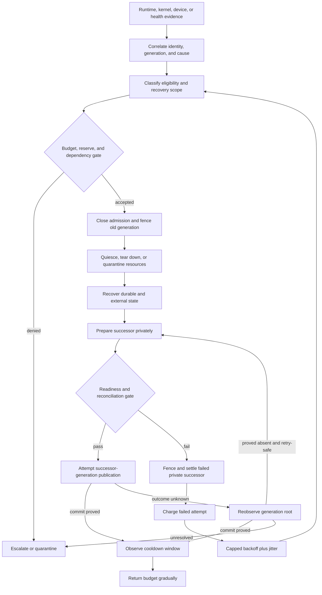
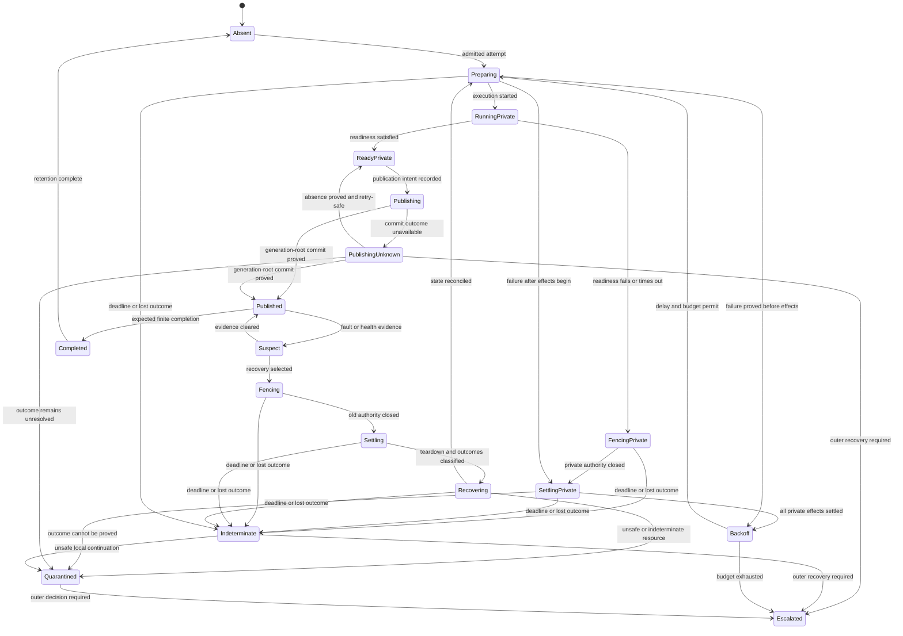

# Supervision and recovery policy

## Question, scope, and operational standard

How should Atom OS preserve OTP's hierarchical supervision while adding the
information and bounds an operating system needs for safe recovery of actors,
domains, resources, and external effects?

This component observes typed termination and fault evidence, decides whether
an instance is eligible for recovery, chooses a recovery scope, sequences
fencing and replacement, meters attempts, and escalates. It does not infer
durable state from process memory, retry unknown effects, reset hardware
without a device capability, or redefine lower-layer teardown.

A native supervisor is satisfactory only when:

1. every child instance and recovery attempt has a distinct generation;
2. the old instance is fenced before a replacement becomes discoverable;
3. restart is admitted against time, attempt, concurrency, and resource
   budgets;
4. persistent and external state is recovered or declared indeterminate
   before readiness;
5. recovery control retains bounded protected capacity during overload; and
6. exhausted local policy reaches an authority outside the failed subtree.

The report specifies a target; it does not claim an implemented supervisor or
measured recovery bound.

## Evidence and interpretation

The [OTP 29 system-services
documentation](../../30-sources/erlang-otp-team-2026-otp-29-0-6-system-services-documentation.md)
provides exact child restart types, restart strategies, ordered shutdown,
restart intensity, and significant-child semantics. Those are valuable
compositional behaviors, but an operating system must additionally handle
domain fencing, finite resources, external outcomes, and non-cooperation.

[Crash-only software](../../30-sources/candea-fox-2003-crash-only-software.md)
and [microreboots](../../30-sources/candea-et-al-2004-microreboot.md) support
small recovery units and uniform start/recover paths. Their benefits depend on
separating durable state and requests from volatile execution. [Exponential
backoff and jitter](../../30-sources/brooker-2015-exponential-backoff-jitter.md)
shows why synchronized retries amplify contention and why capped randomized
delay reduces correlated work; it is engineering evidence, not a proof of
stability for arbitrary services.

[Armstrong](../../30-sources/armstrong-2003-making-reliable-distributed-systems.md)
supports links, monitors, failure isolation, and supervisor trees. The Atom OS
synthesis retains these relationships but treats “let it crash” as permission
to replace disposable execution only after state, authority, and effects have
explicit recovery rules.

## Recommended recovery architecture

The supervisor and child are separate failure domains when the threat model
requires recovery from memory corruption or non-cooperation. For a lightweight
actor failure, the supervisor may reside in the same runtime domain; the
manifest must make that weaker containment explicit. At every boundary, an
outer holder owns enough authority and reserved capacity to fence and recreate
the inner supervisor.

### Child specification

A native `RecoverySpec` includes:

- stable child identity, artifact and compatibility profile;
- expected finite or continuous lifecycle;
- restart eligibility by exit/fault class;
- strategy group and ordering position;
- maximum attempts and weighted failure cost in rolling windows;
- base/cap delay, jitter policy, cooldown, and quarantine duration;
- concurrent-recovery and protected-resource reserve;
- teardown, quiescence, and safe-reclamation requirements;
- durable-state recovery profile and outstanding-effect reconciliation;
- required dependency generations and readiness predicate;
- escalation route and evidence retention; and
- whether operator authorization can clear quarantine.

The supervisor compiles this specification before child start. Invalid
combinations—such as permanent recovery without any finite budget, a recovery
holder inside the domain it must destroy, or a readiness check that requires
the unavailable child itself—fail manifest validation.

## Recovery protocol and states

Termination evidence includes actor/domain identity, incarnation, runtime and
kernel reason, last accepted operation sequence, mailbox/resource counters,
fault address only when authorized, and causal references. A monitor event is
a typed observation. It is not proof that DMA ceased, a durable transaction
aborted, or a remote peer discarded a request.

Recovery proceeds in five separately recorded phases:

1. **Fence:** close old admission and revoke or generation-fence usable
   authority at every sink.
2. **Settle:** drain known completions, finish lower-layer teardown, and
   quarantine anything whose safe reuse is unproved.
3. **Recover:** reconstruct state from the last valid durable point and
   reconcile accepted or indeterminate operations.
4. **Prepare:** start the successor privately with fresh capabilities,
   queues, timers, and incarnation.
5. **Publish:** expose the successor only after dependency and readiness
   evidence matches the new generation.

Every phase has a deadline and an outcome. A timeout becomes
`Indeterminate`, not a fictional failure. Policies may escalate on that state
but may not blindly retry an irreversible effect.

## Strategy and compatibility profiles

The native supervisor can retain `one_for_one`, `one_for_all`, and
`rest_for_one` as recovery-scope declarations. Restarting a group still fences
and privately prepares generations rather than exposing children one by one.
Dependency-aware services should prefer the lifecycle graph in component 3;
strategy order alone is not a complete dependency model.

The strict OTP adapter preserves:

- `permanent`, `transient`, and `temporary` restart types;
- immediate synchronous child start, terminate, restart, and delete behavior;
- ordered shutdown and the exact strategy scope;
- the documented “more than `MaxR` restarts in `MaxT`” intensity rule; and
- `auto_shutdown` and significant-child behavior, including exclusions for
  manual termination and sibling-strategy termination.

It must not insert invisible health gates, jitter, asynchronous activation, or
different intensity counting while claiming exact semantics. A deployment can
wrap the strict subtree in a native outer supervisor whose policy is visible.

## Recovery budgets, backoff, and overload

Restart intensity answers whether a historical pattern is excessive; it does
not reserve the CPU, memory, I/O, or control messages needed to recover. Native
policy therefore uses four coupled limits:

- a weighted attempt budget per child and failure group;
- a maximum number of concurrent recoveries per resource domain;
- a protected resource reserve not borrowable by ordinary workload; and
- a controller-wide storm budget that prevents many independent trees from
  synchronizing into an outage.

Delay uses capped exponential backoff with full or decorrelated jitter.
Budgets and delay reset slowly after an observed stable cooldown, not
immediately after a process reaches `Running`. Critical control services can
use shorter caps, but never infinite zero-delay retries. If recovery is denied,
already healthy services retain resources and the failed child becomes
degraded, quarantined, or escalated according to manifest policy.

## Failure and security analysis

- **Restart loop:** weighted budgets, jitter, cooldown, and causal grouping
  prevent one deterministic bug from monopolizing recovery capacity.
- **Supervisor failure:** an outer holder owns the authority to fence and
  recreate the entire subtree. The supervisor cannot mint that authority.
- **State corruption:** readiness requires a named recovery procedure and
  schema. A fresh actor over corrupt durable state is not recovered.
- **Stale child:** service references and effect requests carry the child
  generation; sinks reject the fenced instance.
- **Cascading strategy:** group restart first closes group admission, reserves
  the complete replacement budget, and publishes a consistent generation.
- **Malicious evidence:** health reports are authenticated observations but
  cannot enlarge authority or override kernel terminal records.
- **Operator abuse:** clearing quarantine or changing budgets requires a
  narrowly scoped capability and produces durable audit evidence.
- **Recovery exhaustion:** control resources are finite and protected; on
  exhaustion the supervisor fails closed and escalates rather than allocating
  opportunistically.

## Implementation and verification program

Stage 0 builds a deterministic model of two nested supervisors, all three
strategy types, expected completion, a failed recovery, and an indeterminate
effect. Model checks cover unique published generation, no pre-fence successor,
bounded attempts, and eventual escalation.

Stage 1 implements hosted supervisors over virtual time and injected monitor,
storage, and teardown results. Stage 2 connects real managed runtimes and
protected domains, then measures fence-to-ready recovery while ordinary queues
are saturated. Stage 3 adds durable recovery records, device/network
reconciliation, and operator quarantine controls. Strict OTP traces are tested
separately against the pinned OTP release.

Fault injection must hit every transition, durable record, reply loss, and
timer edge. Other cases include simultaneous sibling failures, supervisor
failure during group restart, clock discontinuity, dependency flapping,
insufficient reserve, stuck teardown, stale completion, invalid child spec,
and a malicious child fabricating health. Measurements include maximum
recovery memory, controller CPU, control-lane latency, storm convergence, and
false escalation rate.

## Supported decisions and open questions

The evidence supports hierarchical recovery, small restart units, explicit
eligibility and state reconstruction, generation fencing, finite attempt and
resource budgets, jittered delay, cooldown, quarantine, and outer escalation.
It does not choose universal numeric defaults or prove that restart is correct
for any particular service.

Open questions include the right budget algebra for dependent services, which
health failures justify automatic replacement, how to share recovery reserve
on small devices without priority inversion, and which OTP timing behaviors
the first compatibility profile must reproduce exactly.

## Connections

- [OTP-like system services layer](../otp-like-system-services-layer.md)
- [Behaviour engines and capability-gated management](behaviour-engines-and-capability-gated-management.md)
- [Application lifecycle and dependency orchestration](application-lifecycle-and-dependency-orchestration.md)
- [Teardown, revocation, and safe reclamation](../minimal-privileged-kernel-components/teardown-revocation-and-safe-reclamation.md)
- [OTP-like system services map](../../10-maps/otp-like-system-services.md)

## Sources

- [OTP 29 system-services documentation](../../30-sources/erlang-otp-team-2026-otp-29-0-6-system-services-documentation.md)
- [Making reliable distributed systems in the presence of software errors](../../30-sources/armstrong-2003-making-reliable-distributed-systems.md)
- [Crash-only software](../../30-sources/candea-fox-2003-crash-only-software.md)
- [Microreboots](../../30-sources/candea-et-al-2004-microreboot.md)
- [Exponential backoff and jitter](../../30-sources/brooker-2015-exponential-backoff-jitter.md)
