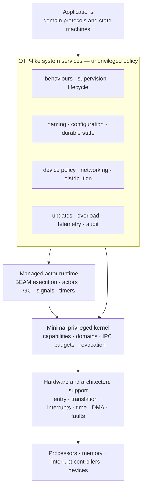
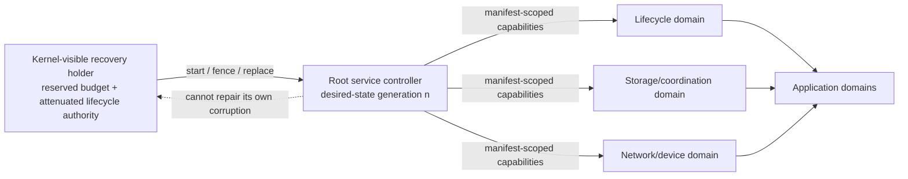
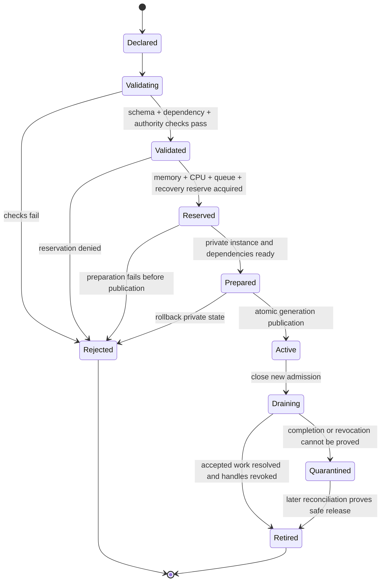
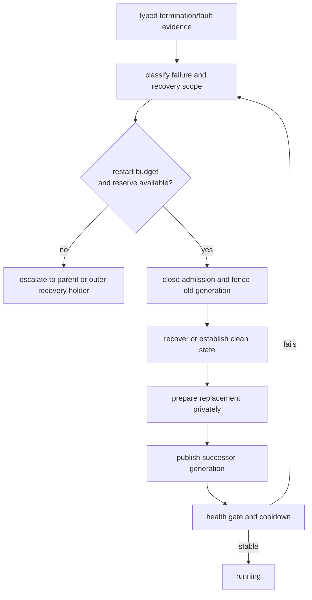
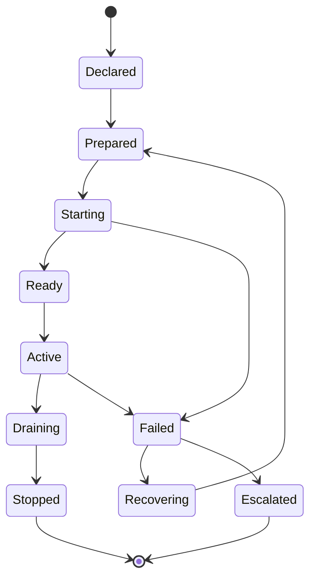
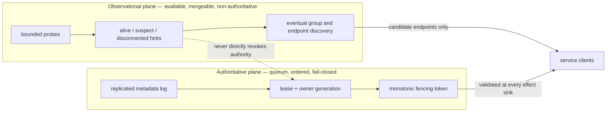
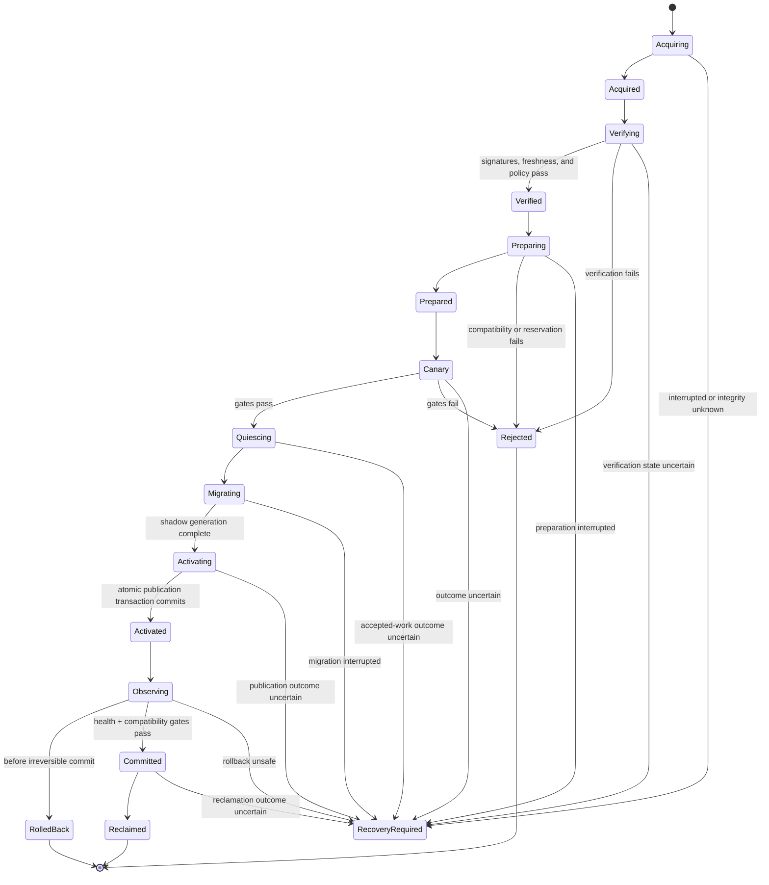
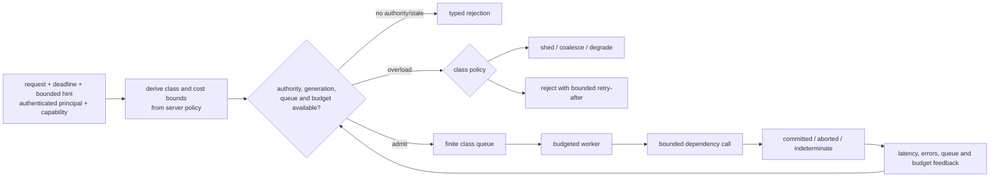
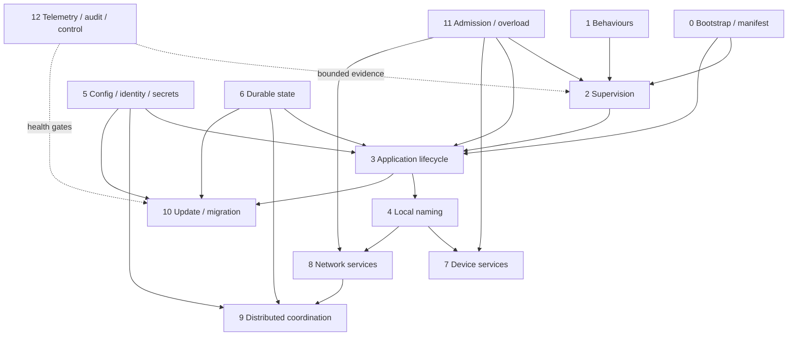

# OTP-like system services layer: architecture, evidence, and implementation plan

## Executive conclusion

Atom OS should implement the OTP-like system-services layer as a collection of
ordinary, unprivileged managed actors and replaceable protected service
domains. It should not be one privileged service manager, a second kernel, or
a copy of every facility currently shipped in Erlang/OTP. Its job is to turn
the managed runtime's mechanisms—spawn, signals, monitors, timers, code
publication, resource accounting, and capability-mediated calls—into reusable
operational policy.

The recommended initial architecture has thirteen components:

| # | Component | Recommended initial implementation |
| ---: | --- | --- |
| 0 | Service-domain bootstrap and manifest controller | A small desired-state reconciler started from a sealed, versioned manifest by an independent recovery holder |
| 1 | Behaviour engines and management protocol | Library-level server, state-machine, event, and cooperative-management protocols with capability-gated control |
| 2 | Supervision and recovery policy | Hierarchical supervisors with explicit restart scope, intensity, backoff, recovery reserve, and escalation |
| 3 | Application lifecycle and dependency orchestration | Transactional prepare/activate/drain/stop state machines over a validated dependency graph |
| 4 | Naming, registry, and local discovery | Incarnation-aware local registries that publish attenuated service handles atomically and never treat names as authority |
| 5 | Configuration, workload identity, and secrets | Immutable configuration snapshots plus short-lived workload credentials delivered through separate least-authority channels |
| 6 | Durable state and outcome recovery | Append-only write-ahead records, immutable checkpoints, idempotency records, explicit commit outcomes, and recovery workers |
| 7 | Device-service policy and management | Per-device service domains over lower-layer capabilities, typed request lifecycles, reset generations, and indeterminate-completion ledgers |
| 8 | Network endpoint and protocol services | Capability-scoped bind/connect/listen operations, bounded sessions, authenticated peers, deadlines, and explicit delivery uncertainty |
| 9 | Distributed membership, discovery, and coordination | Separate weakly consistent observation from quorum-backed authoritative metadata, leases, and monotonically increasing fencing tokens |
| 10 | Release, update, rollback, and state migration | Signed content-addressed artifacts with prepare, canary, quiesce, migrate, activate, commit, and explicitly bounded rollback |
| 11 | Admission, overload, and service-resource governance | Finite queues, hierarchical budgets, deadline-aware admission, backpressure, shedding, degradation, and restart-storm control |
| 12 | Observability, audit, alarms, and operator control | Separate lossy telemetry, bounded crash evidence, persistent alarms, and tamper-evident audit with capability-scoped operations |

These components form a policy layer. The privileged hardware/architecture and
minimal-kernel layers jointly enforce memory, CPU, capability, interrupt, DMA,
and protected-domain isolation: the minimal kernel owns typed authority and
object lifecycles, while architecture support executes the privileged
mechanisms. The managed actor runtime alone owns BEAM execution,
process-local tracing collection,
mailboxes, actor scheduling, links, monitors, aliases, timers, and compatible
code execution. System services decide what to start, what to name, when to
retry, which state is authoritative, how to degrade, and how to update.

The central design rule is:

> Observation, authority, durability, and recovery are different contracts.

A monitor exit is an observation, not proof that an external effect did not
happen. A service name is a routing key, not identity or authority. A liveness
probe is suspicion, not a membership decision. A restarted actor is fresh
execution, not recovered state. A replicated log is authoritative only under
its quorum and stable-storage assumptions. The layer must preserve these
distinctions in its APIs and evidence.

## Question, scope, and operational standard

The research question is:

> What is the smallest unprivileged system-services architecture that carries
> the useful OTP principles into Atom OS while providing explicit security,
> overload, durability, distribution, and update contracts?

This report covers service lifecycle, behaviours, supervision, naming,
configuration and identity, persistent state, device and network service
policy, distributed control, release orchestration, resource governance, and
operations. It does not redesign the BEAM instruction set, actor runtime,
microkernel, hardware abstraction, application protocols, filesystems, or
individual device and network stacks.

A candidate implementation meets the operational standard only when it:

1. runs entirely outside the privileged kernel and survives replacement
   without changing the kernel ABI;
2. starts from a versioned authority, resource, dependency, and compatibility
   manifest whose validation is reproducible;
3. gives every service instance, published endpoint, durable transaction,
   remote session, and update attempt an unambiguous generation;
4. distinguishes request rejection, acceptance, commit, abort, indeterminate
   outcome, fencing, and cancellation rather than mapping all failures to
   time-out;
5. contains a failed or compromised service at its actual protected-domain and
   capability boundary;
6. remains recoverable when the failed service included its own supervisor,
   registry, configuration consumer, logger, or update worker;
7. defines availability and consistency under process failure, domain failure,
   reboot, storage loss, network partition, quorum loss, credential expiry,
   and operator error;
8. prevents overload from turning into unbounded queues, synchronous logging
   stalls, retry amplification, or restart storms;
9. supports signed, staged, observable updates with compatible state
   transitions and an honest point of no return; and
10. passes deterministic model tests, crash and partition injection,
    power-loss recovery, conformance tests, and measured resource budgets on a
    simulator and a physical target.

The design below is therefore a research-backed proposal, not implementation
evidence. The companion
[inquiry](../40-inquiries/what-contract-should-the-otp-like-system-services-layer-provide.md)
keeps that distinction open.

## Placement in the Atom OS architecture



The downward arrow from services to the kernel is deliberately narrow.
Protected service domains use capabilities for endpoints, memory, scheduling
contexts, device bindings, and lifecycle operations; they do not issue
unmediated policy commands. Most service actors run inside a managed runtime
domain. A driver, storage engine, credential broker, or network stack may use a
separate native or managed protection domain when corruption, latency, or
authority warrants it.

### Privilege, authority, and failure boundaries

“System service” describes responsibility, not CPU privilege. A registry may
be authoritative for a namespace while remaining an unprivileged process. A
device manager may hold an exclusive device capability without being trusted
with unrelated memory. The update service may authorize one signed artifact
without gaining a general code-publication capability.

The proposed failure boundaries are:

- an ordinary behaviour actor, supervisor subtree, or application bundle;
- a managed runtime domain containing many actors;
- a dedicated storage, driver, network, identity, or update domain;
- a coordination cell spanning a deliberately scoped set of machines;
- the minimal kernel and architecture boundary; and
- the physical machine or power domain.

A supervisor cannot recover corruption in its own runtime or kernel. A root
service controller cannot reliably restart itself after its domain is gone.
Each critical service therefore needs a recovery holder outside its failure
boundary, with a sealed manifest, reserved CPU and memory, and narrowly
attenuated authority to stop the old generation and start a successor. No
ordinary service can broaden that escrow.



### Host and threat assumptions

The first implementation should state these assumptions rather than inherit
them silently:

- local protection assumes the minimal kernel correctly enforces capability,
  memory, CPU, and device isolation;
- managed actors inside one runtime domain are language-isolated, not isolated
  from a compromised runtime, JIT, or trusted in-process native extension;
- initial distributed algorithms tolerate crash, omission, delay, duplication,
  reordering, and partition faults, not Byzantine participants;
- mutually authenticated transport establishes peer workload identity, not
  authorization or honest behaviour;
- quorum metadata requires a majority and working stable storage;
- wall clocks can jump or drift; safety leases and deadlines use monotonic
  time plus explicit uncertainty bounds;
- a timeout is local evidence that a deadline passed, not proof that the peer
  did nothing;
- power loss can interrupt any durable write unless the selected storage
  profile proves stronger atomicity; and
- hardware or firmware may leave a device request indeterminate until reset or
  device-specific reconciliation proves an outcome.

## What is inherited, retained for compatibility, and changed

| Concern | Principle retained | Existing OTP/ERTS mechanism | Atom OS decision |
| --- | --- | --- | --- |
| Behaviours | Protocol engines separate generic control flow from callbacks | `gen_server`, `gen_statem`, `gen_event`, `sys` | Preserve selected behaviour semantics in explicit compatibility adapters; capability-gate management and use a separate native event bus for isolated bounded subscribers |
| Supervision | Failure observation is separated from restart policy | Hierarchical supervisors, strategies, restart intensity | Preserve hierarchy and scope; add backoff, budgets, recovery reserve, typed evidence, and outer-domain recovery |
| Applications | A bundle has lifecycle ownership and dependency metadata; a supervised root is the preferred native profile | Application controller/master, optional top process, library applications, and `.app` metadata | Use immutable manifests and transactional lifecycle states; require a supervisor for native managed bundles while adapting the broader OTP forms |
| Names | Stable logical names resolve ephemeral actors | Local registration, `via`, `global`, `pg` | Keep local lookup pluggable; separate unique ownership from eventual discovery and return attenuated handles |
| Configuration | Defaults and deployment values are separated from code | Application environment and system configuration | Publish validated immutable snapshots; separate secrets and identity from ordinary configuration |
| Persistent state | Stable storage can support recovery | OTP does not prescribe one system transaction model | Provide explicit local durability and outcome protocols; never infer durability from supervision |
| Device policy | Drivers and servers can be supervised | Ports, drivers, host OS devices | Put device policy in isolated services over typed lower-layer capabilities and reset generations |
| Networking | Processes communicate through message protocols | Sockets and distributed Erlang | Use authenticated, capability-scoped endpoints, bounded flow control, explicit acceptance/outcome semantics, and optional compatibility gateways |
| Distribution | Location transparency is useful within declared limits | Mutually trusted connected nodes; standard visible-node operation and `global` commonly assume full connectivity, while hidden nodes, `connect_all = false`, direct links, and scoped `pg` groups permit partial topologies | Separate observation, discovery, authoritative coordination, and placement; remove cookie-based ambient authority |
| Releases | Change is staged and state transitions are explicit | Release handler, `appup`, two code versions, `code_change` | Use signed content-addressed artifacts, health gates, canaries, persistent ledgers, and explicit irreversible boundaries |
| Operations | Structured events and crash reports aid recovery | Logger, `proc_lib` crash reports, legacy SASL-compatible events, alarm handler | Separate lossy telemetry, persistent alarm state, bounded crash evidence, and durable security audit |

The current official
[OTP 29.0.6 system-services documentation](../30-sources/erlang-otp-team-2026-otp-29-0-6-system-services-documentation.md)
is the compatibility vocabulary, not proof that its implementation or trust
model should be copied. In particular, standard distribution's ambient node
trust, `global`'s topology assumptions, mutable application environment,
best-effort logging, and node-local releases are not the security,
transaction, or cluster-control contracts proposed here.

## Cross-cutting architectural invariants

### Identity, names, authority, and generations stay distinct

Local and remote references need different proofs. Every long-lived reference
should carry enough information to reject a stale incarnation:

```text
LocalServiceRef = {
  scope,
  logical_name,
  instance_id,
  service_generation,
  endpoint_capability,
  protocol_profile,
  registry_revision
}

RemoteServiceRef = {
  scope,
  logical_name,
  instance_id,
  service_generation,
  candidate_endpoints,
  expected_peer_identity,
  trust_domain,
  credential_policy_revision,
  protocol_profile,
  catalog_revision,
  catalog_freshness,
  route_capability,
  lease_id?,
  fencing_proof?,
  expiry?
}
```

A logical name is human and configuration-facing. An instance identifier names
one execution. A service generation orders replacement. A protocol profile
states compatible messages. A local endpoint or route capability is an opaque,
unforgeable handle whose transfer constrains allowed operations, not a trusted
string in the descriptor. A registry or catalog revision orders directory
state. A remote peer identity constrains authentication; it does not grant
authority. Optional lease and fence proofs are required only for operations
that claim authoritative ownership. None substitutes for another.

Local runtime or node incarnation, a distributed coordination term, a storage
epoch, a device reset generation, and an update generation are also separate.
Collapsing them into one “epoch” makes stale acceptance likely.

### Reserve, prepare, publish, drain, and retire

Creation and replacement follow one reusable lifecycle:



Publication is the linearization point at which clients may observe a new
generation. Preparation must remain private. Retirement requires drainage,
revocation, or durable quarantine of anything that can still complete.

### Outcome states are part of every effectful API

An effectful request needs more than `ok | error | timeout`. Cancellation is
a protocol transition, not an interpretation of time-out:

| Outcome | Meaning | Safe caller response |
| --- | --- | --- |
| Rejected | No operation-specific reservation or effect was admitted | Correct and retry only if policy permits |
| Accepted | A named generation owns the request; completion is not yet known | Wait, query by operation ID, or cancel through its explicit protocol |
| Cancel requested | The service has accepted a cancellation race; effect status is still unknown | Await a terminal proof; do not report cancellation yet |
| Cancelled before commit | The service proves the operation can no longer commit | Release request state or retry only if the original intent remains valid |
| Committed | The service can prove the specified effect and return its result at the declared durability profile | Record and continue |
| Aborted | The service can prove the effect did not commit | Retry under a new or retained idempotency key |
| Indeterminate | Admission or effect may have occurred, but proof is unavailable | Reconcile; never blindly replay a non-idempotent effect |
| Fenced | The requester or service generation is stale | Resolve a current handle and reassess intent |

The [Birrell–Nelson RPC analysis](../30-sources/birrell-nelson-1984-remote-procedure-calls.md)
already shows why communication failures make remote outcomes ambiguous.
[RIFL](../30-sources/lee-et-al-2015-rifl.md) demonstrates one restricted route
to retryable requests by coupling unique request IDs, completion records, and
object movement; it does not make arbitrary external effects exactly once.

### Restart, recovery, retry, and takeover are separate

- **Restart** creates a new execution instance.
- **Recovery** reconstructs valid state from durable evidence or a known clean
  initial state.
- **Retry** resubmits an intent under explicit idempotency semantics.
- **Takeover** transfers authoritative ownership and must fence the old owner
  at every external effect sink.

[Crash-only software](../30-sources/candea-fox-2003-crash-only-software.md) and
[microreboots](../30-sources/candea-et-al-2004-microreboot.md) support cheap,
small-scope restarts only when persistent state, dependencies, and requests are
designed for them. They do not justify retrying arbitrary effects or discarding
indeterminate work.

### Control paths have reserved resources

Supervision, cancellation, fault reporting, lease renewal, quiescence, and
teardown must not compete only in the same queues and budgets as ordinary
load. Each service manifest reserves bounded recovery CPU, memory, capability
slots, and control-queue capacity outside the workload's reach. Reserved
capacity is itself bounded and charged to the owning service domain.

## Proposed components

Each summary below is expanded in the [OTP-like system services component
index](otp-like-system-services-components/README.md), with one detailed
evidence, architecture, implementation, and verification report per component.

### [0. Service-domain bootstrap and manifest controller](otp-like-system-services-components/service-domain-bootstrap-and-manifest-controller.md)

**Responsibility.** Convert a validated desired-service manifest and a fixed
delegation envelope into running, capability-confined service domains and
continuously reconcile observed local state with declared state.

**Recommended implementation.** Use a small event-driven controller, started
by an external recovery holder, with an append-only transition ledger. The
minimal-kernel boot authority manifest separately creates that holder and its
initial capability/resource envelope. The unprivileged desired-service
manifest is immutable and content-addressed, names the boot/delegation manifest
identity it expects, and can only select, attenuate, or redistribute authority
inside that envelope. Changing the root envelope is a separate boot-authority
workflow, not an ordinary service rollout. The service manifest declares:

- service bundle and protocol versions;
- dependency edges and readiness conditions;
- protection-domain placement and runtime profile;
- input capabilities and the exact attenuated facets to derive;
- CPU, memory, queue, storage, logging, and recovery reserves;
- supervisor, restart, backoff, and escalation policy;
- configuration, identity, and secret selectors;
- state schema and recovery procedure;
- health and overload contracts; and
- artifact signatures and update compatibility.

The controller validates the complete graph before changing public state,
detects cycles unless an explicitly modeled rendezvous breaks them, reserves
resources, prepares services privately, and atomically publishes a generation.
It converges idempotently after controller restart by comparing manifest
revision, protected-domain evidence, transition ledger, and registry
publication.

**Boundary.** The controller may derive only capabilities delegated by the
boot authority. It cannot forge device, storage, namespace, or application
authority. Its own recovery holder is outside its runtime domain.

**Failure rule.** A controller timeout does not mean the child failed. It
queries the operation ledger or leaves the transition indeterminate. A
partially prepared service is not discoverable.

The desired-state idea is consistent with
[Borg's reconciliation architecture](../30-sources/verma-et-al-2015-borg.md),
but Atom OS needs a far smaller local controller and cannot infer embedded
footprint or kernel suitability from a datacenter cluster manager.

### [1. Behaviour engines and capability-gated management](otp-like-system-services-components/behaviour-engines-and-capability-gated-management.md)

**Responsibility.** Provide reusable protocol engines for serialized services,
explicit state machines, asynchronous workers, fanout, and cooperative
inspection without moving application callbacks into the kernel or runtime.

**Recommended implementation.**

- A `gen_server`-like engine owns mutable state in one actor and supports
  correlated calls, one-way casts, continuation, and absolute deadlines.
- A `gen_statem`-like engine represents state, event type, transition,
  deferred reply, postponement, and timers explicitly.
- An OTP-compatible `gen_event` adapter retains one manager's documented
  sequential handler behavior: `sync_notify` returns only after every handler
  runs, and a slow handler can delay the manager. It makes no false
  resource-isolation claim.
- The native system event bus is a different API: one small routing actor plus
  isolated subscriber actors and finite per-subscriber queues. A slow
  subscriber cannot execute inside the publisher or block unrelated
  subscribers; asynchronous acceptance, loss, backpressure, and
  acknowledgement are declared per event class.
- A common management protocol offers inspect, suspend, resume, drain,
  snapshot, change-code, and terminate operations. Every operation requires a
  target- and action-specific capability and emits an audit event.
- An OTP-compatible `sys:terminate` success reports request acceptance, not
  terminal process evidence. The management adapter waits for a monitor or
  protected-domain terminal record before reporting completed termination.
- Cooperative management has a deadline. If a service is stuck, the caller
  escalates to the kernel-visible lifecycle holder rather than assuming
  cooperation.

**Semantic cautions.** A call deadline stops the caller waiting; it does not
cancel accepted service work. A cast has no acknowledgement. Cleanup callbacks
are useful but cannot be the only correctness path because abrupt termination
can bypass them. Postponed state-machine events need quotas or diagnostics to
avoid permanent starvation. OTP-compatible `sys:suspend` continues servicing
system messages while ordinary messages can accumulate; it is neither
admission close nor quiescence, and any native bounded-mailbox divergence must
be explicit in the compatibility profile.

### [2. Supervision and recovery policy](otp-like-system-services-components/supervision-and-recovery-policy.md)

**Responsibility.** Observe termination, select recovery scope, sequence
shutdown/start, rate-limit attempts, and escalate when local policy is
exhausted.

**Recommended implementation.** Preserve the OTP hierarchy and
`one_for_one`, `one_for_all`, and `rest_for_one` concepts, but make the
following explicit in each child specification:

- restart eligibility, finite-completion semantics, and any significant-child
  auto-shutdown trigger;
- recovery procedure and persistent-state profile;
- restart intensity, exponential backoff, jitter, and cooldown;
- maximum concurrent recoveries and reserved recovery resources;
- dependency health needed before restart;
- teardown proof or quarantine requirement;
- failure classification and causal evidence reference; and
- escalation target outside the supervised failure boundary.

These additions define the native Atom OS supervisor policy. An OTP
compatibility adapter separately preserves the declared child restart types,
immediate and synchronous restart/start/stop behavior, and exact “more than
`MaxR` restarts in `MaxT`” counting. It must not insert hidden backoff,
jitter, health gating, or resource-policy outcomes and still claim identical
OTP timing. Deployments select the compatibility or native policy explicitly.

The strict adapter also preserves OTP's exact significant-child rules. The
default `auto_shutdown = never` rejects significant children.
`any_significant` triggers when one qualifying significant child terminates by
itself, while `all_significant` triggers after the last such child. A
`transient` significant child qualifies after a normal or shutdown exit but is
restarted after an abnormal exit; a `temporary` significant child qualifies
after any exit; and a `permanent` significant child is invalid. Manual child
termination and termination caused by a sibling restart strategy do not count
as automatic-shutdown triggers. Native policy may offer a different typed
finite-work abstraction, but it must not present that extension as OTP
compatibility.



OTP's documented ordered startup, reverse shutdown, strategy scopes, and
restart intensity are strong compositional defaults. Their synchronous
supervisor operations also show why child start/stop must have deadlines and
why a supervisor needs a non-cooperative escape path. Restart intensity alone
is not overload control; repeated failures must consume a separate recovery
budget.

### [3. Application lifecycle and dependency orchestration](otp-like-system-services-components/application-lifecycle-and-dependency-orchestration.md)

**Responsibility.** Manage a deployable bundle's dependencies, lifecycle root,
readiness, configuration, health, drain, and stop semantics. Native Atom OS
managed bundles use a root supervisor. An OTP compatibility adapter also
supports applications whose top process is not a supervisor and library
applications with no callback process.

**Recommended implementation.** Compile the validated manifest into a directed
acyclic activation plan. Independent dependencies may prepare concurrently;
publication follows declared readiness barriers. This is the native controller
and the basis for an `ensure_all_started`-like operation. The
`application:start` compatibility adapter only checks that required
applications are already running and reports `not_started`; it does not
silently traverse and start the dependency graph. Each bundle uses:



The externally visible states are generation-tagged and persisted when they
control durable or distributed ownership. Start rollback stops only resources
created by that attempt; it does not claim to undo external effects. Health
signals are typed:

- **process alive** — the actor or domain has not produced terminal evidence;
- **ready** — the service can accept its declared operation class;
- **degraded** — service continues under an explicit reduced contract;
- **draining** — new admission is closed while accepted work resolves; and
- **failed** — a declared invariant or required dependency is unavailable.

This `Ready` barrier is a native Atom OS lifecycle contract, not an implicit
OTP promise. In the strict OTP adapter, `application:start/1,2` completes when
the documented application callback and application-master startup sequence
has succeeded; the adapter must not wait for an undeclared health probe or
reinterpret callback success. An OTP-shaped bundle may opt into the native
readiness extension explicitly, in which case the different completion
contract is visible in its manifest and API result.

Liveness probes are never allowed to silently become authorization or data
correctness proofs. Application lifecycle is local policy. Cluster placement
uses component 9 and a fencing-aware takeover protocol.

The OTP compatibility adapter records two independent axes. Application
`restart_type` (`permanent`, `transient`, or `temporary`) controls
escalation after termination, including cases where OTP would terminate the
node. The application callback's `start_type` (`normal`, `takeover`, or
`failover`) tells the new instance why it is starting. Atom OS translates
node-wide consequences into an explicitly declared root/service-domain
escalation and does not confuse either axis with the distributed lease and
fencing proof needed for exclusive effects.

Current OTP also associates application membership with the application
master's group-leader tree: stopping the master can terminate associated
processes even when they are not supervised. A compatibility profile must
either emulate that association and `application:get_application/1` behavior
or declare it unsupported. Native bundles use explicit manifest membership and
supervision instead of treating an I/O group leader as an ownership boundary.

### [4. Naming, registry, and local discovery](otp-like-system-services-components/naming-registry-and-local-discovery.md)

**Responsibility.** Resolve stable logical names to current service instances
without turning the namespace into ambient authority.

**Recommended implementation.** Use sharded local registry actors with
single-writer ownership per shard, runtime monitors, atomic
publish-if-generation, and namespace quotas. Local resolve returns an
attenuated `LocalServiceRef`; distributed resolve returns a
`RemoteServiceRef` whose candidate endpoint and expected authenticated
identity are checked when a session is established. Neither is a raw,
universally usable actor identifier.

Supported operations include:

- reserve a name under a namespace capability;
- prepare a binding privately;
- publish only if the expected prior revision and owner generation match;
- resolve with protocol and identity constraints;
- distinguish `CandidateHint(revision, staleness)` from
  `AuthoritativeBinding(revision, lease, fence_proof)`;
- acquire an authoritative binding through a linearizable quorum/barrier read
  or a still-valid, explicitly bounded read lease, never an arbitrary follower
  or cache read;
- acquire a snapshot and watch cursor atomically, then deliver or recover every
  revision after that cursor; after overflow or reconnect, repeat the combined
  snapshot-plus-watch operation rather than leaving a snapshot/watch gap;
- drain and withdraw a generation; and
- garbage-collect a binding only after owner death and handle expiry are
  reconciled.

Lookup and send are racy unless the returned handle is generation-bound and
the receiver checks it. Registered atoms, arbitrary global strings, and
unbounded watcher queues are rejected by quota. Local aliases remain useful
for late-reply suppression but do not prove cancellation.

Unique ownership and group discovery are different abstractions. Eventual
groups and candidate hints may remain available during partitions and merge
afterward; exclusive names require component 9's quorum lease and fencing
proof. A watch notification is a change hint, not proof that a cached
authoritative binding remains current.

### [5. Configuration, workload identity, and secrets](otp-like-system-services-components/configuration-workload-identity-and-secrets.md)

**Responsibility.** Supply validated service settings and authenticated
workload identity while minimizing secret exposure and making rotation
observable.

**Recommended implementation.**

- Configuration is a typed, immutable snapshot identified by content digest
  and monotonically ordered activation revision.
- Sources and precedence are declared in the service manifest; an activation
  transaction validates the complete candidate before publication.
- Snapshot publication is atomic: readers see either the old complete snapshot
  or the new complete snapshot, never a partially published candidate.
  Individual services prepare against that candidate, acknowledge
  compatibility, and adopt it at their own safe point. Mixed active revisions
  can therefore coexist until an explicitly requested coordination barrier or
  quiescence protocol completes; ordinary publication does not imply an
  instantaneous system-wide switch. A watch notification is only a hint to
  fetch and verify the current revision.
- Secrets are absent from ordinary config and logs. A credential broker
  delivers short-lived identity material through a separate protected endpoint
  or file-like capability. JWT-SVID-like tokens carry explicit audiences;
  X.509-SVID-like credentials require a separate authorization policy or
  operation token when audience restriction is needed.
- Workload identity is selected from attested service identity and trust
  domain, not from a mutable display name.
- Authorization remains a local policy decision over identity, requested
  operation, resource, generation, and context.

The [SPIFFE Workload API](../30-sources/spiffe-project-2026-workload-api.md)
provides a useful precedent for local workload credential delivery and
rotation. It does not define Atom OS authorization, bootstrap trust, issuer
availability, or recovery policy.

Credential expiry creates an availability dependency. Each service must
declare which already-established operations may continue, which new
operations fail closed, and how emergency recovery works while the issuer is
unavailable. Long-lived static cluster cookies are not an acceptable substitute.

### [6. Durable state, transactions, and outcome recovery](otp-like-system-services-components/durable-state-transactions-and-outcome-recovery.md)

**Responsibility.** Give services a small, explicit contract for
crash-consistent state and request outcomes without placing a general database
inside the kernel.

The first profile should expose durable journals, immutable snapshots,
content-addressed blobs, and a small transactional metadata namespace. A
POSIX-like file API, database indexes, or application object model can be
implemented later as separate compatibility services. Names, access policy,
quotas, and recovery remain unprivileged; the lower layers expose only the
storage-device, buffer, scheduling, and isolation mechanisms.

**Recommended initial implementation.** Start with one isolated storage
service per persistence domain:

1. assign every WAL record a non-repeating storage-generation/LSN pair and
   frame it with type, transaction ID, payload length, and checksum;
2. represent each transaction with explicit begin/data/commit framing and
   assign every external effect a stable operation ID;
3. make the valid commit record the transaction's local linearization point,
   and force it and all required predecessors according to the declared
   durability profile before acknowledging commit;
4. build checkpoints privately with schema generation, root checksum, and an
   `included_lsn` high-water mark; force their contents before atomically
   publishing a checksummed checkpoint-generation pointer;
5. recover the newest checkpoint whose pointer, contents, and root all
   validate, scan strictly after its `included_lsn`, stop at a malformed or
   torn tail, and apply each validly committed transaction exactly once in log
   order while ignoring uncommitted fragments;
6. record an idempotency result atomically with its state change when
   supporting safe retries; and
7. truncate a WAL prefix only after the checkpoint pointer is durable and a
   retention proof shows that recovery, replicas, readers, and retained
   operation results no longer require it.

Recovery also records the selected storage generation, checkpoint generation,
replay start and end LSNs, and any corrupt tail. Reapplication is keyed by the
transaction/LSN identity rather than by replay timing, so a crash during
recovery can restart the same scan without duplicating pre-checkpoint work.
The atomic-write, flush-ordering, sector, and pointer-publication assumptions
that make these steps true belong to a named device/storage profile and must be
tested with torn writes; a generic `fsync` label is not proof of the protocol.

The stronger retryable-operation profile has additional invariants. A globally
unique logical operation ID survives retry, reconnect, leader change, and
object migration. The server binds that ID to the authenticated principal,
service/protocol generation, operation kind, and request digest; reuse with a
different request is rejected. The state mutation and returned-result record
commit atomically and with the same durability. Routing after placement change
must rendezvous with that retained record. Garbage collection waits for an
authenticated result acknowledgement or a safely expired client lease, and a
client that loses its own request state receives an indeterminate result rather
than a newly fabricated operation. These conditions define a narrow profile;
ordinary actor or network delivery does not gain “exactly once” semantics.

Use copy-on-write or shadow publication for small metadata. Introduce the full
[ARIES](../30-sources/mohan-et-al-1992-aries.md) analysis/redo/undo machinery
only if fine-grained in-place updates and concurrency justify its page-LSN,
compensation-log, and lock assumptions. Simplicity is a safety property for the
first system.

For multi-service workflows, use explicit semantic compensation inspired by
[Sagas](../30-sources/garcia-molina-salem-1987-sagas.md), not a claim of global
atomic rollback. A compensation is another fallible effect and must be
idempotent, authorized, logged, and safe under partial completion.

Durability profiles must state:

- storage medium, write ordering, flush and atomic-sector assumptions;
- single-copy or replicated failure model;
- when acknowledgement becomes durable;
- behavior after torn write, lost device, and checksum failure;
- retention and confidentiality;
- transaction isolation, if any; and
- which external effects remain outside the transaction.

### [7. Device-service policy and management](otp-like-system-services-components/device-service-policy-and-management.md)

**Responsibility.** Turn exclusive device capabilities, queues, interrupts,
DMA mappings, and resets into safe application-facing protocols.

**Recommended implementation.** Assign each device or reset-coupled group to a
dedicated service domain. A small manager derives only profile-approved
register, queue, interrupt, DMA, and reset facets. The driver exposes typed
operations with operation ID, caller generation, device generation, deadline,
buffer authorities, and completion mode.

The lower kernel and architecture layers enforce access and isolation. This
service layer owns:

- device discovery policy and driver selection;
- queue allocation and application admission;
- protocol validation and rate limits;
- completion correlation and retry classification;
- health, power, firmware, and maintenance policy;
- staged driver replacement; and
- reset escalation and post-reset state reconstruction.

[Nooks](../30-sources/swift-et-al-2003-nooks.md), [recovering device
drivers](../30-sources/swift-et-al-2004-recovering-device-drivers.md), and
[CuriOS](../30-sources/david-et-al-2008-curios.md) show benefits and limits of
driver isolation and restart. A driver restart cannot retract a DMA already
accepted by hardware or prove that a device write did not occur. Before
publishing a successor, the manager closes admission, revokes writable aliases,
drains matching completions, and either proves reset/quiescence or preserves a
quarantine ledger.

Every effect sink validates the current device/reset fencing generation.
Fencing in the registry alone is advisory.

### [8. Network endpoint and protocol services](otp-like-system-services-components/network-endpoint-and-protocol-services.md)

**Responsibility.** Provide bounded local network APIs and protocol engines
over isolated drivers without making a connected peer a trusted node.

**Recommended implementation.**

- Bind, listen, accept, connect, resolve, and route operations require
  attenuated endpoint capabilities.
- Connection objects carry local/peer identities, transport generation,
  protocol profile, flow-control window, deadlines, and resource account.
- Protocol parsers run in isolated workers or memory-safe domains with bounded
  input and output buffers.
- Mutual authentication is separate from authorization; accepted peer identity
  is passed to policy without granting ambient spawn, file, device, or registry
  access.
- Backpressure propagates through explicit credits. Each queue defines reject,
  wait, shed, coalesce, or close behavior.
- A send acknowledgement distinguishes local rejection, transport acceptance,
  peer acceptance, and application commit. A disconnect cannot decide an
  application outcome.
- Each peer or application acknowledgement binds the logical operation ID,
  request digest, peer service identity and generation, transport-session
  generation, and exact proof point. An acknowledgement from an old session
  cannot complete new work. The logical operation ID can survive a deliberate
  retry; frame sequence and credit state cannot cross reconnect.
- Reconnection creates a new transport generation and never silently splices
  old requests into a new session.
- The manifest states whether an established session may survive credential
  expiry, trust-bundle redaction, or authorization-policy change and at which
  boundary it must reauthenticate, drain, or close. Credential update streams
  do not retroactively revoke a cryptographic session by themselves.

Standard Erlang distribution can exist as a compatibility gateway inside an
explicitly trusted, capability-confined cell. It must not define the system's
default trust or topology.

The existing [distribution-gateway
report](managed-actor-runtime-components/distribution-gateway-and-remote-actor-semantics.md),
[Birrell–Nelson RPC evidence](../30-sources/birrell-nelson-1984-remote-procedure-calls.md),
and [SPIFFE Workload API](../30-sources/spiffe-project-2026-workload-api.md)
support the session, outcome, and identity boundaries. A concrete secure
channel and application protocol profile remains an implementation decision
and must receive its own source and conformance record when selected.

### [9. Distributed membership, discovery, and authoritative coordination](otp-like-system-services-components/distributed-membership-discovery-and-authoritative-coordination.md)

**Responsibility.** Represent remote observations, discover services, maintain
small authoritative metadata, and transfer exclusive ownership safely during
partitions and recovery.

**Recommended implementation.** Split the distributed control plane:



Use a [SWIM](../30-sources/das-et-al-2002-swim.md)-like probing and
piggybacking service for scalable observations, with suspicion and incarnation
handling. Its weakly consistent membership is not an authorization list.
Represent states such as `observed_alive`, `suspect`,
`transport_disconnected`, `session_expired`,
`administratively_removed(revision)`, and `fenced(generation)` rather than
one Boolean “up”.

Every membership announcement binds an authenticated node or service identity,
fresh boot epoch, membership incarnation, and observation sequence. Receivers
reject older tuples. Removal leaves a tombstone for the declared maximum
message/rejoin interval; if no packet-lifetime bound exists, an unrepeatable
boot epoch and authoritative re-admission prevent delayed traffic from
resurrecting the old instance.

Use a small [Raft](../30-sources/ongaro-ousterhout-2014-raft.md)-style
replicated state machine for authoritative service ownership, metadata
revision, and configuration changes. Under quorum loss, authoritative mutation
fails closed; observational discovery and already-authorized local work may
continue under explicit leases. Membership change uses a proved joint or
equivalent reconfiguration procedure rather than probe results.

A quorum-issued lease is a scoped protocol, not just a duration field. Its
grant binds the coordination cell, resource, owner identity, lease ID,
configuration revision, fencing generation, issuer epoch, and grantor expiry.
The holder uses a conservative local deadline earlier than the grantors'
expiry by the proved clock-drift, scheduling-pause, and communication
uncertainty bound. Renewal uncertainty enters a named `jeopardy` state that
closes new exclusive work and completes quiescence before the holder deadline.
A successor cannot rely on elapsed local time until every possible old-holder
grant has expired under those bounds. If drift or pause cannot be bounded, the
exclusive profile uses a quorum check per operation or fails closed.

[Chubby](../30-sources/burrows-2006-chubby.md) supplies the key operational
lessons: coarse coordination rather than bulk data, session uncertainty,
cache-invalidation discipline, and sequencer/fencing values. A lease holder
must quiesce when its renewal becomes unsafe, and every protected storage,
device, network, and update sink must reject stale tokens.

```text
FenceProof = {
  coordination_cell,
  resource_id,
  owner_identity,
  lease_id,
  configuration_revision,
  issuer_epoch,
  fence_generation,
  authenticator
}
```

Only the current quorum authority can mint an authenticated proof. Fence
generations never wrap or repeat within a resource scope. A sink verifies the
issuer, scope, owner, lease, and configuration, then atomically records the
greatest accepted generation with the protected effect. After sink crash or
reset it recovers that high-water mark, or reloads current authority before
admitting work. A forged high number, a proof for another resource, and a
pre-restart high-water value that the sink forgot are all rejected by design.

When an external sink cannot validate a fence, the service cannot claim
hard-exclusive safety there. It must deny that profile or expose an
indeterminate outcome and use an application-specific idempotency or
reconciliation protocol.

Scope coordination into cells aligned with trust, latency, administrative, and
failure domains. Do not make standard Erlang distribution's default transitive
full-mesh coupling the system's normal topology.
[Partisan](../30-sources/meiklejohn-et-al-2019-partisan.md) and
[Scaling Reliably](../30-sources/trinder-et-al-2017-scaling-reliably.md)
support replaceable overlay topologies and show why global namespaces and
transitive connectivity assumptions constrain scale.

The baseline is crash/non-Byzantine. Mutual TLS and workload identities protect
channels from outsiders but do not make a compromised authorized participant
truthful.

### [10. Release, update, rollback, and state migration](otp-like-system-services-components/release-update-rollback-and-state-migration.md)

**Responsibility.** Authenticate artifacts, decide rollout, coordinate
quiescence and state transformation, preserve a recovery ledger, and define
what rollback can actually restore.

**Recommended implementation.**

1. **Acquire** a signed, content-addressed release manifest and artifacts.
2. **Verify** role, threshold, version, expiry, hash, dependency, compatibility,
   and anti-rollback metadata.
3. **Prepare** code and a shadow state generation privately; validate schemas,
   reserve resources, and record the source generation and migration plan.
4. **Canary** one isolated instance or cell and evaluate declared health and
   resource gates.
5. **Quiesce** new admission and resolve, transfer, or record accepted work.
6. **Migrate** into the shadow generation with a versioned, deterministic and
   idempotently resumable transformer. The durable rollout ledger records each
   input range, output digest, and resume/commit marker; migration never
   modifies the active state generation in place.
7. **Activate** by one local metadata transaction that binds the new registry
   publication, state/schema generation, artifact digest, and migration
   checkpoint. Before that commit, the old generation remains authoritative;
   after it, recovery selects the new generation.
8. **Observe** through a compatibility window in which old and new protocols
   are deliberately supported.
9. **Commit** the irreversible boundary and later reclaim old code/state.
10. **Roll back** only if the ledger proves the old generation, state schema,
    credentials, and external contracts remain valid.



`RecoveryRequired` is resolved from the durable rollout and storage ledgers,
not by rerunning the whole script blindly. Recovery resumes a proved
idempotent private phase, discards an unpublished shadow, selects the
atomically published generation, or stops for operator reconciliation when the
publication or an external effect remains indeterminate.

[Ginseng](../30-sources/neamtiu-et-al-2006-practical-dynamic-software-updating.md)
supports explicit safe update points and state transformers, but its evaluated
single-threaded C programs do not establish actor-system or cluster safety.
[NixOS](../30-sources/dolstra-et-al-2008-nixos.md) supports immutable system
closures, atomic generation selection, and rollback of retained
artifacts/configuration.
Neither rollback reverses already migrated data or external effects.
[The Update Framework](../30-sources/samuel-et-al-2010-tuf.md) informs
compromise-resilient metadata roles and freshness, while deployment-specific
authorization and secure boot remain separate.

Expiry checks require an authenticated, sufficiently trustworthy time source;
anti-rollback checks require a rollback-resistant record of the highest
accepted metadata/artifact versions across reboot. A target lacking either
must fail closed for unattended updates or use an explicit, separately
authorized offline-recovery procedure. Cached wall time and writable service
state alone cannot establish freshness.

OTP release handling is node-local and allows mixed versions. Atom OS should
embrace explicit mixed-version windows rather than promise cluster-atomic code
replacement. Legacy `appup`/`relup` instructions can invoke arbitrary
`{M,F,A}` code; a valid artifact signature authenticates provenance but does
not make that code safe or attenuated. Native migrations therefore use typed,
capability-confined actions, while legacy release scripts run only in an
explicitly trusted compatibility profile with bounded authority and audit.
Purging old code can terminate actors still using it, so reclamation follows
quiescence evidence, not a timer alone.

### [11. Admission, overload, and service-resource governance](otp-like-system-services-components/admission-overload-and-service-resource-governance.md)

**Responsibility.** Keep useful work responsive under excess demand and make
resource policy visible, testable, and distinct from restart policy.

**Recommended implementation.** Each service declares:

- maximum outstanding and queued work by operation class;
- CPU, memory, storage, network, logging, and recovery budgets;
- deadline and priority classes;
- dependency-specific concurrency limits;
- admission response: reject, wait with deadline, shed, coalesce, sample,
  degrade, or close;
- retry budget and server-provided backoff;
- overload state and recovery hysteresis; and
- a protected control/recovery reserve.

[SEDA](../30-sources/welsh-et-al-2001-seda.md) motivates explicit stage
boundaries, finite queues, controllers, and admission. Queue boundaries also
add latency and bookkeeping, so stage only where ownership, independent
control, or isolation justifies it.

[DAGOR](../30-sources/zhou-et-al-2018-dagor.md) contributes call-graph-aware
overload lessons: reject work early, propagate overload, and avoid consuming
downstream capacity on requests unlikely to complete. Atom OS should not copy
application-specific business-priority heuristics into the generic layer.
Nor may it trust a caller's claimed priority or cost: the admission service
derives the effective class from the presented capability, authenticated
principal, operation schema, and current policy, and clamps any caller cost
hint to server-maintained bounds. Per-class reservations, weighted service,
aging or maximum-wait rules, and explicit preemption policy make starvation
and priority inversion measurable rather than accidental.



Supervisors consume this evidence but do not kill healthy services merely
because demand is high. Retry attempts carry a budget and cannot outlive their
original intent deadline. Logging and health checks have independent bounds so
they cannot amplify an incident.

### [12. Observability, audit, alarms, and operator control](otp-like-system-services-components/observability-audit-alarms-and-operator-control.md)

**Responsibility.** Explain service behavior and support authorized operations
without making instrumentation an unbounded dependency or confusing
best-effort telemetry with evidence.

**Recommended implementation.** Use four separate paths:

1. **Telemetry:** structured logs, metrics, and sampled traces through bounded,
   lossy queues with explicit drop counters and per-tenant budgets. Trace ID,
   parent/span ID, sampling decision or probability, and bounded baggage cross
   actor messages, kernel IPC, device requests, and remote protocol calls;
   asynchronous fan-out uses span links rather than inventing a single stack.
   Durations use local monotonic time, while cross-machine ordering records
   clock uncertainty instead of pretending wall clocks are exact. Incoming
   trace fields are size-limited correlation data, never identity, priority,
   or authorization evidence.
2. **Crash evidence:** a bounded actor/runtime fault envelope linked to the
   kernel's sealed protected-domain evidence; collection stays outside the
   failed domain where possible.
3. **Alarm state:** deduplicated set/acknowledge/clear records with owner,
   severity, generation, retention, and bounded cardinality.
4. **Security and control audit:** append-only, durable, access-controlled
   records with hash-chain or forward-integrity protection, sequence-gap
   detection and accounting, and an independently protected export path.

Sensitive control follows an intent/effect/outcome protocol. Before admission,
the controller durably appends an authorized intent containing operation ID,
principal, capability facet, target and generation, request digest, and policy
revision. The effect sink accepts only that bound intent and returns a
generation-bound outcome, after which the audit service appends completion or
an explicit indeterminate result. When audit intent storage is unavailable or
its reserved capacity is exhausted, new sensitive actions fail closed. Export
failure consumes a bounded local reserve and raises a persistent alarm; once
the reserve reaches its safety threshold, admission also closes.

A general external effect and a separate audit log cannot be made atomic by
wording alone. Where the sink and audit ledger share no transaction, recovery
reconciles the durable intent with the sink's operation/result ledger; a crash
between them leaves `accepted` or `indeterminate`, never a fabricated success.
Kernel-enforced emergency actions use the kernel's sealed evidence path and
are later correlated by operation ID rather than bypassing accountability.

[Dapper](../30-sources/sigelman-et-al-2010-dapper.md) shows that low-overhead
distributed traces depend on propagation, sampling, and analysis trade-offs;
sampled traces are not a complete history.
[Secure audit logs](../30-sources/schneier-kelsey-1999-secure-audit-logs.md)
motivate forward-integrity mechanisms against post-compromise rewriting, while
trusted time, availability, key recovery, and endpoint authorization remain
separate obligations.

[DTrace](../30-sources/cantrill-et-al-2004-dtrace.md) supports safe dynamic
observability as a design goal. Operators receive narrow capabilities such as
read health, subscribe to a bounded trace class, drain one service, approve a
release generation, or export one audit range. There is no universal “debug”
authority.

The native telemetry API invokes no arbitrary handler in an emitting service;
it uses bounded asynchronous publication with explicit loss and blocking
behavior. The initial OTP Logger adapter should accept standard events and
route them through that pipeline while excluding arbitrary custom handler
execution from its compatibility profile. A stricter compatibility lane may
invoke handler `log/2` in the emitter as current OTP does, but only as
explicitly trusted code whose blocking, failure, and authority affect that
emitting domain. The two modes must not claim identical resource or ordering
semantics.

## Component relationships and failure propagation



The graph is not a startup order. Bootstrap needs a minimal registry,
configuration reader, storage ledger, and evidence sink before their full
services exist. Those bootstrap implementations use sealed, deliberately
limited profiles and are replaced or adopted after the normal service graph is
active.

| Failure | Local response | What must not be inferred |
| --- | --- | --- |
| Behaviour actor exits | Supervisor classifies evidence and may restart the declared scope | Its durable state is valid or its last request did not commit |
| Supervisor stalls | Outer lifecycle holder revokes or stops its domain after deadline | Cooperative terminate completed |
| Registry shard fails | Rebuild from owners and durable publications; bump shard generation | Every returned old handle is harmless unless receivers fence it |
| Config service unavailable | Continue a pinned valid snapshot or fail closed by declared class | Cached values are current or credentials remain valid |
| Storage service crashes | Recover log/checkpoint and reconcile operation IDs | A timeout means abort |
| Driver crashes | Fence queues, drain or reset, then recover | Hardware did not complete an accepted command |
| Network disconnects | Close transport generation and reconcile outstanding operations | Peer failed or did not process the request |
| Probe suspects peer | Increase evidence and routing caution | Authority or lease is revoked |
| Coordination loses quorum | Stop authoritative mutation; quiesce expiring owners | Minority observations define truth |
| Update worker crashes | Resume from the persistent rollout ledger | Re-running migration is safe without an idempotency proof |
| Telemetry pipeline overloads | Drop/sample under policy and increment durable loss indication | Absence of a log proves absence of an event |

## Implementation program

### Stage 0: executable contracts

- Define service, operation, generation, lease, fence, configuration, artifact,
  and evidence schemas.
- Model lifecycle publication, request outcomes, supervisor escalation,
  registry replacement, lease expiry, update commit, and audit append.
- Pin the initial OTP behaviour and application compatibility profile.
- Declare the local and distributed threat models and storage assumptions.

Exit criterion: model checking or exhaustive state exploration finds no stale
generation acceptance, double publication, post-fence effect, or unsafe reclaim
in the bounded models.

### Stage 1: deterministic single-node service nucleus

- Implement behaviour engines, local registry, supervisor, lifecycle
  controller, immutable config snapshots, finite queues, and structured
  evidence on the deterministic managed runtime.
- Use a volatile in-memory transition ledger with the same outcome schema, but
  never advertise survival across process or machine loss in this profile.
- Inject actor exit, delayed messages, dropped notifications, duplicated
  replies, and controller restart.

Exit criterion: under each declared finite-fault schedule, a fixed manifest
converges to one current publication, and all accepted operations end
committed, aborted, cancelled-before-commit, or explicitly indeterminate.

### Stage 2: protected domains and outer recovery

- Split driver, storage, network, identity, update, and root lifecycle services
  into declared protection domains.
- Bind capability facets and resource accounts from the manifest.
- Implement reserved recovery holders and non-cooperative stop/fence paths.
- Verify that corrupt or stalled service domains cannot exceed authority or
  prevent their own bounded replacement.

### Stage 3: crash-consistent persistence

- Implement append-only WAL, immutable checkpoints, operation-result records,
  recovery scans, checksums, and retention.
- Test torn writes and power loss after every persistence boundary.
- Add saga-style workflow ledgers for selected multi-service operations.
- Benchmark durability profiles rather than advertising one vague “durable”
  mode.

### Stage 4: device and network services

- Implement one simple device service and one bounded network protocol service.
- Exercise generation-bound queues, buffer capabilities, cancellation,
  reconnect, reset, and indeterminate outcomes.
- Integrate workload identity and least-authority policy.
- Prove stale device/network generations cannot affect current service state.

### Stage 5: distributed observation and authority

- Add scoped membership probing and eventual discovery.
- Implement a pinned replicated-state-machine library with tested stable
  storage and membership change.
- Add leases and monotonically increasing fences validated at storage, device,
  network, and update sinks.
- Inject asymmetric partitions, delay, loss, pauses, clock uncertainty,
  delayed old packets, quorum loss, and reconfiguration during recovery.

### Stage 6: releases and operations

- Implement artifact-role verification, staging, canaries, quiescence, state
  migration, compatibility windows, commit, rollback, and reclamation.
- Separate telemetry, crash evidence, alarms, and audit.
- Rehearse recovery from controller, registry, storage, identity, audit, and
  updater failure during every rollout phase.
- Produce an operator runbook whose operations are capability-scoped and
  replayable in the audit ledger.

### Stage 7: compatibility and scale

- Run a representative OTP application subset against the behaviour,
  supervisor, application, config, registry, declared Logger profile, and
  release adapters.
- Scale actors, service domains, queues, nodes, subscriptions, metadata, and
  rollout size while measuring tail latency and recovery interference.
- Repeat on an emulator and at least one physical target.

## Evaluation matrix

| Property | Workload or fault | Required evidence |
| --- | --- | --- |
| Manifest convergence | Controller crash after each reserve/prepare/publish step | Exactly one current generation or an explicit quarantined transition |
| Supervisor containment | Crashing, hanging, and overload-looping children | Correct recovery scope, bounded attempts, maintained recovery reserve |
| Behaviour semantics | Late replies, call timeout, cast, postponed events, stuck callback | No mailbox pollution beyond declared compatibility; timeout never reported as cancellation |
| Registry safety | Concurrent publish, follower/cache read, owner death, watcher loss, stale handle use | Candidate hints are labeled; authoritative reads are linearizable or lease-proved; snapshot/watch has no revision gap |
| Config activation | Invalid snapshot, consumer rejection, service crash mid-switch, barrier failure | Every reader sees one valid complete snapshot; mixed revisions are visible until a declared barrier proves convergence; no partial publication |
| Credential lifecycle | Issuer loss, expiry, rotation, revocation, replay | Declared fail-open/closed behavior and no authority derived from name alone |
| Durable recovery | Torn log/checkpoint at every write boundary | Deterministic recovery to committed prefix or explicit corruption state |
| Retry semantics | Duplicate or same-ID/different-body request before/after commit, migration, result loss, client-state loss, result GC | One effect within the supported profile, retained authenticated result, or explicit stale/indeterminate outcome |
| Device recovery | Driver crash before/after queue admission and hardware completion | No stale-generation submission; safe reset or retained quarantine |
| Network recovery | Disconnect before acceptance, after acceptance, before reply, credential rotation, old-session replay | Correct outcome class, acknowledgement binding, bounded buffers, declared reauthentication, no silent session splice |
| Membership accuracy | Loss, delay, asymmetric partition, pauses, incarnation reuse | Suspicion remains non-authoritative; old messages cannot resurrect instances |
| Coordination safety | Leader/sink crash, quorum loss, reconfiguration, clock/pause uncertainty, stale or forged owner | Linearizable metadata, safe jeopardy/quiescence, authenticated scoped fences, and restart-safe sink high-water state |
| Update safety | Crash/power loss at every rollout transition | Recoverable ledger, valid active generation, honest rollback boundary |
| Overload | Fan-in, dependency saturation, false priority/cost claims, long low-priority load, retry storm, telemetry storm | Bounded queues/memory, useful control latency, server-derived class, measured starvation/priority inversion bounds, explicit shedding |
| Observability | High event rate, handler crash, cross-host trace, audit storage/export loss, crash between control intent and effect | Declared telemetry loss; bounded trace context and clock uncertainty; durable intent/outcome pairing or explicit indeterminate result; protected audit continuity or alarmed gap |
| Security | Compromised app, service, authenticated peer, or operator token | Authority remains within facets; caller-supplied class and trace context confer no authority; sensitive control is durably audited or refused under its declared fail-closed policy |

Performance reporting should include medians only as context. The decision
metrics are high-percentile admission and completion latency, queue residency,
memory per outstanding operation, recovery work, control-path latency under
load, write amplification, restart amplification, false suspicion, quorum
unavailability, and rollout interruption.

## Decisions supported by current evidence

The following are reasonable baselines:

1. Keep every OTP-like service outside the privileged kernel.
2. Retain behaviours and hierarchical supervision as compositional policy
   tools, with capability-gated management and explicit overload semantics.
3. Use immutable, versioned manifests and configuration snapshots.
4. Publish service generations atomically only after private preparation.
5. Treat every accepted effectful request as committed, aborted,
   cancelled-before-commit, or indeterminate; a timeout and a cancel request
   are not terminal cancellation proof.
6. Use a simple WAL plus immutable checkpoints before adopting a full
   transaction manager.
7. Isolate driver, storage, network, identity, and updater authority in
   replaceable service domains where practical.
8. Separate eventual observation/discovery from quorum-backed authoritative
   coordination.
9. Authenticate and scope monotonically increasing fencing proofs, and validate
   them against restart-safe high-water state at every external effect sink.
10. Use signed, content-addressed releases with explicit quiescence,
    migration, compatibility, and irreversible stages.
11. Make admission and degradation sibling policies of supervision rather than
    using restart as the overload controller.
12. Separate lossy telemetry from durable audit and sealed crash evidence.

These are not yet demonstrated on Atom OS.

## Open decisions and falsifiers

- **One root controller or federated controllers.** Start with one small local
  root plus independent recovery. Split it if measurements or authority review
  show a correlated bottleneck or excessive blast radius.
- **Storage engine complexity.** Retain the append-only/checkpoint design unless
  required workloads demonstrate that ARIES-style fine-grained mutation or an
  existing verified engine materially improves the contract at acceptable
  trusted-code and recovery cost.
- **Local registry linearization.** A single writer per shard is preferred.
  Replace it only if measured contention justifies a more complex concurrent
  algorithm without weakening publish/withdraw semantics.
- **Consensus implementation.** Raft is an algorithmic candidate, not
  implementation evidence. Selection requires stable-storage, membership,
  model-testing, footprint, and fault-injection results.
- **Lease timing.** If bounded clock uncertainty cannot be established, owners
  must quiesce conservatively or use per-operation quorum checks; do not claim
  time-based exclusivity.
- **Exactly-once profile.** Support only effects whose result record and state
  mutation share a proved transaction boundary; whose stable request identity
  is bound to principal, operation, digest, and generation; whose retry can
  rendezvous with the retained result after migration; and whose result is
  reclaimed only after acknowledgement or safe lease expiry. Otherwise expose
  at-least-once, at-most-once, or indeterminate semantics explicitly.
- **Live state migration.** Reject or restart across incompatible schemas if a
  transformer cannot be deterministic, bounded, idempotent, and crash-safe.
- **Distributed topology.** Begin with small cells and explicit gateways.
  Broaden only after scale and partition experiments show the security and
  failure semantics remain understandable.
- **Audit protection.** Hash chaining is insufficient if attackers can delete
  the tail, suppress export, or steal keys. The design needs monotonic anchors,
  forward-secure key evolution, remote witnesses, or an explicit weaker claim.
- **Audit/effect coupling.** A durable intent can gate admission, but an effect
  sink outside the audit ledger may still commit before completion is logged.
  Such services need a queryable operation ledger or must expose an
  indeterminate result; they cannot advertise atomic action-and-audit merely
  because both records are durable.
- **OTP compatibility surface.** Compatibility adapters must not silently
  reintroduce ambient distributed authority, unbounded atoms, synchronous
  logger work, or mutable configuration.

## Connection to the wider architecture

The [original BEAM, ERTS, and OTP
synthesis](beam-erts-and-otp-principles-for-a-new-operating-system.md) proposed
this layer. The [managed actor runtime](managed-actor-runtime-layer.md) supplies
the actor, signal, timer, code, and failure-observation mechanisms it consumes.
The [minimal privileged kernel](minimal-privileged-kernel-layer.md) supplies
the protected domains, capabilities, bounded IPC, scheduling contexts, faults,
and teardown enforcement that give services real isolation. The
[hardware and architecture support
layer](kernel-hardware-and-architecture-support-layer.md) owns privileged
entry, translation, interrupts, raw time, DMA, and architecture faults below
that kernel.

The [applications and domain services layer](applications-and-domain-services-layer.md)
remains above this report. Its business protocols, stable domain identities,
schemas, invariants, workflows, compensations, semantic views, collaboration
rules, and user-visible outcomes are not generic system-service policy merely
because they use supervision, behaviours, persistence, or lifecycle services.
Conversely, Layer 5 declares its needs but does not duplicate this layer's
manifest validation, identity/policy, generic durable store, timers, devices,
networking, release orchestration, resource enforcement, telemetry, audit, or
recovery control.

The [OTP-like system-services map](../10-maps/otp-like-system-services.md)
routes through the evidence, and the [research
journal](../50-journal/2026-09-03-otp-like-system-services-deep-dive.md)
records the search and its limits.

## Sources

### OTP semantics and reliability

- [Erlang/OTP 29.0.6 system-services
  documentation](../30-sources/erlang-otp-team-2026-otp-29-0-6-system-services-documentation.md)
- [Making reliable distributed systems in the presence of software
  errors](../30-sources/armstrong-2003-making-reliable-distributed-systems.md)
- [Crash-only software](../30-sources/candea-fox-2003-crash-only-software.md)
- [Microreboots](../30-sources/candea-et-al-2004-microreboot.md)
- [SEDA](../30-sources/welsh-et-al-2001-seda.md)
- [DAGOR](../30-sources/zhou-et-al-2018-dagor.md)
- [Borg](../30-sources/verma-et-al-2015-borg.md)

### Persistence and outcomes

- [ARIES](../30-sources/mohan-et-al-1992-aries.md)
- [RIFL](../30-sources/lee-et-al-2015-rifl.md)
- [Sagas](../30-sources/garcia-molina-salem-1987-sagas.md)
- [Remote procedure calls](../30-sources/birrell-nelson-1984-remote-procedure-calls.md)

### Devices, membership, and coordination

- [Nooks](../30-sources/swift-et-al-2003-nooks.md)
- [Recovering device drivers](../30-sources/swift-et-al-2004-recovering-device-drivers.md)
- [CuriOS](../30-sources/david-et-al-2008-curios.md)
- [Unreliable failure
  detectors](../30-sources/chandra-toueg-1996-failure-detectors.md)
- [SWIM](../30-sources/das-et-al-2002-swim.md)
- [Chubby](../30-sources/burrows-2006-chubby.md)
- [Raft](../30-sources/ongaro-ousterhout-2014-raft.md)
- [PARTISAN](../30-sources/meiklejohn-et-al-2019-partisan.md)
- [Scaling Reliably](../30-sources/trinder-et-al-2017-scaling-reliably.md)

### Identity, updates, and operations

- [SPIFFE Workload API](../30-sources/spiffe-project-2026-workload-api.md)
- [Practical dynamic software updating with
  Ginseng](../30-sources/neamtiu-et-al-2006-practical-dynamic-software-updating.md)
- [NixOS](../30-sources/dolstra-et-al-2008-nixos.md)
- [The Update Framework](../30-sources/samuel-et-al-2010-tuf.md)
- [Dapper](../30-sources/sigelman-et-al-2010-dapper.md)
- [Secure audit logs](../30-sources/schneier-kelsey-1999-secure-audit-logs.md)
- [DTrace](../30-sources/cantrill-et-al-2004-dtrace.md)

### Contextual engineering articles

- [Lukas Larsson, “Erlang/OTP 24
  Highlights”](../30-sources/larsson-2021-erlang-otp-24-highlights.md) —
  historical implementation motivation for process aliases, late-reply
  suppression, and supervisor automatic shutdown; current semantics were
  checked in the OTP 29.0.6 manuals.
- [Isabell Huang, “Erlang/OTP 28
  Highlights”](../30-sources/huang-2025-erlang-otp-28-highlights.md) —
  engineering context for priority messages and Logger's difficulty observing
  an already overloaded mailbox; the article is not performance evidence for
  this proposal.
