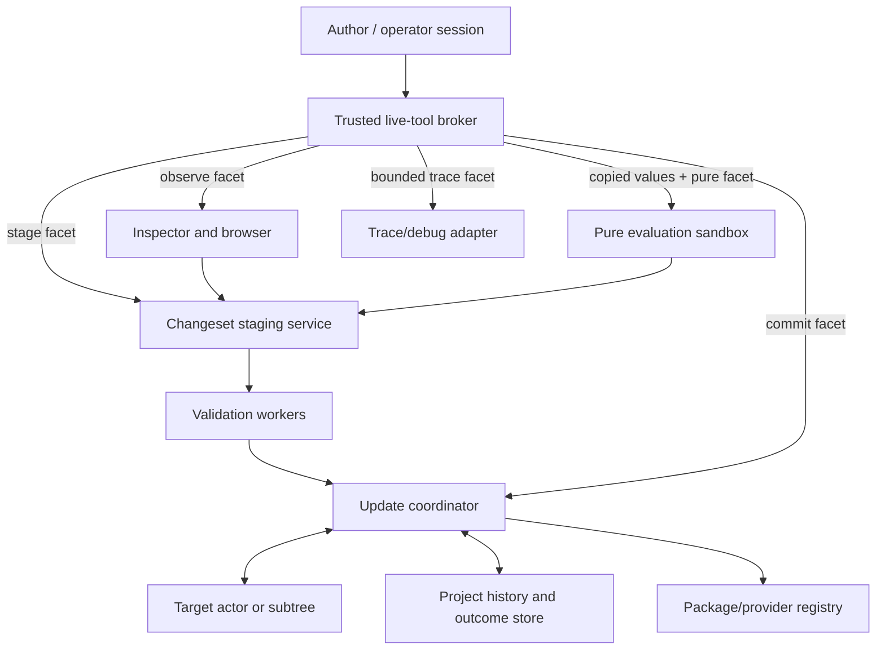
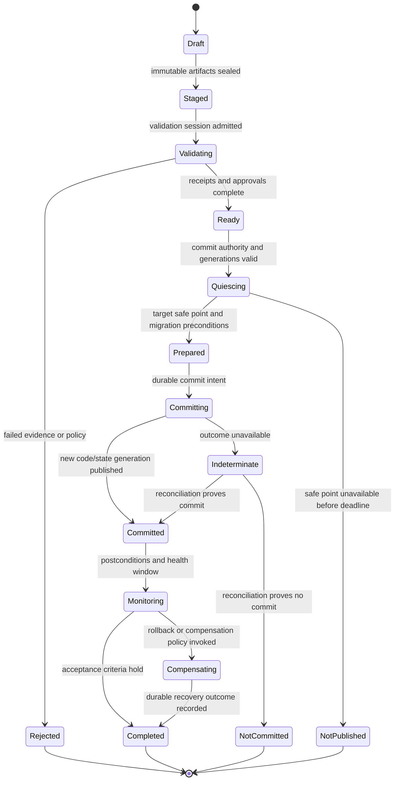

# Capability-Scoped Live Tools and Transactional Evolution

## Executive decision

Atom OS should restore Smalltalk's continuity between use, inspection, and
authorship without restoring a globally mutable, ambiently inspectable image.
Browsers, inspectors, evaluators, tracers, debuggers, editors, migration tools,
and publishers are ordinary supervised services. Each receives a distinct,
attenuated capability facet and a resource budget. Durable change occurs only
through a staged **changeset transaction** bound to author, target, current
generations, declared authority, validation evidence, migration, and recovery
plan.

“Live” must be profiled precisely. Inspecting public semantics, reading private
state, evaluating a pure expression, attaching trace, changing presentation,
replacing one actor's code, migrating durable schema, updating a runtime
component, and publishing a reusable tool have different safety, liveness, and
authority requirements. Immediate feedback is desirable; immediate commit is
not always safe.

## Question and operational standard

The component asks: **how can people understand and alter a running project
while preserving actor isolation, capability authority, BEAM compatibility,
durable outcomes, and recoverable updates?**

It succeeds only when:

- inspection does not imply mutation and public semantics do not imply private
  state access;
- pure evaluation has no ambient I/O, clock, random, process, or authority
  effects unless explicitly supplied;
- trace and debug work is charged and cannot silently destabilize the target;
- a change is checked against exact project, object, code, schema, policy, and
  runtime generations;
- code publication, state migration, and external-effect compensation are
  distinct outcomes;
- a tool crash at any transition leaves the target old, new, or visibly
  indeterminate—never silently half-published;
- signed package provenance establishes who built bytes, not that behavior is
  correct; and
- non-expert authorship is evaluated through explanation and transfer, not
  only update latency or programmer preference.

## Evidence and limits

[Smalltalk-80's environment](../../30-sources/goldberg-1984-smalltalk-80-interactive-environment.md)
and [Kay's later discussion](../../30-sources/feldman-kay-2004-conversation-alan-kay.md)
motivate integrated browsers, inspectors, workspaces, debuggers, source/change
history, and a protected meta-level boundary. [Live Objects All the Way
Down](../../30-sources/pimas-et-al-2023-live-objects-all-the-way-down.md)
demonstrates that collector, JIT, and SIMD runtime machinery can be changed
through live objects in a research system. [Rein et al.'s literature
study](../../30-sources/rein-et-al-2019-liveness-literature-study.md)
shows that liveness covers several research traditions and intended outcomes;
their [productivity-tool report](../../30-sources/rein-et-al-2017-living-in-programming-environment.md)
shows both the value and unresolved remote-object problems of exploratory
adaptation.

For safe update mechanics, [Proteus](../../30-sources/stoyle-et-al-2005-safe-predictable-dynamic-updating.md)
formalizes type-aware safe update points and [practical DSU
research](../../30-sources/neamtiu-et-al-2006-practical-dynamic-software-updating.md)
measures real C-program evolution. [NixOS](../../30-sources/dolstra-et-al-2008-nixos.md),
[TUF](../../30-sources/samuel-et-al-2010-tuf.md), and
[in-toto](../../30-sources/torres-arias-et-al-2019-in-toto.md) supply useful
immutable-version, metadata freshness, role separation, and supply-chain
provenance patterns.

These works do not prove safe arbitrary live change. Type safety is not domain
correctness; package rollback does not reverse a data migration; signed
provenance does not make code benevolent; and builder use does not prove
non-programmer learnability. The Atom protocol explicitly preserves those
limits.

## Capability facets

There is no universal `DebugAuthority`. A tool receives only the facets needed
for one target and bounded interval:

| Facet | Permitted operation | Explicitly excluded |
| --- | --- | --- |
| `ObservePublicSemantics` | Read the same filtered semantic graph available to the session | Private fields, memory, secrets, mutation |
| `InspectModelState` | Read selected typed fields at declared generations | Arbitrary address-space reads, write, transitive capability traversal |
| `EvaluatePure` | Evaluate a bounded expression over copied values and pure libraries | I/O, time, randomness, spawning, message send, native calls |
| `AttachTrace` | Subscribe to named events/fields with rate, duration, and disclosure limits | Stop, step, mutate, read unlisted data |
| `ControlDebug` | Pause/step selected actors at safe points under deadline and recovery policy | Whole-system stop, unrelated actors, automatic secret access |
| `StageChange` | Create an immutable candidate changeset | Publication or target mutation |
| `ValidateChange` | Run declared static, model, test, migration, and resource checks | Commit |
| `CommitChange` | Publish one approved scope under exact generations | Expansion to other actors/projects/runtimes |
| `ReadProtectedData` | Read explicitly selected secret/protected fields through a trusted session | General inspection |
| `PublishTool` | Submit immutable package and provenance metadata to a registry workflow | Installation, grant issuance, automatic migration |

Facets are audience-bound, expiring, revocable, and generation-scoped. A tool
may receive copied values rather than direct target capabilities. Derivation
records preserve who delegated which facet and why.

## Tool isolation architecture



Validation workers execute untrusted compilers, parsers, schema transformers,
and tests in isolated domains with no commit capability. The update coordinator
is smaller and accepts only typed validation receipts from approved workers.
The broker mediates user authority but does not interpret every programming
language.

## Changeset record

```text
ChangeSet {
  change_id, author_identity, project_id,
  target_scope, base_model_version_refs,
  base_code_generations, base_schema_versions,
  base_policy_revision, requested_authority,
  immutable_artifact_digests, semantic_diff,
  migration_plan, validation_plan, resource_delta,
  compatibility_profile, quiescence_profile,
  rollback_plan, compensation_plan,
  provenance_bundle, created_at, expiry
}
```

`target_scope` is one actor, actor type, supervised subtree, project provider,
runtime component, or system service; broad scope is never inferred from a
matching module name. The artifact closure is immutable. The semantic diff
explains changed actions, schemas, capabilities, resource needs, and external
effects, not just source lines.

The record distinguishes:

- **code rollback**: choose the prior immutable implementation generation;
- **data rollback**: restore a compatible snapshot or execute a verified
  inverse before irreversible dependent work;
- **compensation**: perform a new domain action that addresses a previous
  committed effect without pretending history was erased; and
- **forward repair**: publish another generation when rollback is unsafe.

[Sagas](../../30-sources/garcia-molina-salem-1987-sagas.md) shows that
application-defined compensation is not equivalent to transaction isolation
or time reversal. [ARIES](../../30-sources/mohan-et-al-1992-aries.md) shows
how write-ahead records and compensation log records make storage recovery
restartable, but an Atom project history remains a domain-level protocol rather
than a database log exposed as user meaning.

## Lifecycle



A tool timeout never creates a second change ID. Reconciliation queries the
existing operation. If the update crossed an irreversible boundary and the
outcome remains unknown, the affected scope is visibly fenced or quarantined
according to policy.

The public result uses the common visual command-outcome lattice. Failure
before admission maps to `RejectedBeforeAdmission`; accepted validation,
quiescence, and commit work reports `AcceptedPending`; stale authority reports
`Fenced`, while a pre-admission deadline maps to `ExpiredBeforeAdmission`;
publication maps to `Committed`; proved pre-commit cancellation maps to
`NotCommitted`; and an unknown publication point remains `Indeterminate`. The
lifecycle labels above do not redefine those external outcomes.

## Validation ladder

A changeset advances only through checks applicable to its scope:

1. **Provenance and integrity:** artifact digest, signatures, builder/material
   attestations, freshness, revocation, and repository consistency.
2. **Syntax and type:** loader/verifier, BEAM compatibility profile, interface
   and message-schema checks.
3. **Authority:** requested new capabilities and delegation relationships are
   explicit and approved; no hidden authority amplification.
4. **State transformation:** migration totality over supported old schemas,
   bounded resource use, idempotency or durable outcome behavior, and recovery
   from interruption.
5. **Behavior:** unit, property, conformance, model, deterministic replay, and
   application-invariant tests with evidence tied to artifact digest.
6. **Resource:** CPU reductions, heap, mailbox, persistent storage, GPU,
   bandwidth, trace, and recovery-reserve impacts.
7. **Canary:** isolated copy, shadow, selected actor, or selected subtree under
   explicit data and effect policy.
8. **Post-publication:** health and semantic compatibility monitoring; failure
   selects rollback, compensation, quarantine, or forward repair.

Passing a lower rung is evidence only for that property. TUF and in-toto do not
establish behavior; a type checker does not establish domain invariants; a
test suite does not prove all states.

## BEAM and actor update profile

The first profile should build on existing BEAM-compatible module-generation
semantics while strengthening scope and evidence:

- loader verification creates an immutable candidate code generation;
- new calls enter the current generation only after atomic publication;
- actors already executing old code reach declared safe points rather than
  being rewritten at arbitrary instructions;
- per-actor or subtree migration receives old state plus immutable changeset
  data and returns new state or a typed rejection;
- messages carry protocol versions independent of module version;
- old code remains while live continuations, rollback, migrations, replay, or
  compensation reference it, then is reclaimed through explicit quiescence;
- native/JIT helpers remain isolated and use the lower code-publication and
  executable-memory protocol; and
- the exact supported BEAM and OTP update behavior belongs in the compatibility
  profile and conformance suite.

The [managed actor runtime layer](../managed-actor-runtime-layer.md) owns code
generations and safe points; this visual service owns user-facing staging and
authorization policy.

## Pure evaluation and preview

`EvaluatePure` receives serialized immutable inputs, a language/profile digest,
a deterministic seed only when declared, and limits for reductions, wall
deadline, heap, result size, recursion, and output. Clock, randomness, files,
network, actor messaging, code publication, tracing, and secrets are absent by
default.

Preview runs the candidate against a snapshot or disposable actor clone. It
must be visibly labeled and cannot commit external effects. A preview result
contains the base generations and becomes stale when they change. The user may
promote an expression into a staged changeset, but the result itself does not
carry commit authority.

## Tracing and debugging

Tracing is observation with operational cost and disclosure risk.

- Trace points and fields are schema-registered and redacted before export.
- Sessions specify targets, event classes, sampling, buffer policy, duration,
  maximum bytes, and permitted sinks.
- Loss counters and sequence gaps are visible; a trace is never presented as
  complete when it dropped events.
- Debug pause/step uses target safe points, maximum stop time, and an outer
  recovery holder so the debugging tool cannot permanently suspend a service.
- Attaching a debugger changes timing and can change distributed behavior;
  deterministic record/replay evidence is separate from live observation.
- Reading process memory or secrets requires a stronger facet and trusted
  interaction; it is not bundled with “debug.”

[DTrace](../../30-sources/cantrill-et-al-2004-dtrace.md) provides evidence for
safe dynamic instrumentation and predicates, but its kernel/platform model is
not the Atom actor authority contract.

## Publishing reusable tools

Publication is a supply-chain workflow separate from local use:

1. seal source, dependencies, build recipe, tests, schemas, capability request,
   and documentation as immutable materials;
2. build in an isolated environment and record materials/products;
3. sign target metadata through role-separated repository policy;
4. admit the package to a project or system registry only after compatibility,
   resource, and authority review;
5. install side by side with existing versions and bind providers through an
   atomic registry generation;
6. retain old closures while durable objects, migrations, rollback, or
   compensation refer to them; and
7. collect operational evidence without silently promoting a local experimental
   grant into every user's project.

The immutable/coexisting-version approach follows the useful part of
[NixOS](../../30-sources/dolstra-et-al-2008-nixos.md). Activation side effects,
mutable data, and schema migrations remain outside package-store atomicity.

## Layer placement

| Layer | Live-tool responsibility |
| --- | --- |
| Kernel hardware and architecture support | Enforce executable-code publication, memory ordering, timers, interrupts, and architectural fault evidence; no editor/debugger policy. |
| Minimal privileged kernel | Isolate tools and targets; provide capabilities, mappings, IPC, budgets, fault routes, revocation, domain stop, and safe resource teardown. |
| Managed actor runtime | Introspection hooks, copied term/state views, trace streams, safe points, module generations, actor migration calls, scheduling charges, and BEAM conformance. |
| OTP-like system services | Tool/provider registry, project history, package/update service, migration and saga coordination, durable outcomes, supervision, overload policy, telemetry, and audit. |
| Authentication/authorization services | Exact inspect/evaluate/trace/debug/stage/commit/publish facets, relationship checks, trusted approval, expiry, and revocation. |
| Visual-computing services | Browsers, inspectors, editors, preview renderers, changeset explanation, diff, approval, recovery UI, and progressive authorship paths. |
| Domain actors | State invariants, message compatibility, migration semantics, effect idempotency, compensation, and acceptance criteria. |

## Failure and security invariants

- Tool identity is not target authority; every operation presents the exact
  facet at the enforcing boundary.
- Inspection responses are values with provenance and generation, not live
  transitive references unless separately granted.
- A failed or malicious tool cannot hold target suspension indefinitely; leases
  expire and an independent recovery service resumes or terminates the target.
- Candidate code cannot call compilers, networks, secrets, or package stores
  merely because validation needs them; those are isolated workflow steps.
- An update cannot add undeclared capability needs or increase resource ceilings
  without explicit approval.
- Project-local edits do not mutate the system provider registry.
- Rollback is forbidden when it would reinterpret newer durable data without a
  validated reverse or forward migration.
- Audit entries record claims and receipts without storing protected state by
  default.

## Alternatives considered

| Alternative | Strength | Decision |
| --- | --- | --- |
| Globally mutable live image | Maximum immediacy and uniform tools | Rejected across principals and failure domains; retained as an interaction inspiration. |
| Conventional edit-build-restart only | Simple deployment model | Retained as a safe fallback, but insufficient for inspectable running projects and bounded service evolution. |
| One omnipotent debugger permission | Familiar administration | Rejected; split observation, stop control, memory, secrets, trace, mutation, and publication. |
| Apply source edits directly to running objects | Minimal delay | Rejected as durable protocol; edits first form an immutable, validated changeset. |
| Package rollback equals system rollback | Simple operator story | Rejected because data and external effects may have advanced. |
| Event sourcing as universal project model | Rebuild and temporal inspection | Optional persistence profile only; replay, code evolution, side effects, retention, and privacy make it unsuitable as an OS invariant. |

## Staged implementation

1. Implement public semantic inspection, copied private-state inspection, and a
   deterministic pure evaluator with no commit path.
2. Add bounded tracing and safe-point debugging with independent lease expiry
   and recovery.
3. Define immutable changesets and validate one presentation-only provider
   update.
4. Update one BEAM actor type with state migration, durable outcome, old/new
   generation coexistence, and crash injection.
5. Coordinate one supervised-subtree update and one schema migration with
   rollback or explicit compensation.
6. Add signed package publication, side-by-side providers, canary rollout,
   provenance, and human-facing authority/resource diffs.

## Required experiments and falsifiers

- Attempt every facet operation with each weaker facet; no confused-deputy or
  transitive-reference path may amplify authority.
- Exhaust evaluator reductions, heap, recursion, result size, compiler time,
  trace bandwidth, and stopped-target lease while the target and recovery path
  remain bounded.
- Kill editor, validator, coordinator, target, store, and runtime before and
  after every lifecycle record; reconcile one change ID to one outcome.
- Change target code/schema/policy between preview and commit; the stale
  changeset must fail closed or be explicitly rebased and revalidated.
- Roll back code after a forward-only data migration and an external effect;
  the system must refuse the false rollback and offer valid repair policy.
- Have novice and expert participants explain a visible behavior, locate its
  source, make a bounded change, recover from a failed change, and transfer the
  technique to a new project.
- Compare trace-off and trace-on timing and report perturbation and dropped
  evidence.

The design is falsified if “inspect” can mutate, if update safety depends on an
unstated quiescent moment, or if a green signature is presented as proof of
semantic correctness.

## Connections

- [Umbrella visual-interface synthesis](../alan-kay-smalltalk-visual-interface-and-modern-desktop.md) —
  proposes capability- and transaction-scoped liveness.
- [User-owned project graph](user-owned-project-graph-and-composition.md) —
  owns the durable history and provider bindings changed by tools.
- [Input and trusted-interaction authority](input-focus-and-trusted-interaction-authority.md) —
  supplies authentic approval for consequential scope or authority changes.
- [Cross-layer placement and recovery](cross-layer-placement-and-recovery-topology.md) —
  locates tools and independent recovery holders.
- [Visual-computing model inquiry](../../40-inquiries/what-visual-computing-model-should-atom-os-adopt.md) —
  retains the authorship, security, and update falsifiers.

## Sources

- [Smalltalk-80: The Interactive Programming Environment](../../30-sources/goldberg-1984-smalltalk-80-interactive-environment.md)
- [A Conversation with Alan Kay](../../30-sources/feldman-kay-2004-conversation-alan-kay.md)
- [Live Objects All the Way Down](../../30-sources/pimas-et-al-2023-live-objects-all-the-way-down.md)
- [Exploratory and Live, Programming and Coding](../../30-sources/rein-et-al-2019-liveness-literature-study.md)
- [Living in Your Programming Environment](../../30-sources/rein-et-al-2017-living-in-programming-environment.md)
- [Mutatis Mutandis](../../30-sources/stoyle-et-al-2005-safe-predictable-dynamic-updating.md)
- [Practical Dynamic Software Updating](../../30-sources/neamtiu-et-al-2006-practical-dynamic-software-updating.md)
- [NixOS](../../30-sources/dolstra-et-al-2008-nixos.md)
- [Survivable Key Compromise in Software Update Systems](../../30-sources/samuel-et-al-2010-tuf.md)
- [in-toto](../../30-sources/torres-arias-et-al-2019-in-toto.md)
- [Sagas](../../30-sources/garcia-molina-salem-1987-sagas.md)
- [ARIES](../../30-sources/mohan-et-al-1992-aries.md)
- [DTrace](../../30-sources/cantrill-et-al-2004-dtrace.md)
