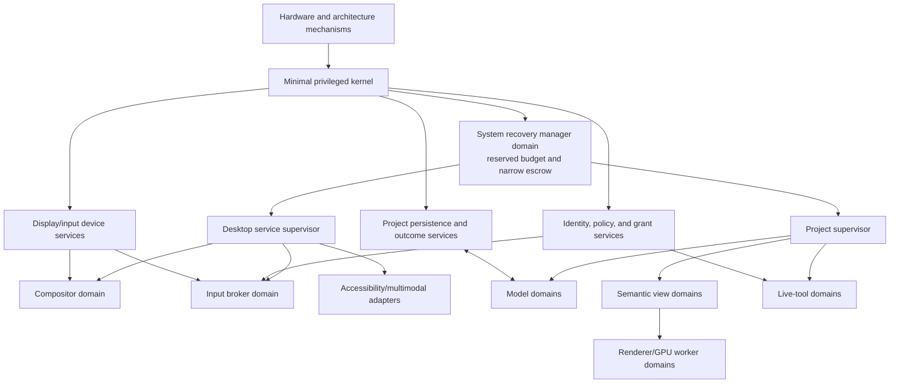
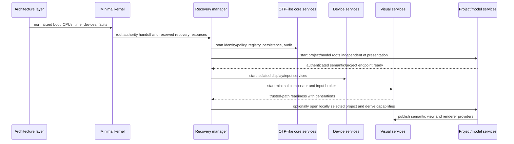

# Cross-Layer Placement and Recovery Topology

## Executive decision

Visual computing should be an **unprivileged service stratum above the four
researched mechanism and policy layers**, not a new monolithic privileged
desktop layer. Hardware support supplies architecture-level entry, timing,
interrupt, ordering, MMIO, DMA/IOMMU, reset, and fault mechanisms. The minimal
kernel enforces isolation, capabilities, IPC, budgets, mappings, revocation,
and teardown. The managed runtime supplies cheap actors and code generations.
Isolated OTP-like device services own controller protocols, GPU/display
programming, and input normalization alongside lifecycle, persistence,
registries, updates, overload, audit, and recovery policy. Visual services then
implement semantic publication, views, renderers, compositor/shell, input
broker, accessibility, multimodal interaction, and live tools. Domain
applications own meaning and effects.

Some visual services are highly trusted, but trust does not imply kernel
placement. The compositor and input broker should run in protected user-space
domains with narrowly delegated lower authority, independent recovery holders,
and reserved resources. The durable project and model graph must not descend
from the desktop supervisor; otherwise restarting the desktop would restart
the application it is supposed to re-present.

## Question and operational standard

The component asks: **where should every visual-computing responsibility live,
which failures should it contain, and what minimum path can restore a usable
system without circular dependence?**

It succeeds only if:

- no semantic role, window policy, toolkit, editor, project schema, or
  accessibility taxonomy is parsed by the privileged kernel;
- display and input hardware can be safely revoked, reset, and reassigned
  without trusting a renderer;
- compositor, renderer, accessibility adapter, live tool, and shell each have
  an explicit failure boundary and supervisor;
- project/model actors may continue or recover independently of all
  presentation domains;
- recovery authority is held outside the component it recovers;
- a bounded recovery console can be started under resource exhaustion;
- stale messages and resources are fenced by end-to-end generations after any
  domain restart; and
- headless, embedded, single-user desktop, and multi-user profiles use the same
  core contracts with different admitted services.

## Evidence and limits

[seL4 design principles](../../30-sources/heiser-2020-sel4-design-principles.md)
and [L4 experience](../../30-sources/elphinstone-heiser-2013-l4-lessons.md)
support a small privileged mechanism boundary and user-level policy.
[Nitpicker](../../30-sources/feske-helmuth-2005-nitpicker.md) demonstrates that
trusted composition and input routing can be implemented in a small isolated
user-space GUI server. [Wayland](../../30-sources/wayland-project-2026-architecture-and-protocol.md)
supplies a widely deployed client/compositor/buffer/input split.
[Crash-only software](../../30-sources/candea-fox-2003-crash-only-software.md)
and [microreboot](../../30-sources/candea-et-al-2004-microreboot.md) motivate
restartable components, explicit leases, and recovery groups derived from real
state dependencies.

These works do not prove the proposed Atom OS topology. A microkernel can still
have unsafe user-space policy; a small compositor can be a single point of
denial; Wayland protocols are not a capability proof; and microreboot is safe
only when state, retry, and effect boundaries are correct. The architecture
below is a placement decision and verification plan.

## Placement rule

A feature belongs at the lowest layer that must enforce it against mutually
distrustful higher components—no lower. Apply these tests in order:

1. Does the feature require privileged instructions or architecture-level
   entry, cache/TLB ordering, time, interrupt, MMIO, DMA/IOMMU, reset, or fault
   mechanisms? Place only that mechanism in hardware/architecture support.
   Device-specific register programming and protocols remain in isolated
   device services.
2. Must it enforce memory, CPU, authority, object lifetime, or IPC isolation
   across distrustful domains? Place the minimal generic mechanism in the
   privileged kernel.
3. Is it part of BEAM-compatible actor execution, messaging, collection, code
   generations, or runtime scheduling? Place it in the managed runtime.
4. Is it a device protocol/driver or lifecycle, registry, persistence,
   identity/policy integration, update, overload, telemetry, audit, or recovery
   policy? Place it in an isolated OTP-like service.
5. Is it visual/semantic interaction, presentation, editor, accessibility, or
   desktop policy? Place it in an isolated visual service.
6. Is it domain meaning, invariant, or external effect? Keep it in the
   application/domain actor.

## Responsibility matrix

| Concern | Hardware / architecture | Minimal kernel | Managed runtime | OTP-like services | Visual services | Domain application |
| --- | --- | --- | --- | --- | --- | --- |
| Display/GPU | Expose discovered resources plus MMIO, order/cache, fault, reset, IRQ, and DMA/IOMMU mechanisms | Device, buffer, mapping, DMA, IRQ, reset, and budget capabilities | Driver/worker actors and async completions | Isolated GPU/display driver programming, lifecycle, allocation, and recovery policy | Renderer, compositor, color/font/media policy | Semantic content and presentation hints |
| Input | IRQ delivery, raw timestamp, MMIO/DMA, reset, and fault mechanisms | Isolate device route/buffers and revoke holders | Ordered typed delivery and actor timers | Isolated controller/HID normalization plus seat/session/broker lifecycle and grant policy | Focus, capture, semantic targeting, trusted interaction | Interpret authorized domain command |
| Project | No knowledge | Enforce live capabilities and resource accounts | Activate object actors and serialize messages | Durable graph, registry, history, collaboration, outcome service | Navigator, editors, views, conflict UI | Type schemas, state machines, effects |
| Semantics | No knowledge | Isolate publishers/consumers | Semantic actor messages and flow control | Schema registry, localization, compatibility, audit | Native semantic graph and adapters | Correct roles, values, relations, actions |
| Presentation | Raw display timing, IRQ, MMIO/DMA, order, and fault mechanisms | Surface/buffer domains and revocation | View/renderer actor lifecycle | Display-driver programming, provider registry, service supervision, overload | Layout, rendering, compositor, shell | Optional provider-specific hints |
| Live change | Code-cache/order mechanism | W^X, mappings, bounded stop, revoke | Loader, verifier, safe points, code generations | Changeset, migration, package, rollout, durable outcomes | Browser, inspector, editor, approval UX | Invariants, migrations, compensations |
| Recovery | Architecture-fault and reset evidence | Fault routes, execution stop, teardown, reserve enforcement | Monitors, links, actor restart hooks | Independent supervisors, recovery leases, persistence and reconciliation | Rebuild snapshots, surfaces, focus and adapters | Continue/pause policy and effect repair |

## Service and trust topology



Arrows express lifecycle or mechanism dependence, not unrestricted authority.
The recovery manager receives only enough escrowed authority to revoke, stop,
restart, rebind, or quarantine named system services. It cannot read arbitrary
project content or perform domain effects. Project supervisors and desktop
supervisors are siblings under outer recovery; neither can silently restart the
other's durable state.

## Generation model

Every cross-boundary handle is validated against the relevant generation
tuple. A single global epoch would invalidate too much and hide which boundary
changed.

```text
VisualRouteGeneration {
  boot_epoch,
  device_generation,
  kernel_object_generation,
  domain_incarnation,
  runtime_incarnation,
  service_epoch,
  project_manifest_revision,
  object_revision_or_frontier_digest,
  view_generation,
  renderer_incarnation,
  compositor_generation,
  seat_focus_sequence,
  policy_revision,
  revocation_epoch
}
```

Protocols carry only the subset needed for their authority and freshness
claim. A frame needs revision-frontier, renderer, surface, compositor, and
buffer generations; an action needs target-object revision, view, input route,
policy, and grant generations; a durable object record must not contain
transient surface or PID generations.

## Boot and headless operation

Visual computing is not required for the system's semantic services to exist.
A desktop boot profile proceeds:



A headless profile starts the project/model roots and an authenticated
semantic/management gateway but omits local display/input device services,
compositor, shell, and input broker. A display service can be added later
without changing model identity. Embedded profiles may admit one fixed renderer
and no general shell while keeping the same project, semantic, input-authority,
and recovery contracts.

## Recovery groups

A recovery group is the minimal set that must change generation together
because it owns non-separable transient state. It is discovered from declared
dependencies and tested, not chosen for administrative convenience.

| Failure | Normally restart | Must survive or reconcile | Must be revoked/fenced |
| --- | --- | --- | --- |
| Renderer/GPU worker | One worker and its caches/buffers | Model, semantic view, project outcomes | GPU mappings, buffer and surface leases, renderer generation |
| Semantic view publisher | View actor or view subtree | Model and durable project state | Subscriptions, presentation handles, pending view actions |
| Accessibility adapter | One adapter | Native semantic publisher and other views | Platform handles and adapter subscription |
| Shell | Shell policy actor(s) | Compositor, input broker, applications | Shell-owned shortcuts, panels, and temporary UI grants |
| Compositor | Compositor plus inseparable scanout state | Models, project store, semantic publishers where isolated | All surface, frame, focus-context, capture, and secure-overlay generations |
| Input broker | Broker and seat transient state | Models and compositor where independently healthy | Focus, capture, drag, clipboard-read, shortcut, pending grant generations |
| Project model domain | Affected actor/domain from durable state | Project store/outcome ledger and unrelated projects | Old PIDs, subscriptions, model grants, unresolved effect admissions |
| Persistence adapter | Adapter after storage recovery | Model may pause or run under bounded policy; outcome log remains authoritative | New durable commits until recovered consistency is proved |
| Recovery manager | Pre-provisioned successor under kernel-enforced handoff | Kernel and sealed recovery record | Old recovery epoch and all delegated recovery sessions |

Microreboot evidence warns that shared mutable state enlarges the real recovery
group. If compositor and broker share hidden state that cannot be reconciled,
they form one group until the interface is redesigned. The system must not
claim independent recovery merely because the processes are separate.

## Compositor recovery sequence

1. Kernel fault routing informs the independent recovery manager; new surface
   and input-context admissions are closed.
2. Old compositor display, DMA, buffer, and surface authorities are revoked;
   the failed domain is stopped and resources are reaped only after CPU/device
   quiescence or quarantined.
3. The broker closes focus, capture, drag, screen-capture, and pending
   confirmation state tied to the old composition generation.
4. Recovery starts a minimal compositor in a new domain with reserved budget
   and newly derived display authority.
5. The compositor publishes readiness and a new generation through the service
   registry.
6. Semantic view supervisors reconnect and provide complete current snapshots;
   renderer workers acquire new surface leases and regenerate frames.
7. Focus policy evaluates which low-risk session may be restored. Sensitive
   ceremonies require new input.
8. In-flight domain actions query their durable operation IDs. No raw input or
   model command is replayed as a side effect of re-presentation.

If the failed compositor cannot be cleanly detached from hardware, the device
service follows its controller-specific reset and DMA-fencing profile. This is
why the lower architecture and kernel teardown protocols remain visible.

## Minimal recovery console

Recovery reserve should cover a deliberately small user-space path:

- one preverified CPU renderer with bounded built-in font/glyph resources;
- one display mode and one normalized keyboard or accessible switch path;
- trusted identification of failed service, current user/session, and action;
- restart, choose prior provider, disable service, export evidence, or shut
  down; and
- no third-party shaders, fonts, media parsers, project scripts, or network
  dependency for local recovery.

The console is not the normal desktop and does not own user projects. Its
artifacts and capabilities are prepared before resource exhaustion. A remote
recovery channel may supplement it but requires separate identity, policy, and
network assumptions.

## Resource topology

Each protected domain and major actor subtree receives distinct accounts for:

- kernel objects and capability slots;
- CPU budget, priority ceiling, and privileged-work charge;
- actor reductions, heap, binaries, mailbox bytes, and timer count;
- persistent bytes, journal growth, snapshots, and outstanding outcomes;
- GPU contexts, mappings, buffers, command submissions, and reset cost;
- semantic snapshot/delta bytes and subscribers;
- input event/capture rate and trusted-session slots; and
- trace, audit, crash evidence, and teardown work.

Interactive latency policy may prioritize the current view within its ceiling,
but cannot borrow unbounded model, compositor, or recovery resources. Renderer
overload drops/coalesces derivable frames before semantic state. Audit and
outcome evidence use reserved bounded paths and explicit loss/failure policy.

## Security invariants

- The kernel knows capability and domain types, not “window,” “button,” or
  “project editor.”
- Display authority does not imply input authority, screen capture, semantic
  access, or model mutation.
- The compositor can identify final visible context but cannot mint arbitrary
  project grants or execute domain actions.
- The recovery manager can replace a service but cannot assume its data-reading
  or user-facing authority.
- Service discovery returns identity and generation; it does not itself grant
  invocation authority.
- A project/object ID is never confused with an actor PID, kernel object ID,
  provider instance, or surface ID.
- Every stale generation fails closed at the receiving sink, not only at the
  registry or sender.
- Device faults and teardown uncertainty are surfaced as quarantined lower
  resources rather than papered over by restarting a renderer.

## Alternatives considered

| Alternative | Strength | Decision |
| --- | --- | --- |
| Monolithic desktop server owns input, windows, toolkit, project store, and applications | Simple global coordination | Rejected because compromise/restart crosses every authority and state boundary. |
| Put compositor and input policy in kernel | Strongest immediate control | Rejected except for generic isolation and unavoidable hardware mechanism; UI policy evolves too quickly and parses hostile complexity. |
| One managed-runtime domain for all system and app actors | Cheap messaging and supervision | Rejected for mutually distrustful or high-risk native/GPU/parser components; allowed inside one declared trust domain. |
| One process per actor | Strong isolation | Rejected as default because it defeats cheap BEAM-style concurrency; protected domains contain actor groups chosen by trust and recovery needs. |
| Browser as the entire desktop boundary | Mature sandbox/tooling ecosystem | Retained as one visual provider profile, not the OS semantic, authority, persistence, or recovery root. |
| Desktop availability required for application progress | Familiar interactive app assumption | Domain policy may choose pause, but the architecture never makes it unavoidable. |

## Staged implementation

1. Model the complete topology and generation checks in an executable protocol
   simulator before device or GPU code.
2. Boot headless core services and one durable project/model actor on the
   minimal kernel/runtime boundary.
3. Add CPU compositor, input broker, semantic publisher, renderer, and recovery
   manager in separate domains.
4. Inject failure at every cross-domain message and lower resource transition;
   refine real recovery groups.
5. Add GPU/device service, accessibility adapter, live tools, and multiple
   projects under independent resource accounts.
6. Implement minimal recovery console and exhaust CPU, memory, mailbox, storage,
   GPU, and capability resources deliberately.
7. Port to a second architecture/device profile and compare which mechanisms,
   not policies, required lower-layer change.

## Required experiments and falsifiers

- Generate a dependency graph from manifests and compare it with observed
  restart groups under fault injection; hidden coupling is a design defect.
- Crash each service before and after capability derivation, registry
  publication, buffer mapping, frame submit, focus transfer, model command,
  durable commit, and teardown.
- Compromise a renderer, accessibility adapter, shell, live tool, and model
  domain separately; measure exactly which resources and data each can reach.
- Exhaust every account and verify the recovery console and independent
  revocation path still meet declared deadlines.
- Run headless, local desktop, remote semantic, and embedded profiles over the
  same project/model protocol.
- Reuse object addresses, PIDs, surface IDs, and device queues after restart;
  generation checks must reject every stale message and capability.
- Measure input-to-semantic-action, model-to-semantic-publication,
  publication-to-frame, and failure-to-trusted-console latency separately.

The topology is falsified if a compositor restart requires restarting model
actors by construction, if recovery depends on the failed service to release
its own authority, or if a system can recover only while resources are
plentiful.

## Connections

- [Umbrella visual-interface synthesis](../alan-kay-smalltalk-visual-interface-and-modern-desktop.md) —
  introduces the cross-layer placement.
- [Kernel hardware and architecture support layer](../kernel-hardware-and-architecture-support-layer.md) —
  owns privileged hardware mechanisms.
- [Minimal privileged kernel layer](../minimal-privileged-kernel-layer.md) —
  owns generic enforcement and teardown.
- [Managed actor runtime layer](../managed-actor-runtime-layer.md) —
  owns BEAM-compatible managed execution.
- [OTP-like system services layer](../otp-like-system-services-layer.md) —
  owns unprivileged lifecycle and operational policy.
- [Applications and domain services layer](../applications-and-domain-services-layer.md) —
  now defines the enclosing fifth-layer domain, effect, semantic-view,
  evolution, tenancy, and user-outcome contracts that this visual profile
  specializes.
- [Authentication and authorization across the five-layer architecture](../authentication-and-authorization-across-the-five-layer-architecture.md) —
  supplies policy, grant, revocation, and recovery-authority services.
- [Visual-computing model inquiry](../../40-inquiries/what-visual-computing-model-should-atom-os-adopt.md) —
  retains the unresolved trust, recovery, and profile questions.

## Sources

- [seL4 Design Principles](../../30-sources/heiser-2020-sel4-design-principles.md)
- [From L3 to seL4](../../30-sources/elphinstone-heiser-2013-l4-lessons.md)
- [A Nitpicker's Guide to a Minimal-Complexity Secure GUI](../../30-sources/feske-helmuth-2005-nitpicker.md)
- [Wayland Architecture and Protocol](../../30-sources/wayland-project-2026-architecture-and-protocol.md)
- [Crash-Only Software](../../30-sources/candea-fox-2003-crash-only-software.md)
- [Microreboot](../../30-sources/candea-et-al-2004-microreboot.md)
- [The Protection of Information in Computer Systems](../../30-sources/saltzer-schroeder-1975-protection-information.md)
- [End-to-End Arguments in System Design](../../30-sources/saltzer-et-al-1984-end-to-end-arguments.md)
