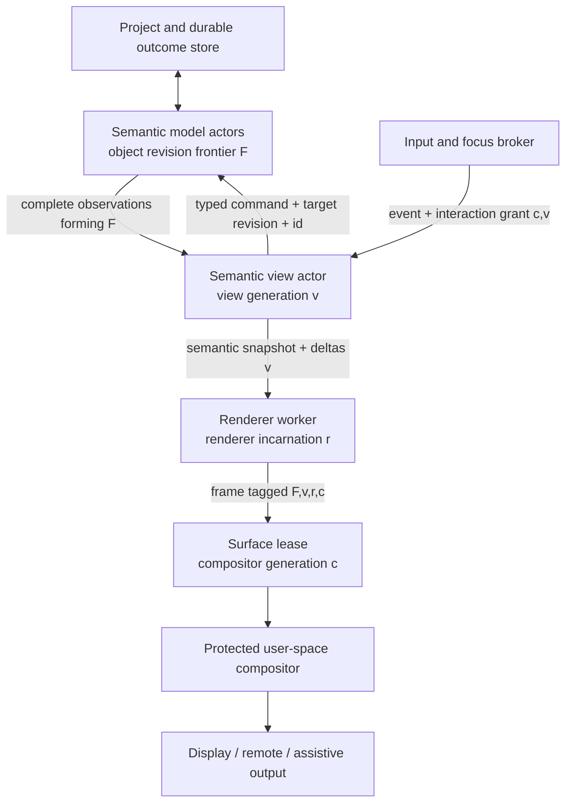
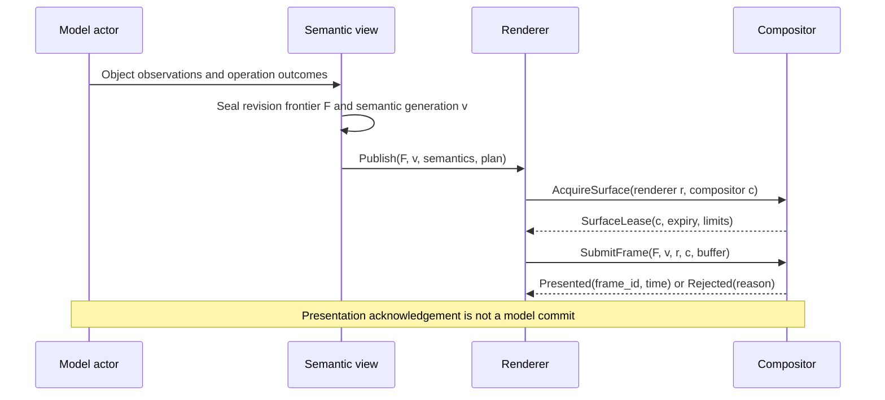
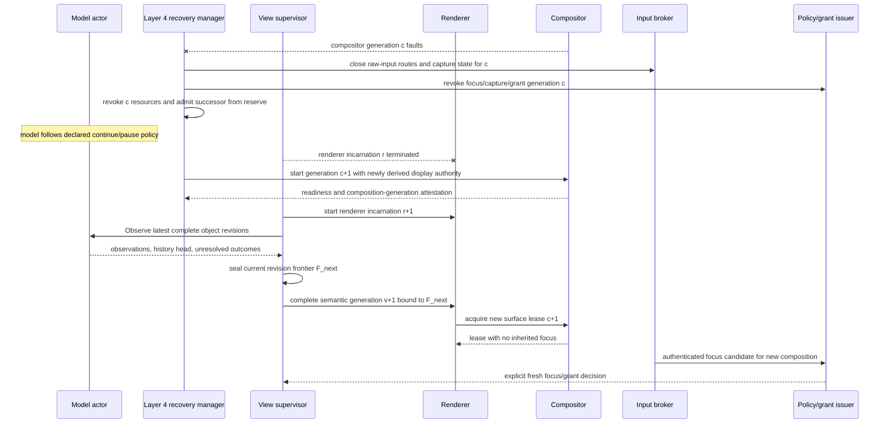
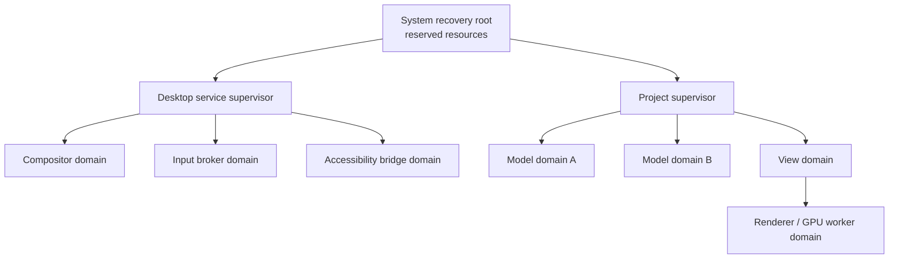

# Durable Semantic Actors and Disposable Presentation

## Executive decision

An Atom OS application with a UI should be a supervised semantic system that
*publishes* presentation, not a process whose identity is its window. Live
model actors, the project store, and durable effect ledgers jointly preserve
application meaning; an actor's heap alone is never treated as durable.
Semantic view actors derive versioned, reconstructible interaction state.
Renderer workers own replaceable CPU/GPU caches and buffers. A protected
user-space compositor owns surface placement, occlusion, focus arbitration,
secure overlays, and final display.

This separation permits a renderer, shell, accessibility adapter, or compositor
to fail and restart while the application's semantic actors continue under
declared policy. It does not promise uninterrupted interaction, invisible
failure, or automatic replay of user input. Ephemeral input and focus grants
expire at the failed generation; external effects reconcile by operation ID.

## Question and operational standard

The component asks: **which UI-related state constitutes durable meaning, and
how can every other state be reconstructed without semantic rollback or effect
duplication?**

It succeeds only when:

- the same immutable project revision frontier produces a semantically
  equivalent view after presentation restart;
- the model can advance, pause, or apply bounded buffering policy while no
  renderer exists;
- a newly activated renderer cannot submit a frame or action for a stale view,
  surface, object revision frontier, or compositor generation;
- neither an unacknowledged input event nor a timed-out domain command is
  blindly replayed;
- a compositor restart revokes old focus, capture, and surface authority;
- presentation overload sheds derivable work before durable state; and
- recovery remains possible under reserved CPU, memory, IPC, and display
  resources.

## Evidence and synthesis boundary

[Crash-only software](../../30-sources/candea-fox-2003-crash-only-software.md)
and [microreboot](../../30-sources/candea-et-al-2004-microreboot.md) motivate
small restart boundaries and treating recovery as an ordinary lifecycle.
[Orleans](../../30-sources/bernstein-et-al-2014-orleans.md) demonstrates the
utility of stable logical actor identity above replaceable activations.
[Wayland](../../30-sources/wayland-project-2026-architecture-and-protocol.md)
provides a practical client-buffer/compositor boundary, while
[Nitpicker](../../30-sources/feske-helmuth-2005-nitpicker.md) demonstrates a
small secure GUI policy and input path. [Functional Reactive
Animation](../../30-sources/elliott-hudak-1997-functional-reactive-animation.md)
shows how presentation can be described as compositional behavior and events
rather than imperative repaint state. The [Dexter hypertext reference
model](../../30-sources/halasz-schwartz-1994-dexter-hypertext-reference-model.md)
provides a separate precedent for stable stored components and links above
transient run-time presentation instantiations.

None of these sources proves the proposed end-to-end recovery protocol.
Crash-only design can lose state if persistence is wrong; actor activation does
not imply exactly-once commands; Wayland does not preserve application meaning;
FRP denotation does not bound rendering work; and a small compositor does not
make compromised clients harmless without authority confinement.

## Four state classes

Every field associated with a visual application must be classified before it
is implemented:

| Class | Examples | Recovery rule |
| --- | --- | --- |
| Durable semantic state | document values, simulation parameters, committed domain commands, project relations, schema generation | Persist through a project transaction or reconstruct from an authoritative external system with an outcome receipt. |
| Durable effect evidence | operation IDs, prepare/commit/unknown outcomes, migration records, audit links | Preserve until the effect is reconciled; never infer failure from timeout. |
| Reconstructible derived state | semantic tree, layout plan, glyph runs, tessellation, image decode, GPU pipeline and buffer contents | Discard on generation change and regenerate from a complete semantic observation. |
| Ephemeral interaction state | hover, pointer position, in-progress gesture, uncommitted composition text, focus/capture lease | Drop or explicitly recover according to a typed policy; never replay merely because presentation restarted. |

Some state is context-dependent. A text insertion becomes durable only after a
model command commits; an input-method composition remains private ephemeral
state until the user commits it. Scroll position may be a local preference,
shared project state, or disposable view state depending on the project schema.
There is no safe default based only on the field's UI name.

## Component boundaries



The semantic view actor may cache a complete snapshot, but it is not the
application database. The renderer may request media assets through narrow
read capabilities, but it cannot inspect arbitrary model state. The compositor
sees surfaces and trusted metadata, not domain objects.

## Required records

### Model observation

```text
ModelObservation {
  project_id, object_id, object_lifecycle_generation, state_revision,
  schema_version, complete_or_delta, base_state_revision,
  semantic_payload_ref, visibility_label, expiry
}

ProjectRevisionFrontier {
  project_id, project_commit_watermark?,
  object_revisions: [{object_id, object_lifecycle_generation, state_revision}],
  history_head, frontier_digest
}
```

A delta is accepted only if its base equals the receiver's latest complete
object revision. Otherwise the receiver requests a bounded full snapshot. A
view coordinator records the exact immutable frontier of object observations
used for a publication. `project_commit_watermark` is present only when the
store proves that all members came from one atomic project snapshot; otherwise
the vector itself is the honest consistency boundary. Model observations are
immutable values; a renderer cannot retain an authority to mutate the actor by
holding one.

### View publication

```text
ViewPublication {
  view_id, view_generation, revision_frontier_digest,
  semantic_root, presentation_plan_ref,
  supported_actions, localization_generation,
  completeness, checksum
}
```

The semantic root and available actions are published atomically for one view
generation. The presentation plan is advisory and can be ignored by another
renderer. Partial trees may stream only when they declare placeholders and a
stable snapshot boundary; assistive clients must not observe internally
contradictory fragments as a completed generation.

### Surface lease

```text
SurfaceLease {
  surface_id, compositor_generation, client_domain,
  renderer_incarnation, allowed_outputs, geometry_limit,
  buffer_profile, expiry, revocation_epoch
}
```

Surface IDs are not durable project identities. A restarted compositor issues
new leases; a frame for an old compositor generation is rejected even if an OS
object address was reused.

## Normal publication path



Frame acknowledgement reports only presentation. It cannot be used as proof
that a model command or external effect committed. Conversely, a committed
model operation does not promise that any particular frame reached a display.

## Restart and reconciliation



Focus restoration is policy, not a side effect of matching window geometry.
For low-risk local views the broker may restore focus after an authenticated
session check. Credential, consent, and cross-project transfer views require a
new trusted interaction. In-progress drag, capture, and secure-prompt sessions
terminate unless their protocol defines a safe, visible recovery step.

## Interaction and command outcomes

An accepted input becomes a `ViewAction` tagged with a non-reusable broker
client-action ID, broker generation, view generation, action digest, and an
optional short-lived grant. The view validates the tag, but the durable
application-admission boundary atomically binds the client-action ID and digest
to the operation ID before effectful dispatch. A replacement view obtains
visible unresolved operation IDs from a fresh authorized snapshot or queries
the broker-retained binding; it never depends on a random key held only in the
failed view. The protocol uses the shared command-outcome lattice from the
[semantic UI protocol](semantics-first-accessible-ui-protocol.md):

- `RejectedBeforeAdmission(reason)`: no work was accepted; a new request may
  be made after addressing the reason;
- `ExpiredBeforeAdmission(evidence)` or `Fenced(current_generation)`: proof no
  responsibility was admitted, so refresh intent/target before a new request;
- `AcceptedPending(operation_id, status_handle)`: admitted but not terminal;
  do not retry;
- `Committed(receipt, revision_evidence: new_revision_frontier)`: terminal
  success; never replay;
- `NotCommitted(proof)`: terminal proof that the declared effect did not commit;
  policy may permit a fresh retry;
- `Terminated(reason, compensation_state)`: the domain workflow ended, possibly
  after visible effects; show surviving effects and do not infer retry safety;
- `Indeterminate(reconciliation_handle)`: disable or mark the action pending
  until reconciliation proves a terminal outcome.

This prevents a presentation restart from turning ambiguous delivery into a
duplicate purchase, message, file transfer, or device action. The end-to-end
distinction follows the outcome limits documented by [remote-procedure-call
research](../../30-sources/birrell-nelson-1984-remote-procedure-calls.md) and
[RIFL](../../30-sources/lee-et-al-2015-rifl.md).

## Layer placement

| Layer | Owned mechanism or policy |
| --- | --- |
| Kernel hardware and architecture support | Display/input interrupt, DMA/IOMMU, timer, cache/coherence, and fault mechanisms. It has no window or semantic-view concept. |
| Minimal privileged kernel | Isolated compositor, renderer, view, and model domains; buffer mappings; endpoints; capabilities; CPU/memory budgets; fault notification; revocation and safe teardown. |
| Managed actor runtime | Model/view/renderer actor identity, mailboxes, private heaps, reduction scheduling, supervision signals, code generations, timers, and serialization. |
| OTP-like system services | Durable outcomes, project persistence, compositor and provider lifecycle, registry publication, update sequencing, overload policy, telemetry, and audit. |
| Visual-computing services | Semantic protocol, layout, rendering, compositor/shell, input broker, accessibility bridges, preferences, and recovery choreography. |
| Domain application | Meaning, invariants, commands, effect adapters, and the policy for continuing, pausing, or rejecting work when presentation is absent. |

## Failure-containment topology



The compositor and broker are trusted but mutually isolated when feasible. A
renderer handling complex fonts, images, shaders, or media belongs in a less
trusted worker domain. Models do not descend from the compositor supervisor;
otherwise a desktop restart would become an application restart.

## Backpressure and resource control

- Each semantic subscription has maximum snapshot size, delta rate, retained
  generations, traversal work, and resynchronization budget.
- Views coalesce intermediate object revisions or revision frontiers only when
  the model declares them observationally supersedable; durable outcomes are
  never coalesced.
- Renderers may drop obsolete frames before submission. The compositor may
  drop presentation work, not semantic events or model commits.
- GPU buffers and surface leases are charged to the renderer/project account
  and revoked on client generation change.
- Model actors choose whether absence of presentation allows progress, causes
  bounded event buffering, disables interactive commands, or pauses a
  simulation. That policy is visible to the user and observable in telemetry.
- Recovery reserve covers a minimal compositor, input path, semantic project
  chooser, and termination/revocation tools—not every application renderer.

## Security invariants

- Pixels never confer object authority.
- A renderer receives immutable view data and narrow asset/buffer capabilities,
  not a general model reference.
- The compositor cannot synthesize a domain command; it can only route tagged
  input and manage trusted interaction.
- Semantic publication applies visibility and redaction before data reaches a
  renderer, remote display, automation client, or accessibility adapter.
- Screenshot and screen-capture authority is separate from surface submission.
- Old generations cannot regain focus, capture, surfaces, model subscriptions,
  or DMA mappings after restart.
- Secret-entry surfaces must be composed through a trusted path and excluded
  from unauthorized capture and accessibility export according to explicit
  policy, without silently making all semantics unavailable.

## Alternatives considered

| Alternative | Strength | Decision |
| --- | --- | --- |
| One process owns model and window | Familiar toolkit architecture and simple local calls | Allowed only for low-assurance prototypes; rejected as the architecture contract because presentation faults become semantic faults. |
| Persistent UI object graph is the model | Strong live continuity | Rejected where renderer/toolkit objects embed nonportable resources and authority; semantic objects may still expose durable presentation preferences. |
| Browser-style reload from application storage | Mature and easy to deploy | Retained as one provider pattern, but strengthened with lifecycle generations, state revisions/frontiers, typed outcomes, and capability revocation. |
| Fully stateless renderer | Easy restart | Goal for caches and surfaces, not an absolute rule; expensive derived state may be checkpointed as invalidatable cache. |
| Kernel compositor/window server | Direct control and availability | Rejected unless measurement proves a mechanism must be privileged; user-space isolation and recovery reserve keep policy replaceable. |

## Staged implementation

1. Define the four state classes and tag every field in one reference
   application.
2. Implement complete model observations, declarative semantic snapshots, and
   a CPU renderer with generation checks.
3. Split model, view, renderer, and compositor into separate protected domains;
   add expiring surface and buffer capabilities.
4. Add command outcome reconciliation and kill every component at each message
   transition.
5. Add GPU workers, accessibility and remote-view adapters, load shedding, and
   recovery reserve.
6. Verify independent updates of model, semantic protocol, renderer, and
   compositor across compatible version ranges.

## Required experiments and falsifiers

- **Semantic continuity:** hash a normalized semantic snapshot before and after
  every presentation-component restart; differences require declared model
  progress or protocol migration.
- **No input replay:** fail the broker, view, renderer, and compositor before
  and after dispatch; an event ID may authorize at most its declared command.
- **Ambiguous effect:** lose replies at every point of an external operation;
  the UI must show pending/indeterminate until reconciliation.
- **Generation attack:** submit old frames, deltas, focus tokens, buffers, and
  actions after reincarnation; all must be rejected without confusing a newly
  allocated object.
- **Overload:** produce model updates faster than display, then verify bounded
  memory, explicit coalescing, complete outcome delivery, and current-state
  recovery.
- **Recovery deadline:** measure time to trusted minimal display and time to
  project interaction separately under CPU, memory, GPU, and I/O pressure.

The proposal is falsified if restarting presentation rolls durable meaning
back, if a view is the only authoritative copy of an edit, or if correctness
requires replaying unacknowledged input.

## Connections

- [Umbrella visual-interface synthesis](../alan-kay-smalltalk-visual-interface-and-modern-desktop.md) —
  proposes durable meaning and disposable presentation.
- [User-owned project graph](user-owned-project-graph-and-composition.md) —
  identifies the durable ownership and persistence boundary.
- [Semantics-first accessible UI protocol](semantics-first-accessible-ui-protocol.md) —
  defines the reconstructible publication shared by renderers and assistive
  services.
- [Input and trusted-interaction authority](input-focus-and-trusted-interaction-authority.md) —
  defines why focus and event authority expire across restart.
- [Cross-layer recovery topology](cross-layer-placement-and-recovery-topology.md) —
  integrates the failure domains into the full architecture.

## Sources

- [Crash-Only Software](../../30-sources/candea-fox-2003-crash-only-software.md)
- [Microreboot](../../30-sources/candea-et-al-2004-microreboot.md)
- [Orleans](../../30-sources/bernstein-et-al-2014-orleans.md)
- [Functional Reactive Animation](../../30-sources/elliott-hudak-1997-functional-reactive-animation.md)
- [The Dexter Hypertext Reference Model](../../30-sources/halasz-schwartz-1994-dexter-hypertext-reference-model.md)
- [Wayland Architecture and Protocol](../../30-sources/wayland-project-2026-architecture-and-protocol.md)
- [A Nitpicker's Guide to a Minimal-Complexity Secure GUI](../../30-sources/feske-helmuth-2005-nitpicker.md)
- [Implementing Remote Procedure Calls](../../30-sources/birrell-nelson-1984-remote-procedure-calls.md)
- [RIFL](../../30-sources/lee-et-al-2015-rifl.md)
