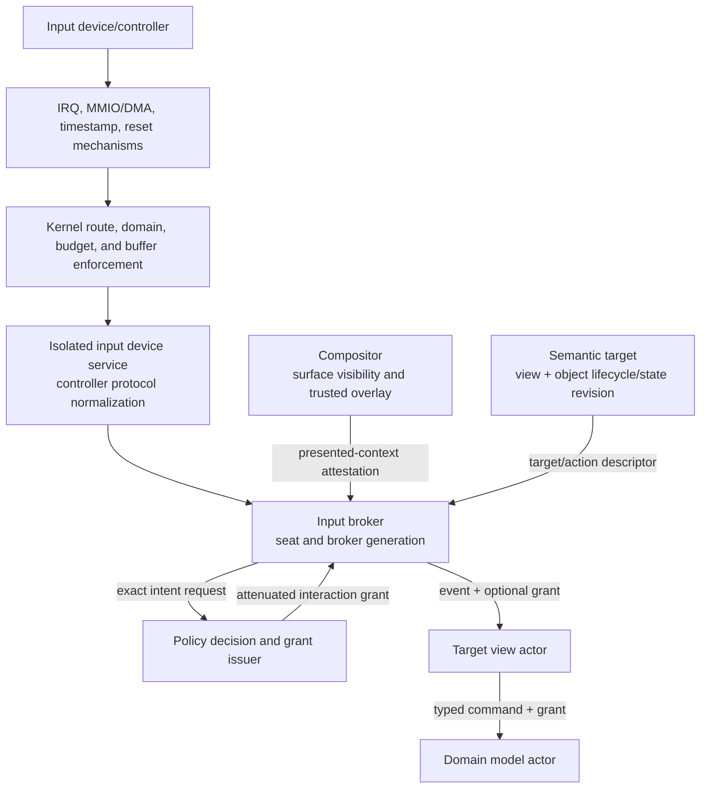
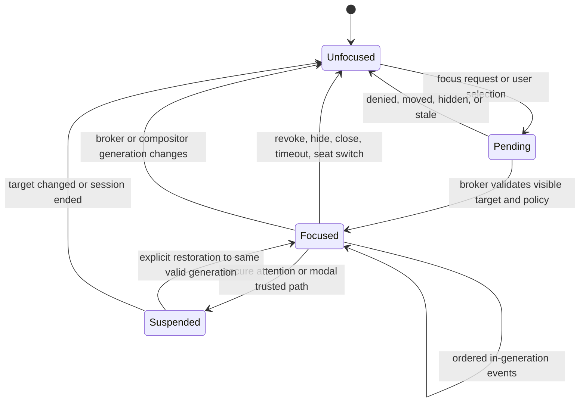
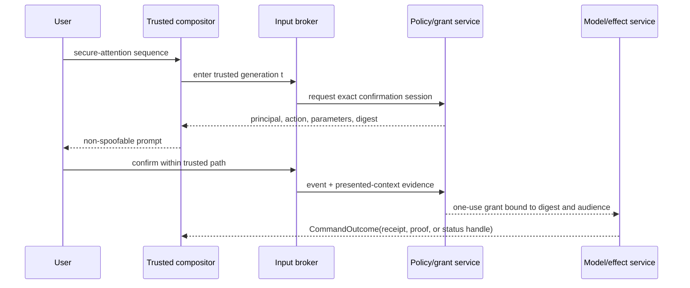

# Input, Focus, and Trusted-Interaction Authority

## Executive decision

Atom OS should treat authenticated user interaction as a possible source of
**narrow, short-lived authority**, not as a stream of untrusted callbacks and
not as ambient permission. A protected user-space input broker combines a
hardware-originated event with current seat, focus, surface, semantic target,
visibility, policy, and session generations. For operations that express
resource-selection or consent, it emits authenticated interaction evidence to
a confined policy/grant issuer, which may derive an audience-bound capability
for the exact object, action, and lifetime. Ordinary events carry no additional
authority.

Focus, pointer capture, drag-and-drop, clipboard use, global shortcuts, screen
capture, accessibility control, and secure prompts are distinct lease or
transaction types. They must not be hidden flags in a global desktop process.
A compositor or broker restart closes old generations; focus and interaction
authority are re-established explicitly rather than inferred from geometry or
replayed input.

## Question and operational standard

The component asks: **how can Atom OS capture what a person actually selected
or authorized while preventing spoofing, focus theft, confused-deputy use, and
replay across independent UI services?**

The design passes only if:

- applications cannot forge the trusted chrome or semantic identity used to
  request derivation of a grant;
- an input event names its provenance and current routing generations;
- a grant identifies one audience, resource, operation, parameter ceiling,
  expiry, and revocation epoch;
- occlusion, movement, replacement, restart, timeout, or semantic-target change
  invalidates sensitive pending interaction;
- non-pointer modalities receive equivalent intent and trusted-path treatment;
- clipboard, drag, capture, and global-shortcut authority is never inferred
  from ordinary focus;
- compromised clients cannot observe raw input for other clients; and
- overload cannot reorder press/release, focus, secure-attention, or grant
  events into a different action.

## Evidence and limits

[User-driven access control](../../30-sources/roesner-et-al-2012-user-driven-access-control.md)
demonstrates that trusted resource-selection widgets can bind permission to a
meaningful in-context user action and outperform disconnected prompts for the
studied tasks. [Clickjacking research](../../30-sources/huang-et-al-2012-clickjacking-attacks-and-defenses.md)
shows that authentic target routing is insufficient when an attacker can
misrepresent visibility, geometry, timing, or context. [Yee's secure-interaction
principles](../../30-sources/yee-2002-user-interaction-design-secure-systems.md)
explain why distinguishable trusted paths and faithful authorization
interfaces matter. [Nitpicker](../../30-sources/feske-helmuth-2005-nitpicker.md)
provides a small secure-GUI precedent; [Android Protected
Confirmation](../../30-sources/android-project-2026-protected-confirmation.md)
shows a current hardware-backed confirmation design whose token is bound to
displayed content.

These sources cover different environments and modalities. None proves the
complete Atom OS broker. Clickjacking thresholds do not transfer directly to
voice or switch input, protected confirmation covers narrow high-value
messages rather than routine desktop use, and trusted UI cannot protect users
from every deceptive but accurately displayed request.

## Trust and responsibility boundary

The trusted interaction path includes only what must establish event origin,
route, final presented context, and grant derivation:

- lower hardware/architecture mechanisms for IRQ delivery, raw timestamps,
  MMIO/DMA isolation, reset, and fault evidence;
- isolated device services that program controllers and normalize HID or other
  device protocols into typed input records;
- kernel enforcement for input-device, shared-buffer, IPC, scheduling, and
  display authority;
- a narrowly privileged input broker;
- the compositor's final placement/occlusion and trusted-overlay mechanism;
- policy and grant services that evaluate the exact requested authority; and
- optional stronger hardware or isolated confirmation for high-risk actions.

It excludes ordinary toolkit controls, layout engines, application renderers,
model actors, clipboard-format parsers, thumbnailers, and remote client code.
Those components may request or consume grants but cannot assert trusted user
intent or derive authority from it.



The compositor reports what it actually composed, not what a client intended
to draw. The semantic publisher reports the logical action. The policy service
decides whether that action may derive authority. The broker binds them to one
physical or assistive interaction.

## Event and grant records

### Routed input event

```text
RoutedInputEvent {
  event_id, hardware_sequence, monotonic_time,
  device_class, seat_id, seat_generation,
  broker_incarnation, compositor_generation,
  focused_surface_id, surface_generation,
  view_session_id, view_generation,
  event_kind, bounded_payload, provenance_flags
}
```

Coordinates are expressed in both trusted output space and target-local space
with the transform generation used. Text input distinguishes physical key,
logical key, composed text, and input-method composition. Accessibility and
voice actions identify their authenticated session and semantic target rather
than fabricating pointer coordinates.

### Interaction-derived grant

```text
InteractionGrant {
  grant_id, event_id, subject_session, audience_domain,
  target_model_version_ref: {
    identity: {project_id, logical_object_id, object_lifecycle_generation},
    state_revision, schema_epoch
  },
  operation, parameter_ceiling,
  policy_revision, relationship_revision,
  view_generation, compositor_generation,
  issued_at, expiry, usage_policy, consumption_handle,
  issuer_epoch, revocation_epoch,
  confirmation_digest?
}
```

The grant is an opaque live capability or a handle to one, not a client-editable
record. The descriptive form is available for audit and explanation. A model
validates target, operation, audience, generations, use count, current
revocation, and parameter bounds at the point of effect.

`usage_policy` is enforced at the resource-owning sink, never by a counter in a
copyable client token. For a one-use grant, every copy names the same
`consumption_handle`; admission atomically changes that handle from open to
consumed together with recording `operation_id`. A duplicate request with that
operation ID returns the recorded outcome, while a different operation is
rejected. A bounded multi-use grant uses a sink-owned reservation counter. If
the authoritative consumption state is unreachable, the sink returns
`Indeterminate` or fails closed; it does not spend an offline copy.

## Focus is a lease

`FocusLease` binds a seat to one input destination and compositor generation.
It is issued by broker policy after an authenticated transition and includes
expiry, modality, focus reason, and a monotonically increasing seat-focus
sequence.



Programmatic “request focus” is a request, not authority. A background client
may signal urgency through a notification service but cannot seize a seat.
Focus restoration after desktop restart is a new policy decision. Sensitive
prompts never regain focus merely because their title, location, or object ID
matches a previous window.

## Pointer and touch capture

Capture is an expiring lease for a specific gesture and surface generation.
The broker grants it only after an initiating in-surface event or an explicit
system gesture. It carries allowed event classes, bounds, cancel behavior, and
a maximum duration. On client stall, focus loss, surface replacement, secure
attention, or generation change, the broker emits one terminal cancellation
when possible and revokes capture.

Capture does not grant screen coordinates, screen capture, other-window input,
or model mutation. Relative pointer confinement and raw-device modes require
separate high-friction grants because they can obscure escape and observation.

## Drag-and-drop as a transfer transaction

A drag is not shared mutable clipboard state. It is a brokered session:

1. the source presents a typed offer containing safe metadata and opaque item
   handles;
2. the broker creates `DragSession(source, seat, generation, expiry)`;
3. candidate targets receive only type summaries and permitted preview data;
4. a visible drop action selects target and requested operation;
5. policy derives a one-use transfer capability from source to target;
6. source and target negotiate a bounded stream or object-reference transfer;
7. move semantics commit only after target receipt is durable and source
   deletion is separately authorized; and
8. timeout or uncertain outcome becomes a visible reconciliation state.

An untrusted file/media parser runs outside the broker and compositor. Hovering
a target never grants it access to the payload.

## Clipboard authority

Clipboard operations use per-seat, per-project offers and requests rather than
ambient global reads.

- Copy publishes typed formats and an expiry under a `ClipboardOffer`.
- Paste is a user action that authorizes the focused audience to request one or
  selected formats.
- Background polling, format enumeration, and historical access require
  separate disclosed capabilities.
- Secret sources can mark data non-exportable or require a stronger trusted
  confirmation; the system still avoids pretending all clipboard content is
  harmless.
- Format conversion occurs in isolated providers with byte, time, nesting, and
  output-size bounds.
- A clipboard manager is an explicit history principal, not invisible system
  memory.

## Global shortcuts and secure attention

Global shortcuts are scarce system authority. Registration is namespaced,
conflict-resolved by policy, disclosed to the user, bounded in number and rate,
and represented by an expiring lease. Security-reserved sequences cannot be
registered by ordinary clients.

Secure attention enters a compositor/broker state ordinary surfaces cannot
imitate. It identifies the trusted path and current requesting principal,
freezes or visually separates untrusted content, and binds any confirmation to
the exact semantic operation and displayed parameters. For high-consequence
operations a protected-confirmation backend may sign or MAC the digest.



## Screen capture and remote control

Screen capture is not implied by the ability to submit a surface. A capture
grant names outputs, surfaces or regions, excluded protected content, cursor
policy, audio, resolution, frame rate, duration, indicator behavior, and
audience. Compositor enforcement prevents a capture client from reading other
buffers directly.

Remote control additionally authenticates a remote subject, chooses a local
seat or separate virtual seat, displays persistent local indication, and
supports immediate local revocation. Remote injected events keep remote
provenance; they cannot satisfy local secure-attention or presence requirements
unless an explicit policy says so.

## Context-integrity checks

Before asking the issuer to derive a sensitive grant, the broker verifies:

- the semantic target and requested action still match the displayed view;
- the target has been stably visible and sufficiently unobscured according to
  its modality-specific confirmation profile;
- no untrusted transform or overlay changed after the initiating event;
- press and release, dwell, voice confirmation, or switch sequence belong to
  the same trusted interaction session;
- focus/capture was not transferred mid-gesture;
- event time lies within the grant window; and
- the user can still perceive the principal, resource, and consequence through
  the selected access modality.

These checks implement the context-integrity lesson from [Huang et
al.](../../30-sources/huang-et-al-2012-clickjacking-attacks-and-defenses.md)
without assuming visual pixel percentage is correct for every modality.

## Layer placement

| Layer | Input-authority responsibility |
| --- | --- |
| Kernel hardware and architecture support | Provide IRQ delivery, raw monotonic timestamps, MMIO/DMA/IOMMU, ordering, reset, and architecture-fault mechanisms; no HID or device-protocol interpretation. |
| Minimal privileged kernel | Bind device, input-buffer, display, IPC, scheduling, and memory capabilities to protected domains; enforce revocation, teardown, and resource budgets. |
| Managed actor runtime | Broker/client actors, ordered protocol messages, timers, monitors, serialization, mailbox bounds, and actor incarnations. |
| OTP-like system services | Isolated input-device driver lifecycle and normalization, broker lifecycle, seat/session policy, exact authorization decisions, grant issuance, clipboard/drag/capture services, configuration, telemetry, durable outcomes, and audit. |
| Visual-computing services | Final composition evidence, focus/capture arbitration, semantic targeting, trusted overlays, modality integration, and user-visible grant management. |
| Domain actors | Interpret typed commands, validate grants at the effect boundary, preserve idempotency/outcomes, and expose accurate consequence semantics. |

The broker and compositor are highly trusted user-space services with recovery
reserve, not kernel UI policy. The kernel enforces that only their current
domains hold the lower input/display authority.

## Overload and failure rules

- Security attention, focus transition, capture termination, and grant events
  use bounded reserved queues and cannot be coalesced with ordinary motion.
- Pointer motion may coalesce with an explicit dropped-count and last sample;
  button, key, touch-contact, and composition transitions preserve order.
- A stalled client loses capture before it can exhaust broker memory.
- Broker failure closes all focus, capture, drag, clipboard-read, shortcut, and
  pending-confirmation generations; it does not replay queued input on restart.
- Compositor failure closes any grant whose context depended on the failed
  composition generation.
- Input-device reset advances a device generation, preventing late completion
  or reused sequence numbers from becoming a new event.
- Audit failure follows declared fail-open/fail-closed policy by action class;
  high-consequence grants fail closed, while ordinary typing need not depend on
  synchronous remote logging.

## Alternatives considered

| Alternative | Strength | Decision |
| --- | --- | --- |
| Application permissions at install time | Simple static review | Insufficient for selecting a particular user object or one-time action; retained only for broad eligibility ceilings. |
| Prompt before every sensitive action | Explicit and familiar | Retained selectively, but disconnected prompts cause habituation and lose in-context intent. |
| Focus implies clipboard/capture/input authority | Simple desktop convention | Rejected; each authority has different disclosure, lifetime, and consequence. |
| Compositor directly executes domain actions | Strong knowledge of visible context | Rejected as a confused deputy and policy concentration; it supplies context evidence to a separate grant/effect path. |
| Kernel window manager and input policy | Small number of transitions | Rejected unless unavoidable enforcement is demonstrated; keep semantics and UX replaceable in isolated user space. |
| Signed visual screenshot as universal intent proof | Auditable artifact | Rejected for nonvisual modalities and because displayed pixels alone do not establish comprehension or target semantics. |

## Staged implementation

1. Define seats, event provenance, focus leases, generation rules, and an input
   protocol simulator without real hardware.
2. Implement one pointer/keyboard broker and software compositor in separate
   domains with stale-event, focus-theft, and restart tests.
3. Add user-driven file/object selection with one-use grants and model-side
   validation.
4. Add drag/drop and clipboard transaction protocols plus isolated format
   conversion.
5. Add trusted attention, protected confirmation backend, screen capture,
   remote seats, and accessible non-pointer confirmation.
6. Verify multiple hardware backends, multiple compositors, and recovery under
   malicious clients and resource exhaustion.

## Required experiments and falsifiers

- Reproduce clickjacking classes: transparency, occlusion, cursor hiding,
  rapid movement, target replacement, double-click, drag, and timing attacks.
- Inject broker, compositor, policy, and client crashes before and after every
  press/release and grant transition; no old event may authorize a new
  generation.
- Attempt clipboard polling, drag preview exfiltration, screen-capture bypass,
  shortcut squatting, focus theft, and fake secure overlays from compromised
  clients.
- Run the same grant task with pointer, keyboard, screen reader, switch access,
  voice, and remote input; record errors and perceived principal/consequence.
- Flood motion and input-method events while issuing secure attention; the
  trusted path must remain bounded and ordered.
- Lose the response after an authorized external effect; the UI must reconcile
  the existing operation ID instead of asking the user to unknowingly repeat it.

The design is falsified if untrusted pixels can mint authority, if ordinary
focus unlocks unrelated channels, or if secure interaction is inaccessible to
the users who most rely on alternate input.

## Connections

- [Umbrella visual-interface synthesis](../alan-kay-smalltalk-visual-interface-and-modern-desktop.md) —
  proposes treating input as authority.
- [Semantics-first accessible UI protocol](semantics-first-accessible-ui-protocol.md) —
  supplies the logical action and target bound into a grant.
- [Durable semantic actors and disposable presentation](durable-semantic-actors-and-disposable-presentation.md) —
  closes input and focus generations during presentation restart.
- [Authentication and authorization across the five-layer architecture](../authentication-and-authorization-across-the-five-layer-architecture.md) —
  supplies exact policy, relationship, grant, revocation, and trusted-path
  services.
- [Visual-computing model inquiry](../../40-inquiries/what-visual-computing-model-should-atom-os-adopt.md) —
  retains the security and usability falsifiers.

## Sources

- [User-Driven Access Control](../../30-sources/roesner-et-al-2012-user-driven-access-control.md)
- [Clickjacking: Attacks and Defenses](../../30-sources/huang-et-al-2012-clickjacking-attacks-and-defenses.md)
- [User Interaction Design for Secure Systems](../../30-sources/yee-2002-user-interaction-design-secure-systems.md)
- [A Nitpicker's Guide to a Minimal-Complexity Secure GUI](../../30-sources/feske-helmuth-2005-nitpicker.md)
- [Android Protected Confirmation](../../30-sources/android-project-2026-protected-confirmation.md)
- [Wayland Architecture and Protocol](../../30-sources/wayland-project-2026-architecture-and-protocol.md)
- [The Confused Deputy](../../30-sources/hardy-1988-confused-deputy.md)
