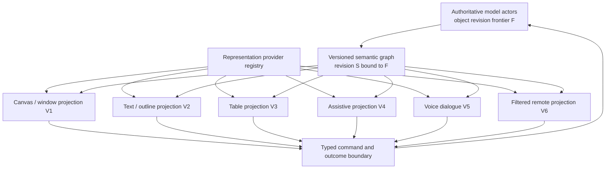
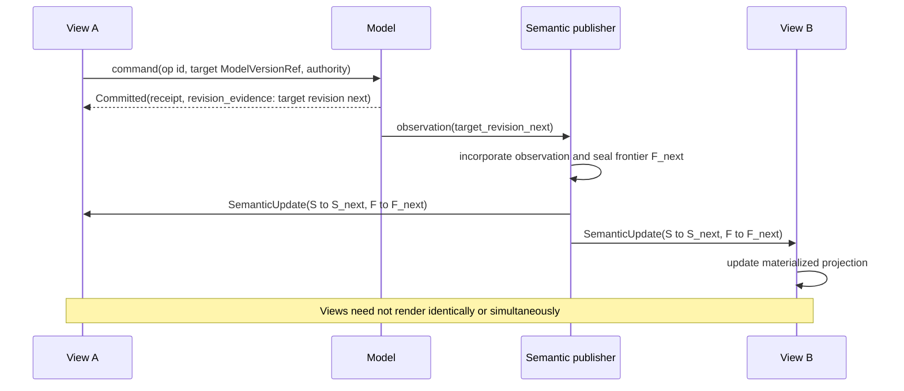

# Plural Representations and Cross-View Consistency

## Executive decision

Atom OS should support **one authoritative semantic/model graph with many
access-controlled materialized interaction projections**. A semantic object may
have a visual canvas, text outline, table, code representation, screen-reader
traversal, voice dialogue, tactile view, automation API, or remote collaborative
view at the same time. None is automatically canonical merely because it is
graphical, textual, first installed, or currently focused.

Plural views must not be sold as perfect interchangeability. Modalities can
carry complementary information, use different ordering and grouping, and
support different subsets of editing. The consistency contract preserves
logical identity, declared observations, domain actions, authority checks, and
effect outcomes. It does not require identical tree shape, pixels, vocabulary,
or number of interaction steps.

Most views should be read-only or command-producing. Direct editable
projections are admitted only with an explicit backward-update policy, domain
validation, authority, concurrency behavior, and rejection path. Lens laws can
prove useful round trips for bounded structured transformations; they cannot
make an arbitrary visualization invertible.

## Question and operational standard

The component asks: **how can users choose or combine representations without
forking the meaning, authority, and history of the underlying project?**

It succeeds only when:

- two views refer to the same durable logical object despite distinct local
  node identities and hierarchies;
- a committed model action eventually produces a declared equivalent
  observation in every authorized current view;
- edits from a projection become typed model commands rather than private
  renderer mutations;
- lossy or ambiguous edits are rejected, clarified, or preserved as explicit
  conflicts;
- voice, assistive, and visual interaction can differ while every essential
  task remains reachable under its profile;
- collaboration converges only for declared data types and never merges
  authority or irreversible effects;
- slow, failed, or disconnected views resynchronize from a complete revision;
  and
- installing a new view provider requires no privileged-kernel change or
  extension of one closed universal domain taxonomy.

## Evidence and limits

[Single Application Model, Multiple Synchronized
Views](../../30-sources/hosn-et-al-2001-single-application-model-multiple-views.md)
provides direct architectural evidence for visual and speech access paths
coordinated through one application model. The [CAMELEON
framework](../../30-sources/calvary-et-al-2003-multi-target-user-interface-framework.md)
separates domain/task, abstract interaction, concrete interaction, and final
presentation. [SUPPLE](../../30-sources/gajos-et-al-2010-personalized-user-interfaces-supple.md)
shows that generated alternatives can improve measured accessibility outcomes
in a bounded task model. [Oviatt](../../30-sources/oviatt-1999-ten-myths-multimodal-interaction.md)
shows why modalities should be treated as complementary, user- and
task-dependent channels rather than redundant encodings.

[Bidirectional tree transformations](../../30-sources/foster-et-al-2007-bidirectional-tree-transformations.md)
formalize round-trip obligations and the need to preserve information omitted
from a view. [CRDT theory](../../30-sources/shapiro-et-al-2011-conflict-free-replicated-data-types.md)
provides convergence conditions, while [cooperative-editing
research](../../30-sources/sun-et-al-1998-cooperative-editing-consistency.md)
separates convergence, causality, and operation intention.

None establishes universal cross-view equivalence. SUPPLE reports modeling
cost and a limited interaction domain; lens laws omit concurrency and
authorization; CRDT convergence does not establish domain intent; and older
multimodal studies do not cover current assistive platforms or distributed
actors. The Atom OS contract is therefore deliberately explicit and
falsifiable.

## Representation provider contract

A provider publishes an immutable descriptor:

```text
RepresentationProvider {
  provider_id, package_digest, publisher_identity,
  input_semantic_profiles, output_view_profiles,
  supported_object_types, schema_ranges,
  modes: Set<ReadOnly | CommandProducing | Bidirectional>,
  action_mappings, round_trip_claims,
  accessibility_profile, localization_profile,
  resource_profile, disclosure_profile,
  compatibility_tests, version
}
```

Registration says the provider is available; it does not grant project access.
Binding to a project requires user or policy selection, compatible schemas,
resource admission, and derived observation/action capabilities. A provider is
replaceable and receives no more semantics than its representation needs.

Provider extensions use namespaced roles, types, and actions layered on a
small core protocol. They cannot demand that the kernel or central semantic
registry understand every scientific, artistic, educational, or commercial
domain concept.

## Equivalence contract

Define equivalence per representation profile rather than with one vague
“same UI” claim:

| Dimension | Required question |
| --- | --- |
| Identity | Which `ModelIdentity` does this element or utterance denote? |
| Observation | Which model fields, relations, and revisions are represented, summarized, omitted, or aggregated? |
| Action | Which typed domain commands are reachable and with what parameter mapping? |
| Effect | Does the same authorized command reach the same domain boundary and outcome protocol? |
| Authority | Does the view request exactly the same or a deliberately narrower capability, never a broader implicit one? |
| Temporal | Against which object revision frontier is the observation current, and how are lag, pending work, and indeterminate effects shown? |
| Accessibility | Can users complete the essential task through the intended modality and access technology? |
| Localization | Do message identity, typed arguments, action target, and consequence survive locale and direction changes? |
| Loss | What information cannot be represented or edited, and how is that disclosed? |

Two views can be equivalent for a task while having different hierarchy and
steps. A map and table may expose the same locations and actions but emphasize
spatial versus sortable relations. A voice view may serialize choices and ask
confirmation where a visual view can present them concurrently. These are
valid differences if the profile states them.

## Projection architecture



Every projection starts from a filtered complete semantic snapshot and applies
only exact-base deltas. It owns presentation-local layout, expansion, cursor,
and caches. Project policy decides whether preferences such as saved zoom,
columns, or reading position are durable and private, shared, or disposable.

## Three editing modes

### Read-only projection

The view observes semantics and may change only local presentation state. It
is the safest default for unfamiliar or lossy representations. Copy/export is
still a separate authorized action because observation does not imply
disclosure to another principal.

### Command-producing projection

User interaction selects a named `ActionDescriptor` and supplies typed
arguments. The model validates authority, current revision, preconditions, and
domain invariants. Most buttons, menus, screen-reader actions, voice commands,
and direct-manipulation gestures should use this mode.

### Bidirectional projection

The provider declares a forward `get` and backward `put` relation for a
constrained data shape plus round-trip laws and conflict policy:

```text
get(source_revision) -> view
put(source_revision, old_view, edited_view) ->
  ProposedModelCommands | NeedsClarification | Conflict | Rejected
```

The result is a proposed command set, not a direct overwrite. The model still
checks authorization and invariants. A well-behaved lens should make viewing an
unchanged source stable and make an accepted view update visible when projected
again, but lossy data requires a complement or rejection. [Foster et
al.](../../30-sources/foster-et-al-2007-bidirectional-tree-transformations.md)
provide the formal foundation and its boundary.

## Cross-view update protocol



If B missed the base revision, it requests a complete snapshot. If A's edit is
`AcceptedPending` or `Indeterminate`, A shows the pending operation and does not
locally pretend the model committed. Optimistic presentation is allowed only
when it is visibly provisional and can reconcile to `Committed`,
`NotCommitted`, `Terminated`, `RejectedBeforeAdmission`,
`ExpiredBeforeAdmission`, `Fenced`, or `Indeterminate` under the shared
command-outcome lattice.

## Multimodal interaction sessions

Voice, gesture, gaze, pen, touch, switch, and keyboard inputs carry different
timing, confidence, privacy, and error characteristics. A multimodal
interaction manager maintains a bounded session:

```text
Interpretation {
  session_id, modality, semantic_candidates,
  confidence, start_time, end_time,
  referenced_model_version_refs, view_revision,
  provenance, privacy_label
}
```

It may fuse complementary interpretations such as spoken “put that there” plus
pointing, but resolves “that” and “there” against explicit semantic identity
and session time. Low-confidence or consequential actions request clarification
or trusted confirmation. One channel does not inherit another's authority
merely because their timestamps overlap.

[Oviatt's findings](../../30-sources/oviatt-1999-ten-myths-multimodal-interaction.md)
reject a simplistic assumption that every user will say and point the same
information simultaneously. Evaluation must include modality switching,
sequential input, recognition errors, privacy constraints, and varied users.

## Collaboration and remote views

Replicate model operations or domain data, not pixels or materialized
presentation trees. Each collaborative object declares one of:

- a proven merge algebra with versioned semantics;
- a causally ordered operation protocol plus commutativity, operational
  transformation, deterministic arbitration, or explicit conflict handling
  for concurrent noncommutative operations;
- a fenced single-writer or coordinator;
- an explicit conflict object requiring human/domain resolution; or
- non-replicability for the effectful or secret state.

[CRDTs](../../30-sources/shapiro-et-al-2011-conflict-free-replicated-data-types.md)
can make replicas converge under specific algebra and delivery assumptions.
[Nested JSON CRDT research](../../30-sources/kleppmann-beresford-2017-conflict-free-json.md)
shows both useful retention of concurrent updates and problematic delete/update,
move, schema, undo, and global-invariant cases. [Sun et
al.](../../30-sources/sun-et-al-1998-cooperative-editing-consistency.md)
show why convergence, causality, and operation intention are distinct.

Atom OS adds two hard rules:

1. merge convergence never grants authority—each admitted edit is bound to a
   policy, relationship, object, and revocation generation; and
2. a replicated model update never replays an external effect unless the
   effect sink participates in the same durable idempotency/outcome protocol.

[Collaborative access-control research](../../30-sources/cherif-et-al-2014-access-control-collaborative-editors.md)
shows that independently replicated content and policy can accept forbidden or
reject permitted edits. Offline edits whose authority cannot yet be proved may
remain private proposals; they do not become published state by ordinary
merge.

## Progressive authorship across views

Plural representation supports Kay's action–image–symbol learning gradient
when connections are visible:

- selecting an object reveals its stable semantic identity and current
  representation providers;
- invoking an action can reveal the typed command and affected model fields
  without exposing secrets;
- an inspector can show why a derived value or annotation exists;
- a user can duplicate and modify a provider in a confined project scope;
- views can be placed side by side with synchronized semantic selection; and
- reusable publication is a separate reviewed transition.

[Potluck](../../30-sources/litt-et-al-2022-potluck-dynamic-documents.md)
demonstrates the value of moving gradually from free-form documents to
searches, computations, annotations, and structured views, while warning that
text and JavaScript are not universal representations. [Direct-manipulation
analysis](../../30-sources/hutchins-et-al-1985-direct-manipulation-interfaces.md)
warns that visible action can reduce distance for concrete tasks while hiding
powerful symbolic abstraction.

## Layer placement

| Layer | Plural-view responsibility |
| --- | --- |
| Kernel hardware and architecture support | Display, input, timestamp, DMA, ordering, and fault mechanisms; no representation taxonomy. |
| Minimal privileged kernel | Isolate providers, enforce buffers/capabilities/budgets, and revoke stale domains and device resources. |
| Managed actor runtime | Model/view actors, typed message transport, serialization, actor generations, flow control, safe points, and distribution gateway. |
| OTP-like system services | Provider/schema registry, project persistence, collaboration sessions, conflict objects, localization, updates, overload policy, telemetry, and audit. |
| Visual-computing services | Semantic projection engine, provider negotiation, synchronized selection, multimodal manager, renderer/accessibility/remote adapters, and view conformance tools. |
| Domain actors | Authoritative meaning, invariants, action semantics, merge algebra, conflicts, effects, and acceptance of proposed updates. |

## Security, privacy, and resource invariants

- A provider receives only the filtered objects, fields, relations, and actions
  its binding authorizes.
- View selection never widens project authority; an inaccessible object remains
  inaccessible in every modality.
- Remote semantic streams are disclosure channels and are separately granted,
  encrypted, rate-limited, and audited.
- Voice and gaze data may reveal sensitive context and have explicit retention
  and export policy.
- Bidirectional providers cannot return capabilities, arbitrary code, or
  unbounded command lists from a `put` operation.
- Each view has snapshot size, delta rate, retained base, render work, action
  rate, memory, and subscriber budgets.
- Provider failure or overload cannot block model progress indefinitely; the
  system coalesces derivable generations or disconnects and resynchronizes.
- Cross-view selection and focus are separate; selecting in a remote or
  assistive view does not steal local input focus unless policy explicitly
  grants it.

## Alternatives considered

| Alternative | Strength | Decision |
| --- | --- | --- |
| One canonical graphical view | Consistent product design | Rejected as universal meaning; allowed as one preferred project view. |
| One canonical text/code representation | Inspectable and portable | Rejected for spatial, sensory, motor, and domain-specific tasks; retained as valuable fallback/export where possible. |
| Duplicate application logic per modality | Each UI can optimize independently | Rejected because state, action, and authority semantics drift; modality-specific interaction remains allowed over shared domain commands. |
| Automatic round-trip generation for every view | Maximum flexibility | Rejected because many projections are lossy or ambiguous. |
| Replicate presentation trees for collaboration | Simple remote mirroring | Allowed for passive screen sharing only; rejected as durable collaborative meaning. |
| Universal CRDT project graph | Offline convergence | Rejected for authority, global invariants, schema transitions, conflicts, and external effects. |

## Staged implementation

1. Define equivalence profiles and implement one model with visual and text
   read-only projections from the semantic snapshot protocol.
2. Add command-producing screen-reader and table views; run identical task and
   outcome tests across all views.
3. Implement one law-checked bidirectional projection with explicit lossy-case
   rejection and domain validation.
4. Add synchronized selection and a voice-plus-pointer interaction manager with
   confidence and clarification.
5. Add one CRDT-backed collaborative object, one fenced object, and explicit
   conflict UI; keep authority in a separate revisioned service.
6. Admit an independently implemented provider and demonstrate installation,
   binding, restart, replacement, and uninstallation without data loss.

## Required experiments and falsifiers

- Define essential tasks for a mixed-media project and execute each through
  visual, keyboard, screen-reader, text, voice, and remote profiles; compare
  outcomes rather than identical steps.
- Property-test lens round trips, complements, validation, and rejection; fuzz
  edits that delete hidden or aggregated data.
- Delay, reorder, duplicate, and drop semantic updates; every view must detect
  stale bases and converge by snapshot without issuing duplicate commands.
- Create concurrent edits that converge structurally but violate domain intent;
  the system must expose conflict or reject, not claim success.
- Revoke a collaborator offline, submit later edits, and prove data merge
  cannot reinstate membership or effect authority.
- Switch locale, direction, modality, device, and provider during active work;
  logical identity, selection, pending outcomes, and action targets must remain
  correct.
- Compromise each provider and attempt semantic overread, command amplification,
  focus theft, capability return, and resource exhaustion.
- Test novice movement from direct action to symbolic explanation and creation
  of a reusable confined view; measure transfer to a new task.

The proposal is falsified if one view contains the only copy of an edit, if a
view can broaden authority through translation, or if replica convergence is
presented as proof that users' meaning was preserved.

## Connections

- [Umbrella visual-interface synthesis](../alan-kay-smalltalk-visual-interface-and-modern-desktop.md) —
  proposes not forcing one representation.
- [Semantics-first accessible UI protocol](semantics-first-accessible-ui-protocol.md) —
  supplies the common graph, actions, snapshots, and deltas.
- [User-owned project graph](user-owned-project-graph-and-composition.md) —
  owns logical identity, provider binding, history, and collaboration policy.
- [Capability-scoped live tools](capability-scoped-live-tools-and-transactional-evolution.md) —
  provides inspectable and editable representation tooling.
- [Input and trusted-interaction authority](input-focus-and-trusted-interaction-authority.md) —
  prevents a modality adapter from manufacturing authority.
- [Visual-computing model inquiry](../../40-inquiries/what-visual-computing-model-should-atom-os-adopt.md) —
  retains the equivalence, accessibility, and collaboration questions.

## Sources

- [Single Application Model, Multiple Synchronized Views](../../30-sources/hosn-et-al-2001-single-application-model-multiple-views.md)
- [CAMELEON Reference Framework](../../30-sources/calvary-et-al-2003-multi-target-user-interface-framework.md)
- [SUPPLE](../../30-sources/gajos-et-al-2010-personalized-user-interfaces-supple.md)
- [Ten Myths of Multimodal Interaction](../../30-sources/oviatt-1999-ten-myths-multimodal-interaction.md)
- [Combinators for Bidirectional Tree Transformations](../../30-sources/foster-et-al-2007-bidirectional-tree-transformations.md)
- [Conflict-Free Replicated Data Types](../../30-sources/shapiro-et-al-2011-conflict-free-replicated-data-types.md)
- [A Conflict-Free Replicated JSON Datatype](../../30-sources/kleppmann-beresford-2017-conflict-free-json.md)
- [Cooperative Editing Consistency](../../30-sources/sun-et-al-1998-cooperative-editing-consistency.md)
- [Access Control for Distributed Collaborative Editors](../../30-sources/cherif-et-al-2014-access-control-collaborative-editors.md)
- [Local-First Software](../../30-sources/kleppmann-et-al-2019-local-first-software.md)
- [Potluck](../../30-sources/litt-et-al-2022-potluck-dynamic-documents.md)
- [Direct Manipulation Interfaces](../../30-sources/hutchins-et-al-1985-direct-manipulation-interfaces.md)
