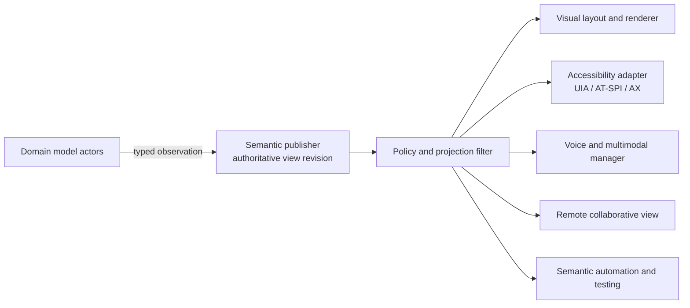
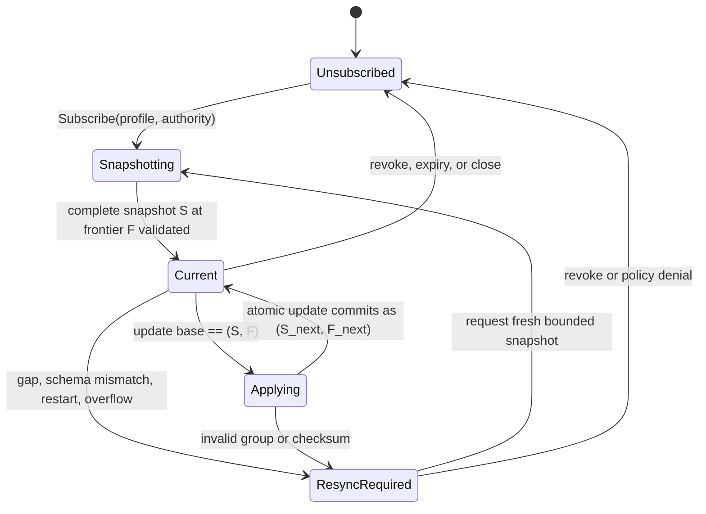

# Semantics-First Accessible UI Protocol

## Executive decision

Atom OS should define a native, versioned **semantic interaction graph** as the
common publication boundary between domain models and visual, assistive,
automation, voice, testing, and remote-view services. It must contain logical
identity, role, names, typed values and state, relationships, actions, focus,
selection, localization, privacy, revisions, and ordered changes. Pixels and
widget objects are projections; they are never the only source of meaning.

The system should have one authoritative semantic publication for a view
generation, but not one literal tree shape for every consumer. Adapters may
filter, flatten, merge, virtualize, reorder, or translate nodes. Equivalence is
defined by the logical objects, available meaning, authorized actions, and
observable domain effects—not by identical hierarchy or interaction steps.

The protocol must extend, not merely copy, WAI-ARIA. WAI-ARIA provides a mature
minimum vocabulary, while Atom OS additionally needs durable model identity,
view generations, capability requirements, typed outcomes, coherent
snapshots, replay/gap recovery, least-disclosure filtering, and overload rules.

## Question and operational standard

The component asks: **what semantic contract lets independently implemented
views remain accessible and consistent across process, renderer, modality,
locale, and machine boundaries?**

It succeeds only when:

1. a nonvisual client can discover and invoke every essential task without
   reading pixels or private model memory;
2. a custom control exposes correct role, state, relationships, keyboard and
   assistive behavior, not just a label;
3. a consumer can detect a missing, duplicate, reordered, stale, or incompatible
   delta and request a complete snapshot;
4. semantic publication remains coherent during multi-node changes;
5. a semantic action advertises the authority it requires but does not itself
   grant that authority;
6. translated labels never serve as durable identity;
7. filtered remote or assistive views cannot infer redacted siblings or
   relations; and
8. real screen-reader, keyboard, switch, voice, magnification, and localized
   workflows pass task-based tests under restart and overload.

## Evidence and limits

[WAI-ARIA 1.2](../../30-sources/w3c-2023-wai-aria-1-2.md) defines an ontology
of roles, states, properties, and structural relationships; [Core-AAM
1.2](../../30-sources/w3c-2026-core-accessibility-api-mappings-1-2.md)
specifies how those semantics map to UI Automation, AT-SPI, macOS, Android,
and related platform APIs. [WCAG 2.2](../../30-sources/w3c-2024-wcag-2-2.md)
supplies task-relevant operability, name/role/value, status, keyboard, focus,
and robustness criteria.

[SUPPLE](../../30-sources/gajos-et-al-2010-personalized-user-interfaces-supple.md)
demonstrates that a declarative task/interface model can generate useful
ability- and device-specific alternatives in a bounded domain. The [CAMELEON
framework](../../30-sources/calvary-et-al-2003-multi-target-user-interface-framework.md)
separates task/domain, abstract interaction, concrete interaction, and final
presentation. [Hosn, Maes, and Raman](../../30-sources/hosn-et-al-2001-single-application-model-multiple-views.md)
demonstrate a common model behind synchronized visual and speech views.

These sources do not establish an OS-wide protocol. ARIA metadata can be wrong;
platform mappings are lossy; model-based generation has substantial modeling
cost and bounded applicability; and synchronized views do not solve authority,
distributed conflicts, or restart. The protocol below is a testable design
hypothesis.

## Semantic graph, not accessibility side table

The semantic graph is emitted as part of view construction before rendering.
Accessibility is therefore an ordinary first-class consumer, not a reverse
engineering stage after pixels exist.



The projection filter is consumer- and authority-specific. It receives a
semantic snapshot and produces a self-consistent subgraph; it cannot simply
remove a secret node while leaving labels, counts, indices, geometry, or
relations that reveal it.

## Identity model

Use two explicitly separate namespaces:

```text
ModelIdentity {
  project_id, logical_object_id, object_lifecycle_generation
}

ModelVersionRef {
  identity: ModelIdentity,
  state_revision, schema_epoch
}

PresentationRef {
  view_session_id, view_generation, node_id, node_generation
}
```

`ModelIdentity` remains meaningful across renderer, model-actor activation,
and accessibility-adapter restart. It is not a BEAM PID, memory address,
localized name, tree index, or platform accessibility handle. Two lagging views
can identify the same object while holding different `ModelVersionRef` values.
The lifecycle generation rejects a reference to a deleted-and-recreated object;
the state revision provides optimistic concurrency within that lifecycle.
`PresentationRef` is an efficient view-local handle and expires with the view
generation. A virtualized row may receive a new presentation handle while
continuing to refer to the same logical model object.

Not every semantic node needs a durable `ModelIdentity`: derived grouping,
presentation-only headings, and temporary progress affordances may be
view-local. Such nodes declare `origin: derived` and cannot be used as durable
command targets.

## Minimum semantic record

```text
SemanticNode {
  presentation_ref,
  model_version_ref?,
  role: {namespace, vocabulary_version, role_id},
  name: LocalizedMessage,
  description?: LocalizedMessage,
  value?: TypedValue,
  states: Set<TypedState>,
  relations: List<SemanticRelation>,
  actions: List<ActionDescriptor>,
  focus: FocusDescriptor,
  selection?: SelectionDescriptor,
  input_affordances: Set<Affordance>,
  presentation_hints?: Map,
  disclosure_label,
  node_revision
}
```

A `LocalizedMessage` contains a stable message identifier, typed arguments,
locale fallback policy, grammatical metadata where required, and direction
isolation—not a prelocalized string used as identity. A renderer can choose
layout and phrasing within the semantic promise, while accessibility adapters
can preserve the same name and action relationship.

Role is a behavioral promise. For example, publishing `slider` requires a
current value and range, increment/decrement or set-value operations,
appropriate focus/keyboard behavior, and change events. An unknown custom role
must declare a base role and namespaced extension; consumers may fall back
without mistaking it for a privileged operation.

## Actions and authority

An action descriptor is discoverable semantics, not a bearer grant:

```text
ActionDescriptor {
  action_id, action_kind, parameter_schema,
  target_model_version_ref, required_capability_type,
  consequence_class,
  confirmation_profile, idempotency_profile
}
```

Invocation is separate:

```text
ActionRequest {
  client_action_id, operation_id | null, action_id, target_model_version_ref,
  typed_arguments,
  interaction_evidence, presented_capability
}
```

The broker supplies the non-reusable `client_action_id`. The durable
application-admission boundary atomically binds it and the request digest to
`operation_id` before effectful dispatch; a disposable view never owns the only
recovery mapping. Authorized replacement views receive relevant unresolved
operation IDs with their fresh semantic snapshot.

The sink compares both lifecycle generation and state revision in
`target_model_version_ref`. Reusing a logical ID after delete/recreate cannot
make a stale action current, and a state conflict is reported rather than
silently applying an edit to a later version.

The model boundary returns one shared `CommandOutcome`:

- `RejectedBeforeAdmission(reason)` proves that no work was admitted; a new
  request may be made after addressing the reason;
- `ExpiredBeforeAdmission(evidence)` proves the deadline or interaction
  freshness ended before responsibility was admitted, and
  `Fenced(current_generation)` means a target lineage or generation is stale;
- `AcceptedPending(operation_id, status_handle)` means work was admitted but
  has no terminal outcome, so the client must query rather than retry;
- `Committed(receipt, revision_evidence)` is terminal success;
- `NotCommitted(proof)` is terminal proof that the named semantic commit did
  not occur, while `Terminated(reason, compensation_state)` says a workflow
  ended and may still have surviving visible effects; and
- `Indeterminate(reconciliation_handle)` means commit/effect status remains
  unknown and blind retry is unsafe.

For admitted work, deadline expiry is status metadata and does not replace
`AcceptedPending` or `Indeterminate`. `revision_evidence` is a tagged value scoped to the operation: for example an
object state revision, a project manifest revision, or a project revision
frontier. The variant name and retry meaning are shared; a command does not
pretend that every scope advances the same kind of revision.

Assistive, voice, pointer, and automation clients submit the same typed intent,
but acquire authority through their own authenticated interaction or delegated
automation session. The existence of `delete`, `pay`, or `share` in a semantic
graph never authorizes it.

## Snapshot and delta protocol

```text
SemanticUpdate {
  stream_id, publisher_incarnation,
  base_semantic_revision, new_semantic_revision,
  base_frontier_digest, new_frontier_digest,
  atomic_group, changes,
  focus_revision, completeness,
  checksum
}
```

Rules:

- Subscription begins with a bounded complete snapshot at semantic revision
  `S` bound to an immutable project frontier digest `F`.
- A delta applies only when its `publisher_incarnation`,
  `base_semantic_revision`, and `base_frontier_digest` exactly match local
  state. A presentation-only delta may carry the same base and new frontier;
  a model-derived delta names the newly sealed frontier digest.
- Gaps, reordering, unknown schema, checksum failure, publisher restart, or
  over-budget buffering cause a new snapshot request.
- An atomic group is exposed as busy/incomplete until all parts validate; the
  consumer never announces a half-moved subtree as stable.
- Derived presentation changes may coalesce to the newest complete generation.
  Focus transitions, user-visible status, command outcomes, and security
  events follow their declared non-coalescing policy.
- History retention is bounded by acknowledgements, leases, and explicit
  snapshot fallback; a slow consumer cannot pin every generation forever.

[Incremental-computation research](../../30-sources/cai-et-al-2014-theory-of-changes.md)
supports updating a result from a known base, but incremental evaluation is an
optimization beneath this externally checked revision protocol.



## Platform accessibility adapters

UIA, AT-SPI, macOS Accessibility, Android, and web bridges are unprivileged
adapters with narrow semantic subscriptions. Each adapter maintains a table
from `PresentationRef` to its platform handle and maps roles, properties,
relations, actions, focus, selection, and events according to an explicit
compatibility profile.

- A platform runtime ID is never promoted to `ModelIdentity`.
- Unsupported roles use documented fallback and retain an inspectable
  namespaced extension.
- Adapters cannot read more semantic state than the assistive session grants.
- Adapter restart invalidates platform handles, then reconstructs them from a
  complete semantic snapshot.
- Action callbacks return through the normal brokered action protocol; an
  adapter does not mutate semantic state directly.
- Compatibility tests compare adapter output to the pinned Core-AAM/profile
  version and then run real assistive workflows; mapping-table conformance
  alone is insufficient.

The official [Windows](../../30-sources/microsoft-2026-desktop-ui-architecture.md)
and [Apple](../../30-sources/apple-2026-desktop-ui-frameworks.md) documentation
shows why native platform interoperability matters while also demonstrating
that toolkit, lifecycle, and accessibility object identities are
platform-specific.

## Focus, selection, and cursors

The protocol must not compress every notion of focus into one Boolean:

- **input focus**: which view may receive a seat's next keyboard/text event;
- **active descendant**: the logical item active inside a composite widget;
- **assistive exploration cursor**: what an AT is currently reading;
- **selection**: domain or view objects selected for an operation;
- **text caret/composition**: insertion and input-method state;
- **voice dialogue referent**: the semantic scope of “this” or “that”; and
- **collaborator presence cursor**: another participant's disclosed location.

Each has its own owner, visibility, revision, and recovery policy. Only input
focus participates directly in the input-authority protocol. Moving an
assistive cursor or remote collaborator cursor must not steal local keyboard
focus.

## Layer placement

| Layer | Semantic-protocol responsibility |
| --- | --- |
| Kernel hardware and architecture support | Accurate input timestamps and display/input mechanisms; no roles, names, trees, or action policy. |
| Minimal privileged kernel | Domains, endpoints, buffers, capabilities, resource accounts, revocation, and generation-safe teardown for publishers and consumers. |
| Managed actor runtime | Semantic publisher/adapter actors, typed messages, serialization, scheduling, monitors, stream flow control, and actor incarnations. |
| OTP-like system services | Schema and provider registries, localization bundles, project/model identity resolution, subscription lifecycle, overload policy, telemetry, audit, and compatibility rollout. |
| Visual-computing services | Native semantic schema, projection filters, platform adapters, view supervision, layout/renderer inputs, voice/multimodal coordination, and semantic test tools. |
| Domain actors | Correct names, values, relationships, invariants, action meanings, consequence classifications, and authorization targets. |

## Privacy, security, and overload

- Semantic output can reveal more than pixels, including off-screen text,
  relationships, actions, history, and hidden states. Least-disclosure filters
  are mandatory.
- Password and secret controls expose role, state, and safe action semantics
  while redacting protected value; policy decides which trusted assistive
  sessions receive additional access.
- Geometry is optional presentation information and must not be treated as
  proof that an element was visible or received authentic input.
- Consumers have node, depth, byte, update-rate, action-rate, and retained-base
  budgets.
- Virtual collections expose size and stable cursors only when doing so is
  permitted; bounded windows carry explicit partiality metadata.
- Malformed or cyclic relations are rejected or normalized without unbounded
  traversal.
- A compromised adapter cannot forge the compositor's trusted path or turn a
  semantic action description into authority.

## Alternatives considered

| Alternative | Strength | Decision |
| --- | --- | --- |
| Derive accessibility from rendered widgets | Mature toolkit defaults | Rejected as the architecture truth; retained as a compatibility fallback for legacy providers. |
| Use WAI-ARIA verbatim as the OS protocol | Existing vocabulary and ecosystem | Rejected because it lacks durable IDs, authority, revisions, outcomes, recovery, and non-web domain extensions. |
| One literal tree for all consumers | Simple mental model | Rejected because relationships form a graph and adapters legitimately flatten, merge, virtualize, or reorder. |
| Let every renderer publish a separate semantic tree | Renderer autonomy | Rejected because visual and assistive state can diverge; a renderer may add presentation-only nodes but not redefine domain actions. |
| Expose full model objects to assistive clients | Maximum expressive power | Rejected under least privilege; publish purpose-specific semantic projections and typed actions. |

## Staged implementation

1. Define versioned IDs, core roles/states/relations, localized messages,
   typed actions, and complete snapshot conformance examples.
2. Implement a reference publisher and text/debug consumer; fuzz graph and
   delta validation.
3. Add visual renderer and AT-SPI adapters from the same stream, then test
   keyboard and real screen-reader tasks.
4. Add UIA and remote filtered adapters, resource credits, snapshot fallback,
   and adapter restart injection.
5. Add custom-role negotiation, voice interaction, large virtual collections,
   locale/direction changes, and disclosure-policy tests.
6. Freeze a compatibility profile only after at least two independent
   publishers and two consumers interoperate.

## Required experiments and falsifiers

- Compare semantic snapshots generated by independent consumers and prove that
  essential task objects and actions remain reachable despite different tree
  shape.
- Drop, duplicate, corrupt, and reorder deltas; no consumer may silently apply
  an update to the wrong base.
- Change locale and text direction mid-session; identity, selection, action
  target, and focus must remain correct.
- Crash publisher and each adapter during an atomic multi-node update; users
  must observe the prior complete generation or the next complete generation.
- Run representative tasks with multiple screen readers, keyboard-only,
  switch, voice, magnification, and high-contrast clients; automated role
  checks alone do not pass.
- Attempt to infer a redacted object from sibling count, order, labels,
  relations, geometry, events, and timing.
- Flood semantic changes and slow one consumer; model actors and other
  consumers must remain bounded and current through coalescing plus resync.

The proposal is falsified if essential meaning exists only in pixels, if two
maintained view trees can disagree about a committed action, or if semantic
access implicitly bypasses project authority.

## Connections

- [Umbrella visual-interface synthesis](../alan-kay-smalltalk-visual-interface-and-modern-desktop.md) —
  proposes primary semantics as the third synthesis aspect.
- [Durable semantic actors and disposable presentation](durable-semantic-actors-and-disposable-presentation.md) —
  defines the restart boundary around semantic publication.
- [Plural representations and cross-view consistency](plural-representations-and-cross-view-consistency.md) —
  defines equivalence and editable projections above this protocol.
- [Input and trusted-interaction authority](input-focus-and-trusted-interaction-authority.md) —
  binds action invocation to authentic interaction and live capabilities.
- [Visual-computing model inquiry](../../40-inquiries/what-visual-computing-model-should-atom-os-adopt.md) —
  retains the unresolved interoperability and user-study criteria.

## Sources

- [WAI-ARIA 1.2](../../30-sources/w3c-2023-wai-aria-1-2.md)
- [Core Accessibility API Mappings 1.2](../../30-sources/w3c-2026-core-accessibility-api-mappings-1-2.md)
- [Web Content Accessibility Guidelines 2.2](../../30-sources/w3c-2024-wcag-2-2.md)
- [SUPPLE](../../30-sources/gajos-et-al-2010-personalized-user-interfaces-supple.md)
- [CAMELEON reference framework](../../30-sources/calvary-et-al-2003-multi-target-user-interface-framework.md)
- [Single Application Model, Multiple Synchronized Views](../../30-sources/hosn-et-al-2001-single-application-model-multiple-views.md)
- [A Theory of Changes for Higher-Order Languages](../../30-sources/cai-et-al-2014-theory-of-changes.md)
- [Windows Desktop UI Architecture Documentation](../../30-sources/microsoft-2026-desktop-ui-architecture.md)
- [Apple Desktop UI Framework and Design Documentation](../../30-sources/apple-2026-desktop-ui-frameworks.md)
