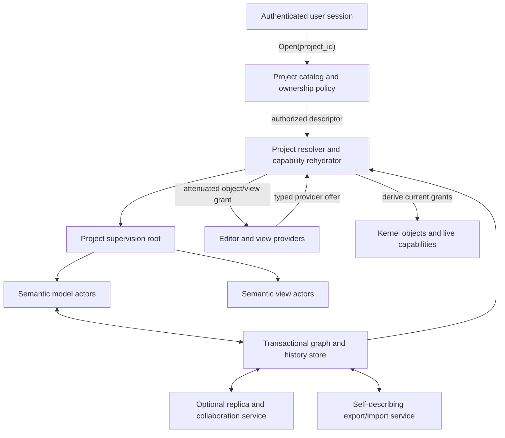
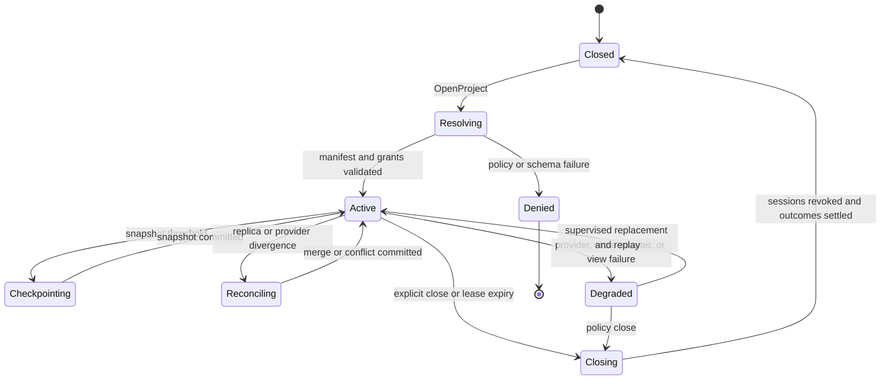

# User-Owned Project Graph and Composition

## Executive decision

Atom OS should make a **user-owned project graph**, not an installed
application, the durable and visible unit of work. The graph names semantic
objects, histories, views, commands, providers, collaborators, and resource
policies. Packages contribute implementations and editors, but a package is
neither the owner of the project nor the sole namespace through which project
objects can be reached.

“Graph” must not mean one globally mutable object image. It is a durable set of
typed records whose live nodes are supervised actors in several protection
domains. “Capability graph” must not mean serializing bearer capabilities to
disk. Durable records name authority lineage and intended grants; trusted
services reconstitute short-lived capabilities after authenticating the opener
and checking current policy.

This is proposed architecture. No Atom OS implementation yet demonstrates its
usability, convergence, portability, or recovery behavior.

## Question and operational standard

The component must answer: **how can a person's work remain inspectable,
composable, portable, and live across tool, package, device, and desktop
failure without collapsing every object into one authority domain?**

The design is acceptable only if a prototype can show all of the following:

1. a project remains openable when its original editor package is removed;
2. two independent providers can render or edit the same supported object type;
3. a provider receives only the object and action capabilities selected for it;
4. local work continues without the collaboration service;
5. concurrent content edits have a declared merge or conflict rule, while
   authority changes never merge by accident;
6. export includes interpretable data, schemas, history, provider requirements,
   and provenance rather than an opaque application database;
7. project recovery cannot resurrect revoked grants or duplicate an external
   effect; and
8. quotas and overload in one project cannot starve recovery or unrelated
   projects.

## Evidence and what it does not prove

[Kay and Goldberg](../../30-sources/kay-goldberg-1977-personal-dynamic-media.md)
describe dynamic documents, media-specific editors, filing, simulation, and
user-created tools as parts of one personal medium. [Webstrates](../../30-sources/klokmose-et-al-2015-webstrates-shareable-dynamic-media.md)
demonstrates that content, computation, interaction, several editors, and
multi-device collaboration can coexist in shareable substrates.
[Potluck](../../30-sources/litt-et-al-2022-potluck-dynamic-documents.md)
demonstrates gradual enrichment of durable text into personal software, while
also exposing complexity and representation limits. [Local-first
software](../../30-sources/kleppmann-et-al-2019-local-first-software.md)
provides a concrete ownership and offline-availability standard.
[Persistent programming](../../30-sources/atkinson-et-al-1983-persistent-programming.md)
supplies the older but still useful idea that typed structures reachable from
explicit roots can outlive one execution without being flattened into an
application-specific file conversion.

None of those works demonstrates a capability-safe, crash-consistent actor
graph. Webstrates centralizes important state in a synchronized DOM; Potluck's
tests are informal and small; local-first convergence does not establish
authorization or semantic validity; the Smalltalk image did not isolate
mutually distrustful principals. The Atom OS graph is therefore a synthesis,
not a direct port of any one system.

## Responsibility and boundary

The project subsystem owns:

- stable project, object, edge, provider-binding, and history identities;
- typed graph schema and schema-version negotiation;
- atomic graph mutations and durable outcome receipts;
- local snapshots, append-only history, migrations, export, and import;
- discovery and selection of compatible providers;
- explicit collaboration membership and replica metadata;
- project-level resource, retention, privacy, and recovery policy; and
- derivation requests for attenuated live capabilities.

It does **not** own:

- actor scheduling, mailboxes, heaps, or code loading;
- kernel capability representation or revocation mechanics;
- rendering, GPU memory, surface placement, or input focus;
- the domain semantics of every model object;
- a universal automatic merge for arbitrary actor state;
- identity proofing or system-wide authorization policy; or
- network transport and durable storage implementation.

## Durable data model

The minimum durable schema is deliberately smaller than the live actor graph:

```text
ProjectManifest {
  project_id, manifest_revision, schema_generation, owner_policy_ref,
  root_object_ids, history_head, replica_policy_ref,
  resource_profile_ref, recovery_profile_ref
}

ObjectRecord {
  object_id, type_id, schema_version, state_ref,
  object_lifecycle_generation, state_revision,
  provenance_ref, provider_requirements
}

GraphEdge {
  edge_id, from_object_id, relation_type, to_object_id,
  edge_generation, visibility, authority_intent_ref
}

ProviderBinding {
  binding_id, object_type, operation_profile,
  provider_identity, package_digest, compatibility_range,
  binding_generation, user_preference_scope
}
```

`authority_intent_ref` names a policy decision and delegation lineage, not a
replayable kernel capability. On open, an authorized project service resolves
that record against current identity, revocation, and recovery state and asks
the capability control plane to derive a new, audience-bound live grant.
[EROS](../../30-sources/shapiro-et-al-1999-eros.md) motivates durable
capability-oriented object systems, while [capability security
analysis](../../30-sources/miller-et-al-2003-capability-myths.md) warns that
authority comes from reachable references and their propagation—not from the
human-readable graph label alone.

## Proposed architecture



The project supervision root is a lifecycle coordinator, not the storage
authority or a privileged omniscient actor. Model actors may reside in one or
more protected domains. Providers receive narrow per-binding capabilities and
may be restarted independently.

## Core protocols

### Open and materialize

`OpenProject(project_id, requested_mode, session_evidence)` returns either a
typed denial or a `ProjectSession` containing:

- `project_id` and immutable open-at `manifest_revision`;
- a session epoch and expiry;
- capabilities for only requested roots and permitted operations;
- a snapshot watermark plus a stream cursor;
- provider compatibility requirements; and
- a recovery token that identifies the session without granting project access.

Materialization is incremental. The session initially exposes metadata and
root summaries; object actors are activated on demand. This follows the
virtual-activation lesson in [Orleans](../../30-sources/bernstein-et-al-2014-orleans.md)
without importing Orleans' cloud availability or storage assumptions.

### Attach a provider

1. A provider publishes a signed offer for object type, semantic protocol,
   editor operations, resource needs, and compatibility range.
2. The resolver checks package provenance, policy, and current object schema.
3. The user selects a provider through trusted interaction when the binding
   expands authority.
4. The resolver derives separate read, semantic-action, and mutation
   capabilities; inspection never implies editing.
5. The binding is committed with `binding_generation` and durable outcome.
6. A provider restart must present the current binding generation before it can
   resume observation or mutation.

### Mutate the graph

Every durable mutation carries:

```text
ProjectMutation {
  operation_id, project_id, expected_manifest_revision,
  actor_identity, presented_authority, preconditions,
  typed_changes, schema_evidence, idempotency_key
}
```

`manifest_revision` is the content compare-and-swap revision; it changes on
every committed manifest or graph mutation and is distinct from
`schema_generation`, which identifies the interpretation contract. The store
uses the shared command-outcome lattice defined by the [semantic UI
protocol](semantics-first-accessible-ui-protocol.md): it can return
`RejectedBeforeAdmission(reason)`, `ExpiredBeforeAdmission(evidence)`,
`Fenced(current_manifest_revision)`,
`AcceptedPending(operation_id, status_handle)`,
`Committed(receipt, revision_evidence: new_manifest_revision)`,
`NotCommitted(proof)`, `Terminated(reason, compensation_state)`, or
`Indeterminate(reconciliation_handle)`. A timeout
is never reported as failure when commit is unknown.
This imports the outcome discipline developed in the [OTP-like system-services
layer](../otp-like-system-services-layer.md), not an “exactly once” claim.

## Collaboration and authority

Content replication and authority delegation are different protocols.

- Replicable value types must declare a merge algebra, a single-writer/fenced
  owner, or an explicit conflict object.
- Model commands that cause external effects are never re-executed merely
  because replicas merge.
- Project membership changes use a serialized, fenced authority log with
  revocation epochs; they are not CRDT set unions.
- A replica authenticates the project and peer, then receives only selected
  object streams and rights.
- Removing a collaborator advances a grant epoch and triggers revocation; it
  cannot erase copies already disclosed, so disclosure and ongoing authority
  are reported separately.
- Offline changes may remain locally valid while being ineligible to publish
  until current policy and schema are reconciled.

[Local-first software](../../30-sources/kleppmann-et-al-2019-local-first-software.md)
supports authoritative local work and background synchronization, but its own
limits require Atom OS to make non-mergeable effects and access changes
explicit.

## Layer placement

| Atom OS layer | Project-graph responsibility |
| --- | --- |
| Kernel hardware and architecture support | Persistent-memory and device mechanisms only through typed lower interfaces; no project identity or schema. |
| Minimal privileged kernel | Protection domains, address spaces, capabilities, IPC, budgets, revocation, fault routes, and teardown for live project components. |
| Managed actor runtime | Object actors, generation-stamped activation/PID routing, messages, per-actor collection, code generations, serialization, and activation hooks. |
| OTP-like system services | Durable logical object identity, project catalog, transactional persistence, provider registry, configuration, identity/policy integration, collaboration sessions, update orchestration, telemetry, and audit. |
| Visual-computing services | Project navigator, editor selection, semantic view composition, and user-facing history/merge/conflict tools. |
| Application/domain actors | Type-specific state machines, commands, invariants, migrations, and effect reconciliation. |

The graph therefore lives primarily in unprivileged system services and domain
actors. The kernel enforces the live authority graph but does not parse the
durable project schema.

## Lifecycle and recovery



A crash may discard ephemeral navigation, selection, surfaces, and caches. It
must not discard committed manifest/object revisions, outcome receipts, revocation
epochs, or unresolved external-effect records. A replacement begins from the
latest complete snapshot and replays a checksummed log. [ARIES](../../30-sources/mohan-et-al-1992-aries.md)
and [FSCQ](../../30-sources/chen-et-al-2015-fscq.md) show two different ways to
reason rigorously about crash recovery, but neither directly proves this actor
graph protocol.

## Security, privacy, and resource invariants

- Project identity is not authority; every operation checks a live capability.
- A provider cannot enumerate projects or objects merely because it supports a
  type.
- Read, semantic observation, history access, mutation, collaboration,
  debugging, export, and deletion are separately attenuable.
- Private objects may publish public semantic summaries without exposing model
  state.
- Export is explicit disclosure and includes a redaction plan and receipt.
- Each project has CPU, memory, mailbox, persistent-byte, history-growth,
  replication, GPU, and recovery budgets.
- A cycle in the semantic graph does not imply an unbounded activation or
  traversal; cursors, depth, item count, and work are bounded.
- Deleted objects enter a tombstoned state until replica, history-retention,
  and external-reference policy is settled; “delete” is not silently equated
  with immediate physical erasure.

## Alternatives considered

| Alternative | Strength | Rejection or retained use |
| --- | --- | --- |
| Application-owned opaque database | Simple packaging and vendor control | Rejected as the project truth because provider removal can strand user work. A provider may still keep reconstructible caches. |
| One persistent Smalltalk-style image | Immediate object continuity and live tools | Rejected as the cross-principal failure and authority boundary; retained as inspiration for inspectability. |
| Shared mutable DOM as project | Direct collaboration and multiple web views | Rejected as universal semantic, authority, and recovery model; Webstrates-style substrates remain useful provider implementations. |
| Files and MIME associations only | Portable, inspectable, interoperable | Retained as an export and interchange layer, but insufficient for live identities, relations, commands, supervision, and effect outcomes. |
| Cloud-authoritative service | Convenient centralized collaboration | Optional as a replica/provider, never the only authoritative copy for user-owned project classes. |

## Staged implementation

1. **Static graph profile.** Define IDs, object records, typed edges, schema
   registry, self-describing export, and read-only project navigator.
2. **Local transactional profile.** Add snapshot/log persistence, generation
   checks, durable outcomes, quotas, and one model-actor family.
3. **Provider profile.** Support two independently packaged views/editors for
   one type with separately derived capabilities.
4. **Recovery profile.** Kill resolver, provider, runtime domain, persistence
   adapter, shell, and compositor at every protocol transition.
5. **Collaboration profile.** Add one mergeable type, one fenced single-writer
   type, explicit conflicts, offline replicas, and membership revocation.
6. **Portability profile.** Remove the original package and machine, import the
   project elsewhere, and demonstrate meaningful degraded access plus later
   provider restoration.

## Required experiments and falsifiers

- **Provider independence:** create a project with provider A, uninstall A,
  inspect the object semantically, then edit it correctly with provider B.
- **Authority confinement:** fuzz provider discovery and graph traversal; no
  ungranted object identity, state, history, or capability may leak.
- **Crash matrix:** inject failure before and after every journal, snapshot,
  membership, binding, and external-effect commit point.
- **Offline ownership:** edit for a declared interval with all remote services
  unavailable, reboot locally, and later reconcile without silent loss.
- **Conflict honesty:** construct concurrent edits that cannot commute; the
  system must preserve an explicit conflict instead of inventing a winner.
- **Resource isolation:** exhaust project history, actor mailboxes, provider CPU,
  and replica bandwidth while recovery and other projects remain responsive.
- **Human portability:** ask participants unfamiliar with the original package
  to locate, understand, export, and continue the work using system-provided
  semantic tools.

The design is falsified if a package remains the only interpreter of durable
meaning, if collaboration can grant authority through data merge, or if a
project restart can duplicate an unconfirmed effect.

## Connections

- [Umbrella visual-interface synthesis](../alan-kay-smalltalk-visual-interface-and-modern-desktop.md) —
  introduces the project graph as the first Atom OS synthesis aspect.
- [Durable semantic actors and disposable presentation](durable-semantic-actors-and-disposable-presentation.md) —
  defines which graph nodes survive UI-process failure.
- [Capability-scoped live tools and transactional evolution](capability-scoped-live-tools-and-transactional-evolution.md) —
  constrains project inspection and mutation.
- [OTP-like system services layer](../otp-like-system-services-layer.md) —
  supplies lifecycle, persistence, registry, update, overload, and audit policy.
- [Visual-computing model inquiry](../../40-inquiries/what-visual-computing-model-should-atom-os-adopt.md) —
  retains unresolved usability and architecture questions.

## Sources

- [Personal Dynamic Media](../../30-sources/kay-goldberg-1977-personal-dynamic-media.md)
- [Webstrates](../../30-sources/klokmose-et-al-2015-webstrates-shareable-dynamic-media.md)
- [Local-First Software](../../30-sources/kleppmann-et-al-2019-local-first-software.md)
- [Potluck](../../30-sources/litt-et-al-2022-potluck-dynamic-documents.md)
- [An Approach to Persistent Programming](../../30-sources/atkinson-et-al-1983-persistent-programming.md)
- [EROS](../../30-sources/shapiro-et-al-1999-eros.md)
- [Capability Myths Demolished](../../30-sources/miller-et-al-2003-capability-myths.md)
- [Orleans](../../30-sources/bernstein-et-al-2014-orleans.md)
- [ARIES](../../30-sources/mohan-et-al-1992-aries.md)
- [FSCQ](../../30-sources/chen-et-al-2015-fscq.md)
