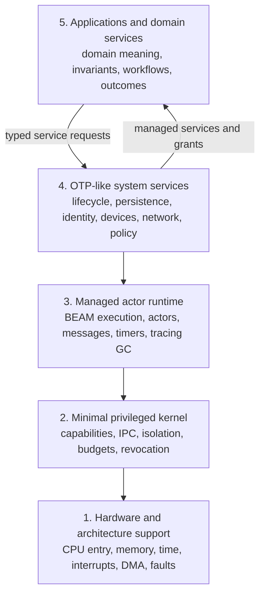

# Kay OS Research Archive

This repository researches and develops a new kernel and operating system
informed by the principles of Erlang/OTP and the BEAM virtual machine. The goal
is to carry ideas such as cheap isolated processes, asynchronous messaging,
supervision, fault containment, responsiveness, and distribution into the
system architecture without tying the project to one existing BEAM
implementation. The platform is required to run compiled BEAM code and retain
automatic process-local tracing garbage collection; the exact compatible
runtime and versioned OTP profile remain implementation questions.

The operating system is named **Kay OS**, by user decision on 2026-09-17, in
honor of Alan Kay. The established research repository and local archive path
retain the historical `atom-os-research` name; that repository identifier is
not the operating-system name.

The current proof of concept builds a minimal bootable OS whose first delivery
is an interactive CLI. Graphical UI and desktop work are outside its scope.
AtomVM has been rejected as an implementation foundation; its archived research
is retained for provenance. The CLI can be native during bring-up, with the
required unprivileged BEAM runtime and tracing GC integrated in a later
milestone. See the [readiness assessment](20-notes/proof-of-concept-research-readiness.md)
for the staged acceptance criteria.

The [implementation planning area](60-planning/README.md) defines the
milestone-directory and phased-plan convention. The
[proof-of-concept planning stream](60-planning/01-proof-of-concept/README.md)
provides five detailed M0–M4 milestone definitions, required artifacts, and
acceptance cases, now decomposed into 18 draft implementation phases. All
delivery gates remain open; authored plans are not implementation evidence.

The selected kernel language is **Zig**. The [feasibility and C-interoperability
study](20-notes/proof-of-concept-requirements/zig-kernel-language-feasibility-and-c-interoperability.md)
supports bounded implementation qualification and records local research
probes. M0 uses a pinned Zig 0.16.0 LLVM/LLD profile in the public
[Kay OS implementation repository](https://github.com/pcharbon70/kay-os); that
profile's bounded [freestanding build qualification](50-journal/2026-09-17-m0-phase-01-build-closure.md)
passes, without closing boot, physical, phase-integration, or milestone
acceptance gates.

The initial platform target is a documented **generic Intel-compatible x86-64
PC envelope**. The [active target profile](20-notes/proof-of-concept-requirements/x86-64-compatibility-envelope-and-test-fixtures.md)
defines a Nehalem-class, one-CPU, 64 MiB serial QEMU baseline, runtime hardware
discovery expectations, a capability-driven virtual matrix, and independent
physical fixtures. The Dell Precision T7500 is candidate fixture P1 rather
than the OS target. The AMD-processor assumption has been corrected;
its former profile is archived. RISC-V/OpenSBI remains comparative research,
not the first implementation path.

## Five-layer architecture

Kay OS separates hardware mechanism, privileged enforcement, managed
execution, reusable system policy, and application meaning. Only the minimal
kernel in Layer 2 is privileged; the managed runtime, system services, and
applications in Layers 3–5 remain outside the kernel.



1. **Hardware and architecture support** discovers and normalizes processor,
   memory, interrupt, time, DMA, fault, and device mechanisms without deciding
   higher-level policy.
2. **Minimal privileged kernel** turns those mechanisms into protected
   domains, capabilities, IPC, mappings, resource accounts, revocation, and
   teardown.
3. **Managed actor runtime** supplies BEAM-compatible processes, messaging,
   scheduling, process-local heaps and tracing garbage collection, timers,
   code generations, and monitored execution.
4. **OTP-like system services** provide unprivileged lifecycle, naming,
   persistence, identity and policy, device and network brokering, updates,
   admission control, telemetry, audit, and operator services.
5. **Applications and domain services** own domain identities, invariants,
   commands, workflows, external effects, semantic views, collaboration rules,
   compatibility, and user-visible outcomes.

The detailed [applications and domain-services synthesis](20-notes/applications-and-domain-services-layer.md#position-in-the-five-layer-architecture)
defines the boundaries and responsibilities of all five layers.

Start at the [home map](10-maps/home.md). Repository-wide authoring and
maintenance conventions are defined in [`AGENTS.md`](AGENTS.md).

## Structure

- [`00-inbox/`](00-inbox/README.md) — unprocessed captures
- [`10-maps/`](10-maps/README.md) — curated paths through subjects and questions
- [`20-notes/`](20-notes/README.md) — ideas developed in the author's own words
- [`30-sources/`](30-sources/README.md) — reading notes and bibliographic records
- [`40-inquiries/`](40-inquiries/README.md) — active research questions
- [`50-journal/`](50-journal/README.md) — dated observations and experiments
- [`60-planning/`](60-planning/README.md) — milestone-scoped phased implementation plans
- [`90-archive/`](90-archive/README.md) — inactive or superseded material
- [`assets/`](assets/README.md) — durable research attachments
- [`templates/`](templates/README.md) — document and directory scaffolds

Folders describe what a document is doing. Links, maps, and tags describe what
it is about. Directory READMEs are complete local inventories; maps remain
selective conceptual paths.

## Research boundary

The central question is which BEAM and OTP principles belong in the kernel,
which belong in a managed runtime or system-service layer, and which existing
implementation choices should be replaced. Research covers boot and bring-up,
hardware abstraction, execution and scheduling, memory and resource
management, isolation and capabilities, persistence, drivers, networking,
updates, distribution, and system tooling.

Research must distinguish a principle from a particular implementation. A
result demonstrated inside Linux, macOS, an RTOS, or another host is evidence
about a hosted arrangement unless it also identifies the services supplied by
that host. Existing systems such as Erlang/OTP, AtomVM, GRiSP, LING, or newer
bare-metal experiments are evidence and design material, not predetermined
foundations.

## Frontmatter

Every completed knowledge document begins with YAML frontmatter:

```yaml
---
title: "A human-readable title"
kind: note
created: "2026-08-28"
maturity: seed
tags:
  - example-topic
aliases: []
---
```

[`frontmatter.schema.json`](frontmatter.schema.json) is the authoritative
metadata contract. Document kinds are `note`, `source`, `inquiry`, `map`, and
`journal`. Notes require `maturity: seed | developing | stable`; inquiries
require `status: open | paused | resolved`.

## Working rhythm

1. Capture temporary material in `00-inbox/`.
2. Promote useful material with the closest template.
3. Connect every durable document to another document or a map.
4. For every deep dive, record an exhaustive journal source manifest that
   separates newly introduced sources from reused sources.
5. Develop selective maps when conceptual clusters emerge.
6. Translate near-term milestones into described, integration-gated phase plans
   in `60-planning/`; keep plans distinct from implementation evidence.
7. Preserve superseded work in `90-archive/` when its context remains useful.
8. Update affected indexes and validate in the same change.

## Validation

Install the pinned dependencies once, then run the archive checks:

```bash
python3 -m pip install -r requirements-validation.txt
python3 validate_archive.py
python3 -m unittest test_validate_archive.py
```

The validator checks metadata, placeholders, filenames, local links,
directory inventories, conceptual connections, deep-dive source-manifest
structure and classification, and duplicate source identifiers.
Planning notes are included in metadata and navigation checks. The described
task hierarchy and adequacy of phase-ending integration tests are review
requirements, not currently automated checks.

## Repository files

- [`AGENTS.md`](AGENTS.md) — research, authoring, and maintenance instructions
- [`frontmatter.schema.json`](frontmatter.schema.json) — metadata schema
- [`requirements-validation.txt`](requirements-validation.txt) — validator dependencies
- [`test_validate_archive.py`](test_validate_archive.py) — focused validator tests
- [`validate_archive.py`](validate_archive.py) — deterministic archive checks
